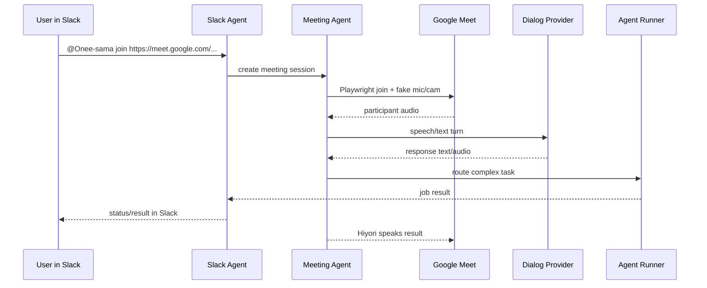

# oneesama

Open-source AI meeting avatar bot framework.

The product has two first-class services:

- **Slack Agent service**: workspace control plane for commands, identity, permissions, memory, tasks, and long-running background work.
- **Meeting Agent service**: realtime runtime that joins Google Meet with Playwright, routes captions/audio/dialog through selected providers, and can route complex work to a user-selected local agent runner.

This repo intentionally does **not** implement its own agent brain. It is a thin meeting/workspace shell: users bring Codex, Claude Code, OpenHands, an HTTP runner, OpenAI Realtime, an OpenAI-compatible endpoint, or another local backend.

The first target demo is:



## Current Scope

- Google Meet only for the first meeting provider.
- Realtime assistant participation, captions, action items, and Slack Canvas summaries are in scope. Live2D is not required for the default runtime; Docker deployments should keep it disabled.
- Pluggable dialog/agent providers. OpenAI Realtime is optional, not required.
- Agent runner seam: `dry-run`, `codex`, `claude`, `ollama`, `slack-agent-d`, `command`, and `http` providers are supported first.
- Slack is part of MVP, not a later add-on.

## Quick Start

The reviewed Go replacement runtime is the primary local path:

```bash
npm ci
make vet
make build
make test

./oneesama meeting-agent
./oneesama slack-agent
```

The two services default to a zero-config local loopback webhook for meeting
lifecycle delivery. When `MAB_MEET_WEBHOOK_URL` / `MAB_MEET_WEBHOOK_SECRET` are
omitted, Meeting Agent posts to Slack Agent at
`http://127.0.0.1:8780/webhooks/meeting-result`, and a shared HMAC secret is
generated under the state data directory. Set those env vars only for
multi-host or container deployments that need explicit wiring.

When a Slack user asks Onee-sama to join a Meet, Slack shows a confirmation
card before the browser join starts. The card lets the user choose the Google
Meet caption language and whether the realtime assistant should participate;
caption capture, ASR/action items, and the final Slack Canvas summary remain on
by default. `MAB_CAPTION_LANGUAGE` controls the default selected language.

The older TypeScript smoke matrix remains available for browser-runtime
compatibility checks:

```bash
npm ci
cp .env.example .env
npm run doctor
npm run dev:slack
npm run dev:meeting
```

The Go runtime still reuses the repo's TypeScript meet-runner/browser-runtime modules, so run `npm ci` before `make test` or direct `go test ./...` on a fresh clone.

Local dry-run smoke:

```bash
npm run ci
npm run smoke
npm run smoke:agent-provider
npm run smoke:agent-real-task
npm run smoke:claude-provider
npm run smoke:ollama-provider
npm run smoke:slack-agent-d-provider
npm run smoke:slack-memory
npm run smoke:dialog-provider
npm run smoke:post-meeting
npm run smoke:canvas-publisher
npm run smoke:state-provider
npm run smoke:local-agent-dialog
npm run smoke:avatar
npm run smoke:meet
npm run smoke:meet-contract
npm run smoke:screen-share
npm run smoke:persistence
npm run smoke:worker-bridge
npm run smoke:realtime-browser
npm run smoke:realtime-webrtc
npm run smoke:realtime-participant-audio
npm run smoke:realtime-audio-route
npm run smoke:realtime-repeat-guard
npm run smoke:realtime-session-update
npm run smoke:realtime-worker-tool
npm run smoke:avatar-state
npm run smoke:avatar-visual
npm run smoke:hiyori-live2d
npm run smoke:runtime-acceptance
npm run smoke:slack-results
npm run smoke:slack-posting
npm run smoke:slack-contract
npm run smoke:cutover-shadow
npm run smoke:shadow-parity
npm run smoke:shadow-tap
npm run smoke:shadow-transmitter
npm run smoke:cutover-evidence
npm run cutover:evidence
npm run smoke:realtime-sdp
npm run smoke:realtime-live-tool
npm run smoke:real-meet
npm run smoke:real-local-dialog
npm run smoke:realtime
npm run smoke:slack
curl -X POST http://127.0.0.1:8781/join/google-meet \
  -H 'content-type: application/json' \
  -d '{"meetUrl":"https://meet.google.com/abc-defg-hij","botName":"Demo Bot","dryRun":true}'
```

The scaffold currently starts local control-plane services, validates the environment, persists session/job state through a replaceable state provider (`memory`, `json-file`, or `sqlite`), exposes a Google Meet joiner adapter with dry-run, local non-dry-run fixture smoke, a stricter Meet contract matrix, and optional real-room smoke modes. Visual avatar injection is intentionally not a product requirement; the Meet runner keeps that browser path disabled while preserving realtime audio/dialog, background work routing, meeting join/stop/status, and post-meeting artifact flows. The repo verifies Slack request signatures, provides an agent-runner provider seam (`dry-run`, `codex`, `claude`, `ollama`, `slack-agent-d`, `command`, `http`), and can report worker results back to Slack through a mock/live poster adapter. Post-meeting artifacts now follow the old MeetD shape: audio artifact, `transcript.json`, `summary.md`, `manifest.json`, and a Slack Canvas-compatible Markdown publisher with Slack-thread fallback. Cutover smoke verifies shadow/canary/rollback mode decisions without changing the old-stack primary path; rollback smoke verifies `MAB_CUTOVER_AUTO_ROLLBACK_ON_FAILURE=1` fails closed when the selected new Meeting Agent path is down; shadow parity smoke mirrors a fixture old-stack control-plane sequence against the new repo and emits an old-vs-new parity report; shadow tap smoke verifies a future old-stack transmitter can mirror commands into the new repo without starting a second bot; shadow transmitter smoke verifies the env-gated stdin hook against the side-effect-free receiver; cutover evidence smoke generates a fixture-safe tarball with git/PR snapshots, healthz output, cutover/shadow reports, SQLite state snapshots, optional agent real-task reports, and a manifest. `smoke:real-meet`, `smoke:real-local-dialog`, `smoke:agent-real-task`, `smoke:realtime-sdp`, and `smoke:realtime-live-tool` are optional: they skip when their real provider/runtime is unavailable. Run real agent task proof with `MAB_RUN_AGENT_REAL_TASK_SMOKE=1 MAB_AGENT_RUNNER=codex npm run smoke:agent-real-task`; require it with `MAB_REQUIRE_AGENT_REAL_TASK=1`. Live Realtime smokes also skip by default even if an API key is present; enable them with `MAB_RUN_REALTIME_SDP=1` / `MAB_RUN_REALTIME_LIVE_TOOL=1`, and make optional gates mandatory with `MAB_REQUIRE_REAL_MEET=1`, `MAB_REQUIRE_REAL_LOCAL_DIALOG=1`, `MAB_REQUIRE_REALTIME_SDP=1`, and `MAB_REQUIRE_REALTIME_LIVE_TOOL=1`.

## Repository Layout

- `apps/slack-agent/` - Slack service entrypoint, HTTP routes, Socket Mode loop, and posting/triage glue.
- `apps/meeting-agent/` - Meeting runtime entrypoint, Google Meet joiner routes, caption ingestion, TTS, and artifact delivery.
- `packages/core/src/` - Shared runtime modules grouped by domain (`slack`, `meeting`, `realtime`, `avatar`, `dialog`, `agent-runner`, `shadow`, `persistence`).
- `src/cli.js` - Operator CLI, doctor checks, and the smoke/compatibility matrix used in CI and local verification.
- `examples/` - Minimal provider/env examples for Codex, Claude, Ollama, HTTP, command, and Slack Agent D runners.
- `docs/` - Architecture, deployment, release, parity, and operator runbooks.
- `scripts/` - Small host-side helpers such as Docker acceptance wrappers.

There is intentionally no separate frontend app scaffold such as Vite or Next.js here. Browser runtime code is owned by the Meeting Agent shell and lives next to the runtime modules that inject avatar, dialog, Realtime, and screen-share behavior into Google Meet.

## Slack Control Plane

Slack app mentions, DMs, and interactive actions invoke the same text command parser. The slash-command HTTP route remains only as a legacy compatibility shim and is not advertised in the Slack app manifest. The current public command contract is:

```text
join <meet-url> [--bot-name name] [--dry-run false]
status [session-id]
stop [session-id] [--reason text]
help
Or mention the bot with what you need.
```

`join` creates a Slack-owned session record and hands it to Meeting Agent. Natural-language mentions are handled directly by the bot; when a request needs heavier background work, the service routes it internally and reports the result back to the thread without exposing provider-specific commands.

Use `npm run smoke:slack-contract` for the strict fixture matrix covering parser behavior, HMAC verification, slash payload compatibility, command edges, and result deduplication. Use `npm run smoke:slack-tool-registry` for the Slack tool compatibility registry/adapters smoke. Use `npm run smoke:slack-domain-store` for the Slack domain store smoke that backs channel cache, thread ledger, channel brain, pending actions, heartbeat followups, triage runs, and the Slack Agent `/slack/domain/refresh` channel/member cache route. Use `npm run smoke:slack-triage-flow` for the buffered Slack message -> AgentRunner triage decision -> pending action/card loop. See [docs/slack-contract-matrix.md](docs/slack-contract-matrix.md) and [docs/slack-tools-parity.md](docs/slack-tools-parity.md) for the coverage maps and remaining live Slack gaps.

See [docs/local-demo.md](docs/local-demo.md) for a local runbook that exercises the command contract without a real Slack workspace.

### Private Local Slack Memory

The repo can bootstrap from an existing private Slack Agent memory snapshot without committing any private workspace content. Code only ships the local-memory reader and seed command; the copied memory lives under `MAB_SLACK_MEMORY_DIR`, which is gitignored.

```bash
MAB_SLACK_MEMORY_ENABLED=1 npm run slack:memory-seed
MAB_SLACK_MEMORY_ENABLED=1 npm run smoke:slack-memory
```

The seed copies allowed Markdown memory files (`MEMORY.md`, `memory/**/*.md`) and exports safe local SQLite snapshots such as `channel_brain` and `thread_ledger` into the local data directory. Background task routing attaches relevant snippets as private runtime context; private Slack payload fields such as `token`, `response_url`, and `trigger_id` remain stripped before provider calls.

## Meeting Runtime

`POST /join/google-meet` starts the Meeting Agent joiner. It supports a dry-run launch plan, local fixture acceptance with `allowNonGoogleMeet`, and optional real Google Meet acceptance through `MAB_REAL_MEET_URL`.

Screen share is exposed as a browser-level synthetic display-media bridge. Enable it at join time with `installScreenShareBridge` / `autoStartScreenShare`, or control the active browser session later:

```bash
curl -X POST http://127.0.0.1:8781/screen-share/start \
  -H 'content-type: application/json' \
  -d '{"title":"Meeting Avatar Bot","subtitle":"Live workspace context"}'

curl -X POST http://127.0.0.1:8781/screen-share/stop
```

Native Google Meet desktop sharing uses Meet's own `Share screen` control. On macOS, the browser selected by
`MAB_CHROMIUM_EXECUTABLE` must be allowed in **System Settings > Privacy & Security > Screen & System Audio Recording**;
otherwise Meet can accept the click but then show `Can't share your screen`.

For real Google Meet rooms, the default profile mode is `guest`, matching the old avatar-spike launcher. If repeated
automated joins trip Google's prejoin anti-bot check, set `MAB_MEET_PROFILE_MODE=persistent` with
`MAB_BROWSER_USER_DATA_DIR=/path/to/dedicated-automation-profile` as a fallback.

Use `npm run smoke:meet-contract` for the strict fixture matrix covering URL validation, dry-run planning, Meeting Agent route behavior, non-dry-run fixture join, fake mic/cam, participant audio discovery, diagnostics, replacement stop, and stop/status lifecycle. Use `npm run smoke:screen-share` to verify the screen-share bridge creates a 1280x720 display stream and can stop it cleanly. See [docs/meet-contract-matrix.md](docs/meet-contract-matrix.md) for the coverage map and remaining live Meet gaps.

## Agent Runner Providers

Set `MAB_AGENT_RUNNER` to choose the backend that does complex work:

```bash
MAB_AGENT_RUNNER=dry-run
MAB_AGENT_RUNNER=codex MAB_CODEX_BIN=codex MAB_CODEX_MODEL=gpt-5.5
OPENROUTER_API_KEY=... MAB_AGENT_RUNNER=codex MAB_CODEX_MODEL_PROVIDER=openrouter MAB_CODEX_BASE_URL=https://openrouter.ai/api/v1 MAB_CODEX_ENV_KEY=OPENROUTER_API_KEY MAB_CODEX_WIRE_API=responses MAB_CODEX_MODEL=deepseek/deepseek-v4-pro
MAB_AGENT_RUNNER=claude MAB_CLAUDE_BIN=claude MAB_CLAUDE_MODEL=sonnet
MAB_AGENT_RUNNER=ollama MAB_OLLAMA_BASE_URL=http://127.0.0.1:11434 MAB_OLLAMA_MODEL=llama3.2
MAB_AGENT_RUNNER=slack-agent-d MAB_SLACK_AGENT_D_URL=http://127.0.0.1:9001/agent/run
MAB_AGENT_RUNNER=command MAB_AGENT_COMMAND='my-local-agent --json'
MAB_AGENT_RUNNER=http MAB_AGENT_HTTP_URL=http://127.0.0.1:9000/agent/run
```

The `codex` and `claude` providers call the local CLIs directly. The `ollama` provider calls the local Ollama HTTP API (`/api/generate`). The `slack-agent-d` provider is a fail-closed bridge adapter for an existing private Slack Agent D endpoint: it requires `MAB_SLACK_AGENT_D_URL`, strips private Slack fields from forwarded context, and may poll an upstream `statusUrl` if the old stack responds asynchronously. The command and HTTP providers receive a JSON job payload and may return either plain text or JSON like `{"status":"completed","result":"..."}`. This keeps the repo compatible with local Codex/Claude/OpenHands/Ollama wrappers or an existing private workspace agent without baking that agent into the public codebase.

Minimal provider examples live in `examples/`:

```bash
source examples/provider-codex.env
source examples/provider-claude.env
source examples/provider-ollama.env
source examples/provider-slack-agent-d.env
source examples/provider-command.env
source examples/provider-http.env
```

See [docs/architecture.md](docs/architecture.md) for the provider boundary map and [docs/codex-app-server-session-management.md](docs/codex-app-server-session-management.md) for Codex App Server thread/session reuse rules.

Optional proof-of-life for live providers:

```bash
MAB_RUN_AGENT_REAL_TASK_SMOKE=1 MAB_AGENT_RUNNER=codex npm run smoke:agent-real-task
MAB_RUN_AGENT_REAL_TASK_SMOKE=1 MAB_AGENT_REAL_TASK_PROVIDERS=codex,claude npm run smoke:agent-real-task
```

The smoke asks the selected provider to summarize a short transcript and writes `reports/agent-real-task-<provider>.json`. `npm run cutover:evidence` copies those reports into the evidence tarball when present.

## Local Dialog Bridge

The Meeting Agent can install a browser-side local dialog bridge instead of using OpenAI Realtime. It treats speech recognition as an interchangeable input source: a local STT adapter or a smoke test dispatches a `meeting-avatar-local-utterance` event, Meeting Agent calls the selected `AgentRunner`, and the returned text is routed through the avatar fake mic via the TTS seam.

```bash
npm run smoke:local-agent-dialog
MAB_AGENT_RUNNER=codex MAB_BROWSER_HEADLESS=true npm run smoke:local-agent-dialog
MAB_REAL_MEET_URL=https://meet.google.com/xxx-yyyy-zzz npm run smoke:real-local-dialog
```

The local dialog path has two independent speech seams:

```bash
MAB_STT_PROVIDER=event
MAB_TTS_PROVIDER=tone-wav
MAB_TTS_PROVIDER=command MAB_TTS_COMMAND='my-tts --json'
MAB_TTS_PROVIDER=http MAB_TTS_HTTP_URL=http://127.0.0.1:9001/tts
```

`event` STT means any browser/native recognizer can dispatch `meeting-avatar-local-utterance` with transcript text; the bot shell does not own speech recognition. The default `tone-wav` TTS provider returns a generated WAV data URL from Meeting Agent `/tts/synthesize`, and the browser decodes it into the avatar fake mic so CI proves the same route a real TTS provider will use. Production providers can replace it with native OS TTS, MiniMax, OpenAI-compatible speech, or any local audio generator without changing the Slack/Meet shell.

OpenAI Realtime remains an optional dialog provider. The default contract targets
`gpt-realtime-2` with Realtime 2 session settings (`output_modalities`,
nested audio config, `reasoning.effort=high`, and `semantic_vad`). Configure it
with `MAB_OPENAI_API_KEY` (or `OPENAI_API_KEY`) and `MAB_OPENAI_BASE_URL`;
OpenAI-compatible endpoints must support the Realtime client-secret and SDP
routes to work. See [docs/realtime-2.md](docs/realtime-2.md).

## State Provider

```bash
MAB_STATE_PROVIDER=json-file
MAB_STATE_PROVIDER=memory
MAB_STATE_PROVIDER=sqlite
MAB_STATE_SQLITE_PATH=/tmp/meeting-avatar-bot-data/meeting-avatar-bot.sqlite3
```

`json-file` is the default local provider and persists Slack sessions plus Meeting Agent worker reports under `MAB_DATA_DIR`. `sqlite` stores Slack sessions, Meeting sessions, and worker reports in one WAL-enabled SQLite database with separate collections and migration metadata; if `MAB_STATE_SQLITE_PATH` is omitted the services use `${MAB_DATA_DIR}/meeting-avatar-bot.sqlite3`. `memory` is useful for disposable tests and never writes to disk. `npm run smoke:state-provider` verifies provider selection directly, and `npm run smoke:persistence` verifies Slack + Meeting services restore state after restart for both `json-file` and `sqlite`.

## Post-Meeting Artifacts

Meeting Agent exposes `POST /meetings/post-process` and `POST /recordings/ingest` for the old MeetD-style artifact flow. The pipeline writes a durable artifact directory containing the audio file when supplied, `transcript.json`, `chat.json`, `summary.md`, and `manifest.json`. Use `GET /meetings/artifact/chat?id=<artifact-id>` to replay the persisted Meet chat transcript and extracted links.

```bash
MAB_RECORD_MEETING=1 MAB_MEET_AUDIO_BACKEND=auto
MAB_RECAPPI_SDK_PATH=/path/to/@recappi/sdk
MAB_ASR_PROVIDER=caption
MAB_ASR_PROVIDER=command MAB_ASR_COMMAND='my-asr --json'
MAB_ASR_PROVIDER=http MAB_ASR_HTTP_URL=http://127.0.0.1:9002/asr
MAB_ASR_PROVIDER=openai MAB_ASR_MODEL=gpt-4o-mini-transcribe
npm run smoke:post-meeting
```

When `MAB_RECORD_MEETING=1`, the Meet joiner follows the old MeetD capture shape: macOS uses Recappi/ScreenCaptureKit when available, Linux uses PulseAudio, and both write `audio.wav` plus `audio_chunk_%03d.mp3` under the session artifact directory. ASR remains provider-based so local captions, a command, HTTP ASR service, or OpenAI transcription can be plugged in without changing the joiner; audio-backed providers process discovered chunks one by one and merge them into the final transcript/manifest. Meet chat entries from live observers or fixture input are normalized into `chat.json` with direction, sender, message ID, delivery state, and URL extraction.

Slack Agent exposes `POST /post-meeting/publish` and `POST /canvas/publish`. The publisher writes Slack Canvas-compatible Markdown, can fall back to Slack thread posting through the existing mock/live Slack poster seam, and can call Slack's native `canvases.create` / `canvases.edit` API when `MAB_CANVAS_PUBLISHER=slack-canvas` and a bot token/channel are configured. `npm run smoke:canvas-publisher` covers both the publisher module and the Slack Agent HTTP routes using mock Slack delivery plus file-backed Canvas output.

```bash
MAB_CANVAS_PUBLISHER=file
MAB_CANVAS_PUBLISHER=slack-thread MAB_CANVAS_SLACK_CHANNEL=C123 MAB_CANVAS_SLACK_THREAD_TS=1710000000.000000
npm run smoke:canvas-publisher
```

## Key Docs

- [docs/architecture.md](docs/architecture.md) - service boundaries, provider seams, and runtime data flow
- [docs/local-demo.md](docs/local-demo.md) - local public demo runbook
- [docs/deployment.md](docs/deployment.md) - Docker and service deployment notes
- [docs/releasing.md](docs/releasing.md) - source-release checklist and current publishing gaps
- [docs/handoff-checklist.md](docs/handoff-checklist.md) - operator validation checklist
- [docs/assets-and-licenses.md](docs/assets-and-licenses.md) - avatar/model redistribution guardrails

## Non-Goals

- Shipping internal Slack/Linear/Calendar credentials or prompts.
- Bundling proprietary or unclear-license avatar assets.
- Running arbitrary code by default. Worker runners are read-only unless explicitly enabled.

## Project Hygiene

- License: [MIT](LICENSE)
- Security reporting: [SECURITY.md](SECURITY.md)
- Contribution guide: [CONTRIBUTING.md](CONTRIBUTING.md)
- Community expectations: [CODE_OF_CONDUCT.md](CODE_OF_CONDUCT.md)
- Release guide: [docs/releasing.md](docs/releasing.md)

## Asset Boundary

The repo references the public Live2D Cubism Web Samples Hiyori URL for demos, but does not bundle Hiyori model files. Review [docs/assets-and-licenses.md](docs/assets-and-licenses.md) before publishing packaged builds or redistributing avatar assets.

## Replacement Goal

The intended product direction is full replacement of the existing Slack Agent D and Meet D stack. See [docs/full-replacement-plan.md](docs/full-replacement-plan.md) for the parity gates and cutover checklist, [docs/parity-inventory.md](docs/parity-inventory.md) for the prototype-to-repo gap map, and [docs/slack-tools-parity.md](docs/slack-tools-parity.md) for the Slack tool port map.

For next-day operator validation, start with [docs/handoff-checklist.md](docs/handoff-checklist.md).
