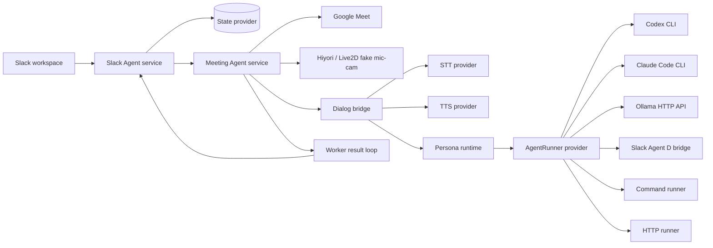
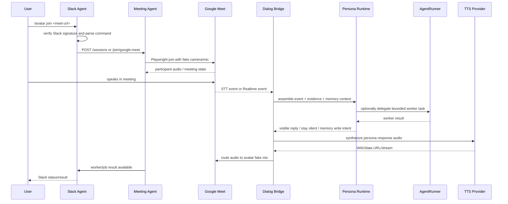
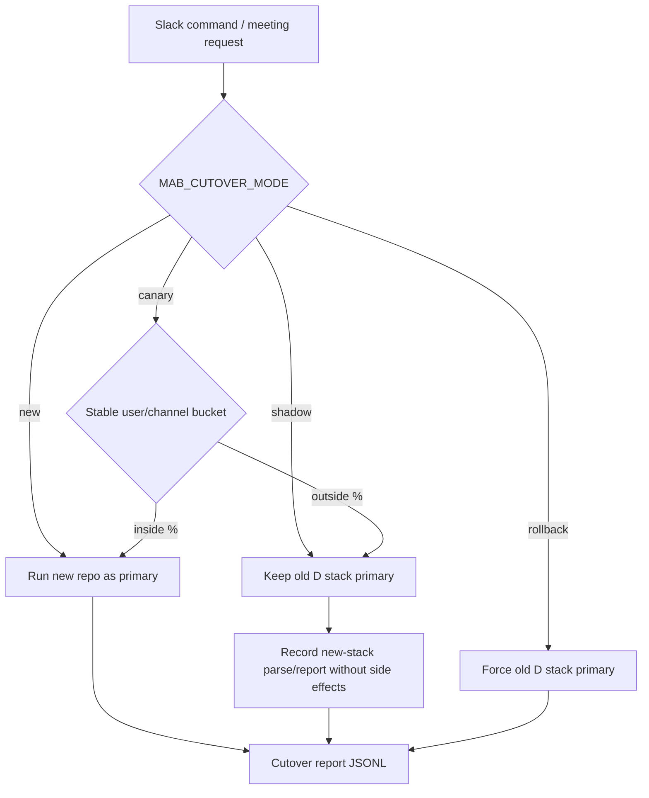

# Architecture

Meeting Avatar Bot is a thin shell around meeting runtime, workspace control,
and a foreground persona runtime. It ports an existing `slack-agentd` / `meetd`
deployment shape into this repo, but it does not bake private agent cognition
into the Go services.

The foreground meeting avatar should be a Pi/OpenClaw-style persona runtime:
memory-native, socially present, and continuously stateful. Codex, Claude Code,
Ollama, command runners, and HTTP runners are delegated worker providers for
bounded tasks. They are not the avatar's long-term persona or memory brain.

See [Meeting Avatar Persona Runtime](persona-runtime.md) for the product/runtime
boundary and migration plan.

## System Shape



## Core Boundaries

| Boundary            | Owned Here                                                                                                                | Replaceable Provider                                                               |
| ------------------- | ------------------------------------------------------------------------------------------------------------------------- | ---------------------------------------------------------------------------------- |
| Workspace control   | Slack slash-command HTTP surface, session lifecycle, join/status/stop/help commands, and natural-language mention routing | Slack app deployment mode, poster backend, old Slack Agent D adapter               |
| Meeting runtime     | Playwright Google Meet joiner, fake mic/cam injection, diagnostics, stop-before-start guard                               | Meeting provider, browser strategy, real-room canary policy                        |
| Avatar output       | Hiyori/fallback renderer contract, fake camera track, fake mic bus                                                        | Avatar model/runtime, true Live2D WebGL gate                                       |
| Dialog input/output | Browser-side local dialog bridge and optional Realtime bridge                                                             | STT provider, TTS provider, OpenAI Realtime endpoint                               |
| Persona runtime     | Foreground avatar voice, memory/social judgment, worker-delegation decisions, memory/world write intent                   | Pi/OpenClaw-style local persona runtime, legacy foreground fallback                |
| Agent work          | Job payload format, status/result reporting, delivery dedup, Slack/Meet worker handoff                                    | Codex/Claude Code/Ollama/command/HTTP as delegated workers, not foreground persona |
| Persistence         | State provider contract for sessions and worker reports                                                                   | memory, json-file, sqlite, future Postgres/Redis                                   |
| Cutover             | shadow/canary/rollback decisions and evidence reports                                                                     | legacy old-stack transmitter hook, live canary cohorts                             |

## Request Flow



## Provider Selection

The foreground persona runtime is selected separately from worker providers.
Legacy mode keeps the current foreground path while the Pi-style runtime is
being integrated:

```bash
ONEESAMA_PERSONA_RUNTIME=legacy
ONEESAMA_PERSONA_RUNTIME=pi
```

Worker agent runners are selected with `MAB_AGENT_RUNNER`:

```bash
MAB_AGENT_RUNNER=dry-run
MAB_AGENT_RUNNER=codex
MAB_AGENT_RUNNER=claude
MAB_AGENT_RUNNER=ollama
MAB_AGENT_RUNNER=slack-agent-d
MAB_AGENT_RUNNER=command
MAB_AGENT_RUNNER=http
```

`MAB_AGENT_RUNNER=codex-app-server` keeps stable Codex App Server threads per
Slack thread or Meet session for delegated worker continuity. It should not be
treated as the avatar's persona memory. See
[Codex App Server Session Management](codex-app-server-session-management.md)
for the exact session-key rules and restart behavior.

Speech is split into independent seams:

```bash
MAB_STT_PROVIDER=event
MAB_TTS_PROVIDER=tone-wav
MAB_TTS_PROVIDER=command
MAB_TTS_PROVIDER=http
```

OpenAI Realtime remains optional. It is configured separately with `MAB_OPENAI_API_KEY` and OpenAI-compatible endpoint overrides, and it is not required for local Codex/Claude demos.

## Cutover Modes



Default development should stay on `new` or local fixture mode. Production migration should start with `shadow`, then `canary`, then `new`, with rollback evidence preserved.

## Verification Layers

| Layer                      | Command                                                                                |
| -------------------------- | -------------------------------------------------------------------------------------- |
| Full local default gate    | `npm run ci`                                                                           |
| Slack contract matrix      | `npm run smoke:slack-contract`                                                         |
| Meet contract matrix       | `npm run smoke:meet-contract`                                                          |
| Local dialog loop          | `npm run smoke:local-agent-dialog`                                                     |
| Runtime integrated fixture | `npm run smoke:runtime-acceptance`                                                     |
| Optional real Meet room    | `MAB_REAL_MEET_URL=... npm run smoke:real-meet`                                        |
| Optional real local dialog | `MAB_REAL_MEET_URL=... MAB_AGENT_RUNNER=codex npm run smoke:real-local-dialog`         |
| Optional OpenAI Realtime 2 | `MAB_OPENAI_API_KEY=... MAB_RUN_REALTIME_LIVE_TOOL=1 npm run smoke:realtime-live-tool` |

## Non-Committed Private State

Do not publish tokens, live Slack app secrets, Google credentials, or bundled Hiyori assets with unclear redistribution rights. Keep provider credentials in environment variables or operator-local config.
