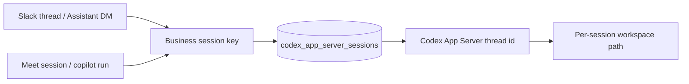

# Codex App Server Session Management

This note documents how `MAB_AGENT_RUNNER=codex-app-server` maps Slack and Meet
business conversations to persistent Codex App Server threads for delegated
worker tasks.

Codex App Server is not the foreground meeting-avatar persona runtime. It gives
code/repo/analysis work stable worker continuity after the persona delegates a
bounded task. See [Meeting Avatar Persona Runtime](persona-runtime.md) for the
foreground persona boundary.

## Why App Server Mode

The Slack Agent and Meeting Agent should not spawn one unrelated Codex process
per delegated worker event. In App Server mode, `meeting-avatar-bot` keeps a
stable mapping from a product-level conversation to a Codex App Server thread:



The mapping is stored in the configured state provider collection `codex_app_server_sessions`. With `json-file`, this defaults to:

```bash
${MAB_DATA_DIR:-/tmp/meeting-avatar-bot-data}/codex-app-server-sessions.json
```

The per-session working directory lives under:

```bash
${MAB_CODEX_APP_SERVER_WORKSPACE_ROOT:-/tmp/meeting-avatar-bot-data/codex-app-server-workspaces}
```

## Session Key Rules

The key is a product/business key. It is not a Slack token, Codex thread id, or user secret.

| Source                                               | Key shape                                                                            | Why                                                                                                 |
| ---------------------------------------------------- | ------------------------------------------------------------------------------------ | --------------------------------------------------------------------------------------------------- |
| Explicit override                                    | `<context.codexAppServerSessionKey>`                                                 | Lets callers force a stable product session when needed.                                            |
| Slack thread / Assistant thread / DM thread          | `slack:<workspace>:<channel>:<thread_ts>`                                            | Everyone replying in the same Slack thread shares one Codex context.                                |
| Slack channel-root command tied to a meeting/session | `slack:<workspace>:<channel>:session:<session_id>`                                   | Keeps root commands related to one meeting together.                                                |
| Slack channel-root command without a thread/session  | `slack:<workspace>:<channel>:channel-root:<user>`                                    | Prevents unrelated root-channel commands from different users mixing.                               |
| Slack triage / scanner context                       | `slack:<workspace>:<channel>:session:<triage_session_id>` or a real Slack thread key | Keeps scanner/triage jobs in Slack-scoped App Server sessions instead of ad-hoc task-hash sessions. |
| Meet dialog / Meet copilot                           | `meeting:<session_id>`                                                               | Meeting audio/chat/captions share the meeting-level Codex context.                                  |
| Meet URL fallback                                    | `meeting-url:<hash>`                                                                 | Gives URL-only callers a stable fallback.                                                           |
| Ad-hoc fallback                                      | `adhoc:<hash(task)>`                                                                 | Last resort for tests and one-off calls.                                                            |

Important detail: Slack thread keys intentionally do **not** include `userId`. The old behavior fragmented the same thread into multiple Codex sessions when another participant replied. User isolation is only applied to Slack channel-root events that have no thread and no explicit session id.

`channel-root` is treated as a sentinel for "no Slack thread", not as a real Slack thread timestamp. Slack callers may pass either nested `context.slack` identity or top-level `workspaceId/channelId/threadTs` identity; both normalize through the same key builder.

## Restart Behavior

`ensureSession()` computes the business key, hashes it into a stable session row id, and either:

1. Reuses the persisted Codex thread id with `thread/resume`, or
2. Starts a new App Server thread with `thread/start`, then persists the new `codexThreadId`.

The job context echoes the mapping for audit:

```json
{
  "codexAppServer": {
    "sessionKey": "slack:T123:C456:1778517300.000100",
    "sessionId": "7b5c...",
    "codexThreadId": "thread_...",
    "workspacePath": "/tmp/meeting-avatar-bot-data/codex-app-server-workspaces/..."
  }
}
```

## Verification

The local smoke `vp run smoke:codex-app-server-provider` covers:

- Same Slack thread reuses the same business key and Codex thread.
- A different Slack participant in the same thread still reuses the same Codex thread.
- Different Slack threads isolate.
- Slack channel-root events without thread/session stay user-isolated.
- Slack channel-root events with an explicit `sessionId` are session-scoped.
- The `channel-root` sentinel does not become a fake shared thread.
- Top-level Slack triage context stays Slack/session-scoped and does not fall back to `adhoc:<hash(task)>`.
- Meet sessions use `meeting:<session_id>` and stay isolated from Slack.
- `MAB_AGENT_RUNNER=codex-app-server` and `MAB_AGENT_RUNNER=codex MAB_CODEX_RUNNER_MODE=app-server` select the same runner.
- The persisted mapping survives runner restart.

Live App Server execution remains opt-in with `MAB_RUN_CODEX_APP_SERVER_LIVE_SMOKE=1`; the default smoke is local dry-run and does not touch live Slack or Meet.
