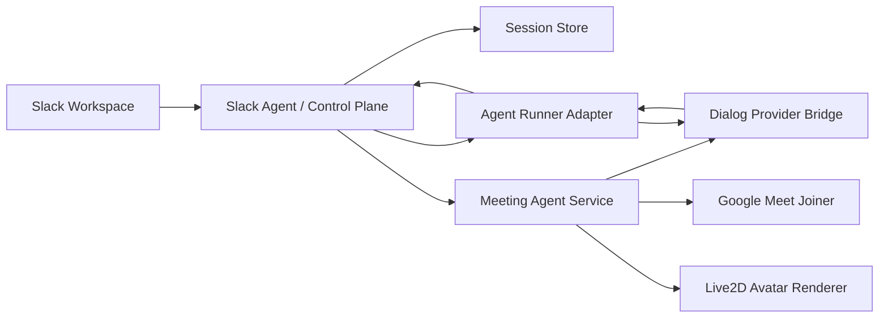

# RFC: Open-Source Meeting Avatar Bot

## Context

The prototype proved that a browser-driven bot can join Google Meet with a Live2D avatar, connect to a realtime speech provider, and speak/listen through fake mic/camera tracks. It also proved that the meeting shell should not try to become the agent brain: complex tasks belong to a user-selected local or remote agent runner.

The open-source project should turn that spike into a clean, reproducible framework.

## Product Definition

**Meeting Avatar Bot** is a Slack-controlled AI meeting participant shell. It joins a meeting as a virtual avatar, routes dialog through a selected provider, and can send complex work to user-selected background agents.

## Architecture



## Components

- **Slack Agent service**: workspace-facing control plane. Owns commands, permissions, workspace context, session lifecycle, and worker job reporting.
- **Meeting Agent service**: realtime runtime service. Owns browser join, audio/video tracks, dialog-provider session, avatar state, and live result reporting.
- **Agent Runner Provider**: background worker adapter for complex tasks. First providers: dry-run, Codex CLI, Claude Code CLI, Ollama, Slack Agent D bridge, command, and HTTP.
- **Dialog Provider**: speech/text loop adapter. OpenAI Realtime 2 is optional and can use `MAB_OPENAI_BASE_URL`; local providers can be added without changing the Slack/Meet shell.
- **Avatar Renderer**: Live2D/Hiyori renderer exposed as a camera track.
- **Provider Adapters**: Google Meet first; Zoom/Teams later.

## MVP Decision

Slack Agent is required in MVP because it is the place that carries workspace identity and operational context. CLI-only remains useful for local smoke tests, but it is not the product spine.

## Open-Source Boundary

- Keep internal workspace tools as optional examples or private adapters.
- Publish generic adapter contracts and mock tools.
- Do not ship secrets, internal prompts, private Slack workspace assumptions, or bundled assets with unclear license.

## Implementation Phases

- [x] Phase 0: scaffold repository and public contracts.
- [x] Phase 1: Slack Agent local mock command -> session store.
- [x] Phase 2: Meeting Agent local smoke -> health/session APIs.
- [x] Phase 3a: Google Meet Playwright joiner adapter dry-run + lifecycle boundary.
- [x] Phase 3b: port real Google Meet Playwright joiner from the internal prototype, with optional real-room smoke gated by `MAB_REAL_MEET_URL`.
- [ ] Phase 4: port Hiyori Live2D renderer and dialog provider bridge.
- [x] Phase 5a: add realtime capability contract + worker completion report store.
- [x] Phase 5b: Slack command contract for session lifecycle and internal background work routing (`join/status/stop/help` plus natural-language mentions).
- [ ] Phase 5c: wire real Realtime WebRTC data channel/audio to meeting browser.
- [x] Phase 5d: add configurable agent runner completion reporting to Slack and Realtime-compatible bridges.
- [ ] Phase 6: package public demo and documentation.

## Slack Command Contract

The MVP keeps Slack as the product spine, while CLI commands remain smoke-test helpers. The public slash-command surface is:

```text
/avatar join <meet-url> [--avatar hiyori] [--bot-name name] [--dry-run false]
/avatar status [session-id]
/avatar stop [session-id] [--reason text]
/avatar help
```

`join` owns workspace/session context and calls Meeting Agent. Natural-language mentions are the user-facing work surface; the service decides internally whether to answer synchronously or route heavier work to the configured provider, then reports the result back to Slack and Meeting Agent.
