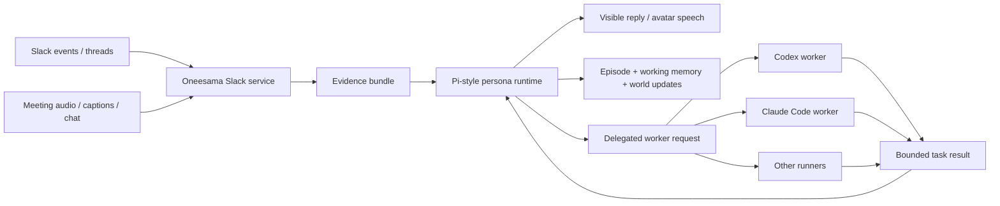

# Meeting Avatar Persona Runtime

Task: #200

## Decision

Meeting Avatar's foreground agent should be a Pi/OpenClaw-style persona
runtime, not Codex.

Codex, Claude Code, Ollama, command runners, and HTTP runners stay in the
system as delegated workers. They can inspect repositories, write patches, run
tests, and answer bounded technical tasks. They should not be treated as the
long-lived meeting avatar itself.

Peng's product language for this is "the meeting avatar is a lobster": it should
feel continuously present, remember relationships and recent context, develop
over time, and create Aha moments when humans leave a useful question or link
unanswered. A stateless Codex process can help the lobster work, but it is not
the lobster.

## Why We Are Pivoting

The previous migration direction tried to recover Cueboard behavior by making Go
services and Codex prompts carry more memory. That creates the same class of
drift Peng has been calling out:

- Go starts hardcoding social/cognitive behavior that belonged to the agent.
- Codex prompt tuning becomes a substitute for a memory-native persona.
- "Tool exists" is mistaken for "the avatar behaves like a present teammate".
- Backfill and triage templates produce plausible but low-quality replies.

The better boundary is:

- The persona runtime owns identity, memory, social timing, lightweight
  synthesis, and relationship continuity.
- The Go services own Slack/Meet IO, persistence, safety, evidence collection,
  and routing.
- Worker agents own delegated specialist work.

The language-neutral wire contract is documented in
[Persona Runtime Protocol](persona-protocol.md). Implementations plug in through
`internal/persona.Runtime` or the HTTP adapter; Slack/triage business logic
should not depend on Pi-specific code.

## Target Shape



The closest existing local reference is
`/Users/pengx17/Documents/telegram-pi-agent/src/runtime/memory.ts`, where the
runtime builds a `<memory-context>` from semantic memory, working memory,
today/yesterday episodes, historical memory, world state, and persona state.
`/Users/pengx17/Documents/telegram-pi-agent/docs/world-model.md` adds the
entity/event/arc/state model and source-reference discipline.

Oneesama should use that style of context assembly instead of feeding raw Slack
memory blobs into Codex.

## Language And Deployment Options

The runtime boundary must be designed before choosing a language. Pi-agent is
currently JavaScript/TypeScript, while Oneesama's surrounding services are Go.
That is acceptable only if the cross-process contract is narrow and typed.

Existing Oneesama already uses this pattern:

- `meet-runner` is a TypeScript subprocess driven by Go over JSON-RPC.
- Codex/Claude/Ollama/command providers are delegated workers behind a Go
  runner interface.

The persona runtime should follow the same discipline: Go orchestrates,
persists, audits, and routes; the persona process owns cognition and memory.

| Option                   | Shape                                                                                                                | Pros                                                                                         | Risks                                                                                           | When To Use                                                                   |
| ------------------------ | -------------------------------------------------------------------------------------------------------------------- | -------------------------------------------------------------------------------------------- | ----------------------------------------------------------------------------------------------- | ----------------------------------------------------------------------------- |
| JS/TS Pi sidecar         | Run the existing Pi-style runtime as a local subprocess or HTTP service; Go calls it through `PersonaRuntime`.       | Fastest path to reuse memory-native behavior; avoids reimplementing the lobster brain in Go. | Two runtimes to supervise; persona state and health must be exposed across process boundaries.  | First production-shaped canary and behavior validation.                       |
| Go Pi-style port         | Reimplement the Pi/OpenClaw memory context builder, episode model, and persona decision loop in Go.                  | Single binary/runtime; easier deploy and observability once correct.                         | High migration risk; easy to repeat the "tool surface migrated, behavior did not" failure mode. | Only after JS sidecar behavior fixtures are stable and the contract is known. |
| Hybrid shadow-first path | Start with JS sidecar in shadow/dry-run, define golden request/response fixtures, then decide whether to port to Go. | Lets us validate behavior before investing in language migration.                            | Requires maintaining the adapter seam during the shadow period.                                 | Recommended path.                                                             |

Decision for now: **hybrid shadow-first**. Do not start by searching for or
building a "Go pi-agent" clone. First lock the persona protocol and behavior
fixtures, run a JS/Pi-style sidecar behind that protocol, and only then decide
whether a Go port is worth the cost.

The code quality implication is important: a future Go implementation is fine
only if it implements the same persona-runtime contract and passes the same
behavior fixtures. A pile of Go heuristics that produces similar-looking text is
not a Go implementation of Pi-agent.

## Responsibilities

| Layer                           | Owns                                                                                                                       | Must Not Own                                                             |
| ------------------------------- | -------------------------------------------------------------------------------------------------------------------------- | ------------------------------------------------------------------------ |
| Persona runtime                 | Foreground avatar voice, memory-native social judgment, Aha replies, relationship continuity, memory/world writes          | Repo patching, shell commands, Slack API details, raw persistence schema |
| Oneesama Slack/Meeting services | Slack/Meet ingress, thread/caption/history fetch, evidence bundle assembly, safety gates, persistence, worker routing      | Persona cognition, long-term identity, hardcoded social reply templates  |
| Evidence providers              | Related-memory records, thread context, delegated link reads, meeting transcript chunks, triage/backfill candidates        | Final social judgment                                                    |
| Worker providers                | Bounded technical execution such as code review, repo inspection, tests, patch generation, document reading when delegated | Foreground persona continuity                                            |

## How Existing Work Fits

- task #195 related-memory search becomes evidence plumbing for the persona
  runtime. It is not "Codex memory".
- task #196 backfill memory gating becomes a quality gate: if evidence is weak,
  the item stays `needs_context` until the persona or delegated reader has enough
  context.
- task #197 canaries should validate persona behavior and citations, not just
  that Codex saw more prompt text.
- task #198 delegated link/article reading is the right direction: Go emits a
  read request, and an agent with appropriate tools reads and reasons.
- task #199 must flag any new Go/Codex path that turns into foreground avatar
  cognition.

## Implementation Plan

### Phase 0: Stop The Wrong Investment

- [ ] Mark Codex App Server session management as worker-session management, not
      persona memory.
- [ ] In task #199, add a quality gate: "Does this code make Go or Codex carry
      avatar cognition?"
- [ ] Keep #195/#196 evidence plumbing, but avoid adding more Codex memory prompt
      polish as a product solution.
- [ ] Document the current runtime as legacy foreground mode until a persona
      adapter is live.

Acceptance:

- [ ] New code reviews can reject "Codex remembers better" patches as drift.
- [ ] Docs consistently describe Codex as a delegated worker.

### Phase 1: Define The Persona Runtime Contract

- [x] Add a `PersonaRuntime` contract with a narrow request/response schema.
- [x] Keep the contract language-neutral: it must support a JS/TS sidecar, a Go
      fake, or a later Go port without changing Slack/Meet code.
- [x] Request fields should include event kind, speaker/user identity, Slack or
      meeting anchor, recent local context, evidence bundle, memory context, and
      safety constraints.
- [x] Response fields should include visible text/speech intent, optional worker
      requests, optional memory/world writes, confidence, citations, and whether
      to stay silent.
- [ ] The contract must support "do not answer yet, wait for humans" and "wake
      up later if still unanswered".

Acceptance:

- [ ] The same request can be handled by legacy fallback, a Pi adapter, or a test
      fake without Slack/Meet code changes.
- [ ] Cross-process implementations expose health, version, state summary,
      request latency, and last error back to Go audit/status endpoints.
- [ ] Worker requests are explicit structured outputs, not hidden prompt text.

Implemented scaffold in task #201:

- `internal/persona` defines the language-neutral request/response/status
  contract.
- `legacy` and `fake` local runtimes let Go tests exercise the contract without
  depending on Pi-agent.
- `http`/`pi` runtime providers call a sidecar over:
  - `POST /persona/decide`
  - `GET /persona/status`
- Slack status now exposes `persona_runtime`, including provider, mode,
  shadow-only flag, readiness, health, version, state summary, request latency,
  and last error.

Config flags:

```bash
ONEESAMA_PERSONA_RUNTIME=legacy   # legacy | fake | http | pi | oneesama-pi
ONEESAMA_PERSONA_RUNTIME_MODE=shadow
ONEESAMA_PERSONA_RUNTIME_BASE_URL=http://127.0.0.1:8799
ONEESAMA_PERSONA_RUNTIME_TIMEOUT=90s
ONEESAMA_PERSONA_RUNTIME_SHADOW_ONLY=1
```

`oneesama-pi` is the dedicated Oneesama foreground runtime. It uses an
OpenAI-compatible chat-completions backend directly and must not reuse the
Telegram/Linger sidecar protocol. Configure it with:

```bash
ONEESAMA_PERSONA_RUNTIME=oneesama-pi
ONEESAMA_PERSONA_RUNTIME_MODE=live
ONEESAMA_PERSONA_RUNTIME_SHADOW_ONLY=0
ONEESAMA_PI_BASE_URL=https://openrouter.ai/api/v1
ONEESAMA_PI_API_KEY=...
ONEESAMA_PI_MODEL=deepseek/deepseek-v4-pro
```

The initial scaffold was intentionally not wired into live reply generation; it
established the runtime boundary and observability surface first. task #206 adds
the first live foreground path for Slack triage replies.

Implemented shadow replay in task #202:

- Live Slack triage finalization builds a `slack_triage` persona request and
  queues it for the configured non-legacy persona runtime in `shadow` mode.
  The live triage finalize path does not wait for the sidecar; slow Pi requests
  write back shadow metadata later.
- `oneesama-triage-replay` accepts `--persona-runtime fake|http|pi` plus
  `--persona-runtime-base-url` to replay backfill candidates through the same
  sidecar contract.
- Shadow replay records runtime, decision, latency, reason, error, and
  citations in triage metadata / Markdown reports.
- Shadow replay is never allowed to post Slack replies; `live` mode is rejected
  by the replay CLI until the foreground cutover phase.

### Phase 2: Build A Pi-Style Memory Context Adapter

- [ ] Build an adapter that can assemble a `<memory-context>` style bundle for
      Oneesama from:
  - current Slack/Meet thread context
  - related-memory records from task #195
  - recent episodes / session tail
  - working memory
  - durable people/project/team memory
  - delegated link-read outputs
  - source refs and line ranges
- [ ] Prefer reusing the Pi-agent memory context shape over inventing another
      prompt format.
- [ ] Preserve source refs and read-back metrics.

Acceptance:

- [ ] A replay fixture can show the exact memory/context bundle seen by the
      persona.
- [ ] The persona can answer an Aha-style unanswered question with cited
      evidence.
- [ ] Weak memory hits remain weak; they do not become confident replies.

### Phase 3: Route Foreground Social Replies Through Persona Runtime

- [x] Route live triage social replies through the persona runtime.
- [ ] Route delayed no-reply surfacing through the persona runtime.
- [ ] Route backfill review-ready drafts through the persona runtime or mark them
      as delegated-reader pending.
- [x] Keep direct Slack/Meet IO and safety checks in Go.
- [x] Codex remains available only through explicit worker delegation for the
      live triage foreground path.

Acceptance:

- [ ] A shared link with no human reply becomes a lightweight persona opinion
      only after the persona receives link/evidence context.
- [ ] A PR review request is not treated as an article opinion; it becomes a
      workflow/context item or a worker delegation.
- [ ] The visible voice no longer sounds like a code worker unless the persona is
      explicitly reporting worker output.

Implemented foreground triage cutover in task #206:

- When `persona_runtime.provider` is non-legacy, `persona_runtime.mode=live`,
  and `persona_runtime.shadow_only=false`, Slack triage no longer posts Codex
  `post_thread_reply` actions directly.
- Go queues a live `slack_triage` `persona.Request` to the configured
  `PersonaRuntime`.
- If the persona returns `decision=reply` with `visible_text`, Go posts that
  text through the existing Slack direct-reply path, preserving freshness checks,
  duplicate suppression, Slack ledger writes, and cognition outbound records.
- If the persona fails or stays silent, Go records the foreground result and does
  not fall back to a Codex-authored visible reply.
- Worker requests are recorded in the triage metadata/tool call result; routing
  those requests to a worker is the next explicit delegation slice.

Live cutover requires both sides to run in live mode:

```bash
ONEESAMA_PERSONA_RUNTIME=pi
ONEESAMA_PERSONA_RUNTIME_MODE=live
ONEESAMA_PERSONA_RUNTIME_SHADOW_ONLY=0
ONEESAMA_PERSONA_RUNTIME_BASE_URL=http://127.0.0.1:8799

PERSONA_SIDECAR_MODE=live npm run persona:start
```

### Phase 4: Add Persona Behavior Canaries

- [ ] `aha_unanswered_question_with_recent_memory`
- [ ] `shared_article_with_prior_decision`
- [ ] `review_request_is_workflow_not_opinion`
- [ ] `weak_memory_hit_stays_needs_context`
- [ ] `persona_delegates_code_work_to_codex`
- [ ] `persona_updates_episode_or_world_state_after_useful_interaction`

Acceptance:

- [ ] Each canary checks behavior, citations, and whether the persona stayed
      silent when context was insufficient.
- [ ] A passing canary cannot be achieved by simply exposing a tool name.

### Phase 5: Cutover And Rollback

- [ ] Add a feature flag such as `ONEESAMA_PERSONA_RUNTIME=legacy|pi`.
- [x] Start with dry-run/shadow evaluation on backfill reports.
- [ ] Move selected Slack channels or meeting sessions to Pi runtime canary.
- [ ] Keep rollback to legacy foreground mode.
- [ ] Track per-run quality signals: answered, stayed silent, delegated worker,
      memory citations, human follow-up, and duplicate/awkward replies.

Acceptance:

- [ ] Pi runtime can be enabled per environment without changing worker
      providers.
- [ ] Rollback does not lose Slack/Meet state or worker session state.
- [ ] Human spot checks show fewer generic replies and more context-aware Aha
      moments.

## Code Quality Rules For task #199

During the post-memory/backfill quality pass, flag the following as drift:

- Go code generating persona opinions from hardcoded templates.
- Codex prompts carrying long-term identity, relationship memory, or social
  judgment as the foreground avatar.
- A worker session id being described as persona memory.
- Link/PDF/article reading implemented directly in Go when the product needs a
  delegated reader.
- Memory results without source refs being used as confident reply evidence.
- Any implementation that cannot be consumed by a Pi-style persona runtime
  without knowing Slack internals.

## Open Questions

- Should the Pi-style runtime be embedded in-process, called as a local HTTP
  service, or invoked through an agent protocol?
- Which parts of `telegram-pi-agent` memory/context can be reused directly, and
  which should become a shared library?
- Where should Oneesama store episode memory and world-state updates so they can
  be shared by Slack and Meet?
- Which channels/meeting sessions should be the first canary cohort?
- What is the minimum "lobster" dogfood script: one meeting, one Slack thread,
  or both?
