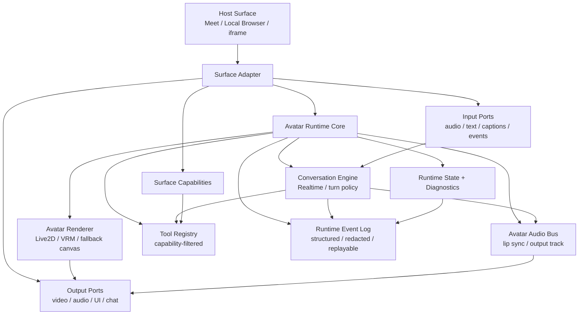

# RFC: Avatar Runtime + Surface Adapter

Date: 2026-05-27
Status: draft v0.3
Owner: @劲霸仁波切
Implementation driver: local Codex session

## Summary

Split the realtime avatar system into a host-agnostic **Avatar Runtime Core** and
host-specific **Surface Adapters**.

The current Google Meet path is both the runtime and the host adapter: the same
browser island joins Meet, installs avatar rendering, configures fake media
devices, hooks Meet WebRTC, connects Realtime, observes Meet chat/captions,
polls worker results, routes tools, and publishes audio/video back into the
meeting. That made the first walking skeleton useful, but it now hides product
decisions behind Meet-specific implementation details.

This RFC introduces two independent session axes:

```text
surfaceKind:
  google_meet | local_browser | embedded

conversationTransport:
  agents_sdk | raw_webrtc | mock | webrtc_mock
```

`GoogleMeetSurface` becomes one adapter plugged into the runtime core. A new
`LocalBrowserSurface` can run the same avatar/conversation runtime in a normal
browser page without copying Meet join logic or weakening Meet audio invariants.

## Reading Guide

This RFC is intentionally layered.

- For the decision: read `Summary`, `Problem`, `Decision`, `Goals`, and
  `Non-Goals`.
- For implementation: read `Runtime Core Responsibilities`, `Surface Adapter
  Responsibilities`, `Proposed Contracts`, and `Migration Plan`.
- For safety/debuggability: read `Observability and Self-Iteration`,
  `Progressive Disclosure`, and `Compatibility Shims`.
- For a local Codex implementation session: start from `First Slice For Local
  Codex`, then jump back to the contracts and validation rules it references.

## Problem

The codebase currently has a conversation transport axis, but no first-class
surface axis.

Today `state.mode` can distinguish transport modes such as `agents-sdk`, `mock`,
and `webrtc-mock`. It cannot express which host surface owns input/output
policy, tool capabilities, or media publication. As a result, Meet-only
assumptions can leak into local browser work, and local browser assumptions can
accidentally leak back into Meet.

Recent audio fixes exposed the risk:

- In Meet, local `getUserMedia` must not be a fallback Realtime input path.
- In Meet, Realtime output must not create a local DOM `<audio>` sink.
- In Meet, participant audio should flow through
  `meet_remote_audio -> meet_audio_mix -> Realtime sender`.
- In Meet, model audio should flow through
  `pc.ontrack -> MAB_AVATAR_AUDIO_BUS -> Meet outbound sender`.
- In a local browser surface, local mic and local speaker may both be valid, but
  only under explicit policy and loop guards.

Those differences are product/runtime contracts, not incidental implementation
branches. They need names, validation, and tests.

## Decision

Create an **Avatar Runtime Core** that owns avatar rendering, audio bus, Realtime
conversation, tool execution, and surface-independent diagnostics.

Create **Surface Adapters** that own host-specific capabilities and I/O:

- `GoogleMeetSurface`: Google Meet join, participant awareness, Meet chat,
  captions, screen-share controls, remote audio capture, and Meet publication.
- `LocalBrowserSurface`: standalone browser page, local controls, optional mic,
  optional speaker sink, and local-only capabilities.
- `EmbeddedSurface`: future page/iframe/web-app embedding surface.

Do not overload the existing transport mode to carry surface semantics. A
runtime session is configured with both `surfaceKind` and
`conversationTransport`.

## Goals

- Make avatar runtime behavior reusable outside Google Meet.
- Preserve current Meet behavior while introducing seams.
- Make Meet audio invariants explicit, validated, and regression-tested.
- Let local browser mode declare its own input/output policy without copying
  the Meet joiner.
- Filter tool schemas by surface capability.
- Keep worker dispatch/result delivery inside the conversation engine.
- Emit enough structured diagnostics for the runtime to explain failures and
  support future self-iteration.
- Keep long diagnostics and long docs usable through progressive disclosure.
- Start with low-risk contracts and a composer before extracting large browser
  injectors.

## Non-Goals

- Do not rewrite the Realtime bridge in the first implementation slice.
- Do not change live Google Meet behavior in Phase 1 or Phase 2.
- Do not implement `LocalBrowserSurface` by copying `GoogleMeetJoiner`.
- Do not silently enable continuous local mic plus local speaker output.
- Do not expose Meet-only tools to non-Meet surfaces.
- Do not make every surface implement worker-result plumbing.
- Do not expose raw debug logs, prompts, secrets, or stack traces to meeting or
  local-browser foreground users by default.
- Do not keep `window.MAB_AVATAR_*` compatibility globals forever.

## Terminology

- Runtime core: host-agnostic avatar renderer, audio bus, conversation engine,
  tool registry, state, and diagnostics.
- Surface adapter: host-specific integration layer that provides input/output
  ports and capabilities.
- Surface kind: immutable session property identifying the active host surface.
- Conversation transport: Realtime transport implementation, such as Agents SDK,
  raw WebRTC, mock, or WebRTC mock.
- Capability: surface-contributed feature that may expose tools, events, ports,
  or diagnostics.
- Input/output policy: explicit media/text routing policy for the session.
- Runtime event: structured, session-scoped log entry safe for machines to
  analyze and compact for humans.
- Progressive disclosure: layered status/debug output where the default view is
  short, with drill-down into timelines, traces, and raw artifacts only when
  requested.

## Architecture



## Runtime Core Responsibilities

The runtime core must not know about Google Meet DOM, Meet SFU behavior,
admission, or screen-share buttons.

It owns:

- `AvatarRenderer`
  - Live2D / VRM / fallback canvas.
  - Visual state: mood, action, HUD/status, lip-sync mouth level.
  - Provides a canvas/video-track output to the active surface.

- `AvatarAudioBus`
  - Receives Realtime response audio streams.
  - Drives lip sync.
  - Exposes an output track/stream for surfaces that publish avatar audio.
  - Does not decide whether audio is sent to Meet or local speakers.

- `ConversationEngine`
  - OpenAI Realtime / Agents SDK / raw WebRTC / mock transport.
  - Turn policy, response interruption, session update, event timeline.
  - Owns `function_call -> tool execution -> function_call_output`.

- `ToolRegistry`
  - Starts from core tools.
  - Adds tools only from the active surface's registered capabilities.
  - Produces the final Realtime tool schema for the session.

- `RuntimeState`
  - Health gates, timeline, diagnostics.
  - Surface-independent readiness plus namespaced surface status.

- `RuntimeEventLog`
  - Structured event timeline for joins, media routing, Realtime state, tool
    calls, loop guards, validation rejects, and recovery decisions.
  - Redacted by default and safe to attach to test/smoke artifacts.
  - Supports compact human summaries and deeper machine-readable traces.

## Surface Adapter Responsibilities

### `GoogleMeetSurface`

Responsibilities:

- launch, join, and stop Google Meet;
- install participant awareness, chat/caption observers, and screen-share
  controls;
- hook Meet remote audio and expose it as an audio input port;
- publish avatar video/audio into Meet;
- register Meet-only capabilities such as Meet chat, screen share, participant
  awareness, and shared app/window control.

Hard invariants:

- No local mic fallback in Realtime input.
- No Realtime local DOM `<audio>` sink.
- Realtime input source must be `meet_audio_mix` when Meet audio is expected.
- Realtime output routes through avatar audio bus, then Meet outbound sender.
- Surface-specific tools must not leak into non-Meet surfaces.

### `LocalBrowserSurface`

Responsibilities:

- open/render a local browser page that hosts avatar canvas and controls;
- support local text input by default;
- optionally support local mic input;
- optionally route response audio to a local speaker sink;
- register only local-browser capabilities.

Default policy:

- local text input enabled;
- avatar visual output enabled;
- avatar audio bus enabled for lip sync;
- continuous local mic disabled;
- local speaker disabled unless explicitly requested.

Allowed mic/speaker policies:

- push-to-talk mic: mic track active only while the user holds a control;
- AEC-gated mic: `getUserMedia({ audio: { echoCancellation: true } })` plus an
  explicit warning/diagnostic;
- headphones-required mode: allowed only when explicitly requested and surfaced
  in status;
- text-only with local speaker: allowed because there is no local mic loop.

Loop guard:

`LocalBrowserSurface` must reject continuous local mic plus local speaker output
unless an explicit loop guard is active.

This prevents the same class of bug as the removed Meet local-mic fallback. The
local browser case is even riskier because mic input and speaker output share
the same machine audio session.

### `EmbeddedSurface`

Future adapter for injecting the avatar runtime into an existing page, iframe,
or web app container.

It should follow the same port/capability contract and should not gain Meet-only
behavior by default.

## Worker and Tool Boundary

Worker results are not a surface input.

Correct ownership:

```text
ConversationEngine -> function_call
ToolRegistry -> dispatch
Worker/provider -> result
ConversationEngine -> function_call_output
```

A surface contributes capability specs. For example, `GoogleMeetSurface` may
register `send_meet_chat` or `share_existing_app_window`, but the engine owns
tool execution and result delivery.

This keeps worker-result polling/delivery from becoming an adapter API every new
surface must reimplement.

## Observability and Self-Iteration

The runtime must emit enough structured evidence for a future implementation or
agent session to answer: "what happened, why did it choose that path, and what
should change next?"

This is a runtime contract, not optional debug noise.

### Required Event Shape

Runtime events should be small, typed, session-scoped, and redacted by default.

Minimum fields:

- `ts`: monotonic or wall-clock timestamp.
- `sessionId`: runtime session id.
- `surfaceKind`: active surface.
- `conversationTransport`: active transport.
- `phase`: lifecycle phase, for example `init`, `join`, `media`, `realtime`,
  `tool`, `guard`, `shutdown`.
- `event`: stable event name.
- `severity`: `debug`, `info`, `warn`, or `error`.
- `summary`: short human-readable summary.
- `detail`: compact structured details.
- `redaction`: whether sensitive fields were omitted, hashed, or summarized.
- `correlation`: optional ids such as `turnId`, `responseId`, `toolCallId`,
  `trackId`, `capabilityName`, or `workerJobId`.

### Events That Must Exist

- session created, validated, started, stopped;
- selected `surfaceKind` and `conversationTransport`;
- surface capability set and generated tool schema hash;
- input/output policy validation pass/fail;
- Meet audio input source selected, including `meet_audio_mix`;
- local mic/speaker loop guard decisions;
- Realtime connection lifecycle and reconnect decisions;
- response audio route selected;
- tool call, tool result, and `function_call_output` delivery;
- compatibility-shim access during migration;
- validation rejects with enough context to write a regression test.

### Self-Iteration Loop

Every smoke or live-debug artifact should be able to produce a compact
post-run summary:

- what surface and transport ran;
- which capabilities were exposed;
- which media routes were selected;
- which guards fired or should have fired;
- which tools were called;
- whether output was delivered through the expected surface;
- top warnings/errors;
- suggested next regression test if the run failed.

This summary should be derived from structured runtime events, not manually
written from scattered console logs.

Raw logs remain available as private artifacts for debugging, but foreground
user-visible output should receive only the compact summary unless an operator
explicitly asks for deeper evidence.

## Progressive Disclosure

The RFC and runtime diagnostics both need layered disclosure because this system
is inherently multi-surface, multi-transport, and media-heavy.

### Document Disclosure

The RFC should keep this shape:

- executive path: `Summary`, `Problem`, `Decision`, `Goals`, `Non-Goals`;
- implementer path: responsibilities, contracts, validation rules;
- migration path: phased checklist and first slice;
- audit path: observability, self-iteration, compatibility shims, reader
  checklist.

Future edits should avoid turning the top of the RFC into a full implementation
manual. Deep details belong in contracts, migration phases, or linked runbooks.

### Runtime Disclosure

Runtime status should expose at least three layers:

- default status: short health summary safe for a live meeting or local page;
- diagnostic summary: compact structured state for operators and tests;
- deep trace: full redacted event timeline and artifacts for debugging.

Default user-facing status must not include raw prompts, stack traces, secrets,
or full worker/tool logs. It can say what failed and what action is needed.

### API Shape

The eventual runtime API should make disclosure level explicit, for example:

```text
GET /avatar/session/:id/status?view=summary
GET /avatar/session/:id/status?view=diagnostic
GET /avatar/session/:id/events?view=trace
```

Exact endpoints are not decided in Phase 1, but the contract should prevent
accidentally treating a full trace as the default status payload.

## Session Lifecycle

Surface selection is session-immutable.

- A runtime session starts with exactly one `surfaceKind`.
- The surface capability set is fixed before the Realtime session starts.
- Changing surface means creating a new runtime session.
- Conversation transport may reconnect according to existing reconnect rules.
- The surface/capability set must not hot-swap inside the same Realtime session.

Reason: Realtime sees a tool schema at session start/update time. If a surface
changes mid-turn and tools disappear or change semantics, tool calls become
ambiguous and hard to recover safely.

## Proposed Contracts

These contracts are intentionally small for Phase 1. They are meant to validate
the decision and support a behavior-preserving composer before deeper module
extraction.

```ts
export type SurfaceKind = "google_meet" | "local_browser" | "embedded";

export type ConversationTransport =
  | "agents_sdk"
  | "raw_webrtc"
  | "mock"
  | "webrtc_mock";

export interface AvatarRuntimeSessionConfig {
  sessionId: string;
  botName: string;
  surfaceKind: SurfaceKind;
  conversationTransport: ConversationTransport;
  renderer: AvatarRendererConfig;
  conversation: ConversationConfig;
  inputPolicy: RuntimeInputPolicy;
  outputPolicy: RuntimeOutputPolicy;
  capabilities: SurfaceCapability[];
  diagnostics?: RuntimeDiagnosticsConfig;
}

export interface SurfaceAdapter {
  kind: SurfaceKind;
  capabilities(): SurfaceCapability[];
  buildInitScripts(config: AvatarRuntimeSessionConfig): RuntimeInitScript[];
  start?(session: RuntimeSessionHandle): Promise<SurfaceStartResult>;
  stop?(reason?: string): Promise<SurfaceStopResult>;
  status?(): SurfaceStatus;
}

export interface SurfaceCapability {
  name: string;
  toolName?: string;
  description: string;
  surfaceOnly?: boolean;
  enabled: boolean;
}

export interface RuntimeInputPolicy {
  audioInputs: Array<"meet_remote_audio" | "local_mic" | "synthetic" | "none">;
  textInputs: Array<"meet_chat" | "caption" | "local_text" | "worker_internal">;
  continuousMic?: boolean;
  pushToTalk?: boolean;
  echoCancellationRequired?: boolean;
  explicitLoopGuard?: "push_to_talk" | "aec" | "headphones_required";
}

export interface RuntimeOutputPolicy {
  audioOutputs: Array<"meet_sender" | "local_speaker" | "avatar_bus_only" | "none">;
  videoOutputs: Array<"meet_camera" | "dom_canvas" | "capture_track" | "none">;
  allowLocalSpeaker?: boolean;
}

export type RuntimeStatusView = "summary" | "diagnostic" | "trace";

export interface RuntimeDiagnosticsConfig {
  eventLogEnabled: boolean;
  defaultStatusView: RuntimeStatusView;
  retainTraceArtifacts?: boolean;
  redactByDefault: boolean;
}

export interface RuntimeEvent {
  ts: string;
  sessionId: string;
  surfaceKind: SurfaceKind;
  conversationTransport: ConversationTransport;
  phase: "init" | "join" | "media" | "realtime" | "tool" | "guard" | "shutdown";
  event: string;
  severity: "debug" | "info" | "warn" | "error";
  summary: string;
  detail?: Record<string, unknown>;
  redaction?: "none" | "omitted" | "hashed" | "summarized";
  correlation?: {
    turnId?: string;
    responseId?: string;
    toolCallId?: string;
    trackId?: string;
    capabilityName?: string;
    workerJobId?: string;
  };
}

export interface RuntimeStatusSnapshot {
  view: RuntimeStatusView;
  summary: string;
  health: "starting" | "ready" | "degraded" | "failed" | "stopped";
  surfaceKind: SurfaceKind;
  conversationTransport: ConversationTransport;
  capabilities?: string[];
  warnings?: string[];
  errors?: string[];
}
```

### Phase 1 Validation Rules

- `surfaceKind` and `conversationTransport` are parsed and normalized
  independently.
- `google_meet` rejects `local_mic` as a Realtime input.
- `google_meet` rejects `local_speaker` as a Realtime output.
- `google_meet` accepts `meet_remote_audio -> meet_audio_mix` ownership only
  through the Meet surface path.
- `local_browser` rejects continuous `local_mic + local_speaker` unless
  `explicitLoopGuard` is set.
- Surface capabilities are frozen once the runtime session is created.
- Worker internal delivery is allowed as an engine text/event lane, not as a
  surface-contributed input.
- Diagnostics default to `summary` or `diagnostic`, never raw `trace`.
- Runtime events must be redacted by default.
- Validation failures must emit structured events that can seed regression
  tests.

## Compatibility Shims

Current browser code exposes globals such as:

- `window.MAB_AVATAR_CONTROLLER`
- `window.MAB_AVATAR_AUDIO_BUS`
- `window.MAB_AVATAR_READY`
- `window.MAB_REALTIME_CLIENT`

Phase 3 may keep these as temporary compatibility shims while modules are
extracted. They must have an explicit deletion target:

- new code should use module/port contracts, not add new global reads;
- contract tests should cover both shim behavior and module behavior during
  migration;
- Phase 8 removes the shims after Meet is stable on runtime-v2.

## Migration Plan

### Phase 1: Contracts only

- [ ] Add `packages/core/src/avatar-runtime/contracts.ts`.
- [ ] Model `SurfaceKind` and `ConversationTransport` as separate axes.
- [ ] Add surface/capability interfaces.
- [ ] Add input/output policy interfaces.
- [ ] Add diagnostics config, runtime event, and status snapshot interfaces.
- [ ] Encode Meet audio invariant validation.
- [ ] Encode local browser loop guard validation.
- [ ] Encode session-immutable surface/capability validation.
- [ ] Encode default progressive-disclosure behavior for status views.
- [ ] Document that worker dispatch/result is internal to the engine.

Acceptance:

- [ ] Typecheck passes.
- [ ] No runtime behavior changes.
- [ ] Contract tests reject invalid Meet local mic/local speaker configs.
- [ ] Contract tests reject invalid local continuous-mic + local-speaker config
      unless an approved loop guard is set.
- [ ] Contract tests prove surface and transport normalize independently.
- [ ] Contract tests prove default status view does not expose trace payloads.
- [ ] Contract tests prove validation rejects can emit redacted runtime events.

### Phase 2: Runtime init composer, no behavior change

- [ ] Add `packages/core/src/avatar-runtime/runtime-init-builder.ts`.
- [ ] Composer wraps existing builders:
  - `buildAvatarInitScript`;
  - `buildRealtimeBrowserInitScript`;
  - `buildLocalDialogInitScript`;
  - `buildScreenShareInitScript`;
  - `buildWorkerResultInitScript`.
- [ ] Update `GoogleMeetJoiner` to call the composer instead of manually
      assembling every init script.
- [ ] Keep generated init scripts behavior-equivalent for the current Meet path.
- [ ] Composer emits a structured event for each installed init-script category.

Acceptance:

- [ ] Existing focused Realtime/Meet tests still pass.
- [ ] `google_meet + agents_sdk` output config matches current behavior.
- [ ] Meet surface still has no local mic fallback.
- [ ] Meet surface still has no Realtime DOM `<audio>` sink.
- [ ] Composer snapshot/golden proves the existing init-script categories remain
      present.
- [ ] Diagnostic summary can list installed categories without exposing raw
      injected script content.

### Phase 3: Extract renderer/audio modules

- [ ] Split `hiyori-avatar-inject.ts` into renderer and audio bus modules.
- [ ] Keep `MAB_AVATAR_*` globals as temporary compatibility shims.
- [ ] Add module-level tests for renderer readiness and audio-bus routing.
- [ ] Add a grep/lint guard that blocks new runtime code from depending on new
      global reads.
- [ ] Emit compatibility-shim access events so remaining global dependencies are
      visible during rollout.

### Phase 4: Extract conversation engine

- [ ] Split Realtime transport and turn policy from surface-specific Meet hooks.
- [ ] Move `meet-peer-hook` and `meet_audio_mix` ownership to
      `GoogleMeetSurface`.
- [ ] Keep Realtime transport reusable across surfaces.
- [ ] Keep `function_call_output` delivery inside the engine.
- [ ] Emit Realtime lifecycle, tool-call, tool-result, and reconnect events.

### Phase 5: LocalBrowserSurface

- [ ] Add a local avatar page/session endpoint, for example `/avatar/local` or
      `/avatar/session`.
- [ ] Default mode: local text input + avatar canvas + avatar bus lip sync.
- [ ] Add push-to-talk or AEC-gated local mic as explicit opt-in.
- [ ] Add optional local speaker sink only behind policy validation.
- [ ] Ensure `LocalBrowserSurface` does not load Meet peer hooks or Meet tools.
- [ ] Surface loop guard decisions in default status and diagnostic events.

### Phase 6: Contract tests

- [ ] Same runtime core can build for Meet and local browser surfaces.
- [ ] Meet surface never includes local mic fallback.
- [ ] Meet surface never creates a Realtime DOM `<audio>` sink.
- [ ] Local browser surface never loads Meet peer hook.
- [ ] Local browser surface rejects continuous mic + local speaker without guard.
- [ ] Tool schema differs by surface capability set.
- [ ] Worker result delivery stays engine-owned.
- [ ] Runtime event log can produce a post-run summary for Meet and local
      browser sessions.
- [ ] Default status stays short while diagnostic/trace views provide deeper
      evidence.

### Phase 7: Meet runtime-v2 rollout

- [ ] Gate Meet path behind a runtime-v2 flag.
- [ ] Run smoke tests on both old and new init paths.
- [ ] Switch live Meet path only after equivalence is proven.
- [ ] Keep old path as rollback for a short window.
- [ ] Runtime-v2 smoke artifacts include a post-run summary derived from
      structured events.

### Phase 8: Remove compatibility globals

- [ ] Remove `MAB_AVATAR_*` compatibility shims.
- [ ] Replace remaining global reads with module/port access.
- [ ] Add lint or grep guard against new direct global usage.

## First Slice For Local Codex

The first implementable slice is Phase 1 + Phase 2 only.

- [ ] Create `packages/core/src/avatar-runtime/contracts.ts`.
- [ ] Create `packages/core/src/avatar-runtime/runtime-init-builder.ts`.
- [ ] Add unit tests for:
  - surface/transport axis normalization;
  - Meet invariant rejection for local mic and local speaker;
  - local browser loop guard rejection;
  - session-immutable capability model;
  - diagnostics redaction and progressive-disclosure defaults;
  - Meet composer includes existing init script categories;
  - composer event summary includes categories without raw script content.
- [ ] Refactor `packages/core/src/meeting/google-meet-joiner.ts` to call the
      composer.
- [ ] Do not extract `packages/core/src/avatar/hiyori-avatar-inject.ts` yet.
- [ ] Do not modify Realtime sender/audio routing logic yet.
- [ ] Validate with:
  - `npm run typecheck`;
  - focused Realtime tests;
  - focused Meet/joiner tests if present;
  - `npm run lint:size`;
  - `git diff --check`;
  - `make build`.

## Open Questions

- Should `LocalBrowserSurface` be served by `meeting-agent` or by a separate
  `avatar-agent` process? The module design should not require this answer in
  Phase 1.
- Should local speaker output be allowed by default when input is text-only?
  Proposed answer: yes, because there is no mic loop. The moment mic is enabled,
  loop guard rules apply.
- Should `webrtc_mock` remain a conversation transport or become test-only?
  Proposed answer: keep it as a transport for now because it is orthogonal to
  surface kind.
- Should Meet screen-share capabilities live under the same `SurfaceCapability`
  registry as app-control capabilities? Proposed answer: yes for schema
  filtering, while implementation modules can remain separate.
- What retention policy should trace artifacts use for live sessions? Proposed
  answer: keep short-lived local artifacts by default, then promote only
  explicit smoke/debug evidence into longer-lived notes.
- Should self-iteration summaries ever be visible to the model in realtime?
  Proposed answer: only compact, redacted summaries; raw traces stay operator
  and test evidence unless a future RFC defines a safe feedback lane.

## Reader Checklist

After reading this RFC, a local implementation session should know:

- not to build local mode by copying `GoogleMeetJoiner`;
- not to put local mic fallback back into the Meet path;
- not to reintroduce a local Realtime `<audio>` sink;
- not to make worker result delivery a surface responsibility;
- not to hot-swap surface/capabilities inside an active Realtime session;
- not to rely on scattered console logs for future debugging or self-iteration;
- not to expose deep trace output as the default status view;
- where the first low-risk implementation slice begins and stops.
