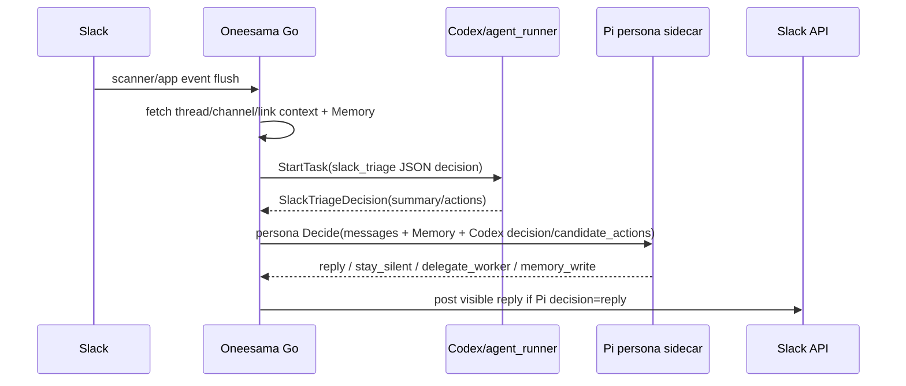
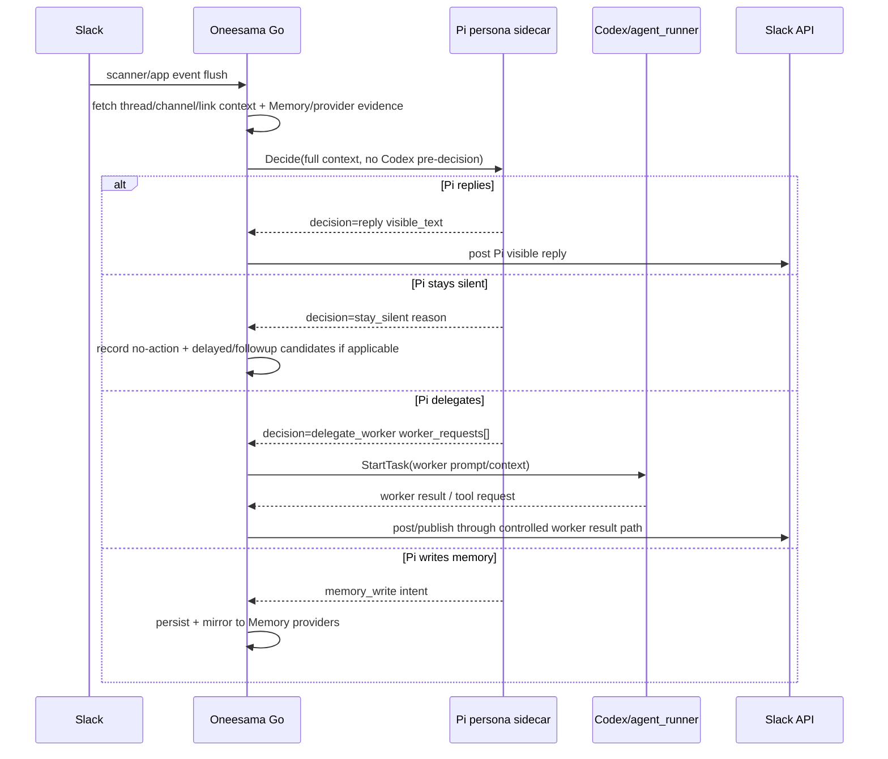

# RFC: Pi-First Foreground Cognition For Slack Triage

Date: 2026-05-19
Status: Draft
Owners: @劲霸仁波切, @喵喵

## Context

Peng pointed out that the post-cutover implementation is still confusing: we say Pi Agent owns foreground replies, but automatic Slack triage still starts by running Codex/agent_runner to produce a `SlackTriageDecision`, then passes that decision into Pi foreground.

That means the live chain is not truly Pi-first. It is currently closer to "Codex proposes, Pi reviews/refines". The intended architecture is "Pi decides, Codex is delegated only when Pi asks for a worker".

This RFC freezes implementation work until the architecture, rollout, and acceptance gates are explicit.

## Current Implementation

Important current call sites:

- `internal/slackagent/service_triage.go:1055`: `StartSlackTriage` always starts `agent_runner` for triage decision generation.
- `internal/slackagent/service_triage.go:1248`: after runner finalization, Go queues Pi foreground.
- `internal/slackagent/persona_shadow.go:130`: `queueSlackTriagePersonaForeground` accepts a `SlackTriageDecision` from runner.
- `internal/slackagent/persona_shadow.go:337`: runner actions become `triage_candidate_actions` inside the Pi request.

## Problem Statement

The current chain violates the desired responsibility split:

- Codex/agent_runner is still doing foreground cognition by producing the first actionable decision.
- Pi is downstream of that decision, so Pi is not truly the primary persona runtime.
- Fixing silence by preserving or passing runner candidates risks keeping the old architecture alive under new names.
- Audit health can be green while the true ownership boundary is wrong.

## Audit Perspective: How This Drift Formed

This section is the supervisor-side reconstruction of why
`codex_then_pi` shipped under the "Pi cutover" label, so the next
migration of a similar shape does not repeat it.

Timeline:

- 2026-05-18 ~18:30 SHA: `adc0182 feat(persona): route live triage
  replies through persona runtime` shipped. The commit message
  framed this as "Pi foreground." Implementation:
  `queueSlackTriagePersonaForeground` took the existing Codex
  `SlackTriageDecision` and asked Pi to refine/replace its actions.
  Codex still ran on every triage; Pi review was the new gate, not
  the new origin.
- 2026-05-18 ~21:00 SHA: persona shadow audits passed cleanly. The
  audit dashboards report `pi foreground 16/16 success` because the
  Pi step succeeded; they do not report whether Codex preceded it.
- 2026-05-19 11:00–12:21 SHA: Pi cutover follow-up swarm closed the
  7-point app-mention entry-parity contract (`#215-#224`). None of
  those contract items asked "does Codex run before Pi?" because the
  contract was framed at the app-mention entry level, not at the
  cognitive-ownership level.
- 2026-05-19 17:28 SHA: driver started cleaning up the worker tool
  bridge. While cleaning, the drift surfaced: removing
  Codex-publishes-to-Slack still left
  Codex-produces-candidate-for-Pi-to-review.
- 2026-05-19 17:29 SHA: Peng called it: 太乱了. RFC mode triggered.

What audit method failed:

- The `persona_shadow` audit reported on Pi runtime health, not on
  whether Pi was the foreground decision owner.
- The `triage_run` schema does not record the chain of decisions per
  event; `last_triage_job` tracks the Codex job, and persona shadow
  results are recorded separately. The audit reader has to manually
  correlate the two to detect double-cognition.
- The 7-point entry-parity contract for `app_mention` did not list
  "OldModel must not run on the foreground path." That item was
  implicit in `adc0182`'s commit message but never written down as a
  contract item with a fixture.

Why this kept living:

- Live behavior of `codex_then_pi` is observable as "everything
  green." Pi succeeds, Codex succeeds, Slack reply lands. There is
  no surface signal that Codex's actions were the seed for Pi's
  visible reply.
- The candidate-generator name (`triage_candidate_actions`) reads as
  evidence, not as cognition. The shape did not name itself as the
  drift it was.

Audit rule from this incident (already captured in
`migration-lessons-audit-method.md` "candidate-generator as cognition
in main path"):

- For any "decision_layer = NewModel" cutover, the audit must
  include a per-event count of OldModel invocations on the
  foreground path. The expectation post-cutover is zero unless the
  decision explicitly delegated.
- The acceptance fixture errors any direct OldModel call and the
  foreground reply must still land.

## Target Architecture

### Responsibility Split

- **Pi Agent** owns foreground cognition:
  - whether to answer;
  - what visible Slack text says;
  - when to delegate;
  - when to propose durable memory writes.
  - when it is not capable enough to answer confidently.

- **Oneesama Go** owns orchestration and safety:
  - Slack event ingestion and dedupe;
  - thread/channel/link/context fetching;
  - Memory provider fanout and retrieval;
  - safe execution of Slack posts, Canvas, tools, and persistence;
  - audit and rollback signals.

- **Codex/agent_runner** is the default delegated worker:
  - only starts when Pi returns `delegate_worker` or when a human explicitly invokes `/work` / app-mention worker behavior;
  - handles longer code/research/tool-loop tasks;
  - does not run before Pi on automatic foreground triage.
  - is the normal fallback for "Pi knows this needs stronger work", not a competing foreground brain.

### Policy Layering

The Pi runtime should not bake every workspace's engagement taste into
the universal persona contract. Split foreground behavior into layers:

1. **Universal persona capability boundary**: Pi must not bluff, must
   delegate when it lacks context/tooling/confidence, must stay silent
   for already-handled/off-topic/unsafe cases, and must cite evidence
   for factual replies.
2. **Workspace-specific engagement policy**: this Oneesama/Bridge
   workspace values lightweight comments on AI agents, coding tools,
   creative tooling, Memory, and Bridge/Cue-like collaboration
   products, even in casual channels. That is our product-development
   context, not a rule every deployment should inherit.
3. **Channel/thread local state**: the channel brain and thread ledger
   can still suppress duplicates, already-handled threads, or channels
   where the local policy says "do not engage."

This separation is important because some proactive behaviors are
valuable for our own product team but inappropriate for other
workspaces. The implementation should model them as deployment /
workspace policy inputs, not as hard-coded universal Pi instincts.

## Target Pi Request Shape

Foreground triage request should contain context and evidence, not a runner decision:

- event:
  - `kind=slack_triage`
  - fresh message text / digest
- anchor:
  - channel, thread, message timestamp
- context:
  - fresh messages
  - fetched thread contexts
  - channel low-context expansion
  - external link excerpts
  - previous triage summaries
  - channel brain / thread ledger
  - safety/freshness hints such as `ignore_existing_bot_reply`
- memory:
  - lexical results
  - semantic provider records
  - entity graph records
  - multimodal/delegated-reader evidence
- safety:
  - `allow_visible_reply`
  - `allow_worker_request`
  - `allowed_workers=[codex, agent_read]`
  - max visible chars

The request should not contain:

- `triage_candidate_actions` produced by Codex pre-triage;
- a Codex summary/action count used as Pi's primary input;
- hidden instruction that Pi should rubber-stamp a runner candidate.

## Decision Semantics

- `stay_silent`: no visible Slack post. Go records outcome and may create delayed/followup candidates if the route is configured to do so.
- `reply`: Go posts `visible_text` after freshness/dedup/safety checks. Pi should use this only when it has enough cited context/evidence to be concrete.
- `delegate_worker`: Go starts Codex/agent_runner using Pi's `worker_requests` and the same fetched context/Memory evidence. Pi should use this when it detects its own capability, context, tool, or confidence limit.
- `memory_write`: Go persists reviewable memory and mirrors to configured Memory providers.

## Pi Capability Boundary

Pi is allowed to handle most Slack triage directly, including moderately complex tasks, but it must not bluff.

Pi should choose `reply` only when the answer can be:

- grounded in supplied Slack context, Memory/provider evidence, or fetched link/thread/file evidence;
- phrased as a concrete answer or concrete next step;
- short enough for the foreground Slack surface;
- safe to post without additional tool execution.

Pi should choose `delegate_worker` when:

- it needs code/repo inspection, a long research pass, browser/tool work, file/video/PDF content reading, or multi-step synthesis;
- the request is important but the supplied evidence is insufficient;
- it would otherwise answer with "maybe / possibly / I guess" style uncertainty;
- it needs a stronger model/tool loop to avoid a vague or misleading visible answer.

Pi should choose `stay_silent` instead of `reply` when the thread is already handled, addressed to another bot, low-signal, or unsafe to answer. If the user explicitly asked Oneesama and the missing information is actionable, `delegate_worker` is preferred over a vague reply.

Hard rule: **no ambiguous foreground answers**. If Pi cannot produce a grounded answer, it must delegate or stay silent with a concrete reason; it must not post a hedged answer just to be active.

Hedge language is a delegation smell, not a safe foreground style. A Pi `reply`
whose main disposition is "可能 / 也许 / 大概 / 或许 / seems / maybe /
might / probably" should usually have been `delegate_worker` instead, unless
the uncertainty itself is the grounded answer and the message clearly says what
evidence supports that uncertainty.

## Delegated Worker Spec

When Pi returns `delegate_worker`, Go should create a worker job with:

- task prompt from `worker_request.prompt`;
- context:
  - original Slack request;
  - Pi decision reason;
  - relevant Memory/provider evidence;
  - thread/link/file context;
  - allowed tool bridge hints;
  - output contract: reply to Slack only through the existing worker result path.
- mode:
  - default `analysis` unless Pi explicitly asks for code changes and safety allows it.
- session kind:
  - `Slack` for user-facing worker tasks;
  - not `Triage`, because this is no longer foreground triage decision generation.

## Migration Plan

### Phase 0 — RFC And Instrumentation Only

- [ ] Land this RFC.
- [ ] Add audit label for current chain: `foreground_chain=codex_then_pi`.
- [ ] Add intended label for target chain: `foreground_chain=pi_first`.
- [ ] Do not change live behavior in this phase.

### Phase 1 — Pi-First Shadow / Dual Run

- [ ] Build Pi-first request builder that does not accept `SlackTriageDecision`.
- [ ] For each live scanner triage run, call Pi-first in shadow while keeping current behavior live.
- [ ] Record Pi-first decision, latency, citations, worker requests, and compare against current chain.
- [ ] Add audit report: old chain vs Pi-first decision distribution and mutation quality.

### Phase 2 — Pi-First Live Behind Flag

- [ ] Add flag: `slack.triage.foreground_chain = codex_then_pi | pi_first_shadow | pi_first_live`.
- [ ] Switch oneesama live to `pi_first_live` only after Phase 1 quality gates pass.
- [ ] In `pi_first_live`, do not start `agent_runner` before Pi.
- [ ] Implement `delegate_worker` execution from Pi response.
- [ ] Keep current chain available as rollback flag for one deploy window.

### Phase 3 — Remove Candidate-Generator Path

- [ ] Remove `triage_candidate_actions` from foreground Pi request.
- [ ] Remove foreground triage dependency on `SlackTriageDecision`.
- [ ] Keep `agent_runner` for explicit `/work`, app-mention worker tasks, and Pi `delegate_worker`.
- [ ] Update migration lessons and delete misleading fallback/candidate tests.

## Acceptance Gates

### Architecture Gates

- [ ] In Pi-first live mode, automatic scanner triage does not call `agent_runner.StartTask` before the Pi decision.
- [ ] If Codex/agent_runner is unavailable, Pi foreground can still reply or stay silent for simple factual/memory-backed cases.
- [ ] Codex/agent_runner jobs created from triage must have a preceding Pi `delegate_worker` decision recorded in the triage run metadata.
- [ ] `queueSlackTriagePersonaForeground` no longer accepts `SlackTriageDecision`.

### Quality Gates

- [ ] Replay today's old Slack Agent D mutation cases and classify each as should-port / product-not-port / out-of-scope.
- [ ] Pi-first decisions must match or improve the current chain on should-port cases.
- [ ] For insufficient-context cases, Pi must choose `delegate_worker` or `stay_silent`, not a vague `reply`.
- [ ] For complex but answerable user asks, Pi must delegate to Codex/agent_runner instead of producing a low-confidence foreground guess.
- [ ] Pi `reply` output must not use hedge markers as the primary content disposition; hedged uncertainty should trigger `delegate_worker` unless it is explicitly source-backed.
- [ ] Add fixture `pi_low_confidence_must_delegate`: an ambiguous but answerable request should produce `delegate_worker`, not a hedged visible answer.
- [ ] Old Bridge identity mentions remain product-not-port unless Peng explicitly retires old Bridge.
- [ ] Fresh factual/current-events questions with enough evidence can produce a short Pi reply.
- [ ] Meeting/quota/person/project Memory cases cite Memory/provider evidence.

### Safety Gates

- [ ] Pi unavailable in `pi_first_live` fails closed or rolls back by flag; it does not silently fall back to Codex visible replies.
- [ ] Tool failures do not expose localhost, internal headers, or stack traces.
- [ ] Worker result path remains bounded and scrubbed.
- [ ] `delegate_worker` cannot write arbitrary Slack messages except through existing safe worker result surfaces.

## Test Fixture Plan

The existing canary suites are the right home for the durable
acceptance contract. Each fixture is named here so reviewers see the
test surface up front, not "tests TBD."

### bridge_quality_fixtures (task #219 suite, supervisor-owned)

New `case_NNN_pi_first_foreground` fixture, contract item
`C237_pi_first_foreground`:

- input: production-shape app-mention or scanner-triage event with
  fresh messages + thread context + related memory seeded;
- runner double: errors on direct `StartTask` if called before Pi
  decision; allows `StartTask` only after a recorded Pi
  `delegate_worker` decision;
- assertions:
  - Pi `Decide` invoked exactly once per event before any
    `agent_runner.StartTask` call;
  - if Pi returns `reply`, Slack post emitted with Pi's `visible_text`
    and zero `agent_runner.StartTask` invocations;
  - if Pi returns `delegate_worker`, exactly one `agent_runner.StartTask`
    invocation follows, with `correlation_id` linking back to the Pi
    request;
  - audit row written with `foreground_chain=pi_first_live` and
    `pre_pi_agent_runner_started=false`.

### memory_quality_fixtures (task #232 suite, supervisor-owned)

Existing fixture set continues to assert provider hooks; one stub
addition for the Pi-first transition:

- `case_007_pi_first_codex_offline_recall`: registers a real Memory
  provider, replays a triage event with `runner=nil` injected,
  asserts Pi returns `reply` with cited evidence. This is the
  "Codex offline → Pi foreground still works" canary from the
  acceptance gate.

### Old-vs-new shadow comparison harness

Phase 1 shadow phase produces a daily report comparing decision
distribution:

- old: Codex decision summary/actions vs Pi-shadow refined decision;
- new: Pi-first decision vs Codex-then-Pi decision on the same
  event;
- gate: Pi-first decision must not regress on the should-port
  fixture set extracted from real Bridge cases; mismatch rate
  above threshold is yellow on the dashboard.

### Production case replay harness

`cmd/oneesama-triage-replay` already exists for offline Markdown
reporting. Extend with a `--foreground-chain` flag so the same tool
can run the same input through `codex_then_pi` vs `pi_first_shadow`
and emit a side-by-side report. This is the operational version of
the comparison harness above; QA / Peng can drive it without a code
deploy.

### Production canary on live

After Phase 2 cutover:

- a synthetic mention from a dev-only Slack channel runs every 5
  minutes;
- expects Pi-first reply within latency SLO;
- if Pi fails or Codex is invoked before Pi, the canary turns red and
  pages.

## Observability

New audit fields proposed:

- `foreground_chain`: `codex_then_pi`, `pi_first_shadow`, `pi_first_live`
- `pi_first_decision`: decision enum
- `pi_first_latency_ms`
- `pi_first_worker_requests`
- `pre_pi_agent_runner_started`: boolean; must be false in Pi-first live
- `delegate_worker_jobs_started`: count
- `pi_confidence_bucket`: high / medium / low / insufficient
- `pi_insufficiency_reason`: missing_context / missing_tool / needs_worker / already_handled / unsafe
- `persona_unavailable_policy`: fail_closed / rollback_flag / shadow_only

Dashboard/audit flags:

- red: `pre_pi_agent_runner_started=true` while `foreground_chain=pi_first_live`
- red: Pi foreground failures above threshold
- red: Pi returns `reply` with low confidence and no citations/evidence on a case marked `needs_worker`
- yellow: no live positive samples
- yellow: Pi-first/Codex-current decision mismatch over threshold during shadow phase

## Rollback

Rollback should be explicit and observable:

1. Flip `slack.triage.foreground_chain` from `pi_first_live` to `codex_then_pi`.
2. Restart via `scripts/oneesama-live.sh`, never raw env.
3. Audit should show `foreground_chain=codex_then_pi` after rollback.
4. Rollback must create a follow-up task; otherwise the system may remain in the old mixed architecture unnoticed.

## Open Questions For Peng

- If Pi sidecar is unavailable in Pi-first live mode, should Oneesama fail closed, or temporarily roll back to the old Codex triage path by flag?
- Should app-mention worker tasks also move to Pi-first immediately, or is this RFC only for automatic scanner triage first?
- What is the acceptable quality threshold in Phase 1 shadow: equal mutation rate, equal user-visible quality, or specific should-port fixture pass rate?
- What confidence/evidence threshold should force `delegate_worker` instead of `reply`?
- Should old Bridge identity retirement be part of this migration, or remain a separate product decision?

### Additional Supervisor Open Questions

- Pi cold-start latency on the foreground critical path is the
  biggest known production risk of removing `codex_then_pi`. Today's
  Pi sidecar still has a ~60s cold path on first request after
  restart. Should Phase 2 keep `codex_then_pi` as automatic fallback
  if Pi latency exceeds a threshold, or strictly fail-closed with
  user-visible "I'm warming up, try again" text?
- For the shadow phase, do we need to record the user-visible reply
  Codex *would* have posted (the candidate text) so reviewers can
  spot cases where Pi's wording is materially worse, not just where
  the decision differs?
- Provider/Memory fanout latency contributes to Pi request build
  time. Should the Pi-first request builder enforce a budget (e.g.,
  cap total Memory provider fanout at 800ms), and what is the
  fail-closed behavior when budget is exceeded?
- For `delegate_worker` to actually run Codex in Phase 3, do we
  preserve the existing Codex prompt template (so Codex sees what it
  saw before) or rebuild the Codex worker prompt from Pi's worker
  request to capture Pi's reasoning context? The first preserves
  Codex behavior; the second is closer to how a human delegates.
- For app-mention worker tasks (out of scope per question 2 above),
  is "Pi-first" also the eventual direction, or do app-mentions
  stay Codex-primary because they're already a user-initiated worker
  request with no automatic triage?

## Risk Inventory

Audit-side risks to track during rollout:

1. **Hidden-cognition leaks back**: A future change adds a
   "preprocessor that summarizes context for Pi" implemented via
   Codex. This is the same drift class as
   candidate-generator-as-cognition. The architecture gate "no
   `agent_runner.StartTask` before Pi" must reject it.
2. **Pi prompt drift**: Pi-first changes the input shape it sees.
   The Pi sidecar prompt template
   (`oneesama-persona-shadow-decision.md`) must be updated to match
   the new input or Pi will produce degraded decisions for reasons
   unrelated to the architecture.
3. **Memory provider failure modes**: With Pi-first, Pi depends on
   Memory provider fanout more directly. A flaky provider can now
   degrade live reply quality, where previously it only degraded
   Codex-then-Pi quality (because Codex also had its own context).
4. **Audit observability lag**: New audit fields must land in the
   same deploy as the runtime change; otherwise we get the same
   "healthy but wrong" gap that produced this drift.
5. **Worker task spec divergence**: If `delegate_worker` worker
   prompts diverge from what Codex used to receive, Codex worker
   behavior may regress on tasks that previously worked. Phase 1
   shadow comparison must include worker outcome quality, not only
   decision quality.

## Initial Code Change Plan

No implementation until this RFC is reviewed. Expected files when approved:

- `internal/slackagent/service_triage.go`
  - add foreground-chain flag handling;
  - build Pi-first request before `agent_runner.StartTask`;
  - bypass runner in Pi-first live mode;
  - record chain audit metadata.
- `internal/slackagent/persona_shadow.go`
  - add `BuildSlackTriagePersonaRequestFromContext` or equivalent;
  - remove foreground dependency on `SlackTriageDecision`;
  - implement delegate-worker execution bridge.
- `internal/slackagent/persona_shadow_test.go`
  - add Codex-offline/Pi-foreground canary;
  - add no-pre-Pi-runner assertion.
- `internal/slackagent/handler_triage_test.go`
  - audit fields for foreground chain.
- `templates/prompts/oneesama-persona-shadow-decision.md`
  - remove candidate-action language after code path no longer emits it;
  - strengthen Pi-first triage rules.
  - add the no-bluff rule: insufficient context should become `delegate_worker` or `stay_silent`, never a vague visible answer.
- `notes/cueboard-function-audit/migration-lessons-audit-method.md`
  - keep candidate-generator-as-cognition as a first-class drift class.
