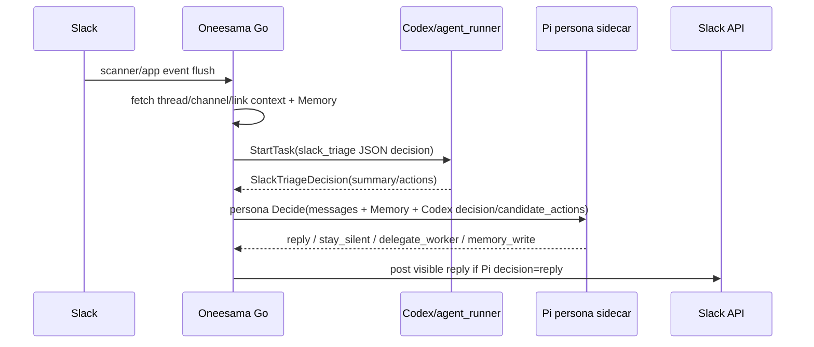
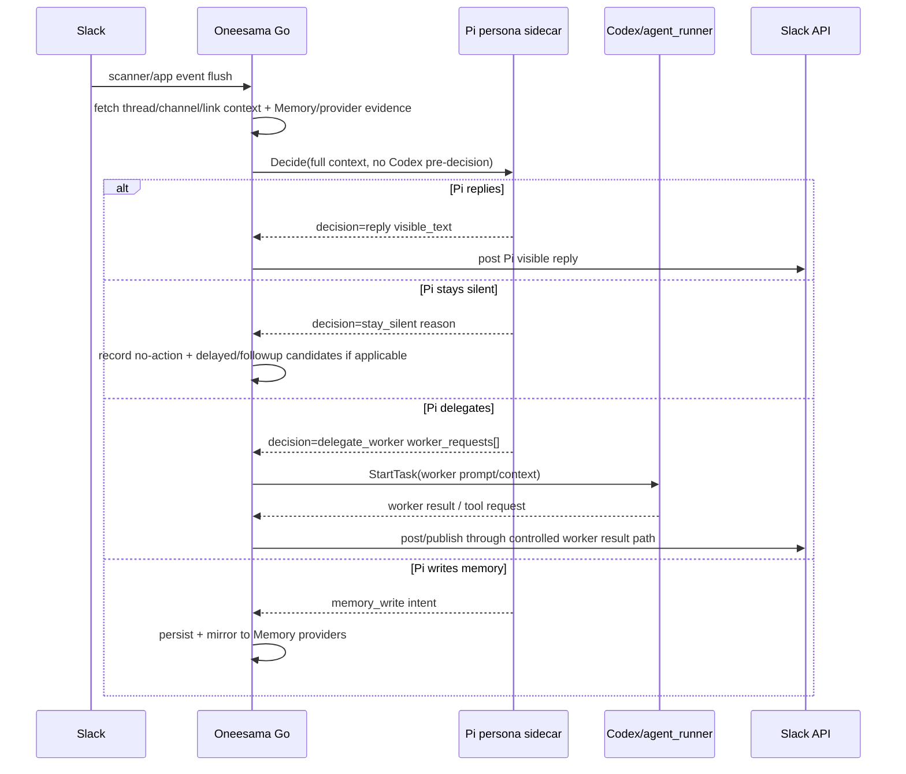

# RFC: Pi-First Foreground Cognition For Slack Triage

Date: 2026-05-19
Status: Draft
Owners: @劲霸仁波切, @喵喵

## Context

Peng pointed out that the post-cutover implementation is still confusing: we say Pi Agent owns foreground replies, but automatic Slack triage still starts by running Codex/agent_runner to produce a `SlackTriageDecision`, then passes that decision into Pi foreground.

That means the live chain is not truly Pi-first. It is currently closer to "Codex proposes, Pi reviews/refines". The intended architecture is "Pi decides, Codex is delegated only when Pi asks for a worker".

This RFC freezes implementation work until the architecture, rollout, and acceptance gates are explicit.

## Current Implementation

Important current call sites:

- `internal/slackagent/service_triage.go:1055`: `StartSlackTriage` always starts `agent_runner` for triage decision generation.
- `internal/slackagent/service_triage.go:1248`: after runner finalization, Go queues Pi foreground.
- `internal/slackagent/persona_shadow.go:130`: `queueSlackTriagePersonaForeground` accepts a `SlackTriageDecision` from runner.
- `internal/slackagent/persona_shadow.go:337`: runner actions become `triage_candidate_actions` inside the Pi request.

## Problem Statement

The current chain violates the desired responsibility split:

- Codex/agent_runner is still doing foreground cognition by producing the first actionable decision.
- Pi is downstream of that decision, so Pi is not truly the primary persona runtime.
- Fixing silence by preserving or passing runner candidates risks keeping the old architecture alive under new names.
- Audit health can be green while the true ownership boundary is wrong.

## Target Architecture

### Responsibility Split

- **Pi Agent** owns foreground cognition:
  - whether to answer;
  - what visible Slack text says;
  - when to delegate;
  - when to propose durable memory writes.

- **Oneesama Go** owns orchestration and safety:
  - Slack event ingestion and dedupe;
  - thread/channel/link/context fetching;
  - Memory provider fanout and retrieval;
  - safe execution of Slack posts, Canvas, tools, and persistence;
  - audit and rollback signals.

- **Codex/agent_runner** is the default delegated worker:
  - only starts when Pi returns `delegate_worker` or when a human explicitly invokes `/work` / app-mention worker behavior;
  - handles longer code/research/tool-loop tasks;
  - does not run before Pi on automatic foreground triage.

## Target Pi Request Shape

Foreground triage request should contain context and evidence, not a runner decision:

- event:
  - `kind=slack_triage`
  - fresh message text / digest
- anchor:
  - channel, thread, message timestamp
- context:
  - fresh messages
  - fetched thread contexts
  - channel low-context expansion
  - external link excerpts
  - previous triage summaries
  - channel brain / thread ledger
  - safety/freshness hints such as `ignore_existing_bot_reply`
- memory:
  - lexical results
  - semantic provider records
  - entity graph records
  - multimodal/delegated-reader evidence
- safety:
  - `allow_visible_reply`
  - `allow_worker_request`
  - `allowed_workers=[codex, agent_read]`
  - max visible chars

The request should not contain:

- `triage_candidate_actions` produced by Codex pre-triage;
- a Codex summary/action count used as Pi's primary input;
- hidden instruction that Pi should rubber-stamp a runner candidate.

## Decision Semantics

- `stay_silent`: no visible Slack post. Go records outcome and may create delayed/followup candidates if the route is configured to do so.
- `reply`: Go posts `visible_text` after freshness/dedup/safety checks.
- `delegate_worker`: Go starts Codex/agent_runner using Pi's `worker_requests` and the same fetched context/Memory evidence.
- `memory_write`: Go persists reviewable memory and mirrors to configured Memory providers.

## Delegated Worker Spec

When Pi returns `delegate_worker`, Go should create a worker job with:

- task prompt from `worker_request.prompt`;
- context:
  - original Slack request;
  - Pi decision reason;
  - relevant Memory/provider evidence;
  - thread/link/file context;
  - allowed tool bridge hints;
  - output contract: reply to Slack only through the existing worker result path.
- mode:
  - default `analysis` unless Pi explicitly asks for code changes and safety allows it.
- session kind:
  - `Slack` for user-facing worker tasks;
  - not `Triage`, because this is no longer foreground triage decision generation.

## Migration Plan

### Phase 0 — RFC And Instrumentation Only

- [ ] Land this RFC.
- [ ] Add audit label for current chain: `foreground_chain=codex_then_pi`.
- [ ] Add intended label for target chain: `foreground_chain=pi_first`.
- [ ] Do not change live behavior in this phase.

### Phase 1 — Pi-First Shadow / Dual Run

- [ ] Build Pi-first request builder that does not accept `SlackTriageDecision`.
- [ ] For each live scanner triage run, call Pi-first in shadow while keeping current behavior live.
- [ ] Record Pi-first decision, latency, citations, worker requests, and compare against current chain.
- [ ] Add audit report: old chain vs Pi-first decision distribution and mutation quality.

### Phase 2 — Pi-First Live Behind Flag

- [ ] Add flag: `slack.triage.foreground_chain = codex_then_pi | pi_first_shadow | pi_first_live`.
- [ ] Switch oneesama live to `pi_first_live` only after Phase 1 quality gates pass.
- [ ] In `pi_first_live`, do not start `agent_runner` before Pi.
- [ ] Implement `delegate_worker` execution from Pi response.
- [ ] Keep current chain available as rollback flag for one deploy window.

### Phase 3 — Remove Candidate-Generator Path

- [ ] Remove `triage_candidate_actions` from foreground Pi request.
- [ ] Remove foreground triage dependency on `SlackTriageDecision`.
- [ ] Keep `agent_runner` for explicit `/work`, app-mention worker tasks, and Pi `delegate_worker`.
- [ ] Update migration lessons and delete misleading fallback/candidate tests.

## Acceptance Gates

### Architecture Gates

- [ ] In Pi-first live mode, automatic scanner triage does not call `agent_runner.StartTask` before the Pi decision.
- [ ] If Codex/agent_runner is unavailable, Pi foreground can still reply or stay silent for simple factual/memory-backed cases.
- [ ] Codex/agent_runner jobs created from triage must have a preceding Pi `delegate_worker` decision recorded in the triage run metadata.
- [ ] `queueSlackTriagePersonaForeground` no longer accepts `SlackTriageDecision`.

### Quality Gates

- [ ] Replay today's old Slack Agent D mutation cases and classify each as should-port / product-not-port / out-of-scope.
- [ ] Pi-first decisions must match or improve the current chain on should-port cases.
- [ ] Old Bridge identity mentions remain product-not-port unless Peng explicitly retires old Bridge.
- [ ] Fresh factual/current-events questions with enough evidence can produce a short Pi reply.
- [ ] Meeting/quota/person/project Memory cases cite Memory/provider evidence.

### Safety Gates

- [ ] Pi unavailable in `pi_first_live` fails closed or rolls back by flag; it does not silently fall back to Codex visible replies.
- [ ] Tool failures do not expose localhost, internal headers, or stack traces.
- [ ] Worker result path remains bounded and scrubbed.
- [ ] `delegate_worker` cannot write arbitrary Slack messages except through existing safe worker result surfaces.

## Observability

New audit fields proposed:

- `foreground_chain`: `codex_then_pi`, `pi_first_shadow`, `pi_first_live`
- `pi_first_decision`: decision enum
- `pi_first_latency_ms`
- `pi_first_worker_requests`
- `pre_pi_agent_runner_started`: boolean; must be false in Pi-first live
- `delegate_worker_jobs_started`: count
- `persona_unavailable_policy`: fail_closed / rollback_flag / shadow_only

Dashboard/audit flags:

- red: `pre_pi_agent_runner_started=true` while `foreground_chain=pi_first_live`
- red: Pi foreground failures above threshold
- yellow: no live positive samples
- yellow: Pi-first/Codex-current decision mismatch over threshold during shadow phase

## Rollback

Rollback should be explicit and observable:

1. Flip `slack.triage.foreground_chain` from `pi_first_live` to `codex_then_pi`.
2. Restart via `scripts/oneesama-live.sh`, never raw env.
3. Audit should show `foreground_chain=codex_then_pi` after rollback.
4. Rollback must create a follow-up task; otherwise the system may remain in the old mixed architecture unnoticed.

## Open Questions For Peng

- If Pi sidecar is unavailable in Pi-first live mode, should Oneesama fail closed, or temporarily roll back to the old Codex triage path by flag?
- Should app-mention worker tasks also move to Pi-first immediately, or is this RFC only for automatic scanner triage first?
- What is the acceptable quality threshold in Phase 1 shadow: equal mutation rate, equal user-visible quality, or specific should-port fixture pass rate?
- Should old Bridge identity retirement be part of this migration, or remain a separate product decision?

## Initial Code Change Plan

No implementation until this RFC is reviewed. Expected files when approved:

- `internal/slackagent/service_triage.go`
  - add foreground-chain flag handling;
  - build Pi-first request before `agent_runner.StartTask`;
  - bypass runner in Pi-first live mode;
  - record chain audit metadata.
- `internal/slackagent/persona_shadow.go`
  - add `BuildSlackTriagePersonaRequestFromContext` or equivalent;
  - remove foreground dependency on `SlackTriageDecision`;
  - implement delegate-worker execution bridge.
- `internal/slackagent/persona_shadow_test.go`
  - add Codex-offline/Pi-foreground canary;
  - add no-pre-Pi-runner assertion.
- `internal/slackagent/handler_triage_test.go`
  - audit fields for foreground chain.
- `templates/prompts/oneesama-persona-shadow-decision.md`
  - remove candidate-action language after code path no longer emits it;
  - strengthen Pi-first triage rules.
- `notes/cueboard-function-audit/migration-lessons-audit-method.md`
  - keep candidate-generator-as-cognition as a first-class drift class.
