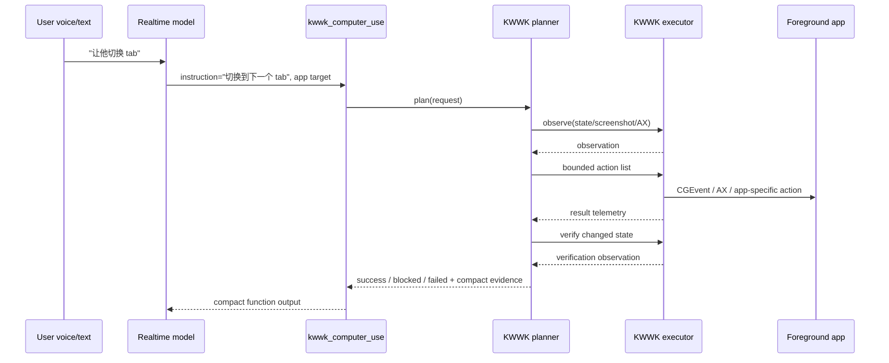

# RFC: KWWK CU Internal Action Planner

Date: 2026-06-02
Status: accepted implementation plan
Owner: @劲霸仁波切
Implementation driver: local Codex session

## Summary

Make `kwwk_computer_use` the single Realtime-visible tool for simple,
bounded foreground app operations, and move operation planning inside KWWK CU.

Realtime should not learn one tool per UI action, and it should not generate raw
click coordinates or operation arrays. It should provide a short natural-language
instruction plus optional app/window targeting. KWWK CU then owns the fast loop:
observe current app state, plan bounded actions, execute them, verify the result,
and return a compact status.

This fixes the failure mode from "让他切换 tab": adding a specific tab-switch
tool would never scale. The required product boundary is a generic
Realtime-facing instruction tool backed by a KWWK-side action planner.

## Decision Snapshot

- Realtime-visible app-control surface stays one generic tool:
  `kwwk_computer_use`.
- Realtime passes natural language:
  `{"instruction":"切换到下一个 tab","applicationName":"Chrome"}`.
- KWWK CU owns instruction normalization, observation, planning, action
  execution, verification, and blocker wording.
- Deterministic planner rules cover high-frequency primitives first:
  tab switching, keyboard shortcuts, typing, enter/escape, scrolling, click by
  accessible label, and simple focus changes.
- An optional fast planner model may be used only for ambiguous visual/action
  decisions. The model is configured by policy/env, not hard-coded in the
  Realtime tool schema.
- Complex multi-step tasks still delegate to Codex/background app-control. The
  KWWK planner is for short, bounded, foreground operations.

## Scope Boundary

`kwwk_computer_use` is the meeting-safe foreground-operation tool. It is not a
general agent shell.

The tool is allowed to:

- observe the foreground or explicitly targeted app/window;
- press bounded keyboard shortcuts;
- type explicit user-provided text;
- scroll;
- click or drag visible targets when observation identifies them;
- verify the immediate result of the action.

The tool is not allowed to:

- run shell, filesystem, network, or browser automation programs directly;
- open-endedly browse, debug, summarize, or build;
- execute more actions than the configured per-call budget;
- invent text to type when the user did not provide it;
- continue after verification fails.

When a task crosses that boundary, KWWK returns `needs_background_agent` with the
original instruction and any observed target context. Realtime can then delegate
to the slower background/Codex path without changing the public tool surface.

## Problem

The current KWWK execution path can receive a generic instruction, but the live
planner capability is still too shallow:

- "按 control+tab" can be mapped to a key event.
- "输入 hello" can be mapped to text input.
- "滚动一下" can be mapped to scroll.
- "切换 tab" may not map unless the instruction already contains explicit key
  language.
- "点第二个按钮" needs observed UI state, not just a prompt rewrite.

That means the Realtime model can choose the correct tool while the actual app
operation still fails or blocks. A recall benchmark can pass and still miss the
real product problem.

## Non-Goals

- Do not expose raw `click`, `type_text`, `press_key`, `scroll`, or `drag` tools
  directly to Realtime.
- Do not expose `app_control.plan_operations` as a public Realtime tool.
- Do not ask Realtime to produce operation arrays, coordinates, selectors, or
  JSON action programs.
- Do not make the KWWK planner responsible for long research/build/debug tasks.
- Do not hide failures behind voice progress text. A blocked action must return
  a compact blocker.

## Proposed Architecture



## Planner Contract

The Realtime tool input stays intentionally small:

```ts
interface RealtimeKWWKComputerUseArgs {
  instruction: string;
  applicationName?: string;
  bundleIdentifier?: string;
  windowTitle?: string;
  windowId?: string;
  processId?: number;
  session_id?: string;
}
```

Required tool-schema constraints:

- `instruction` is required and is always natural language.
- App/window fields are hints, not proof that the target exists.
- The schema must not accept operation arrays, selectors, key names as a
  separate planning language, raw coordinates, screenshots, or model selection.
- The tool description should say "short, bounded app operation" and explicitly
  route long/research/build/debug tasks away from KWWK CU.

KWWK expands it into an internal planning request:

```ts
interface KWWKPlanRequest {
  instruction: string;
  target?: {
    applicationName?: string;
    bundleIdentifier?: string;
    windowTitle?: string;
    windowId?: string;
    processId?: number;
  };
  constraints: {
    maxActions: number;
    maxDurationMs: number;
    allowTextEntry: boolean;
    allowPointerActions: boolean;
    requireVerification: boolean;
  };
  observationBudget: {
    includeAccessibilityTree: boolean;
    includeScreenshot: boolean;
    screenshotMaxPixels: number;
  };
}
```

The planner returns a bounded program, not an open-ended conversation:

```ts
type KWWKPlannedAction =
  | { kind: "observe"; reason: string }
  | { kind: "press_key"; key: string; modifiers?: string[] }
  | { kind: "type_text"; text: string }
  | { kind: "scroll"; direction: "up" | "down" | "left" | "right"; amount?: number }
  | { kind: "click"; target: { label?: string; role?: string; x?: number; y?: number } }
  | { kind: "drag"; from: { x: number; y: number }; to: { x: number; y: number } };

interface KWWKPlanResult {
  status: "planned" | "blocked" | "unsupported" | "needs_background_agent";
  actions: KWWKPlannedAction[];
  rationale: string;
  confidence: number;
  blocker?: string;
}
```

The external result returned to Realtime should be compact:

```ts
interface RealtimeKWWKComputerUseResult {
  status:
    | "success"
    | "blocked_ambiguous_target"
    | "blocked_permission"
    | "blocked_no_target_app"
    | "blocked_unsupported_instruction"
    | "needs_background_agent"
    | "failed_execution"
    | "failed_verification";
  message: string;
  evidence?: {
    app?: string;
    actionKinds?: string[];
    verification?: string;
    modelUsed?: boolean;
    durationMs?: number;
  };
}
```

The full trace belongs in local artifacts/telemetry, not SDK history.

## Planner Layers

### 1. Deterministic Normalizer

Fast local rules should cover common operations without model latency:

- [x] RFC decision: deterministic rules are the first planner layer and the
      default for high-frequency operations.
- [x] `切换 tab` / `下一个标签页` / `next tab` -> `control+tab` or
      app-specific tab shortcut.
- [x] `上一个 tab` / `previous tab` -> `control+shift+tab`.
- [x] `刷新` -> `command+r` for browsers.
- [x] `回车` / `确认` -> `enter`.
- [x] `退出` / `关闭弹窗` -> `escape`.
- [x] `输入 <text>` -> `type_text`.
- [x] `搜索 <query>` -> focus current search/address field when safe, then
      `type_text`, then optionally `enter`.
- [x] `滚动` -> `scroll`.
- [x] Pure observation/status requests -> `observe` only.

The normalizer should be measured in milliseconds and should not require a
screenshot.

### 2. State-Aware Resolver

When the instruction references a visible target, the planner observes the app:

- [x] RFC decision: state-aware planning lives inside KWWK, not Realtime.
- [x] capture focused app/window metadata;
- [x] read accessibility tree when available;
- [x] capture screenshot only when AX is insufficient;
- [x] choose labels/roles before coordinates;
- [x] emit a blocker when target ambiguity is real.

Examples:

| Instruction                | Expected resolver behavior                                                    |
| -------------------------- | ----------------------------------------------------------------------------- |
| "点第二个按钮"             | observe buttons, click the second visible enabled button, verify focus/result |
| "点发送"                   | prefer AX button label "Send"/"发送"                                          |
| "切到 Chrome 的第二个 tab" | use browser/tab state if available, otherwise key shortcut bounded by count   |
| "点左上角那个"             | require screenshot and return low confidence unless target is clear           |

### 3. Optional Fast Planner Model

Use a small/fast planner model only when deterministic and AX paths are
insufficient.

Configuration should look like:

```text
ONEESAMA_KWWK_PLANNER_PROVIDER=off|openai|local
ONEESAMA_KWWK_PLANNER_MODEL=<configured model name>
ONEESAMA_KWWK_PLANNER_TIMEOUT_MS=1200
ONEESAMA_KWWK_PLANNER_MAX_ACTIONS=3
```

Policy:

- [x] RFC decision: optional planner model is configured by env/policy and never
      appears in the Realtime tool schema.
- [x] no model call for deterministic shortcuts;
- [x] no model call for pure typing when text is explicit;
- [x] model output must validate against the internal action schema;
- [x] model cannot request shell/filesystem/network actions;
- [x] model cannot expand max action or max duration budgets;
- [x] failed validation returns `blocked`, not a best-effort unsafe action.

The candidate "gpt-5.3 codex spark" belongs here only as configuration if it is
available and validated. It should not be baked into Realtime prompts or tool
descriptions.

### 4. Execute And Verify

Every non-observe plan should have post-action evidence:

- [x] RFC decision: unverified action is not `success`.
- [x] action telemetry: action kind, target, duration, success/failure;
- [x] verification observation: focus changed, text appeared, tab title changed,
      button state changed, or explicit blocker;
- [x] compact function output for Realtime;
- [x] full trace artifact outside SDK history.
- [x] pointer-action cursor presentation is executor/presentation-layer work,
      not a planner output format. The planner emits bounded action kinds; the
      executor triggers Cueboard-style cursor feedback for pointer actions.

## Failure Taxonomy

KWWK should return one of these compact outcomes:

| Outcome                           | Meaning                                                   |
| --------------------------------- | --------------------------------------------------------- |
| `success`                         | Operation executed and verification passed.               |
| `blocked_ambiguous_target`        | More than one plausible target exists.                    |
| `blocked_permission`              | macOS accessibility/screen permission missing.            |
| `blocked_no_target_app`           | Requested app/window is unavailable.                      |
| `blocked_unsupported_instruction` | Instruction is outside KWWK's bounded scope.              |
| `needs_background_agent`          | Task is multi-step or reasoning-heavy; delegate to Codex. |
| `failed_execution`                | Planned action failed at executor level.                  |
| `failed_verification`             | Action ran but expected state was not observed.           |

## Rollout Plan

### Phase 0: Tool-Surface Lock

- [x] Confirm `/realtime/config` exposes `kwwk_computer_use` as the only default
      Realtime simple app-control tool.
- [x] Keep `control_shared_app_window` compatible server-side for old callers,
      but hide it from the default live-safe Realtime tool list.
- [x] Add a test that rejects public tool schemas containing operation arrays,
      raw coordinates, or planner-model selection.

Done when: recall artifacts show only `kwwk_computer_use` for bounded foreground
CU utterances and old compatibility tools are absent from the default tool list.

### Phase 1: Deterministic Planner

- [x] Add `internal/meetingagent` planner module behind the current app-control
      backend/helper boundary.
- [x] Implement the deterministic normalizer cases listed above.
- [x] Add Chinese and English normalization tests.
- [x] Emit `modelUsed:false`, `normalizeMs`, and planned action kinds.

Done when: tab-switch, enter/escape, type, search, scroll, and observe-only cases
produce bounded action plans without screenshot or model calls.

### Phase 2: State-Aware Resolver

- [x] Add observation fixtures for app metadata and AX-like element trees.
- [x] Add screenshot fallback observation fixtures.
- [x] Resolve visible labels/roles before coordinates.
- [x] Implement ambiguity blockers for target references such as "第二个按钮".
- [x] Verify fixture post-state for tab title, focused element, typed text,
      button state, or scroll position.
- [x] Verify live native fixture app post-state for tab-like title, focused
      element, and typed text.
- [x] Verify observe-only real Meet/browser window title state for the English
      "report visible page title or blocker" instruction.
- [x] Verify live browser post-state for a real browser tab title.

Done when: fixture planner/action benchmark proves "点第二个按钮" succeeds only
when the second enabled visible button is uniquely resolvable.

### Phase 3: Optional Planner Model

- [x] Add env/config plumbing for provider, model, timeout, and max actions.
- [x] Validate model output against the internal action schema.
- [x] Block invalid, over-budget, or unsafe model outputs.
- [x] Record model name, latency, and validation result in local trace artifacts.

Done when: deterministic cases never call the model, visual ambiguous cases
either validate into bounded actions or return compact blockers.

### Phase 4: Delegation And Product Polish

- [x] Route `needs_background_agent` to the existing background/Codex
      app-control path with the original instruction and target hints.
- [x] Add compact Realtime-facing result wording for all failure taxonomy values.
- [x] Feed action telemetry into benchmark reports and cursor/HUD state.

Done when: a live turn can say "切换 tab", execute through KWWK, verify the
state, and return a short success or blocker without exposing raw planner state
to Realtime.

## Implementation Checklist

- [x] Lock RFC decision: `kwwk_computer_use` is a generic simple app operation
      tool; KWWK owns deterministic planning plus optional model planning.
- [x] Add a KWWK-side planner module behind the existing app-control helper
      boundary.
- [x] Add deterministic instruction normalization tests for Chinese and English
      common operations.
- [x] Add internal action schema validation and reject invalid model output.
- [x] Add AX-like observation fixture support for visual target tests.
- [x] Add screenshot fallback fixture support for visual target tests.
- [x] Add compact `success` / `blocked` / `failed` result envelopes.
- [x] Keep `kwwk_computer_use` as the only default Realtime simple app-control
      tool.
- [x] Keep compatibility handling for old `control_shared_app_window` endpoint
      server-side, but do not expose it in the default Realtime tool surface.
- [x] Add config/env for optional planner model provider and model name.
- [x] Add per-call latency telemetry for normalize, observe, plan, execute, and
      verify.
- [x] Add routing rule: if planner returns `needs_background_agent`, delegate to
      Codex/background app-control with the same user instruction and target.

## Verification Checklist

- [x] Unit: "让他切换 tab" plans one shortcut action without a model call.
- [x] Unit: "输入 hello" plans `type_text`.
- [x] Unit: "滚动一下" plans `scroll`.
- [x] Unit: "点第二个按钮" uses AX fixture and rejects ambiguity when there are
      fewer than two enabled buttons.
- [x] Integration: real app helper switches a live native fixture tab-like title
      and verifies the title changed.
- [x] Integration: real app helper types into a focused text field and verifies
      text.
- [x] Integration: real browser helper switches browser tabs and verifies the
      browser title changed.
- [x] Benchmark: planner/action gate records action success, verification
      success, latency, and whether a model was used.
- [x] Realtime recall: Realtime still chooses `kwwk_computer_use` for bounded
      app-control utterances.
- [x] Negative: stop-share and meeting-control utterances do not route through
      KWWK CU.

## Validation Log

- 2026-06-02: `node --import tsx --test --test-reporter=spec test/app-control-helper.test.mjs test/realtime-kwwk-cursor-visible-benchmark.test.mjs test/realtime-kwwk-native-cursor-benchmark.test.mjs test/realtime-kwwk-planner-action-benchmark.test.mjs test/realtime-contract.test.mjs` passed 52/52, including deterministic planner fixtures, optional planner-model config exposure, unsafe/over-budget model-output validation, visual target resolution, native pointer-presentation probe coverage, and Realtime tool-contract coverage.
- 2026-06-02: after rebasing onto `origin/main` `b3bf2b4` and installing the new `oxfmt` / `oxlint` / `lefthook` toolchain, `npm run format:check`, `npm run lint:js`, `npm run lint:go`, `npm run typecheck`, and the same 52/52 targeted Realtime/KWWK tests passed.
- 2026-06-02: after rebasing again onto `origin/main` `2d70b3f` / Vite+ tooling, `npm run format:check`, `npm run lint:js`, `npm run lint:go`, `npm run typecheck`, and `vp test run test/app-control-helper.test.mjs test/realtime-kwwk-cursor-visible-benchmark.test.mjs test/realtime-kwwk-native-cursor-benchmark.test.mjs test/realtime-kwwk-planner-action-benchmark.test.mjs test/realtime-contract.test.mjs` passed 52/52.
- 2026-06-02: after the same rebase, `npm run benchmark:realtime-kwwk-planner-action -- --json-out /tmp/oneesama-realtime-kwwk-planner-action-after-rebase.json` passed all planner/action fixture cases.
- 2026-06-02: real Meet app-control smoke initially exposed a planner bug where `Do not type, click...` in a safety clause made observe/report-title instructions look actionful. The deterministic normalizer now strips negated safety clauses before action-intent detection, and `observe-title-report-en` is covered in helper tests plus `npm run benchmark:realtime-kwwk-planner-action -- --json-out /tmp/oneesama-realtime-kwwk-planner-action-observe-title-fix.json` with 14/14 cases passing.
- 2026-06-02: after restarting stale live helper state, `MAB_REAL_MEET_URL=https://meet.google.com/ypw-fozb-anz vp exec tsx scripts/real-meet-synthetic-speaker-smoke.mjs --real-meet-app-control-smoke --require-real-meet-url --json-out /tmp/oneesama-realtime-real-app-control-after-observe-fix.json` passed; KWWK returned `actions:["observe"]`, planner `actionKinds:["state"]`, app-control job `completed`, function output delivered, and captured real window title `Meet - ypw-fozb-anz`.
- 2026-06-02: `MAB_REAL_MEET_URL=https://meet.google.com/yza-vjpx-qto MAB_SYNTHETIC_SPEAKER_HEADLESS=false MAB_SYNTHETIC_SPEAKER_JOIN_TIMEOUT_MS=45000 vp exec tsx scripts/real-meet-sidecar-acceptance.mjs --require-real-meet-url --json-out /tmp/oneesama-realtime-live-sidecar-yza-vjpx-qto-headed-2026-06-02.json` passed the strict sidecar wrapper. The app-control child used `kwwk_computer_use`, delivered function output, completed `app_control_3`, and KWWK's deterministic planner produced `actionKinds:["state"]` for the observe/report-title instruction. The synthetic-speaker child also passed once the speaker ran headed, proving the earlier `cannot_join_meeting` blocker was the headless guest admission path rather than KWWK app-control routing.
- 2026-06-02: `npm run benchmark:realtime-kwwk-planner-action -- --json-out /tmp/oneesama-realtime-kwwk-planner-action-rfc.json` passed all deterministic planner/action, visual-target, permission, ambiguity, and background-delegation cases.
- 2026-06-02: `node --import tsx scripts/realtime-kwwk-planner-action-benchmark.mjs --include-live-macos-fixture --timeout-ms 30000 --json-out /tmp/oneesama-realtime-kwwk-planner-action-live-macos-rfc.json` passed with real helper execution changing the native fixture title from `KWWK Fixture One` to `KWWK Fixture Two` and focused text from empty to `hello`.
- 2026-06-02: `npm run benchmark:realtime-kwwk-planner-action -- --include-live-browser-fixture --json-out /tmp/oneesama-realtime-kwwk-planner-action-live-browser-rfc.json` passed with `evidenceMode: deterministic_helper_plan_fixture_and_live_browser_fixture`; the KWWK helper observed a real Chrome for Testing window title changing from `KWWK Browser One` to `KWWK Browser Two` after the deterministic planner emitted `press_key control+tab`.
- 2026-06-02: pointer actions now carry native foreground cursor evidence from the executor/presentation layer; keyboard-only planner actions remain pointer-free.
- 2026-06-02: real-room app-control suite `MAB_REAL_MEET_URL=https://meet.google.com/yza-vjpx-qto MAB_REAL_MEET_APP_CONTROL_WAIT_MS=240000 MAB_REAL_MEET_APP_CONTROL_CURSOR_WAIT_MS=25000 vp exec tsx scripts/real-meet-synthetic-speaker-smoke.mjs --real-meet-app-control-suite --require-real-meet-url --json-out /tmp/oneesama-realtime-real-app-control-suite-yza-vjpx-qto-cursor-json-envelope-2026-06-02.json` passed both the keyboard-only `Press Escape` case and the pointer `Click Chromium` case through `kwwk_computer_use`. This covered the Realtime-generated Chinese target wording path (`可见目标：Click Chromium`), AX label parsing for `Chromium`, app-control worker terminal-result redelivery, and cursor/HUD telemetry propagation from the KWWK planner/executor result.

## Open Questions

- What exact model name should be used for the optional fast planner once the
  project config confirms availability?
- Should browser tab switching use app-specific browser automation when a
  browser surface is owned by the bot, or stay with keyboard shortcuts for all
  foreground apps?
- How many actions should the default KWWK budget allow before returning
  `needs_background_agent`?
- Keyboard-only actions should not show a fake pointer. They may show compact
  CU status while active; only pointer actions trigger Cueboard-style cursor
  feedback.
