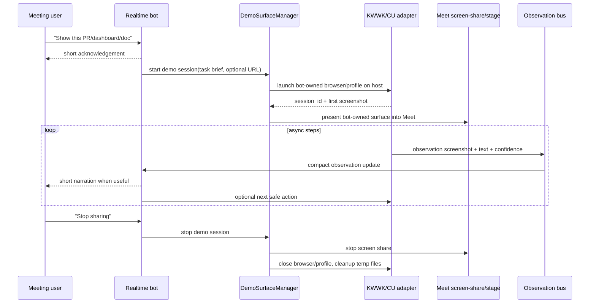

# RFC: KWWK Computer Use Demo Surface POC

Date: 2026-05-21
Status: proposed for task #304
Owner: @劲霸仁波切

## Context

Peng wants the meeting realtime bot to use Computer Use for demonstration work:
open a page, show a dashboard or PR, scroll, point at the interesting part, and
explain what it is doing in the meeting. The important correction is that this
is not just "share the current screen". Screen share is the output surface. The
new capability is a bot-owned, host-run Computer Use workspace that can be
shared into the meeting and narrated by realtime.

For the POC, Peng explicitly said not to block on Docker. It can run directly on
the host, as long as the surface is owned by the bot and not the user's active
desktop/browser session.

Two later corrections shape the implementation:

- this should be developed as an independently testable module, so validating
  Computer Use + realtime sharing does not require running the full meeting
  circuit every time;
- the "POC" is not throwaway. It should be a mainline-bound walking skeleton:
  build the seams cleanly now, then graduate the same module into the integrated
  meeting runtime.

## Existing Surfaces

Oneesama already has meeting-side presentation and realtime seams:

- `meet-runner/src/index.ts` supports `screen_share.start`,
  `screen_share.present`, `screen_share.video`, `screen_share.app`,
  `screen_share.stop`, `worker.result.inject`, and `meet.chat.send`.
- `packages/core/src/meeting/google-meet-joiner.ts` can install a synthetic
  screen-share controller and present a video/stage surface.
- `docs/architecture.md` already separates meeting runtime, realtime dialog,
  persona runtime, and delegated worker providers.

The desktop-minion KWWK/CU spike has useful primitives, but they should be
imported conceptually, not copied as-is:

- `realtime-webview/src/realtime-webview-client.js` defines realtime tools:
  `capture_screen`, `highlight_screen_region`, and `computer_use_step`.
- `macos/Sources/MinionCapture/ScreenCaptureService.swift` captures host
  screen/window frames through ScreenCaptureKit.
- `macos/Sources/MinionComputerUse/CGEventComputerUse.swift` has a gated
  CGEvent executor with dry-run mode.
- `macos/scripts/run-r1-cu-smoke.sh` proves the Computer Use harness can be
  installed behind an env gate and run safely in dry-run mode.

## Product Goal

In a meeting, a user can say something like:

- "Open this PR and show the relevant diff."
- "Bring up that dashboard and explain the red metric."
- "Pull up this doc and show everyone the section we are discussing."

Oneesama should:

1. acknowledge briefly in voice;
2. start a host-run, bot-owned demo browser/session asynchronously;
3. use KWWK/CU-like tools to navigate, observe, scroll, and highlight;
4. share that bot-owned demo surface into Meet;
5. feed observations back into realtime so the avatar can narrate naturally.

## Non-Goals For POC

- No Docker/container isolation in the first slice.
- No control of the user's existing desktop, daily browser, or private windows.
- No broad project-code debugging ownership; this remains secretary/show-and-tell
  work unless explicitly authorized.
- No precise AX control over a remote participant's shared screen. Remote Meet
  shares are pixels only and belong to a separate passive-perception lane.
- No arbitrary shell command execution from realtime voice.

## Proposed Architecture



## Module Boundaries

Every module below must have its own fake or local harness. The full meeting E2E
should be a final smoke test, not the default development loop.

### `DemoWorkspaceLifecycle`

Bot-owned browser sandbox lifecycle.

Responsibilities:

- create `runtime/demo-browser/<session_id>/` profile/runtime directories;
- launch and stop the host-run browser process;
- clean stale profiles and orphaned sessions;
- expose local lifecycle status for tests and operators.

Independent harness:

- spawn/stop a fake browser process or local fixture browser;
- verify stale cleanup without joining Meet or starting realtime.

### `KWWKClient`

Thin interface between Oneesama and the KWWK / Computer Use implementation.

Interface variants:

- fake in-memory implementation for tests;
- direct `agent-browser` CLI adapter for deterministic realtime demo steps;
- Codex/browser-use worker adapter for planning/summarization-heavy tasks;
- deferred stdio JSON-RPC bridge to a Swift/KWWK helper;
- future library binding if KWWK becomes importable as a package.

Key decision:

- use the direct `agent-browser` CLI as the first fast realtime adapter for
  open/capture/scroll/highlight/click/type smokes. Keep the Codex/browser-use
  worker adapter as a slower planning/summarization path, and keep the KWWK
  interface boundary so a Swift/helper adapter can replace either path later.

### `DemoController`

Turns a realtime/demo intent into bounded demo steps.

Input:

- `DemoIntent{kind, url, task_brief, mode, constraints}`.

Output:

- `DemoObservation{step, screenshot_ref, parsed_facts, confidence}`.

Responsibilities:

- call `KWWKClient` operations in a safe sequence;
- keep realtime unblocked while the demo loop runs;
- emit observations and terminal status.

Independent harness:

- fake `KWWKClient` returns deterministic screenshots/observations;
- tests cover open, scroll, observe, stop, and failure taxonomy.

### `DemoSurfaceManager`

Host-service module under the meeting-agent boundary. It owns the lifecycle of
one bot-controlled demo session at a time and coordinates `DemoWorkspaceLifecycle`
plus `DemoController`.

Responsibilities:

- create session IDs and runtime directories under
  `runtime/demo-surfaces/<session_id>/`;
- launch a dedicated browser/profile or delegate to a KWWK adapter;
- expose status, latest frame, latest observation, and cleanup state;
- connect the demo surface to existing `screen_share.*` / stage RPCs;
- record audit events without leaking raw logs into Slack/Meet chat.

It should not:

- decide what to click;
- call a vision model directly;
- post Slack or Meet messages.

### `RealtimeDemoBridge`

Realtime-facing tool and context bridge.

Responsibilities:

- expose `start_demo_surface` / `control_demo_surface` / `cancel_demo_surface`
  intent tools;
- push compact observations back into realtime context;
- keep speech responsive while demo work runs asynchronously;
- convert stop/cancel utterances into session cancellation.

Independent harness:

- fake `DemoController` emits observations;
- assert realtime receives observation context without needing Meet or Chrome.

### `DemoSurfacePresenter`

Connects the bot-owned demo surface to the existing Meet share/stage path.

Responsibilities:

- target the correct demo browser/window/canvas;
- reuse existing `screen_share.start`, `screen_share.present`,
  `screen_share.app`, and `screen_share.stop` where possible;
- expose presentation status independently from session/control status.

Independent harness:

- use a fixture frame/window source;
- prove the stage/share command shape without starting a real meeting.

### `DemoObservationBus`

Low-latency, compact state channel from demo surface to realtime.

Observation shape:

```json
{
  "session_id": "demo_...",
  "sequence": 7,
  "source": "kwwk_demo_surface",
  "kind": "screenshot_observation",
  "summary": "The PR diff shows a new nil check in service_triage.go.",
  "confidence": 0.74,
  "frame_path": "runtime/demo-surfaces/demo_.../frames/0007.jpg",
  "created_at": "2026-05-21T04:00:00Z"
}
```

Rules:

- observations are short and realtime-friendly;
- screenshots are artifact paths, not pasted into prompt every turn by default;
- stale observations expire;
- realtime can continue speaking while CU runs.

### `ObservationFeedbackRenderer`

Turns low-level observations into spoken realtime-friendly summaries.

Responsibilities:

- summarize what the bot actually saw, not raw logs;
- distinguish "I opened it", "I am still looking", and "I could not verify";
- avoid leaking internal tool traces or stack/debug logs into the meeting.

Independent harness:

- feed fake screenshot observations and assert clean spoken summaries.

### `AllowlistAndSafetyPolicy`

Host-run POC safety boundary.

Responsibilities:

- URL/action allowlist;
- explicit stop/cancel interrupt;
- dry-run mode for active operations;
- click/type disabled until an approval gate lands;
- audit-only diagnostics for internal failures.

Independent harness:

- table-driven allow/block tests with no meeting/realtime dependency.

### `DemoSessionStateAndAudit`

Persistent session state and operator audit.

Responsibilities:

- map Slack/meeting thread IDs to demo session IDs;
- record who triggered the demo, URL, action class, result, and artifact refs;
- keep internal logs audit-only, never direct-posted to Slack/Meet.

Independent harness:

- start fake sessions and assert audit rows/status snapshots.

## Realtime Demo Tool

Expose bounded realtime-facing tools, separate from generic worker tools:

```json
[
  {
    "name": "start_demo_surface",
    "description": "Open a bot-owned demo browser and share it into the meeting."
  },
  {
    "name": "control_demo_surface",
    "description": "Change the active shared demo content via open/capture/scroll/highlight/click/type."
  },
  {
    "name": "cancel_demo_surface",
    "description": "Stop the active shared demo surface."
  }
]
```

The realtime model should not receive raw `computer_use_step` in phase 1. It
should ask for demo-surface intents; the host decides which CU actions are safe.

## Host-Run Mainline POC Safety Rules

- Use a dedicated browser profile per session.
- Prefer allowlisted URLs or explicit URLs mentioned in the meeting/Slack thread.
- Never attach to the user's existing browser profile.
- Keep the demo session visible and shareable; do not run hidden actions that the
  meeting cannot inspect.
- Default to read/show/scroll/highlight. Click/type stays disabled unless a later
  task adds an approval gate.
- Store screenshots and downloads under the session runtime dir and delete them
  at stop unless an operator asks to preserve an evidence bundle.
- When the adapter fails, realtime says a short honest status or stays silent; it
  must not invent what it saw.

## Implementation Plan

### Phase 0: Contract And Fixture

- [ ] Add `DemoSurfaceSession`, `DemoIntent`, `DemoObservation`, and status
      types.
- [ ] Add fake `KWWKClient`, fake `DemoController`, and fake lifecycle
      harnesses for deterministic tests.
- [ ] Add an internal service method that starts/stops a fake demo session
      without touching Playwright/KWWK/Meet.
- [ ] Add tests for single active session, cleanup, cancellation, and
      observation emission.

Done when: tests can prove Oneesama can represent a demo session independently
from existing `screen_share.*` code.

### Phase 1: Agent-Browser Demo Adapter

- [ ] Implement an `agent-browser` adapter behind the existing `KWWKClient`
      boundary.
- [ ] Support `open_url`, `capture`, `scroll`, `highlight`, `click`, and `type`
      through bounded demo actions.
- [ ] Persist frames to `runtime/demo-surfaces/<session>/frames/`.
- [ ] Add a dry-run smoke that uses a local fixture page.

Done when: a local command can trigger the direct browser adapter, receive a
structured observation, change the same shared browser content, and stop without
touching a user's active browser.

### Phase 2: Demo Surface Presentation Glue

- [ ] Bridge the demo browser/stage into existing `screen_share.present` or
      `screen_share.app` shape.
- [ ] Add status fields so `/join/status` or meeting status exposes the active
      demo surface.
- [ ] Add a smoke that starts a meeting fixture, starts demo surface, presents it,
      and stops it.

Done when: the bot-owned demo surface is visible through the existing
screen-share/stage path, and the presentation glue can be tested with a fixture
surface without running full realtime.

### Phase 3: Observation To Realtime

- [ ] Add `DemoObservationBus` and compact observation state.
- [ ] Feed latest observations into realtime context without blocking speech.
- [ ] Add a realtime tool contract for `start_demo_surface`,
      `control_demo_surface`, and `cancel_demo_surface`.
- [ ] Add tests that realtime receives a new observation after the adapter emits
      one.

Done when: realtime can narrate "I opened it; I see ..." from a real observation
instead of a tool log.

### Phase 4: Adapter Hardening / KWWK Swap

- [ ] Keep `adapter=fake` for deterministic tests, `adapter=agent_browser` for
      fast POC live verification, and `adapter=codex` for higher-level planning
      or summarization demos.
- [ ] Decide later whether to call KWWK as a library, subprocess, or HTTP
      service once that stack is explicitly in scope.
- [ ] Add a thin adapter that maps KWWK observation output into
      `DemoObservation`.
- [ ] Keep `computer_use_step` inactive by default; add a separate approval gate
      before click/type.
- [ ] Add failure taxonomy: permission denied, browser launch failed, URL
      blocked, observation failed, share failed.

Done when: KWWK-backed observation can replace the agent-browser/Codex adapters
without changing meeting/realtime call sites.

### Phase 5: Mainline Integration Gate

- [ ] Wire the module into the meeting runtime behind an env/config flag.
- [ ] Add operator runbook and local smoke command.
- [ ] Add one end-to-end smoke that starts realtime, starts a demo surface,
      presents it, emits one observation, and stops.
- [ ] Keep module-level tests as the primary iteration loop.

Done when: the feature can ship in mainline disabled-by-default, with a local
operator able to verify it without exercising the entire production stack.

## Acceptance Gates

- Host-run POC starts with no Docker.
- The demo surface uses a dedicated profile/runtime directory.
- Realtime remains responsive while demo actions run.
- Module-level tests can run without joining Meet or starting realtime.
- Final E2E smoke proves the module integrates into the real meeting pipeline.
- Screen share presents only the bot-owned demo surface, not the user's active
  desktop.
- The same observation is available in status/audit and realtime context.
- Stop closes browser/session and cleans temporary artifacts.
- Tests cover fake adapter, browser adapter, meeting presentation glue, and
  observation bus.

## Task Breakdown

The initial task split should be parallel-friendly. Each slice should include
its own fake/local harness and should not require full meeting E2E to develop.

- **304-A Demo workspace lifecycle**: bot-owned browser sandbox start/stop,
  profile/runtime cleanup, stale cleanup tests.
- **304-B KWWK client adapter decision + interface**: define `KWWKClient`,
  fake implementation, and pick `agent-browser` as the first fast realtime
  adapter while keeping Codex/browser-use, stdio JSON-RPC, and library binding
  as swappable variants.
- **304-C Demo controller**: `DemoIntent` -> `DemoObservation` loop using fake
  `KWWKClient`; cover open/observe/scroll/stop/failures.
- **304-D Realtime demo bridge**: `start_demo_surface` /
  `control_demo_surface` / `cancel_demo_surface` tool contract plus async
  observation push into realtime context.
- **304-E Demo surface presenter**: connect fixture/demo surface into existing
  `screen_share.*` / stage path without full meeting dependency.
- **304-F Observation feedback renderer**: convert observations into clean
  meeting narration; prevent tool logs/debug traces from leaking.
- **304-G Allowlist + safety policy**: URL/action allowlist, dry-run mode,
  stop/cancel interrupt, active click/type approval boundary.
- **304-H Session state + audit + runbook**: session/thread mapping, audit rows,
  status endpoint, cleanup/runbook, final mainline integration checklist.

## Open Questions

- Is KWWK currently best consumed as a local repo dependency, a subprocess, or a
  service process?
- For POC, should the browser be Chrome/Chromium through Playwright, or should
  it reuse a KWWK browser runner directly?
- Should a later KWWK replacement use stdio JSON-RPC to a Swift/KWWK helper, a
  service process, or a library binding?
- Should a demo session be 1:1 with a meeting session, or independently
  startable/stoppable inside a meeting?
- Who can stop a demo: only the initiator, any meeting participant, or Pi based
  on intent?
- Should demo-surface screenshots be retained for meeting artifacts, or deleted
  by default after stop?
- Which walking-skeleton target should be first: Linear, PR diff, dashboard, or
  a local fixture page?
- Should first POC target docs/PR/dashboard links only, or also local files?
- Which existing meeting status endpoint should surface demo state first:
  meeting-agent `/join/status`, Slack `/slack/status`, or both?
