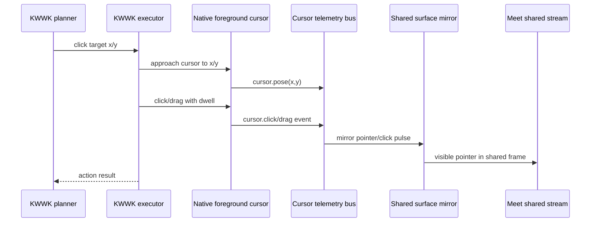

# RFC: KWWK CU Meeting-Visible Cursor

Date: 2026-06-02
Status: accepted implementation plan; Cueboard source refreshed 2026-06-02
Owner: @劲霸仁波切
Implementation driver: local Codex session

## Summary

Add a meeting-visible cursor layer for KWWK CU.

The current executor can post macOS pointer events, but that does not guarantee
the audience sees a useful pointer during a Google Meet share. Mousedo-style
operation feels better because it has an explicit cursor/pointer presentation.
KWWK CU needs the same product affordance: when Oneesama points, clicks, drags,
or highlights something, the shared surface should show a clear cursor state and
click feedback.

This RFC also lowers low-value audience HUD badges. Connection and audio state
remain available in diagnostics, but the default meeting surface should spend
visual attention on computer-use intent, blockers, and pointer feedback.

## Decision Snapshot

- Cursor visibility is a presentation concern, not a Realtime tool concern.
- KWWK executor emits pointer telemetry for move, click, drag, and hover
  actions.
- The first native implementation should copy/port Cueboard
  `BridgeComputerUse` foreground cursor pieces, then extend them for KWWK.
- A native foreground overlay cursor draws visible pointer/click feedback on the
  desktop. A shared-surface/HUD renderer mirrors compact cursor telemetry for
  meeting artifacts and local tests.
- System cursor movement alone is not accepted as proof of meeting-visible
  pointer feedback.
- Keyboard-only actions may optionally show a small "working focus" indicator,
  but speech state should not add redundant HUD text.
- Benchmarks must verify cursor telemetry and at least one rendered-frame
  signal, not just executor success.

## Product Contract

When KWWK performs a pointer action in a shared meeting/demo surface, the
audience must be able to answer three questions from the video alone:

- where the assistant is pointing;
- when it clicked or dragged;
- whether the action is still active, blocked, or finished.

That means the accepted signal is rendered-frame evidence, not only executor
telemetry or a successful `CGEvent`.

Keyboard-only actions do not need a fake pointer. They may show a short focus or
"控制中" state while work is active, but must not add always-on speech/listening
badges.

## Problem

For meeting demos, the audience needs to understand where the assistant is
looking and acting.

Current behavior is weaker:

- `CGEvent` can move or click the real pointer, but capture paths may not show
  it consistently.
- A real cursor can be too subtle, hidden, or absent from the captured stream.
- There is no click pulse, drag trail, hover ring, or target marker.
- The HUD currently shows low-value connection/audio labels, but does not expose
  meaningful Computer Use state.
- Showing "speaking" state is redundant because users can hear speech.

The result: even when an operation succeeds, it feels slow and opaque because
there is no visible action trace.

## Non-Goals

- Do not expose cursor controls as Realtime tools.
- Do not require the planner model to reason about overlay rendering.
- Do not use noisy always-on status text for speech/listening states.
- Do not leak raw screenshots or cursor traces into SDK history.
- Do not depend on the operating-system cursor being captured by Meet.

## Options Considered

| Option                                                 | Pros                                                                                                                                                                     | Cons                                                                              | Decision                                |
| ------------------------------------------------------ | ------------------------------------------------------------------------------------------------------------------------------------------------------------------------ | --------------------------------------------------------------------------------- | --------------------------------------- |
| System cursor only                                     | Simple, already happens for some CGEvent paths                                                                                                                           | Not reliably visible in Meet capture; no click feedback                           | Reject as acceptance proof              |
| HUD text labels                                        | Easy to implement                                                                                                                                                        | Low value; does not show target or motion                                         | Reject for pointer feedback             |
| Cueboard `BridgeComputerUse` foreground cursor overlay | Current Cueboard has transparent non-activating cursor panels, cursor sprite geometry, action approach/dwell timing, display/window anchoring, and system-cursor handoff | Needs a small KWWK helper port without pulling the whole package dependency graph | First native implementation             |
| Shared-surface overlay cursor                          | Explicit, visible, testable, independent of OS capture quirks                                                                                                            | Does not by itself prove KWWK has a real desktop cursor presentation              | Required mirror/benchmark layer         |
| Mousedo backend                                        | Already has the product shape Peng remembers                                                                                                                             | Adds adapter dependency and compatibility work                                    | Keep as adapter option, not first block |
| Screenshot annotation after action                     | Useful evidence                                                                                                                                                          | Not live enough for demos                                                         | Diagnostic only                         |

## Cueboard Source To Port

Peng pointed out that the cursor work can copy the existing Bridge/Cueboard
implementation. After refreshing `/Users/pengx17/Documents/cueboard` on
2026-06-02, the current source of truth is the `BridgeComputerUse` foreground
cursor package, not the older Slack `event_cursor` scanner state and not a stale
`Automation/BridgeAutomationToolService.swift` path.

Reference files:

| Source                                                                                                                       | Useful pieces                                                                                                                                 |
| ---------------------------------------------------------------------------------------------------------------------------- | --------------------------------------------------------------------------------------------------------------------------------------------- |
| `/Users/pengx17/Documents/cueboard/frontend/macos/BridgeComputerUse/Sources/CUForegroundCursor/ActionOverlay.swift`          | `CursorAnchor`, transparent `ActionOverlayPanel`, cursor sprite view, hotspot/render-size geometry, timing env vars, window/display anchoring |
| `/Users/pengx17/Documents/cueboard/frontend/macos/BridgeComputerUse/Sources/CUForegroundCursor/DaemonCursor.swift`           | Materialized cursor panel, approach-to-action, drag animation, dwell/hold, pose callbacks, teardown                                           |
| `/Users/pengx17/Documents/cueboard/frontend/macos/BridgeComputerUse/Sources/CUForegroundCursor/CoordinateSpaces.swift`       | AX screen, AppKit screen, window-local, screenshot-pixel coordinate conversions                                                               |
| `/Users/pengx17/Documents/cueboard/frontend/macos/BridgeComputerUse/Sources/CUForeground/AgentCursorOverlay.swift`           | System cursor hide/restore, foreground/observe marker mode, watchdog for cursor visibility drift                                              |
| `/Users/pengx17/Documents/cueboard/frontend/macos/BridgeComputerUse/Sources/CUForeground/AgentPresentationCoordinator.swift` | Product lifecycle: enter foreground, pause/intervention marker, recover, end session                                                          |
| `/Users/pengx17/Documents/cueboard/frontend/macos/BridgeComputerUse/Sources/CUForegroundCursor/Resources/OverlayCursor.png`  | Current cursor sprite asset                                                                                                                   |

The portable first slice is not the old tiny click dot. It is the Cueboard
foreground cursor contract:

- a transparent, non-activating, non-hit-testing panel;
- a visible cursor sprite with a stable hotspot;
- action timing that lets the cursor land before click/drag state;
- window/display anchoring so overlay layering is predictable;
- explicit coordinate conversions between screenshot pixels, AX screen points,
  AppKit screen points, and window-local points;
- optional system-cursor hide/restore when KWWK owns foreground presentation.

The shared-surface marker remains useful, but it is only the telemetry/HUD mirror
layer. It must not be the only proof that KWWK has mousedo-style cursor feedback.

## Cueboard-Parity First Slice

First port only what Cueboard `BridgeComputerUse` already proves:

- [x] RFC source refresh: current Cueboard main was pulled/checked and
      `BridgeComputerUse` is the cursor source of truth.
- [x] RFC decision: KWWK cursor parity starts from Cueboard foreground cursor,
      not from Slack scanner cursor state or a HUD-only marker.
- [x] Create a small KWWK/Oneesama `ActionOverlayPanel` /
      `ActionOverlayCursorView` equivalent.
- [x] Reuse Cueboard cursor geometry: hotspot, render size, foreground display
      anchor, non-activating panel, non-hit-testing overlay.
- [x] Reuse Cueboard action timing for bootstrap, pre-action hold, and final
      hold.
- [x] Port Cueboard-style approach and drag animation timing with smoothstep
      frame evidence.
- [x] Port Cueboard Bezier planner into the KWWK `DaemonCursor`-equivalent
      approach/drag animation path, with turn-bound diagnostic evidence.
- [x] Port enough coordinate conversion to place the cursor at the same point as
      the executor click/drag.
- [x] Emit cursor telemetry at the same point where the native foreground cursor
      pose is applied.
- [x] Keep the existing shared-surface marker as a mirror, not as native cursor
      acceptance evidence.

Shared-surface mirror work that can stay in place:

- [x] Add a persistent cursor asset in the avatar/shared-surface renderer.
- [x] Add move/hover cursor rendering before click.
- [x] Add drag trail.
- [x] Add target highlight ring in the shared-surface renderer.
- [x] Decide whether status cards should use a WindowNotification-style overlay
      or the existing avatar HUD: keep meaningful CU state in the existing HUD
      for this slice; keep low-value connection/audio/speaking status in
      diagnostics only.

## Target Surfaces

Cursor rendering should support two layers over time:

| Surface                               | Role                                                                               | Initial requirement                   |
| ------------------------------------- | ---------------------------------------------------------------------------------- | ------------------------------------- |
| Native KWWK foreground cursor overlay | Cueboard-style desktop cursor presentation near the actual dispatched AppKit event | Required first                        |
| Shared demo/meeting surface overlay   | Stable telemetry/HUD mirror and local rendered-frame benchmark layer               | Required for cursor-visible benchmark |

The native foreground overlay is the product cursor. The shared-surface overlay
is the benchmarkable audience mirror. Final Meet acceptance needs evidence for
both: native cursor presentation exists, and the shared stream or composited
surface shows a visible pointer/click signal.

## Proposed Architecture



The executor does not draw. It emits normalized events:

```ts
type KWWKCursorEvent =
  | { kind: "cursor.show"; sessionId: string; at: number }
  | { kind: "cursor.hide"; sessionId: string; at: number }
  | { kind: "cursor.move"; sessionId: string; x: number; y: number; at: number }
  | {
      kind: "cursor.click";
      sessionId: string;
      x: number;
      y: number;
      button: "left" | "right" | "middle";
      phase: "down" | "up";
      at: number;
    }
  | {
      kind: "cursor.drag";
      sessionId: string;
      from: Point;
      to: Point;
      phase: "begin" | "move" | "end";
      at: number;
    }
  | { kind: "cursor.highlight"; sessionId: string; rect: Rect; reason?: string; at: number };
```

The overlay renderer owns visual style and frame composition:

- [x] pointer shape visible on light and dark backgrounds;
- [x] shared-surface click marker/pulse for pointer down/up;
- [x] native Cueboard-style foreground cursor panel for pointer actions;
- [x] drag trail for drag actions;
- [x] optional target ring before click;
- [x] fade-out after inactivity;
- [x] no speech/listening text badges;
- [x] compact Computer Use state only when useful: "控制中", "等待权限",
      "目标不明确", or hidden when idle.

### Rendering Rules

- Pointer is high-contrast on both light and dark backgrounds.
- Click marker has at least two visual cues: a dot/ring at the target and a
  short pulse/fade.
- Drag trail is visible only while dragging and fades quickly.
- Highlight rings are used for "look here" or pre-click target confirmation,
  not for every keyboard shortcut.
- Overlay elements are non-hit-testing and must not intercept the app action.
- Cursor assets and marker styles are local/static; no network fetches in the
  meeting path.
- Speech/listening/connected states are hidden unless a diagnostic view is
  explicitly enabled.

## Coordinate Mapping

Cursor events must use one explicit coordinate space:

```ts
interface KWWKCursorCoordinateSpace {
  source: "window" | "screen" | "shared_surface";
  windowId?: string;
  scaleFactor: number;
  originX: number;
  originY: number;
  width: number;
  height: number;
}
```

Rules:

- [x] executor reports the coordinate space used for each pointer action;
- [x] Cueboard-parity port maps captured-pixel/AX/window-local coordinates to
      AppKit screen points before drawing or dispatching events;
- [x] overlay maps to shared-surface coordinates before drawing;
- [x] if mapping is unavailable, emit `cursor_unmappable` and skip pointer
      action or downgrade to diagnostic-only evidence;
- [x] screenshots and cursor events in artifacts must share the same coordinate
      metadata.

## HUD Cleanup

Connection/audio badges should not dominate the meeting HUD.

Recommended HUD states:

| State                  | Show?                              | Copy       |
| ---------------------- | ---------------------------------- | ---------- |
| Idle connected         | No, or tiny diagnostic-only marker | none       |
| Speaking               | No                                 | none       |
| Listening              | No                                 | none       |
| Computer Use executing | Yes, compact                       | 控制中     |
| Waiting for permission | Yes                                | 需要权限   |
| Ambiguous target       | Yes                                | 目标不明确 |
| Action failed          | Yes, short                         | 操作失败   |

The cursor/overlay should carry the interaction feedback. Text is only for
blockers or non-obvious control state.

### HUD Placement

Default audience HUD:

- [x] shows no "connected", "listening", or "speaking" text;
- [x] shows no raw transport/model/audio status;
- [x] shows a compact CU status only while an action is active or blocked;
- [x] clears success state quickly after visible cursor/action feedback;
- [x] keeps diagnostics available behind existing debug/dev surfaces.

Failure/blocker HUD:

- [x] `blocked_permission` -> `需要权限`;
- [x] `blocked_ambiguous_target` -> `目标不明确`;
- [x] `blocked_no_target_app` -> `找不到窗口`;
- [x] `failed_execution` / `failed_verification` -> `操作失败`;
- [x] `needs_background_agent` should not linger as a HUD warning unless the
      foreground action truly stopped.

## Artifact Contract

Cursor-visible evidence should be reproducible from a local artifact:

```ts
interface KWWKCursorArtifact {
  schema: "oneesama.kwwk-cursor-artifact.v1";
  sessionId: string;
  actionId: string;
  events: KWWKCursorEvent[];
  coordinateSpaces: Record<string, KWWKCursorCoordinateSpace>;
  frames: Array<{
    path: string;
    at: number;
    coordinateSpaceId: string;
    markerDetected?: boolean;
  }>;
  hudStates: Array<{ state: string; copy?: string; at: number }>;
}
```

The artifact is local/debug evidence. SDK history and Realtime function output
receive only compact success/blocker text.

## Rollout Plan

### Phase 0: Cueboard Port Audit

- [x] Pull/check `/Users/pengx17/Documents/cueboard` main and avoid the older
      runtime checkout.
- [x] Identify `BridgeComputerUse/Sources/CUForegroundCursor` as the current
      cursor source.
- [x] Decide copy-first vs shared-module-first for the initial cursor overlay:
      copy a minimal single-helper slice first, deduplicate later.
- [x] Preserve the original coordinate conversion assumptions in tests.

Done when: the KWWK implementation issue can point to exact source functions and
target files without re-discovering the Cueboard cursor code.

### Phase 1: Native Foreground Cursor Overlay

- [x] Port `ActionOverlayPanel` / `ActionOverlayCursorView` behavior.
- [x] Port AppKit screen/window-local coordinate conversion needed by KWWK.
- [x] Show cursor dwell for point click actions.
- [x] Port approach animation for point click actions.
- [x] Port native drag movement animation for drag actions.
- [x] Emit cursor events at pointer dispatch sites.
- [x] Keep overlay non-hit-testing and non-activating.

Done when: the local benchmark proves a Cueboard-style native panel
materializes and animates at the clicked point, and a later screenshot pass
proves it on light and dark backgrounds.

### Phase 2: Shared-Surface Cursor Overlay

- [x] Normalize cursor coordinate-space metadata.
- [x] Render persistent cursor and click pulse in the shared/demo surface.
- [x] Add drag trail and optional target highlight ring.
- [x] Record rendered frames for benchmark inspection.

Done when: cursor-visible benchmark can fail if telemetry exists but rendered
frames do not contain the marker.

### Phase 3: HUD Cleanup

- [x] Hide low-value connection/audio/speech/listening labels from the default
      audience HUD.
- [x] Add short CU-only HUD states for active, permission, ambiguity, missing
      target, and failure.
- [x] Keep transport/audio diagnostics in debug surfaces.

Done when: live-room screenshots show cursor/action feedback without redundant
speech/listening labels.

### Phase 4: Live-Room Acceptance

- [x] Run a real Meet room smoke with at least one click action and one
      keyboard-only action.
- [x] Confirm pointer/click feedback is visible to the audience stream.
- [x] Confirm keyboard-only actions do not show noisy pointer or speech HUD.

Done when: the real-room artifact links cursor events, rendered frames, app
action result, and HUD state.

## Implementation Checklist

- [x] Lock RFC decision: mousedo-style visible cursor/click feedback is a KWWK
      presentation requirement, not a separate Realtime tool.
- [x] Port Cueboard `ActionOverlayPanel` / `ActionOverlayCursorView` minimal
      behavior into the KWWK helper.
- [x] Port minimal Cueboard-style approach/drag timing behavior.
- [x] Port Cueboard `DaemonCursor` Bezier planner into the KWWK helper
      animation path; defer extracting a shared animation module.
- [x] Port Cueboard coordinate scaling and point-resolution helpers needed by
      KWWK foreground placement.
- [x] Add cursor event emission to KWWK pointer actions.
- [x] Add coordinate-space metadata to pointer events.
- [x] Add matching coordinate-space metadata to screenshots.
- [x] Show native Cueboard-style cursor for KWWK point clicks.
- [x] Show native Cueboard-style cursor for KWWK double-clicks.
- [x] Add overlay renderer on the shared app/demo surface after click-marker
      parity is working.
- [x] Add shared-surface persistent cursor, click pulse, and drag trail styles.
- [x] Add native foreground persistent cursor and click pulse styles.
- [x] Add native foreground drag trail style.
- [x] Add a short-lived "控制中" HUD state for active CU operations.
- [x] Remove or hide low-value connection/audio badges from default audience HUD.
- [x] Keep detailed connection/audio status in diagnostics, not audience overlay.
- [x] Keep mousedo adapter investigation as a later option only; current
      Cueboard parity passes native/local cursor gates.
- [x] Add artifact capture that records cursor events plus rendered frames.

## Verification Checklist

- [x] Unit: shared-surface coordinate mapping converts captured-pixel x/y into
      AppKit root/window points with flipped and non-flipped views.
- [x] Unit: click indicator is non-hit-testing and removes itself after timeout.
- [x] Unit: executor pointer action emits `cursor.move` and `cursor.click`
      events with coordinate metadata.
- [x] Unit: helper probe materializes a transparent, non-activating,
      non-hit-testing native cursor panel.
- [x] Unit: helper probe returns native approach animation evidence.
- [x] Unit: overlay maps window/screen coordinates to shared-surface pixels.
- [x] Screenshot: native Cueboard-style cursor is visible on light and dark
      backgrounds.
- [x] Screenshot: drag trail appears for drag action and fades after timeout.
- [x] Live room: shared Google Meet surface shows pointer/click feedback during
      a KWWK action.
- [x] Benchmark: cursor-visible gate fails if pointer events exist but no
      rendered-frame marker is detected.
- [x] Benchmark: cursor-visible gate requires native foreground cursor
      materialization evidence and distinguishes it from the shared-surface
      mirror.
- [x] Benchmark: cursor-visible gate requires native approach/drag animation
      evidence.
- [x] Benchmark: cursor-visible and native cursor gates require Cueboard Bezier
      planner evidence with passing turn-bound diagnostics.
- [x] Benchmark: native cursor gate requires light/dark rendered PNG pixel
      evidence and native drag-trail rendered evidence.
- [x] Negative: speech/listening state does not show redundant HUD text.

## Validation Log

- 2026-06-02: `swiftc packages/core/src/meeting/app-control-helper.swift -module-cache-path /tmp/oneesama-swift-module-cache -o /tmp/oneesama-app-control-helper-compile-check` passed.
- 2026-06-02: `node --import tsx --test --test-reporter=spec test/app-control-helper.test.mjs test/realtime-kwwk-cursor-visible-benchmark.test.mjs test/realtime-kwwk-native-cursor-benchmark.test.mjs test/realtime-kwwk-planner-action-benchmark.test.mjs test/realtime-contract.test.mjs` passed 52/52, including native foreground cursor materialization, native approach/drag animation evidence, light/dark rendered PNG pixel evidence, shared-surface mirror evidence, HUD negative coverage, and Realtime tool-contract coverage.
- 2026-06-02: after rebasing onto `origin/main` `b3bf2b4` and installing the new `oxfmt` / `oxlint` / `lefthook` toolchain, `npm run format:check`, `npm run lint:js`, `npm run lint:go`, `npm run typecheck`, and the same 52/52 targeted Realtime/KWWK tests passed.
- 2026-06-02: after rebasing again onto `origin/main` `2d70b3f` / Vite+ tooling, `npm run format:check`, `npm run lint:js`, `npm run lint:go`, `npm run typecheck`, and `vp test run test/app-control-helper.test.mjs test/realtime-kwwk-cursor-visible-benchmark.test.mjs test/realtime-kwwk-native-cursor-benchmark.test.mjs test/realtime-kwwk-planner-action-benchmark.test.mjs test/realtime-contract.test.mjs` passed 52/52.
- 2026-06-02: after the same rebase, `npm run benchmark:realtime-kwwk-cursor-visible -- --json-out /tmp/oneesama-realtime-kwwk-cursor-visible-after-rebase.json` and `npm run benchmark:realtime-kwwk-native-cursor -- --json-out /tmp/oneesama-realtime-kwwk-native-cursor-after-rebase.json` both passed.
- 2026-06-02: `npm run benchmark:realtime-kwwk-cursor-visible -- --json-out /tmp/oneesama-realtime-kwwk-cursor-visible-rfc.json` passed with `native-foreground-cursor-materialized`, `native-foreground-cursor-drag-materialized`, `native-foreground-cursor-animation`, `cursor-evidence-layer-split`, shared rendered marker, drag trail, target ring, and HUD negative cases.
- 2026-06-02: `npm run benchmark:realtime-kwwk-native-cursor -- --json-out /tmp/oneesama-realtime-kwwk-native-cursor-rfc.json` passed with `native-foreground-cursor-light-dark-rendered` and `native-foreground-drag-trail-rendered`; rendered PNG artifacts include light, dark, and drag-trail frames with non-background pixel ratios above threshold.
- 2026-06-02: `MAB_REAL_MEET_URL=https://meet.google.com/ypw-fozb-anz vp exec tsx scripts/real-meet-synthetic-speaker-smoke.mjs --real-meet-app-control-smoke --require-real-meet-url --json-out /tmp/oneesama-realtime-real-app-control-after-observe-fix.json` passed an observe-only real Meet app-control smoke. This does not prove the live-room cursor-visible gate because it intentionally performed no pointer action and produced no audience-visible cursor artifact.
- 2026-06-02: `vp test run test/app-control-helper.test.mjs test/realtime-kwwk-cursor-visible-benchmark.test.mjs test/realtime-kwwk-native-cursor-benchmark.test.mjs` passed 26/26 after wiring the KWWK native foreground cursor through a Cueboard-style Bezier planner.
- 2026-06-02: `npm run benchmark:realtime-kwwk-cursor-visible -- --json-out /tmp/oneesama-realtime-kwwk-cursor-visible-bezier-rfc.json` passed with `native-foreground-cursor-animation` requiring `cueboard_action_overlay_bezier`; approach and drag both used `quartic` Bezier plans with `turnBound.passed:true`, `violations:0`, and candidate pool `total:8`.
- 2026-06-02: `npm run benchmark:realtime-kwwk-native-cursor -- --json-out /tmp/oneesama-realtime-kwwk-native-cursor-bezier-rfc.json` passed with `native-foreground-cursor-cueboard-bezier-planner`, `arc_length_smoothstep`, `controlPointCount:5`, `sampleCount:137`, and native light/dark/drag-trail PNG evidence still above threshold.
- 2026-06-02: `MAB_REAL_MEET_URL=https://meet.google.com/yza-vjpx-qto MAB_REAL_MEET_APP_CONTROL_WAIT_MS=240000 MAB_REAL_MEET_APP_CONTROL_CURSOR_WAIT_MS=25000 vp exec tsx scripts/real-meet-synthetic-speaker-smoke.mjs --real-meet-app-control-suite --require-real-meet-url --json-out /tmp/oneesama-realtime-real-app-control-suite-yza-vjpx-qto-cursor-json-envelope-2026-06-02.json` passed with `ok:true` and `acceptanceSatisfied:true`. The suite covered `keyboard-escape` and `pointer-visible-click`; keyboard-only had `kwwkCursor.eventCount:0` and `noisySpeechOrConnectionVisible:false`, while pointer had `kwwkCursor.eventCount:1`, `eventKinds:["cursor.click"]`, `hasClick:true`, `latestVisible:true`, `persistentCursor:true`, `clickPulse:true`, and HUD `visibleText:"done 完成 "` with no connection/audio/speech noise.
- 2026-06-02: the real-room cursor gate initially failed even after KWWK clicked successfully because terminal app-control worker results were delivered as JSON strings inside `resultEnvelope.result`; the browser cursor collector only traversed objects. The bridge now parses JSON-string envelopes before extracting `backendResult.metadata.cursor.events`, and `test/realtime-app-control-bridge.test.mjs` covers the Go-shaped JSON-string envelope path.

## Open Questions

- Should the overlay be rendered in the shared app surface, the avatar HUD, or a
  composited video stage?
- Should Cueboard cursor code become a shared macOS automation module, or
  be copied into the KWWK helper first and deduplicated later?
- Can mousedo's cursor/pointer presentation still add anything after
  Cueboard foreground cursor rendering is ported?
- Should keyboard shortcuts show a focus ring on the affected window/tab, or
  only pointer actions get visible effects?
- What visual language should distinguish "assistant is looking" from
  "assistant is clicking"?
