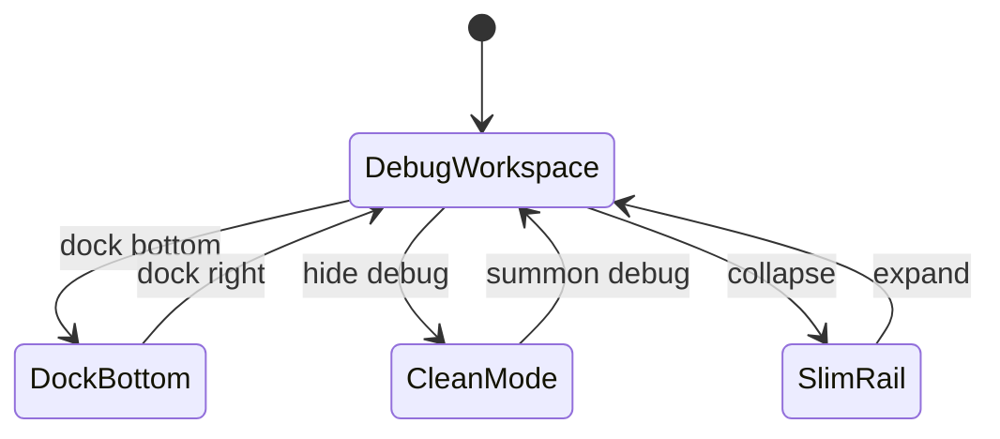

# RFC: Meet-like Operator Surface with Dockable Debug Tools

Date: 2026-06-07
Status: draft; direction decided 2026-06-07 by @peng-xiao — **shared-screen primary + debug-first local operator** (see Decision); reviewed by @realtime-gpt5
Owner: @realtime-cc
Reviewer: @realtime-gpt5
Requested by: @peng-xiao

Related work:

- [RFC: Single-Machine Operator Surface Acceptance Lane](./single-machine-operator-acceptance-rfc-2026-06-06.md)
- [ADR 0001: Conversation Engine Port owns provider-neutral conversation events](../../docs/adr/0001-conversation-engine-port.md)
- [ADR 0002: Operator visual composition produces the shareable video track](../../docs/adr/0002-operator-side-visual-composition.md)
- Surface implementation: `packages/core/src/operator/lan-operator-surface-html.ts` + `lan-operator-*-client.ts`

## Context

The Local Operator Surface (`http://127.0.0.1:18913/operator`) began life as an
acceptance/debug dashboard: a large stage canvas plus a right-hand panel packed
with telemetry cards and tables. Over a fast review loop (2026-06-06 → 06-07) it
was iterated into a much denser, better-organized debug surface:

- A **realtime ledger** (formatted event list, good and bad events) as the body.
- A thin **verdict + pipeline** strip (`Mic → Transcript → Assistant → Tool → App → Final`)
  for fast fault-localization.
- A one-line **status strip** (connection / in-flight / events / last error).
- A collapsible **telemetry drawer** (metrics + the gate-read tables + raw JSON).
- A **stage HUD** (composition health) and a compact source rail.

That work is good _as a debug surface_, but in review @peng-xiao surfaced the
real product insight:

> 整个 app 有可能更像一个 Meet，或者用户的桌面，只是为了方便 debug 才做成这种形态。

@peng-xiao then sharpened it (2026-06-07): the **stage** should look like a
shared-screen Meet / the operated desktop — but the app's **primary job stays
debug**. It is a _local operator console for debugging and controlling a remote /
Meet desktop_ (placed locally for convenient control). So the dashboard wasn't
wrong in being debug-centric; it was wrong in being **rigid** — the debug tools
should be dockable/hideable so the surface can collapse into a clean shared-screen
Meet/desktop on demand, without the debug layer being demoted to a secondary
product.

This RFC defines that end-state — **shared-screen primary + debug-first local
operator**: the main stage is a **shared-screen Meet** (the controlled remote/Meet
desktop as the big screen, avatar as a participant), and the existing debug
instrumentation is **dockable tools that are open by default** (debug is the
primary workspace) yet can be docked/resized/hidden — collapsing to a clean
Meet/desktop view when wanted, and restorable.

## Goals

1. **Default is a debug-first operator workspace.** On open, the user sees the
   debug tools (ledger / verdict / telemetry-on-demand) **and** a stage showing
   the controlled remote/Meet desktop as a shared screen with the avatar as a
   participant. Debug is the primary job, not a hidden afterthought.
2. **Debug tools are dockable and hideable (open by default).** The ledger /
   telemetry / verdict / source inspector live in a dockable panel that is
   **open by default** but can be docked/resized/hidden — flexibility for triage,
   not a demotion of debug.
3. **Hiding the debug layer yields a clean, coherent Meet/desktop.** When the
   user collapses debug, the surface becomes a usable shared-screen Meet/desktop
   (for demo / pure use) — not a half-empty dashboard. This is an **opt-in mode,
   not the default**.
4. **Layout is flexible, persistent, and shareable.** Users can show/hide/resize
   the debug dock and switch task views; the layout is restored across reloads
   and is encodable in the URL so a specific view can be shared/reproduced
   (valuable for acceptance: "open this link, you get this exact view").
5. **Acceptance gates do not constrain the product UI.** Debug data must be
   readable from a stable data source, so hiding panels never breaks gates.

## Non-goals

- Re-running the conversation/visual/KWWK runtime design — unchanged. This RFC
  is purely the **operator surface shell + UI/UX**.
- A multi-user/remote meeting product. "Meet-like" is a UX metaphor for the
  single-machine operator; LAN/remote remains out of scope per the existing
  single-machine RFC.
- Building the debug-tool internals from scratch — they already exist and are
  reused; this RFC re-homes them into a dock.

## Product model: two surfaces, one app

```mermaid
flowchart LR
  subgraph App[Operator App Shell]
    direction LR
    Workspace[DEFAULT: debug-first workspace\nstage (shared-screen Meet) + debug dock OPEN]
    Clean[OPT-IN: clean Meet/desktop\ndebug hidden]
    Workspace -- "hide debug" --> Clean
    Clean -- "summon debug (hotkey / button)" --> Workspace
  end
```

The stage form is a shared-screen Meet in **both** states; what changes is
whether the debug dock is open (default) or hidden (opt-in clean mode).

### A. The stage — shared-screen Meet (decided: option a)

The composition already is **host app (the operated desktop/app) + avatar (the
bot as a participant)**. Per @peng-xiao's decision, the stage is a
**shared-screen Meet** (the controlled remote/Meet desktop is the big screen):

- The **host app/desktop capture is the main stage** (the "shared screen").
- The **avatar is a participant** — a corner tile / picture-in-picture, with
  always-on voice.
- **Voice controls** (arm/mute/PTT, mic, energy) are presented like a meeting
  control bar (compact, bottom), not a debug toolbar.
- **Minimal chrome**: a thin presence/status line (connected, who's speaking,
  recording state). Nothing that reads as "telemetry".
- Source switching (host app / avatar / layout) is a lightweight switcher, not a
  permanent wide rail.

In the **default debug-first** state, this stage sits alongside the open debug
dock. In the **opt-in clean mode** (debug hidden) the same stage fills the
viewport and stands on its own as a usable meeting/desktop (Goal 3) — minimal
chrome, nothing that reads as telemetry.

### B. Debug tools — dockable DevTools layer (open by default)

The instrumentation built across the recent iterations is preserved verbatim but
re-homed into a **dockable debug panel** modeled on browser DevTools:

- **Open by default** (debug is the primary job); dismissable/hideable via a
  button and a hotkey.
- **Dock positions**: right, bottom, or detached/undocked (future); resizable
  splitter; can be fully hidden leaving only a slim status rail / hot corner so
  state is not lost. The **slim rail's minimum visible set** is fixed (not
  arbitrary): mic/voice connection state, in-flight tool (if any), and the latest
  blocker/error — i.e. just enough to know "is anything wrong right now" and to
  re-summon the full dock. Everything else lives inside the dock.
- **Tabs** inside the dock:
  - `Ledger` — the formatted realtime event list (good + bad), product-language
    type labels, click-to-inspect raw.
  - `Telemetry` — metrics + transport/voice/timeline/turn/tool/KWWK/composition/
    artifact tables + raw report JSON.
  - `Selected` — the selected event / pipeline stage evidence (transcript,
    timing, tool args/result, DOM mutation) — _next-round; see Phasing_.
  - `Sources` — per-source details (state, resolution, track, rect).
- The thin **verdict + pipeline** strip is the dock's header summary (where is it
  broken / next action). It is shown in the default debug workspace; it is not
  part of the clean shared-screen stage chrome (it disappears in Clean mode).

## Layout & state model

### Panes and dock states



`DebugWorkspace` (debug dock open, docked-right) is the **default/entry** state;
`CleanMode` (debug hidden → clean shared-screen Meet/desktop) is opt-in.

- **Pane set**: one persistent `Stage` pane; one `Debug` dock containing the
  tabbed tools above.
- **Dock state**: `hidden` (slim status rail only) | `docked-right` |
  `docked-bottom` | (future) `detached`.
- **Sizing**: the splitter between Stage and Debug is draggable; width/height
  ratio is part of persisted state.

### Persistence and shareable URL state

Layout state is small and serializable:

```
{ surface: "meet" | "desktop-focus",
  dock: "hidden" | "right" | "bottom",
  tab: "ledger" | "telemetry" | "selected" | "sources",
  split: 0.0–1.0,
  density: "comfortable" | "compact",
  selectedEventId?: string }
```

- **localStorage** holds the user's default so layout is restored across reloads
  (no re-arranging every session).
- The same state is encodable in the **URL hash** (e.g.
  `/operator#dock=right&tab=ledger&split=0.42`) so a view is shareable and a
  reviewer/agent can open a precise debugging layout. URL state, when present,
  wins over localStorage.

### Modes are debug-view presets, not the homepage

Debug/Inspect/Evidence/Clean are **named presets** over the same pane model — not
a top-level product navigation. They simply set `{surface, dock, tab}`. The
**default is Debug** (debug-first); Clean is the opt-in debug-hidden view:

| Mode                | surface | dock   | tab       | Use                                                           |
| ------------------- | ------- | ------ | --------- | ------------------------------------------------------------- |
| **Debug (default)** | meet    | right  | ledger    | Default workspace — watch realtime events, fast triage        |
| Inspect             | meet    | right  | selected  | Drill one event/stage's evidence                              |
| Evidence            | meet    | bottom | telemetry | Raw telemetry / export / gate data                            |
| Clean / Present     | meet    | hidden | –         | Collapse debug → use it like a call/desktop (demo / pure use) |

## Gate de-coupling (prerequisite)

**Problem.** Debug _data_ is currently asserted through the **DOM** in two
places, which couples the product UI to the tests — once the user enters Clean
mode (or the dock is hidden/undocked/unmounted), those assertions break:

- **Acceptance gate**: `scripts/lan-operator-debug-panel-benchmark.mjs` reads the
  debug tables via `innerText` (after clicking `#open-debug-panel-button`). Among
  the `scripts/*` acceptance gates this is the only DOM-table reader (voice/kwwk/
  host-visual gates do not).
- **Unit/integration suite (do not under-scope — initial analysis missed this)**:
  several `test/lan-operator-*.test.mjs` also assert on `#debug-*-table` /
  `innerText` and surface structure. Confirmed readers:
  `test/lan-operator-surface.test.mjs` (~37 DOM/text reads),
  `test/lan-operator-engine-control.test.mjs` (~4),
  `test/lan-operator-visual-webrtc.test.mjs` (~2),
  `test/lan-operator-kwwk-verification.test.mjs` (~1),
  `test/lan-operator-host-visual-capture-diagnostics.test.mjs` (~1).
  If Phase 1 only migrates the one `scripts` gate, the test suite still blocks
  hiding/re-laying-out debug UI.

**Decision.** Move **product-correctness assertions off the DOM** onto the stable
data source, across _both_ the acceptance gate and the unit/integration suite:

- The surface already serves `/runtime/report` (the client fetches it to build
  `state`). Gates/tests should assert against that JSON (transport, voice,
  timeline, turn, tool-routing, KWWK, composition, artifacts) rather than table
  `innerText`.
- Retain only a small set of **DOM smoke checks** that _open_ the debug dock and
  confirm the same data renders + that the filter UI still hides rows — but
  acceptance correctness must not depend on panels being permanently visible.

Once migrated, the product UI is free to hide/relayout/undock debug panels
without ever risking a green gate or red unit test. This unblocks Goals 1–4 and
is owned by @realtime-cc.

> Note on the current Phase-0 baseline: the telemetry drawer is hidden by default
> (shown when `#open-debug-panel-button` sets `data-debug-panel-opened`). That was
> validated against the Playwright debug-panel gate (which clicks open first), but
> the DOM-coupled `test/*` unit suite has **not** yet been run against it. Treat
> "Phase 0 is gate-safe" as proven only for the `scripts` Playwright gate until
> Phase 1 audits/migrates the unit suite.

## KWWK CU integration quality retrospective

The shared-screen stage depends on KWWK Computer Use feeling trustworthy when it
acts on the host desktop/app. Current evidence shows the integration is wired
through the local operator stack, but this RFC should not claim "Cueboard-quality"
KWWK CU until the visual cursor/action evidence is proven.

### Current quality assessment

- **Tool routing and execution are instrumented.** The debug state/report can show
  expected vs actual tool routing, function-output delivery, KWWK status/blocker,
  current job id, verification details, and timeline rows. That is enough to
  diagnose whether KWWK was called and whether the app-control loop reported a
  result.
- **Action correctness is partially covered by KWWK verification.** Existing
  verification checks can prove that KWWK CU executed state-changing actions on
  the expected surface and can report blockers such as missing verification
  targets. This is necessary but not enough for user-perceived quality.
- **Cursor quality is the unresolved bar.** A passing telemetry row or
  `cursorEventCount` only proves that cursor events exist. It does **not** prove
  the user sees a Cueboard-quality cursor on the shared stage, nor that the
  native foreground cursor and shared-surface mirror are visually correct.

### Audit findings (current operator cursor reality, 2026-06-07 code audit)

A read-only code audit makes the gap concrete — it is worse than "unproven", the
operator cursor path is effectively **dead**:

- **The Cueboard standard already exists and explicitly rejects telemetry-only
  proof.** It is defined by `notes/rfc/kwwk-cu-visible-cursor-rfc-2026-06-02.md`
  and enforced by `scripts/realtime-kwwk-cursor-visible-benchmark.mjs` +
  `scripts/realtime-kwwk-native-cursor-benchmark.mjs` against the native cursor
  `packages/core/src/meeting/kwwk-cu-cursor.swift` (native non-activating panel,
  28px geometry, target ring + arrow + drag trail, `cueboard_style_ease_in_out` /
  `arc_length_smoothstep` / `cueboard_action_overlay_bezier`, declared coordinate
  spaces, and **rendered-pixel** `nonBackgroundRatio` proof) and the shared-surface
  mirror `packages/core/src/avatar/hiyori-avatar-cursor-feedback.ts`.
- **That whole cursor stack is disconnected from the operator lane.** The operator
  KWWK benchmark (`scripts/lan-operator-kwwk-action-benchmark.mjs`) never invokes
  the native cursor, never calls `emitKwwkOverlay`, and never sends
  `cursorEventCountDelta` — so `kwwk.cursorEventCount` is effectively 0 in this lane.
- **The cursor SLO passes with zero cursor.** `scripts/lan-operator-acceptance-slo.mjs:280-286`
  passes when `cursorEventCount >= 1` **OR** a non-empty `cursorPolicy` string **OR**
  `pointerAction === false`. The operator benchmark only runs a keyboard `type_text`
  TextEdit fixture, so it satisfies the SLO via the escape hatch **without any cursor**.
- **The operator's own overlay is a flat crosshair, not a Cueboard cursor.**
  `lan-operator-surface-html.ts` (`emitKwwkOverlay` ~938, `drawOverlays` ~1195) draws
  a fading `#facc15` crosshair-in-circle from raw `sourceRects` — no arrow, no target
  ring, no drag trail, no eased/bezier motion, no native panel, no coordinate-space
  mapping. The debug panel only prints `cursorEventCount/actionCount` as text.
- **What the operator lane _does_ prove (and should keep claiming):** tool routing to
  `kwwk_computer_use`, function-output delivery, real host-app **mutation**
  (TextEdit AX/file marker), 4-phase evidence, verification, hard-cancel, in-flight
  progress. I.e. intent + effect are solid; **cursor visual form is unproven**.

So the honest status: KWWK CU integration proves _"the tool ran and the app changed"_,
not _"the user saw a Cueboard-quality cursor"_. The parity cursor is fully built but
lives only in the realtime/meet lane (the one live-room cursor proof came from
`real-meet-app-control-suite`, not the operator).

### Cueboard parity bar

Phase 3 must treat cursor/action visibility as a product-quality gate. The
minimum bar is:

- Native foreground cursor materializes from the expected helper/source and uses
  the Cueboard bridge contract (`cueboard_bridge_computer_use_port`), with a
  non-activating, transparent, mouse-ignoring foreground panel.
- Geometry matches the Cueboard cursor contract: expected render size/hotspot,
  light/dark rendering, and foreground display anchoring.
- Motion uses the Cueboard-style planner/easing already encoded in the repo:
  `cueboard_style_ease_in_out`, `arc_length_smoothstep`, and
  `cueboard_action_overlay_bezier` with a valid Bezier plan, turn-bound check,
  and non-empty candidate pool.
- The shared surface renders a cursor marker, target ring, drag trail, event
  coordinate spaces, and rendered-frame pixel evidence. Coordinate telemetry
  without rendered evidence is insufficient.
- Visual review artifacts exist for the operator stage/Clean mode, not just raw
  helper output: screenshot/pixel/video evidence must show the cursor/action
  feedback in the surface the user actually sees.

### Remediation plan

Do **not** fold this into Phase 1's DOM-to-report migration. Track it as a Phase
3 quality gate, or split it into a dedicated cursor-parity sub-phase before Phase
3 signoff if the gap is large. If the evidence fails, remediation should focus on
the KWWK CU cursor bridge/rendering path and shared-stage mirror before changing
the operator shell layout.

Concrete remediation steps (from the audit, when this gate is taken on — mostly
integration of the already-built cursor stack, not new rendering):

1. Tighten `scripts/lan-operator-acceptance-slo.mjs:280-286` so the cursor SLO only
   passes for pointer actions with positive rendered-cursor evidence; keep the
   `pointerAction === false` escape only for genuinely keyboard-only actions.
2. Wire the existing cursor stack into the operator lane: drive the native cursor
   (`kwwk-cu-cursor.swift`) + shared-surface renderer (`hiyori-avatar-cursor-feedback.ts`)
   from real `metadata.cursor.events` and feed `cursorEventCountDelta`.
3. Replace the flat crosshair in `lan-operator-surface-html.ts` (`drawOverlays`) with
   the Cueboard renderer (arrow + ring + click pulse + drag trail), bound to a declared
   coordinate space instead of raw `sourceRects`.
4. Add a pointer (click/drag) fixture to the operator KWWK benchmark (today only the
   keyboard `type_text` TextEdit fixture runs), so a real cursor must appear.
5. Port the rendered-pixel assertions from `realtime-kwwk-cursor-visible-benchmark.mjs`
   into the operator gate (fail if telemetry exists but no marker pixels render).
6. Emit a live operator-stage artifact linking cursor events + rendered frames + host
   mutation + HUD, analogous to the realtime `real-meet-app-control-suite` evidence.

### Phase 3b status (2026-06-07) — operator shared-surface cursor parity DONE, native lane tracked

The **operator stage (shared-surface mirror)** now has Cueboard parity with
rendered-pixel proof. What landed (commit on `codex/local-operator-handoff-2026-06-06`):

- **Step 1 (SLO escape closed) — done.** `scripts/lan-operator-acceptance-slo.mjs`
  `kwwkCursorActionFeedbackCount` now requires `cursorEventCount >= 1` for any pointer
  action (click/drag/scroll/move); the bare `cursorPolicy` label and `pointerAction`
  truthiness no longer satisfy it. The `pointerAction === false` pass survives only for
  genuinely keyboard-only actions (e.g. `type_text`). Locked by a new regression test
  (`test/lan-operator-acceptance-slo.test.mjs`: pointer w/ 0 cursor → fails; w/ evidence → passes).
- **Step 3 (flat crosshair → Cueboard renderer) — done.** `drawOverlays` no longer paints
  the `#facc15` crosshair; it now calls the ported Cueboard renderer
  `packages/core/src/operator/lan-operator-kwwk-cursor-client.ts` (a faithful port of the
  shared-surface `hiyori-avatar-cursor-feedback.ts`: persistent arrow + per-kind colored
  ring + click pulse + target ring + drag trail + label box). `emitKwwkOverlay` maps
  source-relative coords → canvas-normalized and feeds the renderer.
- **Step 4 (pointer click/drag fixture) — done.** `runKwwkCursorFixture()` drives a real
  approach → click → drag-with-trail → done sequence; exposed on the surface API + a
  "CU Cursor" toolbar button.
- **Step 5 (rendered-pixel assertions) — done.** New gate
  `scripts/lan-operator-cursor-benchmark.mjs` (`npm run benchmark:realtime-local-operator-cursor`)
  diffs composition-canvas pixels before/after the fixture and fails if the cursor does not
  actually paint (measured ~0.75% non-background footprint / 6.8k px, 7-point trail,
  click+drag events, 0 console errors). Mirrored by `test/lan-operator-cursor.test.mjs`.

Remaining (NOT signed off — native lane, needs macOS app-control-helper + real run, not
verifiable headless in this environment):

- **Step 2 (native foreground NSPanel end-to-end) — partial.** The operator now renders the
  Cueboard **shared-surface mirror** with pixel proof. Driving the **native** cursor
  (`kwwk-cu-cursor.swift` NSPanel) from real `metadata.cursor.events` and feeding
  `cursorEventCountDelta` into the acceptance runtime so the tightened SLO passes on a real
  macOS run is still open. The existing native benchmarks
  (`benchmark:realtime-kwwk-{native-cursor,cursor-visible}`) require the app-control-helper +
  accessibility/display permissions; treat as a human/native gate (like the real-mic gate).
- **Step 6 (single linked live artifact)** — the cursor benchmark emits a JSON artifact +
  screenshot; folding cursor events + rendered frames + host mutation + HUD into one
  `real-meet-app-control-suite`-style artifact remains a follow-up.

Net: the audit finding "operator cursor path is effectively dead / flat crosshair / SLO
passes with zero cursor" is **resolved for the operator stage** with rendered-pixel proof
and a closed SLO escape; the native NSPanel end-to-end remains a tracked macOS gate.

## Phasing (incremental, ship-safe)

Each phase is independently shippable and keeps gates green.

- [ ] **Phase 0 — Baseline (done this round).** Improved debug surface: verdict +
      pipeline, formatted ledger (good+bad), one-line status, telemetry drawer,
      stage HUD, compact rail, mixed monospace. Currently uncommitted; can land
      as the better debug baseline.
- [ ] **Phase 1 — Decouple debug data from the DOM (broadened per review).**
      Audit _all_ DOM-text debug assertions and move product-correctness onto
      `/runtime/report` JSON: the acceptance gate
      `scripts/lan-operator-debug-panel-benchmark.mjs` **and** the unit/integration
      suite (`test/lan-operator-surface.test.mjs` and the other confirmed readers
      above). Keep only minimal "open dock → renders / filter hides rows" DOM
      smoke. Verify the full acceptance lane **and** `vp test run test/lan-operator-*`
      stay green. (Owner: @realtime-cc.) This is the hard prerequisite for the
      Clean (debug-hidden) mode.
- [ ] **Phase 2 — Dockify debug tools (debug stays open by default).** Wrap the
      current right panel as a dockable Debug panel: summon/hide button + hotkey,
      right/bottom dock, resizable splitter, tabs (Ledger/Telemetry/Sources). The
      dock stays **open by default** (debug-first); this phase only adds the
      capability to dock/resize/hide.
- [ ] **Phase 3 — Shared-screen Meet stage + Clean mode (default stays debug-first).**
      Recompose the Stage as a shared-screen Meet (the controlled host desktop/app
      as the main screen, avatar participant tile, meeting-style voice control bar).
      Add a **Clean mode** that hides the debug dock → a coherent shared-screen
      Meet/desktop (Goal 3). The **default remains debug-first (dock open)**; Clean
      is opt-in/toggleable. There is no "flip debug to closed by default". This
      phase also gates KWWK CU cursor/action quality against the retrospective
      above; telemetry-only evidence does not pass.
- [ ] **Phase 4 — State persistence + URL.** localStorage default + URL-hash
      layout state + mode presets.
- [ ] **Phase 5 — Selected-event inspector.** The `Selected` tab: click a ledger
      event / pipeline stage → contextual evidence (transcript, timing, tool
      args/result, mutation), filling the "few events" emptiness without making
      telemetry permanent.

## Risks / open questions

1. **Meet vs desktop default emphasis — DECIDED (2026-06-07, @peng-xiao): option
   (a) shared-screen primary** (screen = controlled remote/Meet desktop, avatar =
   participant). Nuance retained: the local app's primary job is debug / control
   of a remote/Meet desktop — so this is a _debug-first_ operator, not a consumer
   Meet product. (avatar-primary call-like layout is not pursued now.)
2. **Gate migration scope.** Need to confirm `/runtime/report` exposes every
   field the debug-panel gate currently asserts (turn-timeline rows, filter
   behavior). Filter/`data-filter-hidden` is a UI feature — if a gate asserts on
   it, keep a DOM smoke test for that specific behavior.
3. **Detached/pop-out dock** (separate window) is attractive for dual-monitor
   debugging but adds windowing complexity — deferred beyond Phase 5.
4. **Accessibility / keyboard**: define focus order and hotkeys so the dock is
   operable without mouse.
5. **KWWK CU visual quality.** Current integration evidence is strongest for
   routing/execution/telemetry. Cueboard-quality cursor/action feedback remains a
   Phase 3 risk until native foreground cursor, shared-surface mirror, rendered
   marker/target ring/drag trail, and operator-stage screenshots/video are
   verified.

## Verification plan

- Each phase keeps the existing acceptance lane green
  (`vp run acceptance:realtime-local-rfc:audit` and the per-gate scripts) **and**
  the UI unit/integration suite green
  (`vp test run test/lan-operator-surface.test.mjs test/lan-operator-engine-control.test.mjs
test/lan-operator-kwwk-verification.test.mjs test/lan-operator-visual-webrtc.test.mjs
test/lan-operator-host-visual-capture-diagnostics.test.mjs` and the smoke set
  `smoke:local-operator-surface`). Gates-green alone is insufficient — those
  DOM-coupled tests must be run every phase.
- Phase 1 re-runs `benchmark:realtime-local-debug-panel` **and** the migrated unit
  suite against the JSON-source assertions and confirms parity with the prior DOM
  assertions; the remaining DOM smoke checks pass with the dock opened.
- Phase 2 (debug still open by default): Playwright checks the docked-open
  baseline + dock capability — summon/hide/resize work and the dock re-renders the
  same data. Do **not** assert a Clean (debug-hidden) default yet (Clean arrives
  in Phase 3).
- Phases 3–4: Playwright checks (a) **default stays debug-first** (dock open) on
  load, (b) toggling **Clean mode** hides the dock and the stage reads as a
  coherent shared-screen Meet/desktop with no telemetry visible, (c) URL-hash +
  localStorage restore a layout (including which mode), (d) zero console errors.
- Phase 3: visual review with @peng-xiao — default reads as a debug-first
  operator with a shared-screen Meet stage, and Clean mode reads as a usable
  Meet/desktop. This review must include KWWK CU quality evidence: run/attach the
  cursor gates (`scripts/realtime-kwwk-cursor-visible-benchmark.mjs` and
  `scripts/realtime-kwwk-native-cursor-benchmark.mjs`, where the native helper is
  available), keep `test/lan-operator-kwwk-verification.test.mjs` green, and
  provide screenshot/pixel/video artifacts from the operator stage proving the
  cursor marker, target ring, drag trail, and action feedback are visible. A
  green `cursorEventCount` or telemetry-only report is not enough.

## Appendix: what already exists (reuse, do not rebuild)

- Realtime event model: `conversation.canonicalEvents` (`transcript_*`,
  `assistant_text_*`, `tool_call_*`) + `output.assistantText` — feeds the Ledger,
  verdict, and pipeline.
- Composition/visual state: `composition` (mode/w/h/fps/track/focus) +
  `state.visual` (connection/trackCount) + sources — feeds the Stage HUD and
  Sources tab.
- `/runtime/report` endpoint — the stable JSON source for Phase 1 gate migration.
- Debug rendering: `lan-operator-debug-panel-client.ts`
  (`renderConversationStream`, verdict/pipeline, telemetry tables) — re-homed
  into the dock.
