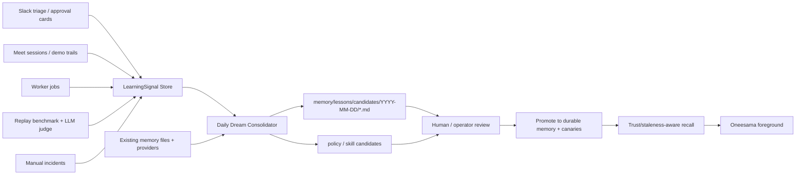

# Oneesama Daily Dream Memory + Self-Learning RFC

Status: proposed for task #367.

Scope: learn from OpenClaw + latest Hermes Agent source, then turn the existing
#289 memory roadmap into a concrete daily consolidation and self-improvement
loop for Oneesama. This RFC intentionally pauses the triage replay benchmark
from task #365 until the Memory loop shape below has a canary-first contract.

## Why This Exists

- [ ] Peng asked for a way to simulate Oneesama's triage decisions directly,
      but then corrected the order: first understand Hermes, write the RFC, then
      build the benchmark.
- [ ] Today's identity regression (`你是什么模型` answered as Codex/OpenRouter)
      is not only a prompt bug. It is a Memory scope bug: an old worker /
      codex-3720 self-description was allowed to answer Oneesama's foreground
      identity question.
- [ ] The existing #289 roadmap already names the missing OpenClaw + Hermes
      capabilities: trust scoring, staleness, episodic consolidation,
      cross-surface episodes, memory-quality canaries, and contradiction
      detection.
- [ ] The benchmark should feed a self-learning loop, not become a one-off
      test script. Failing replay cases should produce typed learning signals
      and candidate memory / prompt / gate updates.

## Reference Systems Studied

Fetched `~/.hermes/hermes-agent` `origin/main` at
`1e71b7180e5b4e84905b9a3086cf9cecca139562` on 2026-05-22.

### Hermes Contracts To Reuse

- [ ] `agent/memory_provider.py`
  - Provider lifecycle has `system_prompt_block()` for stable static text and
    `prefetch()` for dynamic recall.
  - Hooks exist for `sync_turn`, `on_session_end`, `on_pre_compress`,
    `on_memory_write`, and parent-side `on_delegation`.
  - Subagent/delegation observations are parent-side; the subagent itself has
    no provider session by default.
- [ ] `plugins/memory/honcho/__init__.py`
  - Honcho has recall modes: `context`, `tools`, `hybrid`.
  - Static prompt text is separated from live context injection; base context is
    cached and refreshed by cadence.
  - Dialectic passes are explicit and bounded: pass 0 cold/warm assessment,
    later passes synthesize gaps and reconcile contradictions.
  - Prefetch is asynchronous, has cadence/backoff/stale-result handling, and
    returns cached recall on the next turn.
  - Built-in memory writes can mirror into Honcho conclusions.
- [ ] `plugins/memory/honcho/session.py`
  - Sessions are scoped by session key and peer IDs.
  - Conclusions are written about a target peer and feed peer cards /
    representations.
  - Writes can be async, per-turn, session-end, or every N turns; session end
    flushes pending messages.
- [ ] `agent/background_review.py` + `agent/conversation_loop.py`
  - Hermes runs self-improvement after the user-facing response, so background
    review does not compete with the live task.
  - Memory and skill review triggers are turn-count nudges hydrated from
    persisted history.
  - The review fork is tool-limited and disables recursive nudges.
- [ ] `agent/agent_init.py`
  - Memory and skill nudge intervals default to turn-count based review, not a
    wall-clock cron. The counters are configurable and hydrated from history.
- [ ] `agent/curator.py`
  - The curator is a periodic, recoverable consolidation loop.
  - It writes run reports, distinguishes consolidated vs pruned items, archives
    instead of deleting, and supports dry-run.
  - Curator review forks use `skip_memory=True` and explicitly disable recursive
    memory/skill nudges.
- [ ] `tools/session_search_tool.py`
  - Cross-session recall is FTS5-backed and returns actual messages, not an LLM
    summary as source of truth.
  - Discovery returns anchored windows and bookends; scroll/browse are separate
    low-cost shapes.
- [ ] `plugins/memory/holographic/store.py` +
      `plugins/memory/holographic/retrieval.py`
  - A local fact store can carry `trust_score`, entity links, FTS5 search,
    retrieval/helpful counters, and optional temporal decay.

### OpenClaw / Existing Oneesama Contracts To Reuse

- [ ] `docs/persona-runtime.md`
  - Foreground avatar identity belongs to a Pi/OpenClaw-style persona runtime,
    while Codex/Claude/browser workers are delegated execution components.
  - Oneesama memory reference is OpenClaw + Hermes, not a worker prompt blob.
- [ ] `notes/code-polish/openclaw-hermes-memory-roadmap-canary-first-2026-05-21.md`
  - #289-A through #289-F are the canonical missing Memory capabilities.
  - Every slice must land a failing canary before implementation.
- [ ] `notes/code-polish/memory-provider-ownership-matrix-2026-05-21.md`
  - Current Oneesama has structured memory files, providers, family boosts, and
    source refs, but not trust/staleness/contradiction gates.
- [ ] `notes/cueboard-function-audit/memory-recall-parity-inventory.md`
  - Product behavior is "use memory as evidence before speaking", not "there is
    a memory tool".

## Goals

- [ ] Add a daily "dream" consolidation pass that turns repeated Slack/Meet
      episodes, approval outcomes, worker results, benchmark failures, and
      operator incidents into reviewable memory candidates.
- [ ] Add write-time contradiction detection so stale worker identities or
      low-trust legacy memory cannot silently override high-trust Oneesama
      foreground facts.
- [ ] Add trust and staleness fields to memory records so retrieval can prefer
      fresh, source-backed evidence and annotate stale evidence.
- [ ] Add a self-learning signal store that ingests approval-card decisions,
      LLM-judge benchmark verdicts, production incidents, and manual review.
- [ ] Add a skill/policy self-improvement lane: repeated fixes can propose
      updates to review checklists, canaries, prompt policies, or reusable
      operator playbooks, but never mutate the live runtime silently.
- [ ] Keep the first rollout review-gated: candidates are proposed, audited, and
      tested before being promoted to durable memory or prompt/gate changes.

## Non-Goals

- [ ] Do not use Linger / telegram-pi as the implementation reference.
- [ ] Do not auto-edit prompts, policies, or durable memory from a nightly job
      during the pilot.
- [ ] Do not replace source-backed memory with LLM summaries.
- [ ] Do not build an embeddings-first RAG system before the source-ref,
      trust/staleness, and contradiction contracts are green.
- [ ] Do not let worker self-description become foreground Oneesama identity.

## Proposed Data Model

### `MemoryFact`

- [ ] `id`
- [ ] `kind`: `person_profile | team_fact | team_decision | team_action |
episode | worker_result | foreground_identity | lesson`
- [ ] `subject`: canonical person/project/team/entity key
- [ ] `scope`: `foreground | worker | slack | meet | channel | thread |
person | team`
- [ ] `applies_to`: list of surfaces or entities this fact can be used for
- [ ] `do_not_generalize_to`: explicit negative scope list
- [ ] `content`
- [ ] `source_refs`: Slack thread, Meet session, file path, worker job,
      approval sample, benchmark run, incident id
- [ ] `trust`: numeric 0-1 plus `trust_reason`
- [ ] `staleness`: `fresh | aging | stale | expired` plus age days
- [ ] `status`: `active | candidate | superseded | contradiction_review |
rejected`
- [ ] `supersedes` / `superseded_by`
- [ ] `contradictions`: list of conflicting fact ids and reason codes

### `DreamCandidate`

- [ ] `id`, `date`, `cluster_key`
- [ ] `input_refs`: all episodes/signals used
- [ ] `proposal_type`: `new_fact | update_fact | contradiction |
gate_fixture | prompt_candidate | ignore`
- [ ] `proposal`
- [ ] `confidence`
- [ ] `required_canaries`
- [ ] `review_status`: `pending | approved | rejected | promoted`
- [ ] `review_notes`

### `LearningSignal`

- [ ] `source`: `approval_card | llm_judge | production_incident |
manual_review | triage_sweep | benchmark`
- [ ] `surface`: Slack / Meet / demo surface / worker
- [ ] `verdict`: `confirm | reject | block | false_positive |
false_negative | quality_regression | pass`
- [ ] `refs`: concrete artifacts, not summaries
- [ ] `reason_code`
- [ ] `proposed_action`: `memory_candidate | contradiction_review |
prompt_candidate | gate_fixture | benchmark_case | ignore`

### `SkillOrPolicyCandidate`

- [ ] `id`, `date`, `source_signal_ids`
- [ ] `target`: `prompt_policy | visible_reply_gate | triage_sweep_bucket |
runbook | canary_fixture | benchmark_case`
- [ ] `proposal`
- [ ] `why_reusable`
- [ ] `do_not_capture`: explicit reason when the learning is environment-only,
      one-off, stale, or already covered
- [ ] `review_status`

## Architecture

### Runtime Rules

- [ ] Live foreground reply path reads active memory facts only.
- [ ] Dream jobs write candidates only; they do not mutate active memory during
      the pilot.
- [ ] Contradiction detector runs before any durable memory promotion.
- [ ] Benchmark failures become `LearningSignal` rows; they do not directly
      patch prompts.
- [ ] Worker outputs are scoped as worker evidence unless explicitly promoted.
- [ ] Every promoted fact keeps source refs and at least one canary fixture.
- [ ] Self-improvement jobs run out-of-band after the live response or on a
      scheduled daily pass; they must not block live triage.
- [ ] Self-improvement jobs use a restricted tool/capability surface and cannot
      recursively trigger their own review pass.
- [ ] Candidate deletion is forbidden in the pilot. Bad or stale candidates can
      be archived/rejected, and archived items stay recoverable.
- [ ] Pinned facts, canaries, or operator policies bypass automatic transitions.

## Phased Task Plan

### Phase 0: Source Audit + RFC

- [x] Fetch latest Hermes source and record commit SHA.
- [x] Read Honcho provider/session code, provider lifecycle hooks, background
      review, curator, session search, and local trust-scored memory store.
- [x] Map the latest source contracts back to Oneesama #289.
- [x] Publish this RFC and index it in `notes/README.md`.

Verification:

- [x] RFC references concrete source paths and contracts, not inferred names.
- [x] Benchmark task #365 remains paused until this RFC defines the learning
      signal integration.

### Phase 1: Identity Scope + Contradiction Canary

- [ ] Add a canary `case_identity_scope_codex3720_not_oneesama`.
  - Input: memory contains a codex-3720 / worker self-description and a user
    asks "你是什么模型 / 你是谁".
  - Expected: foreground answer uses Oneesama/Pi identity; worker memory is
    either ignored or cited only as non-foreground evidence.
- [ ] Add a canary `case_contradiction_routes_to_review`.
  - Input: existing high-trust Oneesama identity fact conflicts with a new worker
    or legacy memory write.
  - Expected: new write lands as `contradiction_review`, not active memory.
- [ ] Wire these canaries before implementation.

Verification:

- [ ] Canary fails on current memory scope behavior before the detector lands.
- [ ] After implementation, canary passes without broad deny-list markers.

### Phase 2: Typed Fact + Trust/Staleness Baseline

- [ ] Add `MemoryFact` type and normalize existing `SlackRelatedMemoryRecord`
      into typed fact candidates.
- [ ] Add trust defaults by source:
  - `explicit_user_command`, `manual_review`, `approved_memory`: high
  - `foreground_identity`: high, foreground-scoped
  - `worker_result`: medium and worker-scoped
  - `legacy_triage_archive`: low until corroborated
- [ ] Add staleness horizon by kind.
- [ ] Surface trust/staleness in memory quality audit without changing ranking
      first.

Verification:

- [ ] Existing related-memory tests still pass.
- [ ] New audit report shows per-kind count, mean trust, mean staleness, and
      low-trust count.

### Phase 3: Write-Time Contradiction Detector

- [ ] Intercept persona memory writes and promotion attempts.
- [ ] Compare candidate fact against active facts with same subject/scope.
- [ ] Detect direct negation, incompatible identity, stale worker identity, and
      "same subject but different owner/preference" conflicts.
- [ ] Route conflicts to
      `memory/lessons/candidates/<date>/contradiction-*.md`.

Verification:

- [ ] Contradiction candidates include both sides and source refs.
- [ ] No active fact is overwritten silently.
- [ ] Non-conflicting candidate writes still proceed or stay pending normally.

### Phase 4: Daily Dream Candidate Writer

- [ ] Add a daily job that reads LearningSignals, recent triage runs, approval
      samples, worker jobs, Meet trails, and memory extraction candidates.
- [ ] Support two trigger modes:
  - [ ] Scheduled Asia/Shanghai daily run for Peng-visible "dream" output.
  - [ ] Turn-count / sweep-count nudge for review-only local development.
- [ ] Cluster repeated patterns by subject + reason code + source type.
- [ ] Emit reviewable `DreamCandidate` Markdown files.
- [ ] Add a dry-run CLI that prints candidates without writing.

Verification:

- [ ] Repeated signals consolidate into one candidate with all source refs.
- [ ] One-off/noisy signals are ignored or emitted as low-confidence.
- [ ] Candidate files are deterministic for the same input window.

### Phase 5: Self-Learning Signal Store

- [ ] Persist approval card confirms/rejects with reason codes.
- [ ] Persist visible-reply allow-list blocks and canary failures.
- [ ] Persist benchmark LLM-judge verdicts from task #365.
- [ ] Persist production incident closures and manual operator labels.
- [ ] Persist proposed skill/policy updates separately from memory facts.
- [ ] Expose `/slack/status.learning` summary.

Verification:

- [ ] A rejected approval card becomes a `LearningSignal`.
- [ ] A benchmark failure becomes a `LearningSignal` with the benchmark case id.
- [ ] No signal is promoted without a DreamCandidate review path.
- [ ] A repeated workflow correction can produce a `SkillOrPolicyCandidate`
      while an environment-specific failure is explicitly rejected as
      `do_not_capture`.

### Phase 6: Cross-Session Search Recall

- [ ] Index Slack triage runs, approval samples, worker jobs, and Meet trails in
      a lightweight FTS5 store.
- [ ] Return actual source windows/bookends to the dream job and benchmark
      judge; if an auxiliary model summarizes them, keep raw refs attached.
- [ ] Hide tool-only/noisy system sessions by default.

Verification:

- [ ] A benchmark failure can find prior related incidents by FTS5 and include
      raw source refs in the LearningSignal.
- [ ] Search does not summarize away source evidence.
- [ ] CJK/mixed-token queries have a LIKE/trigram fallback or fixture coverage.

### Phase 7: Benchmark Integration

- [ ] Resume task #365 after Phase 1 canaries exist.
- [ ] Run replay variants through the side-effect-free dry-run path.
- [ ] Run an LLM judge over output with source refs, visible reply verdict,
      worker requests, and gate reasons.
- [ ] Write judge failures to `LearningSignal` instead of treating the benchmark
      as a standalone report.

Verification:

- [ ] Same triage input can be replayed across variants.
- [ ] Judge failures create candidates for memory/gate/prompt review.
- [ ] Human acceptance stays auxiliary but can override judge labels.

### Phase 8: Shared Slack/Meet Episode Store

- [ ] Normalize Slack thread episodes and Meet session episodes into the same
      source-ref format.
- [ ] Add cross-surface recall canary from #289-D.
- [ ] Add trust/staleness audit canary from #289-E.

Verification:

- [ ] Slack triage can cite a relevant Meet episode.
- [ ] Meet/realtime can cite a relevant Slack decision.
- [ ] Cross-surface evidence never drops source refs.

## Suggested Slock Task Split

- [ ] #367-A: Source audit + RFC publish (this document).
- [ ] #367-B: Identity scope + contradiction canaries.
- [ ] #367-C: `MemoryFact` trust/staleness schema + audit summary.
- [ ] #367-D: Write-time contradiction detector.
- [ ] #367-E: Daily Dream candidate writer + dry-run CLI.
- [ ] #367-F: LearningSignal store from approval / canary / incident paths.
- [ ] #367-G: Skill/policy candidate lane for reusable self-improvement.
- [ ] #367-H: Cross-session FTS5 recall for triage/worker/meeting artifacts.
- [ ] #367-I: Benchmark integration to LearningSignal store.
- [ ] #367-J: Shared Slack/Meet episode recall canary.

Tasks B-J can be split for parallel work once A is reviewed. B should start
first because it directly covers today's identity regression.

## Open Questions For Peng

- [ ] During pilot, should DreamCandidates require Peng approval to promote, or
      can trusted operators approve non-user-preference facts?
- [ ] What false-block / false-allow threshold is acceptable before benchmark
      judge failures can produce prompt/gate candidate updates automatically?
- [ ] Should daily dream cadence be once per Asia/Shanghai day, or after each
      09/11/13/15/17/19/21 daytime triage sweep?
- [ ] Which memory facts are allowed to be foreground identity facts? Proposed:
      only manual docs, accepted RFCs, and approved DreamCandidates.
