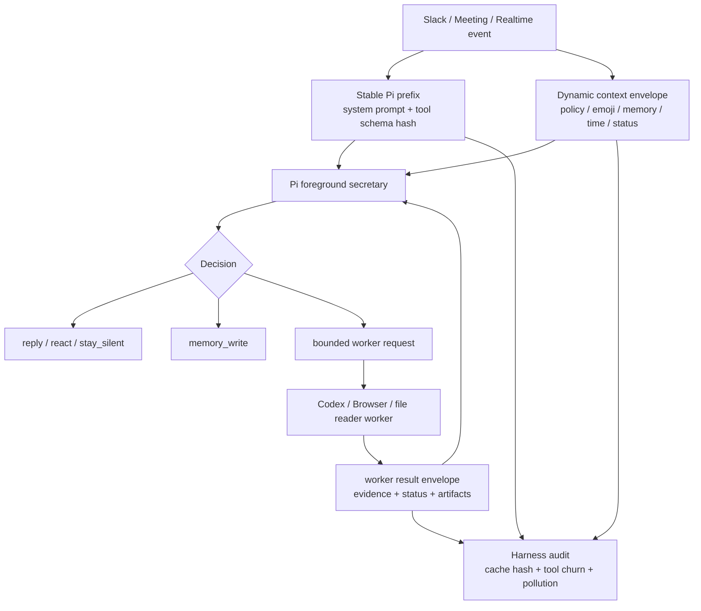

# Oneesama Harness Cache and Tool Stability RFC

Status: Proposed
Date: 2026-05-21
Owner: `@劲霸仁波切`
Supervisor / audit lane: `@喵喵`

## Context

Peng asked whether Oneesama should borrow the Harness engineering ideas from
the OpenClacky write-up: high cache locality, stable tool schemas, dynamic
context outside the stable prompt prefix, bounded worker isolation, and browser
automation as one stable capability instead of a pile of tools.

This maps directly onto the last two days of Oneesama incidents:

- Workspace-specific policy leaked into universal prompt behavior.
- Dynamic context such as custom emoji, workspace policy, live status, current
  time, and memory snippets kept being patched into whichever prompt path was
  closest.
- Worker delegation fixed real capability gaps, but it also created new failure
  modes when intermediate worker lifecycle leaked into user-visible Slack copy.
- Demo-surface / Browser Use proved that a single stable browser capability is
  powerful, but Linear / GitHub write actions need explicit approval gates.
- Daily triage quality and monitor surfaces exist, but they do not yet measure
  cache-prefix stability, tool-schema churn, or dynamic-context pollution.

The target is not "100% cache hit" as a slogan. The target is a maintainable
Oneesama harness:

```text
stable prefix + dynamic evidence envelope + bounded worker lane + small tool surface
```

## Problem

Oneesama currently has strong behavior canaries, but weak harness invariants.
The codebase can still regress by accidentally making one of these changes:

1. Add a dynamic field to the Pi system prompt and invalidate prompt cache every
   turn.
2. Add a new mainline tool schema for a niche capability instead of routing it
   through a stable worker / browser / skill boundary.
3. Let worker intermediate logs or failure details leak into the Pi foreground
   answer.
4. Add workspace preference as universal model behavior instead of dynamic
   workspace evidence.
5. Compress / summarize large contexts through a separate path that loses cache
   locality and changes semantic inputs.

Today we catch many of those only after production behavior looks wrong. This
RFC makes them first-class engineering contracts.

## Goals

- Freeze Oneesama's stable prompt and tool-schema prefix as an explicit,
  testable contract.
- Move dynamic context into typed evidence envelopes with source/version
  metadata.
- Keep the foreground Pi session as a secretary brain, not a project-code
  executor.
- Keep worker / skill execution isolated; foreground sees only a bounded result
  envelope with evidence and status.
- Keep the main tool surface small and stable; new capabilities enter through
  stable dispatch tools or worker skills.
- Add cache / tool churn / dynamic-context pollution metrics to daily audit.
- Define a safe path for Browser / Computer Use write actions with approval
  gates.

## Non-Goals

- Do not replace Oneesama Memory with "no RAG." Oneesama needs workspace memory,
  but it must behave as an evidence provider, not as unbounded prompt stuffing.
- Do not forbid all sub-agents. The prohibition is on human-org-chart-style
  multi-agent workflows. Bounded worker delegation remains required.
- Do not optimize one provider-specific prompt cache only. The invariant should
  survive model/provider changes.
- Do not enable real Linear / GitHub write actions without a separate approval
  gate.

## Design Principles

1. **Stable prefix is sacred.** System prompt, tool schemas, and stable
   persona rules must not vary with time, workspace policy, emoji list, memory
   snippets, live status, or current channel.
2. **Dynamic data is evidence.** Dynamic context is a typed envelope with
   `kind`, `source`, `version`, `freshness`, and `confidence`.
3. **Foreground is a secretary.** Pi decides whether to reply, react, stay
   silent, remember, or delegate. It does not debug unrelated product code.
4. **Workers are bounded and disposable.** Workers may read many files or run
   tools, but their scratch history does not enter foreground context.
5. **Tool surface changes are migrations.** Adding or changing a foreground
   tool schema requires an explicit migration note and cache-impact test.
6. **Browser / CU is one capability.** Snapshot / click / type / navigate
   remain parameters of a stable browser/demo-surface tool boundary.
7. **Compression is part of the harness.** Context compaction should preserve
   source attribution and happen through the same observable session path when
   possible.

## Target Architecture



## Dynamic Context Envelope

Every dynamic item supplied to Pi or workers should use a common shape:

```json
{
  "kind": "workspace_triage_policy",
  "source": "workspace_config",
  "version": "policy_hash_or_config_version",
  "freshness": "2026-05-21T11:30:00Z",
  "confidence": 1.0,
  "content": "...",
  "cache_policy": "dynamic_not_stable_prefix"
}
```

Initial dynamic kinds:

- `workspace_triage_policy`
- `workspace_custom_emoji`
- `related_memory_evidence`
- `current_time`
- `channel_brain_summary`
- `thread_activity_summary`
- `live_service_status`
- `browser_demo_observation`
- `worker_result_envelope`

Rules:

- Dynamic envelopes may be appended to the request context.
- Dynamic envelopes must not change stable prompt or stable tool schema bytes.
- Dynamic envelopes must carry source/version so stale data can be invalidated.
- Dynamic envelopes should be summarized or ranked before Pi sees them.

## Stable Prefix Contract

Define two hashes:

1. `pi_stable_prompt_hash`: stable persona/system instruction text.
2. `pi_tool_schema_hash`: foreground tool schema JSON after canonicalization.

The following changes must not alter either hash:

- current time / date changes;
- workspace policy version changes;
- custom emoji list changes;
- memory retrieval results change;
- channel brain summary changes;
- Slack thread context changes;
- live service status changes.

The following changes may alter the hash, but require an explicit migration:

- new foreground tool schema;
- changed tool parameter shape;
- changed universal Pi role rule;
- changed secretary delegation boundary.

## Worker / Skill Boundary

Worker requests should use a result-only contract:

```json
{
  "kind": "codex",
  "scope": "secretary_lookup | file_read | browser_demo | oneesama_code",
  "prompt": "bounded task",
  "context": {
    "dynamic_envelopes": ["..."],
    "artifact_refs": ["..."]
  }
}
```

Worker results should return:

```json
{
  "status": "succeeded | failed | timed_out | blocked",
  "confidence": 0.0,
  "summary": "short evidence-backed result",
  "evidence": [
    {"kind": "slack_file", "ref": "...", "quote": "..."},
    {"kind": "browser_observation", "ref": "...", "summary": "..."}
  ],
  "artifacts": ["..."],
  "user_visible": false
}
```

Rules:

- Foreground Pi never receives raw worker scratch logs by default.
- A worker failure may produce audit/status, but not canned user-facing
  completion copy.
- Worker scope is checked by Go-side hard guards before start.
- Browser/CU write actions require an approval gate even if worker requests
  them.

## Tool Surface Policy

Foreground tools should be grouped into a small stable set:

- Slack / Slock message actions.
- Reaction action.
- Memory write.
- Worker delegation.
- Browser/demo-surface control.
- Meeting/realtime status and presentation controls.
- Ask-human / approval request.

Any proposed new tool must answer:

- Can this be a parameter of an existing stable tool?
- Can this be implemented as a worker skill behind `delegate_worker`?
- Does this tool mutate external state?
- Will its schema change often?
- What cache-prefix hash changes?

## Browser / Computer Use Policy

The #304-#318 demo-surface work gives Oneesama a strong base:

- bot-owned browser surface;
- stable `start_demo_surface` / `control_demo_surface` / `cancel_demo_surface`;
- allowlist and `AllowActiveControl` gate;
- local task-to-Snake workflow smoke;
- no real Linear write without explicit approval.

Next step is not more raw tools. Next step is an approval gate:

```text
Pi decides desired write action
  -> asks human / policy for approval
  -> records approval token with scope + URL + action + expiry
  -> Browser/CU executes only if token matches
  -> audit records result and revokes token
```

## Compression / Context Budget Policy

Initial policy:

- Do not let triage / meeting / realtime context grow unbounded.
- Add context budget metadata to every request:
  `stable_tokens`, `dynamic_tokens`, `worker_result_tokens`,
  `memory_evidence_tokens`.
- Prefer ranked evidence over full-history prompt stuffing.
- Idle compaction should be observable and testable; do not silently rewrite
  foreground history without an audit row.

Open question:

- Whether Oneesama should implement provider-specific cache markers now, or
  first ship provider-neutral prefix hashes and context budgets.

Recommendation: start with provider-neutral hash and budget canaries first.

## Implementation Plan

### Phase 0: Inventory and Baseline

- [ ] 0-A. Inventory every Pi / agentrunner / realtime stable prompt builder.
  Done when a doc lists stable vs dynamic inputs for each builder.
- [ ] 0-B. Inventory foreground tool schemas and their current hashes.
  Done when test fixtures can print canonical schema hashes.
- [ ] 0-C. Add a harness status endpoint/report section with prompt hash,
  tool-schema hash, dynamic envelope counts, and worker scope counts.

### Phase 1: Stable Prefix Guards

- [ ] 1-A. Add `pi_stable_prompt_hash` and `pi_tool_schema_hash` tests.
  Done when current time, workspace policy, emoji list, and memory evidence
  changes do not affect stable hashes.
- [ ] 1-B. Move `workspace_custom_emoji`, `workspace_triage_policy`, and
  `current_time` into typed dynamic envelopes.
  Done when they are visible to Pi but absent from the stable hash inputs.
- [ ] 1-C. Add pollution canaries for "workspace preference as universal
  behavior" and "dynamic status as prompt mutation."

### Phase 2: Dynamic Evidence Envelope

- [ ] 2-A. Introduce typed `PersonaDynamicContextEnvelope` in Go.
- [ ] 2-B. Convert related Memory evidence and channel-brain summaries to the
  envelope shape.
- [ ] 2-C. Add source/version/freshness invalidation for workspace policy and
  custom emoji.
- [ ] 2-D. Teach daily triage audit to report stale dynamic envelope usage.

### Phase 3: Worker / Skill Isolation

- [ ] 3-A. Define `WorkerResultEnvelope` and normalize all worker completions
  through it.
- [ ] 3-B. Block raw worker logs from foreground Pi context unless explicitly
  requested for audit.
- [ ] 3-C. Add worker scratch-history isolation tests: large worker file reads
  must not expand foreground Pi history.
- [ ] 3-D. Add failure-mode tests: timeout / no result / blocked worker produce
  audit rows, not user-visible canned completion text.

### Phase 4: Tool Surface Consolidation

- [ ] 4-A. Generate a foreground tool inventory and classify tools as stable,
  worker-only, or deprecated.
- [ ] 4-B. Add tool-schema change review gate: any foreground schema change
  must update an RFC/task note.
- [ ] 4-C. Consolidate Browser/CU actions under the existing demo-surface
  control tool, not new one-off tools.
- [ ] 4-D. Add approval-token design for Browser/CU external write actions
  such as Linear close / GitHub issue update.

### Phase 5: Compression and Cache-Aware Context Budget

- [ ] 5-A. Add request context budget metrics to triage and meeting/realtime
  paths.
- [ ] 5-B. Add compaction audit rows for triage and meeting transcript
  summaries.
- [ ] 5-C. Prototype idle compaction for triage channel brain only.
- [ ] 5-D. Add canary: compaction preserves source attribution and does not
  rewrite stable prefix.

### Phase 6: Observability and Daily Review

- [ ] 6-A. Extend daily report with harness metrics:
  stable hash drift, tool schema drift, dynamic context stale count, worker
  isolation violations, browser/CU approval-denied count.
- [ ] 6-B. Extend the 2h triage quality sweep with harness buckets:
  `stable_prefix_changed`, `dynamic_context_stale`,
  `worker_log_leaked`, `unexpected_tool_schema`.
- [ ] 6-C. Add old-slackd vs Oneesama comparison fields for reaction/emoji use
  without putting emoji names in stable prompt.

## Task Breakdown

| Slice | Suggested owner | Write scope | Deliverable |
|---|---|---|---|
| Harness 0-A prompt/tool inventory RFC appendix | `@劲霸仁波切` | `notes/rfc`, `notes/code-polish` | Stable/dynamic source map |
| Harness 0-B hash scaffold | `@劲霸仁波切` | `internal/persona`, `internal/meetingagent`, tests | Prompt/tool hash helpers |
| Harness 1-A stable-prefix canaries | `@喵喵` | tests + audit docs | Hash invariance fixtures |
| Harness 1-B dynamic envelope type | `@劲霸仁波切` | `internal/persona`, `internal/slackagent` | Typed envelope and builders |
| Harness 2-A policy/emoji/time migration | `@劲霸仁波切` | persona/slack context builders | Dynamic context migration |
| Harness 2-B stale envelope audit | `@喵喵` | audit/sweep/daily report | Stale dynamic context buckets |
| Harness 3-A worker result envelope | `@劲霸仁波切` | `internal/slackagent`, `internal/agentrunner` | Result-only worker contract |
| Harness 3-B worker isolation canaries | `@喵喵` | tests/fixtures | Scratch-history isolation tests |
| Harness 4-A tool inventory/gate | `@喵喵` | docs/tests/scripts | Foreground tool registry |
| Harness 4-B Browser/CU approval gate RFC | `@劲霸仁波切` | `notes/rfc`, demo surface config | External write approval design |
| Harness 5-A context budget metrics | `@劲霸仁波切` | triage/meeting request builders | Token/context budget metadata |
| Harness 5-B compaction canary plan | `@喵喵` | docs/tests | Source-preserving compaction gate |
| Harness 6-A daily harness report | `@劲霸仁波切` | daily/sweep/monitor | Operator-facing metrics |
| Harness 6-B audit review cadence | `@喵喵` | audit docs/reminders | How to review drift weekly |

## Acceptance Gates

- [ ] Changing current date/time does not change `pi_stable_prompt_hash`.
- [ ] Changing workspace policy content/version does not change stable prompt
  or tool schema hash.
- [ ] Changing custom emoji list does not change stable prompt or tool schema
  hash.
- [ ] Changing Memory retrieval results does not change stable prompt or tool
  schema hash.
- [ ] Any foreground tool schema change fails a test unless expected hash
  fixtures are updated with a migration note.
- [ ] Worker scratch logs do not appear in Pi foreground request context.
- [ ] Worker failure with empty result does not produce user-visible canned
  completion text.
- [ ] Browser/CU click/type that mutates external state requires an approval
  token.
- [ ] Daily report shows stable hash drift and dynamic context stale counts.
- [ ] Triage quality sweep separates behavior quality failures from harness
  drift failures.

## Open Questions

- Should Oneesama implement provider-specific prompt-cache markers in the first
  phase, or wait until provider-neutral hash/budget canaries are green?
- Should Skill invocation become a first-class worker scope, or remain encoded
  as `delegate_worker.kind=codex` with a skill prompt?
- What is the approval UX for external Browser/CU writes: Slack button, realtime
  spoken confirmation, or both?
- What is the default retention policy for worker result envelopes and browser
  screenshot artifacts?
- Which dynamic envelopes should be hidden from model input but kept for audit
  only?

## Immediate Recommendation

Ship Phases 0-2 first. They are low-risk and directly prevent the regressions
that caused the recent Oneesama incidents. Then ship worker isolation and
Browser/CU approval gates before enabling real Linear/GitHub write workflows.

