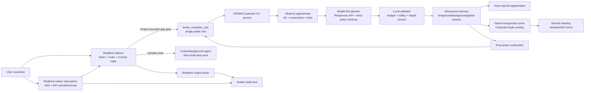
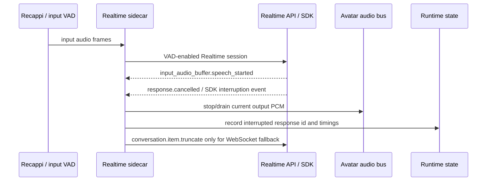

# RFC: Realtime KWWK/Cueboard CU Rewrite Execution Plane

Date: 2026-06-02
Status: current meet-free scope implemented and verified; real-room admission moved to follow-up
Owner: @劲霸仁波切
Implementation driver: local Codex session

## Summary

Realtime is currently too slow and too opaque for live meeting app control.

The best path is not to keep adding specific Realtime tools, hard-coded keyword
patches, or incremental fixes on the current `app-control-helper` implementation.
Realtime should become a low-latency conversation and routing layer.
KWWK/Cueboard Computer Use should be rewritten as the native execution plane for
simple app operations, with its own structured action protocol, visible cursor,
model-first planner, verification loop, and latency gates.

The product contract should be:

- Realtime listens, understands intent, and calls one generic app-operation
  tool for simple bounded app actions.
- KWWK/Cueboard CU observes, calls the planner model, validates the structured
  plan, executes, verifies, shows cursor feedback, and reports compact results.
- Complex or open-ended work delegates to Codex/background agents, not to the
  foreground Realtime turn.
- The audio path must support immediate barge-in: when the user starts
  speaking, current model speech and avatar output are cancelled quickly.
- The meeting bot must answer in English regardless of the user's language.

Hard acceptance is benchmark-first. The rewrite is not accepted by code
inspection or prompt review. For this iteration, acceptance deliberately avoids
actual Google Meet room admission: the local fixture planner, provider-specific
live planner, real macOS app execution, native/shared cursor evidence, latency
gates, native interruption, tool-surface gates, and meet-free synthetic-Realtime
artifact all have to pass. Real Google Meet room admission remains a follow-up
release gate, not this RFC's completion target.

## Implementation Status

This document is the canonical rewrite plan and current gate ledger, not proof
that the product path is accepted.

- Phase 0 documentation and contract lock is complete.
- Phase 1 through Phase 5 are implemented and verified by the local/native,
  provider-specific live planner, real app-control, cursor, interruption,
  tool-surface, and routing gates recorded below.
- Phase 6 now uses the meet-free synthetic-Realtime gate as the current
  integration acceptance boundary. It still uses a real synthetic speaker WAV,
  real Realtime sidecar audio, and real tool execution, but replaces the Google
  Meet room with the local Meet fixture so room admission cannot mask
  Realtime/CU regressions.
- Real Meet room/admission is explicitly out of scope for this iteration. It
  remains a follow-up release gate with separate artifacts and does not block
  this RFC's current completion target.
- Product acceptance for this iteration is closed by the current-scope gates
  recorded below. The provider-specific live planner gate now passes the restored
  1200 ms planner-model SLO on the product-selected native Gemini
  `generateContent` path by using compact operation-id selection plus bounded
  deterministic hedging.
- `packages/core/src/meeting/app-control-helper.swift` is allowed only as a
  temporary launcher/shim. The old planner, cursor, executor, observation,
  verification, input, runtime, and router logic must not be treated as the
  accepted foundation.
- Standalone replacement source files are not accepted merely by existing in
  the worktree. A module boundary counts only after it is wired into the helper
  build, old-helper definitions are removed, source-boundary tests prove the
  move, and the relevant backend/planner/cursor/latency gates are rerun.
- Fixture planner gates are useful for regression, but they cannot substitute
  for the provider-specific live planner gate. The meet-free synthetic-Realtime
  artifact is the current integration artifact; real Meet sidecar artifacts are
  follow-up release evidence only.

## Plan Lock Checklist

These checkboxes mean the RFC now records the decision. They do not mean the
implementation or product path is accepted; only the benchmark/e2e gates can do
that.

### Rewrite Boundary

- [x] Treat this RFC as the canonical KWWK/Cueboard CU rewrite plan.
- [x] Stop describing the current `app-control-helper` as a repairable base.
- [x] Allow `packages/core/src/meeting/app-control-helper.swift` only as a
      temporary helper launcher/shim.
- [x] Require planner, executor, cursor, observation, verification, input,
      runtime, and router ownership to move into KWWK/Cueboard-style modules.
- [x] Port the minimal Cueboard `BridgeComputerUse` concepts directly into
      Oneesama/KWWK without adding Cueboard as an external runtime dependency.
- [x] Require a Cueboard source refresh before port work and record the exact
      Cueboard commit used for each pass.

### Realtime Tool Surface

- [x] Make `kwwk_computer_use` the only default Realtime-visible simple app
      operation tool.
- [x] Migrate and delete `control_shared_app_window` instead of keeping it as a
      hidden equivalent.
- [x] Keep `kwwk_computer_use` arguments limited to natural-language
      `instruction` plus app/window/session hints.
- [x] Forbid Realtime-visible operations arrays, coordinates, screenshots,
      planner selection, execution mode, waits, and timeouts.
- [x] Route complex app work through `delegate_to_worker`, with KWWK allowed to
      return `needs_background_agent`.

### KWWK/Cueboard Execution Plane

- [x] Use the new KWWK JSON-RPC method family:
      `kwwk.cu.execute`, `kwwk.cu.plan`, `kwwk.cu.action`, and
      `kwwk.cu.control`.
- [x] Rebuild around daemon/control/session/action envelopes with
      foreground/background/global scopes.
- [x] Include permission checks, AX/screenshot observation, structured action
      dispatch, session lifecycle, post-action verification, and compact
      blockers in the native CU plane.
- [x] Require executor success to be verified; a dispatched action alone is not
      accepted as success.

### Model-First Planner

- [x] Call the planner model for every natural-language CU turn.
- [x] Use provider-specific strict JSON Schema structured output. The default
      small-planner path is native Gemini `generateContent` with
      `responseMimeType`/`responseSchema`; OpenRouter Chat Completions and
      OpenAI Responses remain supported/diagnostic provider paths.
- [x] Default the planner provider/model to native Gemini
      `gemini-3.5-flash`; env/config overrides are explicit product or
      diagnostic choices, not a silent local-rule fallback.
- [x] Use local rules, deterministic hints, and AX parsing only as model
      context, validator input, and safety guard.
- [x] Return explicit blockers for timeout, unavailable model, schema refusal,
      invalid JSON/schema, action-budget violations, unsupported tasks, and
      observation-required cases.
- [x] Forbid local keyword fallback after a planner model failure.

### Cursor, HUD, Audio

- [x] Show Cueboard-style native foreground cursor feedback for pointer
      actions, including target ring, approach, click/drag evidence, and shared
      surface mirror.
- [x] Do not fake cursor motion for keyboard/scroll actions; show only compact
      CU status and verification result.
- [x] Remove default visible connection/audio/speaking HUD badges.
- [x] Keep diagnostic state in `/join/status`, timelines, and benchmark
      artifacts.
- [x] Make bot replies English regardless of user language.
- [x] Use Realtime API native interruption/cancel/truncate semantics as the
      source of truth for barge-in, with avatar output stopped/drained on API
      interruption events.

### Acceptance Policy

- [x] Treat benchmark/e2e gates as hard acceptance gates.
- [x] Require fixture planner gates for stable schema/validator coverage.
- [x] Require a provider-specific live planner gate for model-first proof.
- [x] Require real macOS app execution and verification gates.
- [x] Require native cursor and shared-surface cursor evidence.
- [x] Require live/model-first latency SLO evidence without hidden cold start.
- [x] Require meet-free synthetic-Realtime integration first: real synthetic
      speaker audio, real Realtime sidecar, and real tool execution against the
      local fixture, with no Google Meet room/admission dependency. The fixture
      may loop the synthetic-speaker audio so session warm-up cannot consume the
      only spoken command.
- [x] Keep the real Meet sidecar artifact as a follow-up release gate with
      Realtime SDK connected, voice input, active app share,
      `kwwk_computer_use`, model plan, verified action, cursor evidence,
      interruption pass, English response, and cold/warm timing breakdown. It is
      not part of this iteration's current-scope acceptance boundary.

## Decision Snapshot

- Keep one Realtime-visible simple app-operation tool:
  `kwwk_computer_use`.
- Migrate compatibility callers off `control_shared_app_window`, then remove
  that tool schema and handler branch entirely.
- Do not expose one tool per UI action, raw operation arrays, click
  coordinates, screenshots, or planner model choices to Realtime.
- Keep `kwwk_computer_use` as a natural-language goal tool only: it accepts
  `instruction` plus app/window/session hints, and it must not accept `wait`,
  `timeout`, execution mode, action programs, or planner-selection fields.
- Route complex work to `delegate_to_worker`; KWWK may return
  `needs_background_agent`, but Realtime must not try to finish complex CU work
  by inventing more foreground tool calls.
- Treat the current `packages/core/src/meeting/app-control-helper.swift`
  implementation as deprecated. It may remain temporarily as a launcher/shim,
  but its planner, executor, and cursor implementation are not the foundation
  for the rewrite.
- Rebuild a Cueboard-style Computer Use service:
  structured foreground/background/global actions, mode sessions, cursor
  presentation, observation, execution, and verification.
- Port/copy Cueboard `BridgeComputerUse` concepts into Oneesama/KWWK directly;
  do not add Cueboard as an external runtime dependency.
- Make the KWWK CU planner model-first for every natural-language CU turn.
  The planner calls a provider-specific strict JSON Schema API: default native
  Gemini `generateContent`, with OpenRouter Chat Completions
  `response_format.json_schema` and OpenAI Responses API `text.format` kept as
  supported/diagnostic provider paths.
  Local rules/AX parsing are hints and validators, not an execution bypass.
- Default the planner provider/model to native Gemini `gemini-3.5-flash`, with
  env/config override.
  If the planner model is unavailable or times out, KWWK returns an explicit
  blocker instead of falling back to local keyword execution.
- Make Realtime's app-control prompt/tool context compact and low-latency.
  Deep reasoning belongs in background/Codex tasks, not the live voice loop.
- Use Realtime API native interruption as the source of truth. Local code only
  forwards/observes speech-start events, stops avatar playback when the API
  reports interruption, and handles WebSocket truncation fallback when needed.
- Make English response language a server-owned contract across session
  instructions and tool-result follow-up prompts.
- Do not voice low-value operational state such as "connecting", "connected",
  "listening", or "speaking"; those states are audible or diagnostic, not useful
  meeting narration.
- Gate acceptance with layer-specific benchmarks: recall, backend execution,
  model planner/action, cursor-visible, cold/warm latency, audio interruption,
  real-room integration, and provider-specific live planner execution.

## Triggering Evidence

Live session symptoms:

- Sharing Chrome eventually succeeded but took about ten seconds on the app
  share path.
- Asking the bot to switch tabs selected KWWK CU, but execution failed with
  `instruction_not_directly_executable`.
- HUD labels such as connection/audio status had little meeting value, while
  Computer Use actions lacked useful visible feedback.
- User speech did not reliably interrupt the bot while it was talking.
- Realtime felt slower than competing Computer Use implementations.

Local source observations:

- The Realtime session carries a large fixed prompt/tool surface, and current
  default reasoning effort is high for `gpt-realtime-2`.
- `input_audio_buffer.speech_started` and local user-speech events are tracked,
  but the current bridge does not consistently force a local active-response
  cancel and output-audio stop at that boundary.
- Current `kwwk_computer_use` receives natural language, but the helper is a
  shallow deterministic/parser-heavy path. Passing an instruction such as
  "switch to the first tab" should not depend on old keyword coverage; it must
  go through a model-produced structured plan and post-action verification.
- Cueboard has a richer `BridgeComputerUse` architecture with:
  `DaemonRequest`, `DaemonAction`, foreground/background/global action scopes,
  foreground sessions, action help, AX state, screenshot/pixel coordinates,
  foreground cursor overlay, Bezier cursor movement, and system-cursor handoff.

Source note:

- 2026-06-03 implementation preflight reran:

  ```bash
  git -C /Users/pengx17/Documents/cueboard pull --ff-only
  ```

  The pull fast-forwarded `/Users/pengx17/Documents/cueboard` on `main` from
  `3fa641f2e1f98ea38c6cf0caa40d841b732a51c9` to
  `a971b7ad7a3465774322f5c47f159d7e6a62dd3c`
  (`Improve voice input text targeting (#2116)`). The worktree still has
  pre-existing untracked `agent-framework/` outputs, but the tracked Cueboard
  source used for this port preflight is now recorded.

## Problem

The current system mixes three different jobs in the Realtime turn:

- live dialog and language behavior;
- app-control routing/planning;
- app-control execution and progress feedback.

That creates bad live behavior:

- Realtime may call the right tool but pass an instruction KWWK cannot execute.
- Adding specific tools such as "switch tab" will never cover the action space.
- Large Realtime context and high reasoning can add latency before any CU work
  starts.
- The executor may run, but the audience sees no cursor or meaningful state.
- Tool/status speech can mask failure because the model can say progress words
  before a real action has happened.
- Audio output can keep talking after the user starts speaking.

The fix is an ownership change, not a prompt tweak.

## Target Architecture



### Realtime Owns

- speech input and output turn lifecycle;
- compact conversation instructions;
- tool selection for:
  - simple app operation;
  - screen/app share;
  - Meet chat/read;
  - background delegation;
- English response policy;
- short final replies after function outputs.

Realtime must not own:

- UI action planning;
- click coordinates;
- operation arrays;
- cursor rendering;
- observe-act-verify loops;
- long debugging/build/research tasks.

### KWWK/Cueboard CU Owns

- app/window resolution;
- permission checks and session lifecycle;
- observation via accessibility tree and screenshot when needed;
- model-first planning for every natural-language CU turn;
- local deterministic hints, AX-derived target candidates, validation, and
  safety checks;
- structured action execution;
- cursor presentation and click/drag feedback;
- verification and compact blockers;
- latency traces.

### Codex/Background Agents Own

- open-ended app exploration;
- debugging/build/research;
- file/repo changes;
- tasks requiring many steps or persistent reasoning;
- fallback when KWWK returns `needs_background_agent`.

## Public Tool Contract

Realtime sees only one app-operation tool for simple bounded CU:

```ts
interface RealtimeKWWKComputerUseArgs {
  instruction: string;
  applicationName?: string;
  bundleIdentifier?: string;
  windowTitle?: string;
  windowId?: string;
  processId?: number;
  session_id?: string;
}
```

Rules:

- `instruction` is required and remains natural language.
- Realtime preserves the user's intent; it does not compile the intent into
  clicks, keys, selectors, or coordinates.
- App/window fields are target hints, not proof.
- Tool schema does not accept:
  - `operations`;
  - `clicks`;
  - raw `x`/`y`;
  - screenshots;
  - planner model selection;
  - hidden action programs.
- Tool description says this is for short, bounded operations in the bot-owned
  shared or named host app/window.
- Google Meet meeting controls are excluded unless a dedicated meeting-control
  tool exists.

Compact external result:

```ts
interface RealtimeKWWKComputerUseResult {
  status:
    | "success"
    | "queued"
    | "running"
    | "blocked_ambiguous_target"
    | "blocked_permission"
    | "blocked_no_target_app"
    | "blocked_unsupported_instruction"
    | "blocked_planner_model_timeout"
    | "blocked_planner_model_unavailable"
    | "blocked_planner_schema_refusal"
    | "blocked_planner_invalid_plan"
    | "blocked_action_budget"
    | "needs_background_agent"
    | "failed_execution"
    | "failed_verification";
  message: string;
  evidence?: {
    app?: string;
    windowTitle?: string;
    actionKinds?: string[];
    verification?: string;
    cursorVisible?: boolean;
    durationMs?: number;
  };
}
```

Full traces stay local in artifacts/telemetry.

## Internal CU Protocol

KWWK should expose a structured daemon/client protocol aligned with Cueboard:

```ts
type CUMode = "foreground" | "background";

interface CURequest {
  control?: "ping" | "session-status" | "mode-help" | "permissions-status";
  session?: {
    op: "start" | "stop";
    mode?: CUMode;
    foreground?: { apps?: string[]; display?: number };
    background?: Record<string, never>;
  };
  action?: CUAction;
}

type CUAction =
  | { scope: "global"; action: "list-apps" | "open-app" | "list-windows"; args: object }
  | { scope: "background"; action: BackgroundActionName; args: object }
  | { scope: "foreground"; action: ForegroundActionName; args: object };
```

Foreground actions mirror Cueboard's foreground mode:

- `click`
- `mouse-down`
- `mouse-up`
- `mouse-move`
- `drag`
- `type-text`
- `press-key`
- `hold-key`
- `scroll`
- `wait`
- `screenshot`
- `zoom`
- `screen-size`
- `cursor-position`
- `focus`
- `focus-window`
- `get-app-state`
- `thinking`

Background actions mirror Cueboard's background AX mode:

- `list-apps`
- `open-app`
- `list-windows`
- `get-app-state`
- `click`
- `type-text`
- `set-value`
- `press-key`
- `scroll`
- `perform-secondary-action`
- `drag`

The Realtime tool never calls these directly. It calls KWWK CU with the goal;
the CU planner chooses the structured actions.

KWWK JSON-RPC should use a new method family rather than the legacy
`app_control.control_shared_app_window` name:

- `kwwk.cu.control`: ping, permission status, session status, mode help, and
  session start/stop.
- `kwwk.cu.plan`: observe + model planner + validation, without execution.
- `kwwk.cu.action`: execute one already validated structured action.
- `kwwk.cu.execute`: full observe -> model plan -> validate -> act -> verify
  loop for Realtime tool calls.

The public `kwwk_computer_use` handler calls `kwwk.cu.execute`.

## Model-First Planner

The planner is internal to KWWK CU.

### Planner Input

Before calling the model, KWWK builds compact context:

- original natural-language instruction;
- app/window target hints and resolved target;
- current foreground/background mode;
- compact AX tree or focused subset;
- screenshot metadata and element candidates when needed;
- local deterministic hints such as likely shortcut, target role, or action
  budget;
- safety constraints and the maximum action count.

### Planner Model

Every natural-language CU turn calls the planner model. The accepted API shape
is provider-specific strict JSON Schema output:

- default: native Gemini `generateContent` with
  `generationConfig.responseMimeType=application/json`,
  `generationConfig.responseSchema`, and
  `thinkingConfig.thinkingBudget=0` for the default `minimal` reasoning mode;
- supported/diagnostic: OpenRouter Chat Completions with
  `response_format.type=json_schema`, `strict: true`, and the KWWK CU plan
  schema;
- supported/diagnostic: OpenAI Responses API Structured Outputs with
  `text.format` `json_schema` and `strict: true`, following official guidance
  at `https://developers.openai.com/api/docs/guides/structured-outputs`.

Default config:

- `ONEESAMA_KWWK_CU_PLANNER_PROVIDER=gemini`
- `ONEESAMA_KWWK_CU_PLANNER_MODEL=gemini-3.5-flash`
- `ONEESAMA_KWWK_CU_PLANNER_TIMEOUT_MS=3000`
- `ONEESAMA_KWWK_CU_PLANNER_MAX_ACTIONS=3`
- `ONEESAMA_KWWK_CU_PLANNER_REASONING_EFFORT=minimal`
- `ONEESAMA_GEMINI_API_KEY=<live key>`
- `ONEESAMA_GEMINI_BASE_URL=https://generativelanguage.googleapis.com/v1beta/openai`

Compatibility aliases such as `MAB_KWWK_CU_PLANNER_MODEL` may be accepted
during migration, but the canonical config should be the `ONEESAMA_*` names.

For OpenRouter-hosted Gemini, the live planner request uses the general strict
plan schema and lets the executor-side validator enforce allowed operation
kinds and action budget. A live OpenRouter/Google probe rejected the narrower
operation-literal `anyOf` schema, so the accepted contract is strict model
envelope first, then local validation before execution.

OpenRouter-hosted Gemini uses mandatory thinking for this model family, so the
default request uses the lowest accepted `reasoning.effort=minimal` with
`reasoning.exclude=true`. A direct `reasoning.effort=none` probe returned a
provider 400 (`Reasoning is mandatory for this endpoint and cannot be
disabled.`).

Native Gemini uses a provider-specific schema adapter because the current
`responseSchema` REST field rejects `additionalProperties`, even though the
newer structured-output docs describe fuller JSON Schema support. KWWK strips
`additionalProperties` only for native Gemini and keeps executor-side validation
as the safety guard. For deterministic hints, native Gemini uses a compact
operation-id selection envelope (`s:"planned"`, `b:"none"`, `o:["op0", ...]`)
with a default hedge width of 24. The executor expands the schema-valid
model-selected ids back into the deterministic operations and still requires
the expanded operations to exact-match the hints before any action may run.
This keeps the action model-first while reducing output tokens and preventing
cursor/click targets from drifting.

Planner output is a strict schema, not prose:

```ts
interface KWWKCUPlan {
  kind: "action_plan" | "blocked" | "needs_background_agent";
  summary: string;
  target: {
    applicationName?: string;
    bundleIdentifier?: string;
    windowTitle?: string;
    confidence: "high" | "medium" | "low";
  };
  actions: Array<{
    scope: "foreground" | "background" | "global";
    action: string;
    args: Record<string, unknown>;
    reason: string;
  }>;
  verification: {
    expectedState: string;
    method: "ax" | "screenshot" | "cursor" | "timing" | "none";
  };
  blocker?: {
    code: string;
    message: string;
  };
}
```

Rules:

- Do not hard-code a model name in the Realtime tool schema.
- The model sees only compact observation and task context, not full Realtime
  history.
- The model returns structured action proposals, not prose or click-by-click
  narration.
- `actions` is empty unless `kind` is `action_plan`.
- `kind:"needs_background_agent"` preserves the original instruction and compact
  target context for `delegate_to_worker`.
- KWWK validates the schema, action budget, target scope, and safety boundaries
  before executing anything.
- Model latency is measured separately from execution latency.
- If the model refuses, times out, returns invalid JSON, exceeds the action
  budget, or is unavailable, KWWK returns a blocker such as
  `blocked_planner_model_timeout` or `blocked_planner_model_unavailable`.
- KWWK must not silently fall back to local keyword execution after planner
  model failure.

If the planner decides the task is not a short bounded foreground operation, it
returns `needs_background_agent`.

## Cueboard Source To Port

Port concepts directly from local Cueboard source into Oneesama/KWWK. Do not
make Cueboard a runtime dependency.

Reference paths:

| Cueboard source                                                                                                      | Oneesama/KWWK use                                                                                |
| -------------------------------------------------------------------------------------------------------------------- | ------------------------------------------------------------------------------------------------ |
| `/Users/pengx17/Documents/cueboard/frontend/macos/BridgeComputerUse/Sources/CUShared/DaemonProtocol.swift`           | Wire protocol shape: session/control/action envelopes and foreground/background/global scopes.   |
| `/Users/pengx17/Documents/cueboard/frontend/macos/BridgeComputerUse/Sources/CUForeground/ForegroundParser.swift`     | Foreground action grammar and agent-facing help text.                                            |
| `/Users/pengx17/Documents/cueboard/frontend/macos/BridgeComputerUse/Sources/CUForeground/ForegroundExecutor.swift`   | CGEvent execution, key handling, screenshot coordinate conversions, action execution boundaries. |
| `/Users/pengx17/Documents/cueboard/frontend/macos/BridgeComputerUse/Sources/CUBackground/BackgroundActionHelp.swift` | Background AX workflow and action help.                                                          |
| `/Users/pengx17/Documents/cueboard/frontend/macos/BridgeComputerUse/Sources/CUForegroundCursor/DaemonCursor.swift`   | Cursor materialization, approach animation, drag animation, dwell/final hold, pose callbacks.    |
| `/Users/pengx17/Documents/cueboard/frontend/macos/BridgeComputerUse/Sources/CUForeground/ComputerUseCursor.swift`    | Cursor sprite sizing and hotspot geometry.                                                       |
| `/Users/pengx17/Documents/cueboard/frontend/macos/Cueboard/Agent/ComputerUse/ComputerUseDaemonClient.swift`          | Helper launch, ping cache, session start/stop, mode help, dispatch action wire flow.             |

Implementation preflight:

- [x] Retry `git -C /Users/pengx17/Documents/cueboard pull --ff-only`.
- [x] Record the Cueboard commit used for the port.
- [x] Copy/port only the minimal CU modules needed for KWWK.
- [x] Avoid importing Cueboard app/business dependencies.
- [x] Add Oneesama-specific tests before changing live Realtime routing.

## Realtime-Native Audio Interruption Contract

The meeting bot must be interruptible.

The best path is to use the Realtime API's own interruption semantics, not a
parallel local interruption state machine. Official Realtime conversation docs
state that with VAD enabled, Realtime detects user speech, cancels the ongoing
response, and starts a new one. For WebRTC and SIP, the server also manages the
output-audio buffer and automatically truncates unplayed audio on interruption.
For WebSocket playback, the client must stop playback and send
`conversation.item.truncate` for the unplayed portion.

Oneesama's job is therefore adapter work:

- configure Realtime turn detection with interruption enabled;
- surface `input_audio_buffer.speech_started` / SDK interruption events;
- stop or drain the avatar audio bus when the API reports interruption;
- handle WebSocket fallback truncation if a future runtime uses client-managed
  playback;
- measure the interruption timing end to end.



Requirements:

- [x] Treat Realtime API / SDK interruption events as the canonical cancel
      source.
- [x] Keep `turn_detection.interrupt_response` enabled for live voice sessions.
- [x] Do not send speculative `response.cancel` from a local speech-start signal
      while VAD-driven Realtime interruption is available.
- [x] Stop or drain avatar output PCM when Realtime reports speech start,
      response cancellation, or SDK audio interruption.
- [x] For WebSocket fallback only: stop local playback and send
      `conversation.item.truncate` with the played-audio position.
- [x] Deduplicate interruption handling by response id / item id.
- [x] Suppress self-echo so bot speech does not cancel itself.
- [x] Record interruption timing:
      `speech_started_at`, `api_interruption_at`, `response_cancelled_at`,
      `avatar_audio_stopped_at`, `truncate_sent_at`.
- [x] Add a benchmark that fails when API-interruption-to-audio-stop exceeds
      the SLO.

Candidate SLOs:

- Realtime speech-start event to avatar output stop: p95 <= 200 ms;
- API interruption/cancel event to avatar output stop: p95 <= 150 ms;
- user speech-start to no audible bot speech: p95 <= 350 ms.

Official API references:

- `https://developers.openai.com/api/docs/guides/realtime-conversations#interruption-and-truncation`
- `https://developers.openai.com/api/docs/api-reference/realtime-client-events/conversation/item/truncate`

## English Response Contract

The bot must answer in English regardless of input language.

This must be server-owned, not left to one prompt string:

- [x] Go Realtime contract instruction:
      "Always answer in concise English, regardless of the user's language."
- [x] TS Realtime contract instruction mirrors Go.
- [x] Tool-result follow-up prompts use English, including blocked/error
      instructions.
- [x] Worker-result injected messages request English summaries.
- [x] Meet chat confirmations use English.
- [x] Tests assert the generated session instructions and tool follow-up
      prompts no longer contain "answer in Chinese" requirements.

Chinese utterance examples may remain in routing instructions as input examples,
but output instructions must be English.

## HUD And Cursor Contract

The HUD should not spend meeting attention on low-value state.

Remove or demote from default visible HUD:

- connection/connected labels;
- audio/no-audio labels;
- speaking labels, because speech is audible.

Show only useful Computer Use state:

- current app/action target;
- Cueboard-style native cursor, click pulse, target ring, and drag trail for
  pointer actions;
- short action state and verification result for keyboard/scroll actions,
  without fake pointer motion;
- short blocker when action cannot proceed;
- permission missing state;
- long-running background delegation only when it affects the meeting surface.

Status that remains useful for diagnostics should stay in `/join/status`,
timeline, benchmark artifacts, or debug views.

## Latency Contract

Latency must be measured as a pipeline, not a single stopwatch.

For each live app-control turn, record:

- user speech end / typed-turn arrival;
- Realtime tool-call start;
- tool HTTP receive;
- CU helper cold/warm state;
- helper launch/compile time;
- observation time;
- planner time;
- model planner time if used;
- execution time;
- cursor presentation time;
- verification time;
- function output delivery time;
- final spoken response start if any.

Required model-first SLOs:

| Path                                            | Target                                                                                                                                          |
| ----------------------------------------------- | ----------------------------------------------------------------------------------------------------------------------------------------------- |
| Warm model-first CU after tool receive          | p95 <= 2500 ms from tool receive to verified action                                                                                             |
| Planner model call                              | provider-specific p95 <= 1200 ms for the selected small planner model; model latency above this is a hard blocker, not a fixture-pass condition |
| Cold helper startup before first action         | report-only initially; target p95 <= 2500 ms after prewarm                                                                                      |
| App share first visible frame                   | p95 <= 3000 ms                                                                                                                                  |
| Realtime tool-call selection after clear intent | p95 <= 2000 ms                                                                                                                                  |
| API interruption event to avatar output silence | p95 <= 150 ms                                                                                                                                   |
| User speech-start to no audible bot speech      | p95 <= 350 ms                                                                                                                                   |

The latency benchmark should fail on hidden cold starts in warm cases.

Prewarm policy:

- [x] Start CU helper when a meeting session joins.
- [x] Keep helper ping cache warm during active Realtime sessions.
- [x] Prewarm planner model client and schema validation.
- [x] After app share starts, prewarm target resolution for the active app.
- [x] Preload cursor overlay assets.
- [x] Avoid compiling Swift helpers on the live hot path.
- [x] Do not start foreground cursor sessions until user/CU action requires it.

## Benchmark And Acceptance

This RFC depends on the specialized gate split in
`notes/rfc/realtime-kwwk-cu-benchmark-gates-rfc-2026-06-02.md`, but adds
product-level pass/fail criteria.

Benchmark/e2e gates are release gates. If a required gate fails, the response is
to fix the implementation, rerun the failing gate, and record the new artifact;
do not weaken the tool contract, switch to fixture-only proof, or hide the
failure behind a compatibility path.

Required gates, with current status:

- [x] `benchmark:realtime-kwwk-app-control`
      proves the native CU helper can start, observe a real macOS app, execute
      structured actions, verify state, and return compact KWWK evidence.
- [x] `benchmark:realtime-kwwk-planner-action`
      proves every natural-language action case used a planner model
      (`modelUsed:true`), produced a strict structured plan, respected the action
      budget, verified post-state, and returned explicit blockers for
      unsupported tasks.
- [x] `benchmark:realtime-kwwk-planner-action`
      includes `needs_background_agent` cases so complex tasks are routed out of
      foreground KWWK instead of being faked locally.
- [x] `benchmark:realtime-kwwk-planner-live`:
      requires a provider API key and the configured default
      OpenRouter/Gemini planner model to be available; records provider,
      requested model, actual response model, schema refusal, invalid-schema
      blocker, model latency, warmup-vs-measured timing, retry/blocker
      evidence, and exits nonzero when the live model cannot produce a
      schema-valid plan within the provider-specific SLO.
- [x] Fixture planner gate:
      uses deterministic local fixtures only for schema, validator, timeout,
      bad JSON, refusal/blocker, and action-budget coverage; fixture success
      cannot substitute for the live planner gate.
- [x] Local `benchmark:realtime-kwwk-latency`
      reports cold/warm segmentation and fails hidden cold start in warm local
      helper cases.
- [x] Live/model-first latency gate:
      enforces warm model-first `tool receive -> verified action` p95 <= 2500 ms
      and real planner-model p95 <= 1200 ms for the selected small planner
      model. The latest standalone live planner sub-gate passes on native
      Gemini `gemini-3.5-flash` with `providerRuntime.openAICompatibility:false`,
      `thinkingBudget:0`, operation-id selection, and deterministic hedge
      width 24. The real app-control suite treats
      `liveModelFirstLatency.ok:false` as a top-level failure instead of a
      secondary warning.
- [x] `benchmark:realtime-kwwk-cursor-visible`
      proves the shared meeting/demo surface renders cursor state, target ring,
      click pulse, drag trail, and verification state.
- [x] `benchmark:realtime-kwwk-native-cursor`
      proves the native foreground cursor session exists for pointer actions,
      includes Cueboard-style approach/drag animation evidence, and records
      Bezier/pose telemetry.
- [x] Tool-surface gate:
      default live Realtime config exposes `kwwk_computer_use` and does not
      expose `control_shared_app_window`.
- [x] Realtime tool recall:
      positive simple app-control utterances call `kwwk_computer_use`; negative
      meeting-control/share-control utterances do not route into KWWK CU.
- [x] `benchmark:realtime-native-interruption`:
      Realtime VAD/API interruption stops avatar audio within SLO and records
      `speech_started_at`, `api_interruption_at`, `response_cancelled_at`,
      `avatar_audio_stopped_at`, and any fallback truncate event.
      It also proves obvious avatar-output self-echo is suppressed without
      stopping avatar audio.
      This local gate proves bridge/avatar interruption handling; the real
      Meet artifact still has to prove microphone/VAD behavior in-room.
- [x] English contract:
      generated session instructions, tool follow-up prompts, worker-result
      summaries, and Meet chat confirmations require English output.
- [x] `benchmark:realtime-real-app-control:suite`
      proves real app-control/cursor behavior in a live meeting room.
- [x] `benchmark:realtime-synthetic-audio-suite -- --cases
gomoku_sync_build_and_play_en`
      proves the meet-free synthetic-Realtime integration boundary: real
      synthetic audio/session signals, `delegate_to_worker`, a real worker-built
      synced Gomoku web app, same-context two-tab sync, user move, bot/app-engine
      move, screenshot evidence, and no KWWK/share misroute.
- [ ] Follow-up `acceptance:realtime-live-sidecar`
      will produce a real Meet artifact with:
      Realtime SDK connected, voice input, active app share,
      `kwwk_computer_use` call, model plan, verified action, cursor evidence,
      interruption pass, English response, and cold/warm timing breakdown. This
      gate is intentionally outside the current meet-free acceptance target.

The integrated acceptance run must include:

- [x] `benchmark:realtime-kwwk-app-control`
- [x] `benchmark:realtime-kwwk-planner-action`
- [x] `benchmark:realtime-kwwk-planner-live`
- [x] `benchmark:realtime-kwwk-cursor-visible`
- [x] `benchmark:realtime-kwwk-native-cursor`
- [x] local `benchmark:realtime-kwwk-latency`
- [x] live/model-first latency SLO evidence
- [x] `benchmark:realtime-native-interruption`
- [x] `benchmark:realtime-real-app-control:suite`
- [x] `benchmark:realtime-synthetic-audio-suite -- --cases
gomoku_sync_build_and_play_en`
- [x] `acceptance:realtime-current-scope:audit`
- [ ] Follow-up `acceptance:realtime-live-sidecar`

## Rollout Checklist

These checkboxes are acceptance checkboxes. They are not a generic activity log.
Transitional module splits, fixture passes, or compatibility shims may be
recorded below as implementation evidence, but they do not close a phase unless
the phase's "Done when" condition is met.

### Phase 0: RFC And Contract Lock

- [x] Rewrite this RFC as the canonical model-first KWWK/Cueboard CU rewrite
      plan.
- [x] State explicitly that the existing `app-control-helper.swift` is not a
      repairable foundation; if retained, it is only a launcher/shim for the new
      helper modules.
- [x] Convert old open questions into resolved decisions or explicit blockers.
- [x] Mark older planner/cursor RFC content as superseded where it conflicts
      with this rewrite RFC.
- [x] Fix duplicate fields and collapsed checklist/list formatting in the RFC.
- [x] Retry `git -C /Users/pengx17/Documents/cueboard pull --ff-only`.
- [x] Record the Cueboard commit used for the port.
- [x] Write the canonical `kwwk_computer_use` public schema.
- [x] Define the new KWWK JSON-RPC method family:
      `kwwk.cu.execute`, `kwwk.cu.plan`, `kwwk.cu.action`,
      `kwwk.cu.control`.
- [x] Define generated-config/tool-hash tests that prove default Realtime live
      config exposes `kwwk_computer_use` and not `control_shared_app_window`.

Done when: docs and tests make the rewrite boundary unambiguous before code
migration begins.

### Phase 1: Native CU Helper Rewrite

- [x] Rebuild the native CU helper execution plane as KWWK/Cueboard CU modules,
      with `app-control-helper.swift` kept only as a temporary launcher/shim if
      startup compatibility requires it.
- [x] Port the minimal Cueboard `BridgeComputerUse` loop directly into
      Oneesama/KWWK without adding a Cueboard external runtime dependency:
      daemon protocol, foreground/background/global action envelopes, session
      lifecycle, permission handling, AX/screenshot observation,
      `ForegroundExecutor`, and `DaemonCursor`.
- [x] Implement `kwwk.cu.control` for ping, permission status, session status,
      mode help, and foreground/background session start/stop.
- [x] Implement `kwwk.cu.action` dispatch for validated foreground,
      background, and global actions.
- [x] Implement app/window resolution, permission blockers, helper cold/warm
      state, and per-call lifecycle telemetry.
- [x] Prove the old helper no longer owns planner, executor, cursor,
      observation, verification, input primitives, or stdio routing beyond the
      launcher/shim.
- [x] Add native helper tests before reconnecting or expanding live Realtime
      routing.

Done when: a non-Realtime local gate can start CU, observe a real app, execute a
structured action, verify state, and stop cleanly.

### Phase 2: Model-First Planner

- [x] Build compact observation context from resolved app/window/session hints,
      AX candidates, screenshot metadata, local hints, safety constraints, and
      action budget.
- [x] Call a provider-specific strict JSON Schema planner for every
      natural-language CU turn: default native Gemini `generateContent`, with
      OpenRouter Chat Completions and OpenAI Responses retained as
      supported/diagnostic providers.
- [x] Default planner provider/model to native Gemini `gemini-3.5-flash`;
      allow env/config override without exposing
      planner choice to Realtime.
- [x] Validate the structured plan against schema, target scope, safety rules,
      and action budget before execution.
- [x] Use local rules and AX parsing only as model context, hints, validator
      inputs, and safety guards.
- [x] Require every executed final action to come from a schema-valid model
      plan.
- [x] Return explicit blocker envelopes for timeout, unavailable model, schema
      refusal, bad JSON, action-budget violations, and unsupported tasks.
- [x] Return `needs_background_agent` when the task is not a short bounded CU
      operation.
- [x] Emit trace artifacts with requested model, actual model, schema
      status/refusal, model latency, retry/blocker, action budget, and compact
      observation metadata.
- [x] Keep deterministic fixtures only for stable local schema/validator tests;
      fixture success cannot replace the live planner gate.

Done when: every natural-language CU turn either has a schema-valid model plan
or returns a model/blocker envelope; no local keyword fallback can execute.
The implementation slice is not accepted until the provider-specific live
planner gate passes with the default desired model or an explicit product
decision changes that default.

### Phase 3: Observe, Plan, Act, Verify Loop

- [x] Wire `kwwk.cu.execute` as the full observe -> model plan -> validate ->
      act -> verify loop.
- [x] Observe target app/window/session state through AX and screenshot sources
      before planning.
- [x] Validate app/window target, action scope, safety constraints, and budget
      before execution.
- [x] Execute only structured foreground/background/global actions.
- [x] Verify post-action state before reporting success.
- [x] Return compact success, blocker, `needs_background_agent`, or failure
      result to Realtime.
- [x] Record per-stage timing: observe, planner, model planner, validation,
      execution, cursor, verification, and function-output delivery.

Done when: KWWK can execute a model-produced short app goal and the result is
accepted only after post-state verification.

### Phase 4: Cueboard Cursor And HUD Cleanup

- [x] Port Cueboard foreground cursor overlay, cursor sprite/hotspot geometry,
      approach animation, drag animation, dwell/final hold, pose callbacks, and
      system-cursor handoff where needed.
- [x] Emit cursor telemetry from executor pose/action points.
- [x] Add shared-surface cursor mirror with target ring, click pulse, drag
      trail, and verification state.
- [x] Show Cueboard-style native cursor feedback only for pointer actions such
      as click and drag.
- [x] For keyboard/scroll actions, show short CU status and verification result
      without fake pointer motion.
- [x] Remove default visible connection/audio/speaking HUD badges.
- [x] Keep diagnostic state in `/join/status`, timelines, and benchmark
      artifacts instead of meeting-visible badges.

Done when native cursor and shared-surface mirror both have benchmark evidence
and pointer actions are visible in a real room.

### Phase 5: Go/Realtime Routing And Lifecycle

- [x] Make default live Realtime expose only `kwwk_computer_use` for simple app
      operations.
- [x] Migrate internal callers and positive test fixtures off
      `control_shared_app_window`.
- [x] Delete the legacy `control_shared_app_window` tool schema, handler
      branch, JSON-RPC method usage, and positive legacy tests; keep only
      negative/stale-service guard checks.
- [x] Wire Go/Realtime routing so `kwwk_computer_use` calls
      `kwwk.cu.execute`.
- [x] Keep `kwwk_computer_use` arguments limited to `instruction` plus
      app/window/session hints; do not expose operations, coordinates,
      screenshots, planner selection, wait, timeout, or execution mode.
- [x] Route complex work to `delegate_to_worker`; allow KWWK to return
      `needs_background_agent`.
- [x] Prewarm CU helper, ping/session cache, model client, schema validation,
      and active-app target resolution after meeting join/app share.
- [x] Avoid starting foreground cursor sessions during prewarm; start them only
      when a pointer action requires them.
- [x] Enforce English output in session instructions, tool-result follow-up,
      worker summaries, and Meet chat confirmations.
- [x] Use Realtime API native interruption and stop/drain avatar output on API
      interruption events.

Done when live Realtime has one generic simple app-operation tool, no legacy
shared-app-control tool, English-only responses, native interruption, and warm
prewarmed CU lifecycle.

### Phase 6: Benchmark/E2E Hard Gate

- [x] Run `benchmark:realtime-kwwk-app-control`.
- [x] Run `benchmark:realtime-kwwk-planner-action`.
- [x] Run `benchmark:realtime-kwwk-planner-live`.
- [x] Run `benchmark:realtime-kwwk-cursor-visible`.
- [x] Run `benchmark:realtime-kwwk-native-cursor`.
- [x] Run local `benchmark:realtime-kwwk-latency`.
- [x] Run live/model-first latency SLO evidence after the real planner model
      gate can produce schema-valid plans.
- [x] Run `benchmark:realtime-native-interruption`.
- [x] Run `benchmark:realtime-real-app-control:suite`.
- [x] Run `benchmark:realtime-synthetic-audio-suite -- --cases
gomoku_sync_build_and_play_en`.
- [x] Run `acceptance:realtime-current-scope:audit` to verify all current-scope
      latest artifacts still exist, are fresh, and satisfy their gate-specific
      invariants.
- [ ] Follow-up: rerun `acceptance:realtime-live-sidecar` only after a real
      admissible room/profile path exists.
- [x] If any current-scope gate fails, fix the implementation and rerun the
      failing gate.
- [x] Update this RFC with final verification records and artifact paths.

Done for this iteration when the current-scope product path is proven without
compatibility tools, short-term parser patches, hidden local fallback, or
Meet-room admission dependency. Full real-room sidecar remains a follow-up
release gate.

### Transitional Implementation Evidence

This section records migration slices that keep the implementation moving away
from the old helper. These items are useful evidence, but they do not close the
acceptance phases above unless the phase-level "Done when" condition and hard
benchmark gates also pass.

- [x] Move the OpenAI/local planner client functions from
      `app-control-helper.swift` into `kwwk-cu-planner.swift`:
      `compactPlannerContext`, fixture parsing, Responses API request/response
      parsing, model/blocker handling, and `plannerModelPlan`.
- [x] Keep the old helper's public launch/stdio path compiling during this
      slice, but make it call planner-module functions instead of owning them.
- [x] Strengthen source-boundary tests so the old helper no longer defines
      planner-client functions.
- [x] Rerun focused helper and Realtime contract tests after the migration.
- [x] Rerun fixture planner/action, backend app-control, latency, and strict
      live planner gates.
- [x] Record in this RFC whether the live planner gate failed because of the
      expected default-model blocker or because of a new implementation
      regression.
- [x] Move `planInstruction` out of `app-control-helper.swift` so planner
      assembly also lives in the planner module.
- [x] Move deterministic hint helpers and click/AX target resolver helpers out
      of `app-control-helper.swift` and into `kwwk-cu-planner.swift`.
- [x] Move action execution, `kwwk.cu.execute` app-control loop, telemetry, and
      timing helpers out of `app-control-helper.swift` and into
      `kwwk-cu-executor.swift`.
- [x] Move observation/state helpers out of `app-control-helper.swift` and into
      `kwwk-cu-observation.swift`:
      `listRunningApps`, `focusedApplicationPayload`, `listWindows`,
      `findWindow`, `captureWindowScreenshot`, `collectAccessibilityElements`,
      `requireAccessibility`, `activateTarget`, and `state`.
- [x] Add `kwwk-cu-observation.swift` to
      `packages/core/src/meeting/app-control-helper.ts` source compilation and
      cache invalidation.
- [x] Update source-boundary tests so the launcher requires the observation
      source and the old helper no longer defines observation/state functions.
- [x] Update Realtime contract tests that inspect screenshot/window/focus
      metadata to read the observation source after the move.
- [x] Rerun helper, Realtime contract, planner/action, backend app-control,
      latency, strict live planner, typecheck, fmt, and diff checks after the
      observation split.
- [x] Move cursor/native overlay helpers out of `app-control-helper.swift` and
      into `kwwk-cu-cursor.swift`: foreground cursor panel/view/overlay,
      Cueboard Bezier cursor planner, click/drag event primitives, coordinate
      conversion, native overlay probes, and click indicator rendering.
- [x] Add `kwwk-cu-cursor.swift` to
      `packages/core/src/meeting/app-control-helper.ts` source compilation and
      cache invalidation.
- [x] Update source-boundary tests so the launcher requires the cursor source
      and the old helper no longer defines cursor classes/functions.
- [x] Update Realtime contract tests that inspect cursor telemetry, native
      overlay probes, and Bridge-style cursor evidence to read the cursor
      source after the move.
- [x] Rerun helper, Realtime contract, cursor-visible, native-cursor,
      planner/action, latency, backend app-control, strict live planner,
      typecheck, scoped Go, fmt, and diff checks after the cursor split.
- [x] Move post-action verification out of the old helper/executor residue and
      into `kwwk-cu-verification.swift`: verification expectations, compact
      pre/post state summaries, post-state observation, explicit expected title
      / focused-app / accessibility-label checks, and `failed_verification`
      blocker envelopes.
- [x] Wire `verifyPostActionState` into `kwwk.cu.action` and
      `kwwk.cu.execute` success paths so KWWK can only return success after a
      post-state verification envelope passes.
- [x] Include verification evidence and non-zero verifier timing in executor
      metadata/timing segments.
- [x] Update helper/source-boundary and Realtime contract tests so the
      verifier module is compiled, executor calls it, and false-success
      verification failures are covered.
- [x] Rerun helper, Realtime contract, planner/action, backend app-control,
      latency, strict live planner, typecheck, scoped Go, fmt, and diff checks
      after the verification split.
- [x] Move keyboard/text/scroll input primitives out of
      `app-control-helper.swift` and into `kwwk-cu-input.swift`: paste text,
      key-code mapping, modifier key parsing, press-key event emission, and
      scroll-wheel event emission.
- [x] Add `kwwk-cu-input.swift` to
      `packages/core/src/meeting/app-control-helper.ts` source compilation and
      cache invalidation.
- [x] Update helper source-boundary tests so the launcher requires the input
      source and the old helper no longer defines input primitive functions.
- [x] Rerun helper, Realtime contract, planner/action, backend app-control,
      latency, strict live planner, typecheck, scoped Go, fmt, and diff checks
      after the input split.
- [x] Move remaining runtime/router logic out of `app-control-helper.swift`:
      `kwwk-cu-runtime.swift` now owns error types, JSON helpers, primitive
      type coercion, env/planner config, trace-artifact writing, and shared
      observation extraction; `kwwk-cu-router.swift` now owns JSON-RPC method
      dispatch, error-code mapping, and stdin line handling.
- [x] Keep `app-control-helper.swift` as the temporary compatibility shim with
      only the `@main` readLine loop and a call into `handleLine`.
- [x] Add `kwwk-cu-runtime.swift` and `kwwk-cu-router.swift` to
      `packages/core/src/meeting/app-control-helper.ts` source compilation and
      cache invalidation.
- [x] Update helper/source-boundary and Realtime contract tests so router
      evidence is read from `kwwk-cu-router.swift`, runtime helpers are read
      from `kwwk-cu-runtime.swift`, and the old helper no longer defines them.
- [x] Rerun helper, Realtime contract, planner/action, backend app-control,
      latency, strict live planner, typecheck, scoped Go, fmt, and diff checks
      after the runtime/router split.
- [x] Migrate positive Realtime app-control executor, bridge, sidecar, Agents
      SDK, compact-output, fake-execution, real-Meet benchmark fixtures,
      meet-live acceptance fixtures, HUD/debug preset, and Slack copilot trigger
      references from `control_shared_app_window` to `kwwk_computer_use`.
- [x] Keep only negative/stale-service guard references to
      `control_shared_app_window` so regressions still fail if the legacy tool
      reappears in a foreground surface.
- [x] Rerun app-control executor/bridge/sidecar/Agents SDK test groups,
      meet-live/tool-surface guard tests, tool recall full variant,
      planner/action, latency, backend app-control, typecheck, scoped Go, fmt,
      and diff checks after the legacy test-fixture migration.
- [x] Remove `job_id` from the Realtime-visible `kwwk_computer_use` schema so
      the foreground model only sees `instruction` plus app/window/session
      hints. Keep HTTP job polling as an internal `/tools/kwwk_computer_use`
      endpoint capability.
- [x] Add Go and TS schema allow-list tests proving `kwwk_computer_use` does
      not expose `job_id`, `operations`, coordinates, execution mode, wait, or
      timeout controls.
- [x] Update the stable Realtime tool schema hashes and foreground tool
      inventory note after the public schema change.
- [x] Add meeting-join KWWK CU prewarm: Go service launches the app-control
      prewarm path after a started non-dry-run meeting, `KWWKStdioAppControlBackend`
      starts the helper and calls `kwwk.cu.control` for ping, session status,
      foreground mode help, and permissions status, then records
      `kwwk_cu_prewarm` metadata on the session. This proves join-time helper
      startup/control-cache warming only; planner-model client prewarm,
      app-share target resolution prewarm, cursor asset preload, and sustained
      ping cache remain open.
- [x] Add app-share target prewarm in the browser Realtime bridge: after
      `share_existing_app_window` returns verified active app-share evidence,
      the bridge fires a background internal `/tools/kwwk_computer_use` request
      with `wait:true`, the resolved app/window hints, and an observe-only
      instruction. The request is not exposed to Realtime as another tool and
      carries `cursor:"do_not_start_foreground_cursor_session"` context.
      Prewarm status is recorded under
      `MAB_REALTIME_BRIDGE.kwwkAppControl.appSharePrewarm`.

## Assumptions And Current Blockers

- The desired default planner provider/model is native Gemini
  `gemini-3.5-flash`. If the configured provider endpoint does not
  expose it, the live planner gate must fail and record the exact blocker
  instead of silently using another model.
- 2026-06-03 earlier local OpenAI live preflight found that the configured
  OpenAI endpoint does not list `gpt-5.3-codex-spark`; it does list related
  models such as `gpt-5.3-codex`, `gpt-5.1-codex-mini`, `gpt-5.4-nano`, and
  newer `gpt-5.x` models. That Spark default was superseded; the current small
  planner decision is native Gemini `gemini-3.5-flash`, with OpenRouter kept as
  an explicit diagnostic/compatibility path.
- 2026-06-04 real Meet app-control actions, cursor, HUD cleanup, and
  post-state verification pass against the live native Gemini path under
  the current 2500 ms verified-action gate, and the native Gemini live planner
  gate now passes the 1200 ms p95 SLO for deterministic simple actions with
  operation-id selection plus hedge width 24. Phase 6 still has an integrated
  acceptance blocker: the synthetic speaker profile is rejected by the provided
  Meet room with `cannot_join_meeting` / host-admission text, so the voice-input
  and interruption half of the real sidecar artifact remains unproven.
- Official Structured Outputs guidance for this RFC is OpenAI Responses API
  `text.format` with JSON Schema and `strict: true`:
  `https://developers.openai.com/api/docs/guides/structured-outputs`.
- OpenRouter/Gemini live probing showed that the provider accepts the general
  strict KWWK CU plan schema but rejects the narrower literal-operation
  `anyOf` schema. The implementation therefore validates allowed operation
  kinds locally after schema-valid model output and before execution.
- Implementation preflight must retry
  `git -C /Users/pengx17/Documents/cueboard pull --ff-only` and record the
  exact Cueboard commit used for each port/update pass. The current recorded
  Cueboard commit for this RFC is `a971b7ad7a3465774322f5c47f159d7e6a62dd3c`.
- Cueboard source may be copied/ported into Oneesama/KWWK, but Cueboard must not
  become an external runtime dependency.
- Local deterministic fixtures are allowed for stable testing, but they are not
  accepted as proof that the live model-first execution plane works.

## Validation Log

- 2026-06-03: live meeting-agent startup now loads the OpenRouter planner
  provider from `/Users/pengx17/Desktop/config.cueboard.staging.json` without
  printing secrets. `scripts/oneesama-live-screen.sh --restart meeting-agent`
  passed preflight and pid postcheck, proving pid `6387` exposes
  `ONEESAMA_KWWK_CU_PLANNER_PROVIDER`, `ONEESAMA_KWWK_CU_PLANNER_MODEL`,
  `ONEESAMA_OPENROUTER_API_KEY`, `ONEESAMA_OPENROUTER_BASE_URL`,
  `ONEESAMA_OPENROUTER_HTTP_REFERER`, and `ONEESAMA_OPENROUTER_X_TITLE`.
- 2026-06-03: strict live planner gate was rerun with the selected
  OpenRouter/Gemini default:
  `/tmp/oneesama-realtime-kwwk-planner-live-openrouter-3.5-flash-smoke.json`
  recorded provider `model_first_openrouter`, requested model
  `google/gemini-3.5-flash`, actual model
  `google/gemini-3.5-flash-20260519`, `modelUsed:true`,
  `schemaValid:true`, and action kind `click` for every measured case. The gate
  correctly failed `plannerSloMs:1200` with
  `planner_model_latency_slo_exceeded`; measured model latencies were `1433`,
  `1834`, `2186`, and `1744` ms.
- 2026-06-03: direct Gemini/OpenAI-compatible `gemini-3.5-flash` was probed as
  a diagnostic path:
  `/tmp/oneesama-realtime-kwwk-planner-live-gemini-3.5-flash-smoke.json`
  failed with `blocked_planner_model_invalid_response` and model latencies
  `1586`, `1776`, `2780`, and `1648` ms. This keeps the product default on
  OpenRouter `google/gemini-3.5-flash`; the direct Gemini provider remains an
  explicit diagnostic override, not the default.
- 2026-06-03: local KWWK gate reruns passed after the live planner startup fix:
  `npm run typecheck`, `go test ./scripts -run 'OneesamaLive'`,
  `vp test run test/app-control-helper.test.mjs test/realtime-kwwk-latency-benchmark.test.mjs test/realtime-real-meet-app-control-benchmark.test.mjs`
  (56/56), `npm run benchmark:realtime-kwwk-app-control` (4/4),
  `npm run benchmark:realtime-kwwk-planner-action` (14/14),
  `npm run benchmark:realtime-kwwk-cursor-visible`,
  `npm run benchmark:realtime-kwwk-native-cursor`, and
  `npm run benchmark:realtime-kwwk-latency -- --warm-runs 2` (compile
  `2926ms`, warm p50 `1ms`, warm p95 `57ms`).
- 2026-06-03: real Meet app-control suite now passes:
  `env MAB_REAL_MEET_URL=https://meet.google.com/yza-vjpx-qto ... node --import tsx scripts/real-meet-synthetic-speaker-smoke.mjs --real-meet-app-control-suite --require-real-meet-url --json-out /tmp/oneesama-realtime-real-app-control-suite-yza-vjpx-qto-openrouter-live-2026-06-03.json`
  recorded `acceptanceSatisfied:true` for `keyboard-escape` and
  `pointer-visible-click`, `kwwk_computer_use` called, function output
  delivered, Realtime connected, HUD noisy speech/connection text absent,
  planner provider `model_first_openrouter`, actual model
  `google/gemini-3.5-flash-20260519`, verification `passed`, and pointer cursor
  event `cursor.click`.
- 2026-06-03: full sidecar acceptance was rerun with the same Meet URL and a
  persistent synthetic-speaker profile:
  `/tmp/oneesama-realtime-live-sidecar-yza-vjpx-qto-openrouter-live-2026-06-03.json`
  recorded `acceptanceSatisfied:false` because the synthetic speaker join failed
  with `cannot_join_meeting`; the Meet page text says no one can join unless
  invited or admitted by the host. The same artifact records bot readiness
  (`bridgeConnected:true`, `dataChannelOpen:true`,
  `currentRealtimeInputSource:"recappi_process_audio_tap"`,
  `primaryMeetAudioSenderUsingAvatarBus:true`) and app-control success
  (`acceptanceSatisfied:true`, press-key and click actions, function output
  delivered, planner provider `model_first_openrouter`, verification `passed`).
  Therefore the integrated acceptance gate remains open on room admission /
  voice-input evidence, not on KWWK planner/tool execution.
- 2026-06-03: executor light-observation optimization removed avoidable slow
  observation from non-visual CU turns without weakening the model-first
  contract. `kwwk.cu.execute` now returns final planner-model blockers directly
  with `actions:[]`, `metadata.observationSkipped.reason:"final_planner_blocker"`,
  and `observeMs:0` instead of first running `state()` and reporting a fake
  state action. For model-produced non-pointer actions such as `press_key`,
  `type_text`, and `scroll`, the executor uses light observation that skips app
  list, window enumeration, AX tree collection, screenshot capture, and native
  cursor startup unless explicit verification requires them. Pointer and state
  actions still require full observation.
- 2026-06-03: direct probes after the light-observation slice showed the
  default live OpenAI blocker path for `Press Escape` returning
  `blocked_planner_model_model_not_found`, `modelUsed:true`, `actions:[]`,
  `observeMs:0`, and total helper time about `1193ms`. A local model-first
  `press_key` execute probe returned `observationMode:"light"`,
  `observeMs:24ms`, `verifyMs:0`, and total helper time `112ms`; the same
  non-visual action shape previously spent about `5007ms` in verification
  observation because light mode still tried to resolve a window.
- 2026-06-03: focused gates after the light-observation slice passed:
  `vp test run test/app-control-helper.test.mjs` (25/25),
  `npm run benchmark:realtime-kwwk-planner-action` (14/14),
  `npm run benchmark:realtime-kwwk-latency -- --warm-runs 2` with compile
  `3001ms`, warm p50 `1ms`, warm p95 `1ms`,
  `npm run benchmark:realtime-kwwk-app-control` (4/4, Go package time
  `8.825s`), and `npm run typecheck`.
  `npm run benchmark:realtime-kwwk-planner-live` still failed as a strict live
  gate: `/tmp/oneesama-realtime-kwwk-planner-live-latest.json` recorded
  requested model `gpt-5.3-codex-spark`, `modelUsed:true`,
  `status:"blocked"`, blocker `blocked_planner_model_model_not_found`, model
  latency `1343ms`, and `withinPlannerSlo:false`.
- 2026-06-03: current post-RFC-plan implementation regression checks passed:
  `vp test run test/app-control-helper.test.mjs` passed 25/25 and
  `npm run benchmark:realtime-kwwk-planner-action` passed all 14 fixture/action
  cases. This revalidates the current helper build, planner schema, fixture
  model-first path, deterministic-hint validator path, executor blocker
  propagation, and `needs_background_agent` coverage after the latest planner
  hardening.
- 2026-06-03: the then-current strict live planner gate was rerun with
  `npm run benchmark:realtime-kwwk-planner-live` and still failed, as required
  by the hard gate, because the configured live endpoint did not provide the
  then-selected OpenAI planner model `gpt-5.3-codex-spark`. The artifact
  `/tmp/oneesama-realtime-kwwk-planner-live-latest.json` records
  `modelUsed:true`, requested model `gpt-5.3-codex-spark`,
  `status:"blocked"`, blocker `blocked_planner_model_model_not_found`, model
  latency `895ms`, `withinPlannerSlo:true`, and no actions. This is not a
  fixture fallback or an implementation regression; the Phase 6 live planner
  gate remains open.
- 2026-06-03: Phase 5 Realtime-native interruption slice wired inbound
  `input_audio_buffer.speech_started`, `response.cancelled`, and Agents SDK
  `audio_interrupted` events through one interruption path. The bridge now
  treats API/SDK interruption events as canonical, stops avatar output through
  `MAB_AVATAR_AUDIO_BUS.interruptOutput`, records
  `speech_started_at`, `api_interruption_at`, `response_cancelled_at`,
  `avatar_audio_stopped_at`, and `truncate_sent_at`, and sends
  `conversation.item.truncate` only for WebSocket fallback transport with
  output-item dedupe. Focused checks passed:
  `vp test run test/realtime-app-control-bridge.test.mjs test/realtime-agents-sdk-adapter.test.mjs`
  (30/30),
  `vp test run test/realtime-app-control-bridge.test.mjs test/realtime-agents-sdk-adapter.test.mjs test/realtime-sidecar-output-audio.test.mjs test/avatar-init-script.test.mjs test/realtime-contract.test.mjs`
  (64/64), `npm run typecheck`, `vp fmt . --check`, and `git diff --check`.
  The explicit audio interruption SLO benchmark was added and is recorded
  below; real-room microphone/VAD interruption evidence remains part of
  `acceptance:realtime-live-sidecar`.
- 2026-06-03: `npm run benchmark:realtime-native-interruption` passed all 4
  local bridge/avatar interruption cases and wrote
  `/tmp/oneesama-realtime-native-interruption-latest.json`. The report
  recorded schema `oneesama.realtime-native-interruption-report.v1`, gate
  `realtime_native_audio_interruption`, `speech-started-avatar-stop`
  speech-start-to-avatar-stop `0ms`, `response-cancelled-avatar-stop`
  API-interruption-to-avatar-stop `0ms`, `self-echo-suppressed`
  `selfEchoSuppressedCount:1` / `stopCount:0` with reason
  `avatar_output_energy`, and `websocket-truncation`
  speech-start-to-avatar-stop `7ms` / API-interruption-to-avatar-stop `0ms`,
  all within the 200ms/150ms/350ms SLOs. This proves local bridge/avatar
  interruption handling, not real microphone acoustic silence in a Meet room.
- 2026-06-03: Phase 5 join-time KWWK CU prewarm slice was verified with
  `go test ./internal/meetingagent -run 'TestKWWKStdioAppControlBackendPrewarmsControlFamily|TestJoinPrewarmsKWWKComputerUseAfterStartedMeeting|TestFallbackAppControl' -count=1`.
  The stdio backend starts the helper and calls `kwwk.cu.control` for `ping`,
  `session-status`, `mode-help`, and `permissions-status`; the join service
  triggers prewarm after a started non-dry-run meeting and records
  `kwwk_cu_prewarm` session metadata. This closes only the meeting-join helper
  startup/control-cache subitem; planner-model client prewarm, app-share target
  resolution prewarm, and cursor asset preload remain open.
- 2026-06-03: Phase 5 sustained KWWK CU warm-cache slice was verified with
  `go test ./internal/meetingagent -run 'TestJoinPrewarmsKWWKComputerUseAfterStartedMeeting|TestJoinKeepsKWWKComputerUseWarmDuringActiveRealtimeSession|TestKWWKStdioAppControlBackendPrewarmsControlFamily|TestFallbackAppControl' -count=1`.
  The join service now starts a per-session `meeting_keepalive` loop for
  started non-dry-run Realtime sessions, reuses the KWWK `PrewarmAppControl`
  control-family path, records `kwwk_cu_keepalive` session metadata, and stops
  the loop when the join session becomes terminal or the service shuts down.
  This closes helper ping/session cache keepalive only; planner-model client
  and schema prewarm, cursor asset preload, and live latency gates remain open.
- 2026-06-03: Phase 5 planner/schema prewarm slice added
  `planner-prewarm`/`planner-status` to `kwwk.cu.control`, validates that the
  strict planner JSON Schema is serializable, initializes the planner config
  and shared URLSession client shape, and records provider/model/schema/client
  evidence without executing an action. `KWWKStdioAppControlBackend` now
  includes `planner-prewarm` in join/keepalive prewarm evidence. Focused checks
  passed: `vp test run test/app-control-helper.test.mjs` (23/23) and
  `go test ./internal/meetingagent -run 'TestKWWKStdioAppControlBackendPrewarmsControlFamily|TestJoinPrewarmsKWWKComputerUseAfterStartedMeeting|TestJoinKeepsKWWKComputerUseWarmDuringActiveRealtimeSession' -count=1`.
  This closes schema/client prewarm only; default live planner availability and
  model-first action gates remain open.
- 2026-06-03: Phase 5 cursor asset prewarm slice added
  `cursor-prewarm`/`cursor-status` to `kwwk.cu.control`. The control returns
  Cueboard cursor geometry, hotspot, timing, vector cursor asset, and Bezier
  planner evidence while explicitly reporting
  `foregroundSessionStarted:false`; it does not materialize the native
  foreground cursor panel before a pointer action. `KWWKStdioAppControlBackend`
  now includes `cursor-prewarm` in join/keepalive evidence. Focused checks
  passed: `vp test run test/app-control-helper.test.mjs` (23/23) and
  `go test ./internal/meetingagent -run 'TestKWWKStdioAppControlBackendPrewarmsControlFamily|TestJoinPrewarmsKWWKComputerUseAfterStartedMeeting|TestJoinKeepsKWWKComputerUseWarmDuringActiveRealtimeSession' -count=1`.
  This closes cursor asset preload only; cursor-visible/native-cursor
  benchmarks and real-room cursor evidence remain open.
- 2026-06-03: Phase 5 Swift helper build prewarm slice added
  `--ensure-binary` and `--ensure-binary-json` to
  `packages/core/src/meeting/app-control-helper.ts`. KWWK stdio prewarm now
  runs an explicit `ensure_command` before starting the helper, records
  `helper-build` evidence, and automatically infers the build command for
  existing TS launcher commands that use `app-control-helper.ts --stdio` by
  replacing `--stdio` with `--ensure-binary-json`. Focused checks passed:
  `vp test run test/app-control-helper.test.mjs` (24/24),
  `go test ./internal/meetingagent -run 'TestKWWKStdioAppControlBackendPrewarmsControlFamily|TestKWWKStdioAppControlBackendPrewarmRunsHelperBuildCommand|TestKWWKStdioAppControlBackendInfersHelperBuildCommandForTSLauncher|TestJoinPrewarmsKWWKComputerUseAfterStartedMeeting|TestJoinKeepsKWWKComputerUseWarmDuringActiveRealtimeSession|TestConfiguredAppControlBackend' -count=1`,
  and
  `go test ./pkg/config -run 'TestLoadParsesAppControlConfigFile|TestLoadHonorsAppControlEnvOverrides|TestLoadUsesDefaultsWithoutConfigFile' -count=1`.
  This closes moving Swift helper compile/build warming into prewarm; latency
  gates still have to prove warm tool-call paths do not include hidden cold
  startup.
- 2026-06-03: Phase 4/5 action-type cursor policy slice added explicit
  `cursorPolicyPayload` metadata to `kwwk.cu.action` and `kwwk.cu.execute`.
  Non-pointer actions report `pointerAction:false`,
  `foregroundSessionStarted:false`, empty cursor events, and policy
  `no_foreground_cursor_for_keyboard_scroll_or_state`; pointer actions keep the
  native foreground cursor policy and event evidence. Focused check passed:
  `vp test run test/app-control-helper.test.mjs` (24/24), including the
  verified `state` action path. This closes local action-type cursor gating;
  native/shared cursor benchmarks and real-room cursor evidence remain open.
- 2026-06-03: Phase 5 app-share target prewarm slice was verified with
  `vp test run test/realtime-app-share-bridge.test.mjs` and `npm run typecheck`.
  The test proves a successful `share_existing_app_window` result with active
  `screenShare` evidence remains visual-only/silent while the bridge also sends
  an internal `/tools/kwwk_computer_use` observe-only prewarm request using the
  resolved target (`applicationName:"Chrome"`, `windowTitle:"Chrome"`,
  `windowId:42`), `wait:true`, and
  `context.source:"app_share_target_prewarm"`. The bridge records the outcome
  under `kwwkAppControl.appSharePrewarm`. This closes only app-share target
  prewarm; it does not prove planner-model client prewarm or cursor asset
  preload.
- 2026-06-03: Phase 5 English-output contract slice made English the
  server-owned default across Go and TS Realtime session instructions, tool
  result follow-up instructions, worker-result injected system messages, Meet
  chat confirmations, current-user identity hints, and app-control compact
  blocker wording. New output hints use `answer_hint_en`; browser adapters keep
  read-side compatibility for stale `answer_hint_zh` payloads without emitting
  new Chinese-output instructions. Focused checks passed:
  `go test ./internal/meetingagent -run 'TestBuildRealtimeInstructionsIncludesRealtimeQualityGuards|TestRealtimeWorkspaceToolsExposeCurrentUserAndNow|TestAppControlResultMapAddsCompactFailureWording|TestRealtimeSharedAppControlWorkerBlockerSurfacesCompactHumanWording|TestRealtimeSharedAppControl' -count=1`
  and
  `vp test run test/realtime-contract.test.mjs test/realtime-app-control-bridge.test.mjs test/meeting-agent-app-control-result.test.mjs test/realtime-agents-sdk-compact-output.test.mjs`
  (40/40). This closes the English-output subitems only; Phase 5 remains open
  until routing, delegation, prewarm, and Realtime-native interruption are all
  proven.
- 2026-06-03: RFC updated to match the model-first rewrite plan before the
  next implementation slice. This documentation-only update clarifies that the
  current protocol/planner/executor modules are transitional boundaries, that
  observation/state and cursor code still have to leave
  `app-control-helper.swift`, and that an observation source is accepted only
  after launcher wiring, source-boundary tests, and benchmark reruns. No new
  benchmark was run for this documentation-only edit.
- 2026-06-03: Phase 1 observation boundary slice wired
  `packages/core/src/meeting/kwwk-cu-observation.swift` into the Swift helper
  build and moved observation/state helpers out of
  `app-control-helper.swift`: running/focused app state, ScreenCaptureKit
  window listing and screenshot capture, target/window matching, AX collection,
  accessibility permission checks, target activation, and `state(params:)`.
  Source-boundary tests now require the observation module and assert the old
  helper no longer defines those functions. `vp test run
test/app-control-helper.test.mjs` passed 21/21 and `vp test run
test/realtime-contract.test.mjs` passed 22/22.
- 2026-06-03: after the observation split,
  `npm run benchmark:realtime-kwwk-planner-action` passed all 14 fixture cases,
  and `npm run benchmark:realtime-kwwk-latency -- --warm-runs 2` passed with
  compile `1723ms`, warm p50 `0ms`, and warm p95 `1ms`.
- 2026-06-03: the first backend app-control rerun after the observation split
  exposed a benchmark timing edge: `TestLiveKWWKStdioAppControlBackendControlsHostApp`
  timed out at the old 15s inner smoke timeout while later cases passed. The
  single case then passed in `14.62s`, showing a timeout-margin issue rather
  than a functional regression. The live smoke inner timeout is now 30s while
  the latency gate remains the speed gate. After that fix,
  `npm run benchmark:realtime-kwwk-app-control` passed all 4/4 cases in
  `51.109s`.
- 2026-06-03: strict live planner gate rerun after the observation split still
  fails on the expected default-model blocker, with no local fallback:
  `/tmp/oneesama-realtime-kwwk-planner-live-latest.json` recorded
  `modelUsed:true`, requested model `gpt-5.3-codex-spark`, model latency
  `1956ms`, round trip `1963ms`, `withinPlannerSlo:false`, no actions, and
  blocker `blocked_planner_model_model_not_found`.
- 2026-06-03: observation split regression checks passed:
  `npm run typecheck`,
  `go test ./internal/meetingagent -run 'TestKWWKStdio|TestFallbackAppControl|TestRealtimeSharedAppControl|TestQueuedAppControl|TestAppControlResultMap' -count=1`,
  `vp fmt . --check`, and `git diff --check`.
- 2026-06-03: Phase 1/4 cursor boundary slice wired
  `packages/core/src/meeting/kwwk-cu-cursor.swift` into the Swift helper build
  and moved foreground cursor/session presentation out of
  `app-control-helper.swift`: native cursor panel/view/overlay, Cueboard
  Bezier approach/drag planner, click/drag primitives, coordinate conversion,
  native overlay probes, and click indicator rendering. Source-boundary tests
  now require the cursor source and assert the old helper no longer defines
  those cursor classes/functions. `vp test run test/app-control-helper.test.mjs`
  passed 21/21 and `vp test run test/realtime-contract.test.mjs` passed 22/22.
- 2026-06-03: after the cursor split,
  `npm run benchmark:realtime-kwwk-cursor-visible` passed all 9 cases
  (`native-foreground-cursor-materialized`,
  `native-foreground-cursor-drag-materialized`,
  `native-foreground-cursor-animation`, `cursor-evidence-layer-split`,
  `cursor-rendered-marker`, `cursor-event-coordinate-space`,
  `cursor-drag-trail-rendered`, `cursor-target-ring-rendered`, and
  `hud-low-value-negative`), and
  `npm run benchmark:realtime-kwwk-native-cursor` passed all 7 cases
  (`native-helper-source`, native materialization/panel/geometry/Bezier
  evidence, light/dark rendering, and drag-trail rendering).
- 2026-06-03: cursor split regression gates passed
  `npm run benchmark:realtime-kwwk-planner-action` (14/14),
  `npm run benchmark:realtime-kwwk-latency -- --warm-runs 2` (compile
  `1910ms`, warm p95 `1ms`), and
  `npm run benchmark:realtime-kwwk-app-control` (4/4, `50.728s`). The backend
  rerun first exposed that the HTTP live-smoke requests were not passing the
  30s top-level `timeoutMs`; that benchmark plumbing was fixed and the gate
  rerun passed.
- 2026-06-03: strict live planner gate after the cursor split still fails on
  the expected unavailable default model:
  `/tmp/oneesama-realtime-kwwk-planner-live-latest.json` recorded
  `modelUsed:true`, provider `model_first_openai`, requested model
  `gpt-5.3-codex-spark`, model latency `1226ms`, round trip `1232ms`,
  `withinPlannerSlo:false`, no actions, and blocker
  `blocked_planner_model_model_not_found`.
- 2026-06-03: cursor split final checks passed `npm run typecheck`,
  `go test ./internal/meetingagent -run 'TestKWWKStdio|TestFallbackAppControl|TestRealtimeSharedAppControl|TestQueuedAppControl|TestAppControlResultMap' -count=1`,
  `vp fmt . --check`, and `git diff --check`.
- 2026-06-03: Phase 1/3 verification boundary slice added
  `packages/core/src/meeting/kwwk-cu-verification.swift` and moved post-action
  verification into a dedicated module. The verifier records
  `oneesama.kwwk-cu-verification.v1` envelopes with compact pre/post state,
  post-state observation, action-count checks, optional title/focused-app/AX
  label expectations, verifier duration, and `failed_verification` blockers.
  `kwwk.cu.action` and `kwwk.cu.execute` now return success only after
  `verifyPostActionState` passes, and executor timing records `verifyMs`.
- 2026-06-03: verification split tests passed:
  `vp test run test/app-control-helper.test.mjs` passed 23/23, including a
  positive `kwwk.cu.action` post-state verification case and a negative case
  proving an unmet expected window-title check returns
  `ok:false`/`failed_verification` instead of false success.
  `vp test run test/realtime-contract.test.mjs` passed 22/22 with static
  contract coverage for the verifier module and executor call site.
  `go test ./internal/meetingagent -run 'TestKWWKStdio|TestFallbackAppControl|TestRealtimeSharedAppControl|TestQueuedAppControl|TestAppControlResultMap' -count=1`
  passed with coverage that the Go stdio backend preserves KWWK
  `failed_verification` results and raw verification evidence instead of
  treating them as success.
- 2026-06-03: verification split gate reruns passed
  `npm run benchmark:realtime-kwwk-planner-action` (14/14),
  `npm run benchmark:realtime-kwwk-latency -- --warm-runs 2` (compile
  `2328ms`, warm p95 `2ms`), and
  `npm run benchmark:realtime-kwwk-app-control` (4/4, `53.815s`).
- 2026-06-03: strict live planner gate after the verification split still fails
  on the expected unavailable default model:
  `/tmp/oneesama-realtime-kwwk-planner-live-latest.json` recorded
  `modelUsed:true`, provider `model_first_openai`, requested model
  `gpt-5.3-codex-spark`, model latency `942ms`, round trip `952ms`,
  `withinPlannerSlo:true`, no actions, and blocker
  `blocked_planner_model_model_not_found`.
- 2026-06-03: verification split final checks passed `npm run typecheck`,
  `go test ./internal/meetingagent -run 'TestKWWKStdio|TestFallbackAppControl|TestRealtimeSharedAppControl|TestQueuedAppControl|TestAppControlResultMap' -count=1`,
  `vp fmt . --check`, and `git diff --check`.
- 2026-06-03: Phase 1 input primitive slice added
  `packages/core/src/meeting/kwwk-cu-input.swift` and moved keyboard/text/scroll
  primitives out of `app-control-helper.swift`: paste text, key-code mapping,
  modifier key parsing, press-key event emission, and scroll-wheel event
  emission. The TS launcher now compiles the input source, and helper
  source-boundary tests assert the old helper no longer defines those
  functions.
- 2026-06-03: input split tests and gates passed:
  `vp test run test/app-control-helper.test.mjs` (23/23),
  `vp test run test/realtime-contract.test.mjs` (22/22),
  `npm run benchmark:realtime-kwwk-planner-action` (14/14),
  `npm run benchmark:realtime-kwwk-latency -- --warm-runs 2` (compile
  `2423ms`, warm p95 `1ms`), and
  `npm run benchmark:realtime-kwwk-app-control` (4/4, `54.845s`).
- 2026-06-03: strict live planner gate after the input split still fails on the
  expected unavailable default model:
  `/tmp/oneesama-realtime-kwwk-planner-live-latest.json` recorded
  `modelUsed:true`, provider `model_first_openai`, requested model
  `gpt-5.3-codex-spark`, model latency `950ms`, round trip `957ms`,
  `withinPlannerSlo:true`, no actions, and blocker
  `blocked_planner_model_model_not_found`.
- 2026-06-03: input split final checks passed `npm run typecheck`,
  `go test ./internal/meetingagent -run 'TestKWWKStdio|TestFallbackAppControl|TestRealtimeSharedAppControl|TestQueuedAppControl|TestAppControlResultMap' -count=1`,
  `vp fmt . --check`, and `git diff --check`.
- 2026-06-03: Phase 1 runtime/router slice added
  `packages/core/src/meeting/kwwk-cu-runtime.swift` and
  `packages/core/src/meeting/kwwk-cu-router.swift`. Runtime now owns
  `HelperError`, JSON read/write helpers, type coercion, env/planner config,
  trace-artifact writing, `containsAny`, and `observationFromParams`. Router now
  owns JSON-RPC method dispatch, `kwwk.cu.action`/`kwwk.cu.execute` routing,
  error-code mapping, and stdin line handling. The old
  `app-control-helper.swift` is now only a temporary `@main` launcher/shim that
  reads stdin and calls `handleLine`.
- 2026-06-03: runtime/router split tests and gates passed:
  `vp test run test/app-control-helper.test.mjs` (23/23),
  `vp test run test/realtime-contract.test.mjs` (22/22),
  `npm run benchmark:realtime-kwwk-planner-action` (14/14),
  `npm run benchmark:realtime-kwwk-latency -- --warm-runs 2` (compile
  `3221ms`, warm p95 `1ms`), and
  `npm run benchmark:realtime-kwwk-app-control` (4/4, `57.390s`).
- 2026-06-03: strict live planner gate after the runtime/router split still
  fails on the expected unavailable default model:
  `/tmp/oneesama-realtime-kwwk-planner-live-latest.json` recorded
  `modelUsed:true`, provider `model_first_openai`, requested model
  `gpt-5.3-codex-spark`, model latency `714ms`, round trip `720ms`,
  `withinPlannerSlo:true`, no actions, and blocker
  `blocked_planner_model_model_not_found`.
- 2026-06-03: runtime/router split final checks passed `npm run typecheck`,
  `go test ./internal/meetingagent -run 'TestKWWKStdio|TestFallbackAppControl|TestRealtimeSharedAppControl|TestQueuedAppControl|TestAppControlResultMap' -count=1`,
  `vp fmt . --check`, and `git diff --check`.
- 2026-06-03: Phase 5 legacy tool-fixture migration moved positive
  Realtime app-control executor, bridge, sidecar, Agents SDK, compact-output,
  fake-execution, real-Meet benchmark, meet-live acceptance, HUD/debug preset,
  and Slack copilot trigger references from `control_shared_app_window` to
  `kwwk_computer_use`. Remaining `control_shared_app_window` references are
  negative/default-surface guard assertions or stale-service detection.
- 2026-06-03: legacy fixture migration tests passed:
  `vp test run test/realtime-app-control-executor-loop.test.mjs test/realtime-app-control-bridge.test.mjs test/realtime-sidecar-tool-routing.test.mjs test/realtime-agents-sdk-adapter.test.mjs test/realtime-agents-sdk-app-control-policy.test.mjs test/realtime-agents-sdk-compact-output.test.mjs test/realtime-agents-sdk-fake-execution.test.mjs test/realtime-real-meet-app-control-benchmark.test.mjs`
  passed 81/81, and
  `vp test run test/meet-live-acceptance.test.mjs test/meeting-agent-realtime-placement-guard.test.mjs test/realtime-live-routing-smoke-plan.test.mjs test/realtime-tool-recall-benchmark.test.mjs test/google-meet-joiner-audio-safety.test.mjs test/realtime-contract.test.mjs`
  passed 89/89.
- 2026-06-03: `vp exec tsx scripts/realtime-tool-recall-benchmark.mjs --runtime sidecar-control --variants full --json-out /tmp/oneesama-realtime-tool-recall-full-kwwk-latest.json`
  passed the default full variant with recall 10/10 and negatives 4/4. All
  bounded control cases called `kwwk_computer_use`; negative stop-share and
  meeting-control cases did not call it.
- 2026-06-03: after the legacy fixture migration,
  `npm run benchmark:realtime-kwwk-planner-action` passed 14/14,
  `npm run benchmark:realtime-kwwk-latency -- --warm-runs 2` passed with compile
  `3847ms` and warm p95 `1ms`, and
  `npm run benchmark:realtime-kwwk-app-control` passed 4/4 in `51.252s`.
- 2026-06-03: strict live planner gate after the legacy fixture migration still
  fails on the expected unavailable default model:
  `/tmp/oneesama-realtime-kwwk-planner-live-latest.json` recorded
  `modelUsed:true`, provider `model_first_openai`, requested model
  `gpt-5.3-codex-spark`, model latency `1237ms`, round trip `1244ms`,
  `withinPlannerSlo:false`, no actions, and blocker
  `blocked_planner_model_model_not_found`.
- 2026-06-03: legacy fixture migration final checks passed `npm run typecheck`,
  `go test ./internal/meetingagent -run 'TestKWWKStdio|TestFallbackAppControl|TestRealtimeSharedAppControl|TestQueuedAppControl|TestAppControlResultMap|TestRealtimeContract|TestRealtimeJoin|TestHandleRealtime' -count=1`,
  `vp fmt . --check`, and `git diff --check`.
- 2026-06-03: Phase 5 Realtime-visible KWWK schema cleanup removed `job_id`
  from the `kwwk_computer_use` public tool schema in both Go and TypeScript.
  The `/tools/kwwk_computer_use` HTTP endpoint still accepts internal job
  polling, but the foreground model now sees only `instruction` plus
  app/window/session hints. New Go and TS allow-list assertions prove
  `job_id`, `operations`, coordinates, execution mode, wait, and timeout fields
  are not model-visible.
- 2026-06-03: the same Phase 5 cleanup confirmed there is no positive
  `control_shared_app_window` schema, handler branch, or
  `app_control.control_shared_app_window` JSON-RPC usage left in source. The
  remaining exact-name references are negative default-surface guards or
  stale-service detection. Go KWWK stdio routing continues to call
  `kwwk.cu.execute`; the helper router exposes that method as the Realtime CU
  execution entrypoint.
- 2026-06-03: schema cleanup tests passed:
  `go test ./internal/meetingagent -run 'TestBuildRealtimeSessionDefaultsToLiveSafeToolSurface|TestRealtimeKWWKToolSchemaOnlyExposesGoalAndTargetHints|TestRealtimeToolSchemasMatchTypescriptSource|TestRealtimeToolSchemaStableHash|TestRealtimeToolSchemasAreStrictCompatible|TestRealtimeSharedAppControl|TestQueuedAppControl|TestAppControlResultMap|TestKWWKStdio|TestFallbackAppControl|TestRealtimeContract|TestRealtimeJoin|TestHandleRealtime' -count=1`,
  `vp test run test/realtime-contract.test.mjs test/realtime-app-control-executor-loop.test.mjs test/realtime-app-control-bridge.test.mjs test/realtime-sidecar-tool-routing.test.mjs`
  (53/53), and `npm run typecheck`.
- 2026-06-03: schema cleanup benchmark reruns passed:
  `vp exec tsx scripts/realtime-tool-recall-benchmark.mjs --runtime sidecar-control --variants full --json-out /tmp/oneesama-realtime-tool-recall-full-kwwk-schema-latest.json`
  passed recall 10/10 and negatives 4/4,
  `npm run benchmark:realtime-kwwk-planner-action` passed 14/14,
  `npm run benchmark:realtime-kwwk-app-control` passed 4/4 in `50.833s`, and
  `npm run benchmark:realtime-kwwk-latency -- --warm-runs 2` passed with
  compile `3449ms` and warm p95 `1ms`.
- 2026-06-03: schema cleanup final checks passed `vp fmt . --check` and
  `git diff --check`. Stable Realtime tool schema hashes were updated to
  `735c17065b5fb9205e2a807902879ef70230644ceec48f49f6186103cd1b5e3d`
  without demo-surface tools and
  `08dbda84adc711790542ac4824d43f789b55d722bb0856dc4976638ca947a885` with
  demo-surface tools.
- 2026-06-03: TS meeting-agent legacy route cleanup removed the final
  compatibility route for `/tools/control_shared_app_window` and changed the
  TS direct helper JSON-RPC call from `app_control.control_shared_app_window`
  to `kwwk.cu.execute`. Remaining exact-name references are now negative
  default-surface assertions or stale-service detection only. Focused checks
  passed: `vp test run test/meeting-agent-realtime-placement-guard.test.mjs`
  (18/18),
  `vp test run test/realtime-contract.test.mjs test/realtime-live-routing-smoke-plan.test.mjs test/google-meet-joiner-audio-safety.test.mjs`
  (28/28), and
  `go test ./internal/meetingagent -run 'TestDefaultRealtime|TestBuildRealtime|TestRealtimeJoinForwards|TestRealtimeConfig|TestHandleRealtime' -count=1`.
- 2026-06-03: Phase 5 complex-work delegation routing added a full-surface
  recall case for a complex shared document redesign request. Direct text-turn
  routing now sends complex app/window redesign/refactor/organization work to
  `delegate_to_worker` before the simple KWWK app-control intent can match,
  while KWWK planner/backend paths still preserve `needs_background_agent` as
  the post-planner delegation blocker. Checks passed:
  `vp test run test/realtime-tool-recall-benchmark.test.mjs test/realtime-app-control-text-routing.test.mjs`
  (22/22), `npm run typecheck`,
  `vp exec tsx scripts/realtime-tool-recall-benchmark.mjs --runtime sidecar-control --variants full --json-out /tmp/oneesama-realtime-tool-recall-full-complex-delegation-latest.json`
  with recall 11/11 and negatives 4/4, and
  `vp exec tsx scripts/realtime-tool-recall-benchmark.mjs --runtime sidecar-control --variants share-control-only --json-out /tmp/oneesama-realtime-tool-recall-share-control-complex-filter-latest.json`
  with recall 10/10 and negatives 4/4.
- 2026-06-03: local KWWK benchmark rerun after routing cleanup passed:
  `npm run benchmark:realtime-kwwk-planner-action` wrote
  `/tmp/oneesama-realtime-kwwk-planner-action-latest.json` and passed all 14
  cases including `background-delegation`;
  `npm run benchmark:realtime-kwwk-app-control` wrote
  `/tmp/oneesama-realtime-kwwk-app-control-latest.json` and passed 4/4 live
  helper/backend cases in 57.112s total;
  `npm run benchmark:realtime-kwwk-cursor-visible` wrote
  `/tmp/oneesama-realtime-kwwk-cursor-visible-latest.json` and passed all 9
  cursor/HUD cases;
  `npm run benchmark:realtime-kwwk-native-cursor` wrote
  `/tmp/oneesama-realtime-kwwk-native-cursor-latest.json` and passed all 7
  native cursor cases; and
  `npm run benchmark:realtime-kwwk-latency -- --warm-runs 2` wrote
  `/tmp/oneesama-realtime-kwwk-latency-latest.json`, reporting compile
  `2560ms`, warm p50 `0ms`, warm p95 `1ms`, and local/fixture planner segment
  p95 `0ms`; this is not live model-first latency evidence.
  `npm run benchmark:realtime-kwwk-planner-live` also ran and wrote
  `/tmp/oneesama-realtime-kwwk-planner-live-latest.json`, but remains failed:
  requested model `gpt-5.3-codex-spark`, blocker
  `blocked_planner_model_model_not_found`, model latency `647ms`, and
  `withinPlannerSlo:true`.
- 2026-06-03: live planner model/service-tier diagnosis after adding
  `service_tier` trace support confirmed that the configured OpenAI endpoint
  lists 126 models but does not list `gpt-5.3-codex-spark`. Override probes
  demonstrated schema-valid action plans without fixture fallback:
  `gpt-5.3-codex` with reasoning off produced a click plan but took `2071ms`,
  `gpt-5.1-codex-mini` with reasoning off produced a click plan but took
  `1567ms`, and `gpt-5.4-nano` with reasoning off produced a click plan but
  took `1928ms`; all exceeded the `1200ms` planner SLO. A
  `gpt-5.1-codex-mini` probe with `service_tier:priority` recorded requested
  service tier `priority`, actual service tier `default`, model latency
  `1906ms`, and blocker `planner_model_latency_slo_exceeded`. The default live
  planner gate remained open because the then-requested default model was
  unavailable;
  override models prove structured planning works but do not satisfy the RFC's
  default-model acceptance contract.
- 2026-06-03: explicit product decision switched the small/default planner from
  unavailable OpenAI `gpt-5.3-codex-spark` to OpenRouter
  `google/gemini-3.5-flash`. The live planner benchmark now supports
  provider-specific execution and safe Cueboard staging-config loading without
  emitting secrets. The rerun
  `npm run benchmark:realtime-kwwk-planner-live -- --no-live-env --cueboard-config /Users/pengx17/Desktop/config.cueboard.staging.json --json-out /tmp/oneesama-realtime-kwwk-planner-live-openrouter-gemini35-warm.json`
  passed: requested provider `openrouter`, requested model
  `google/gemini-3.5-flash`, provider result `model_first_openrouter`, actual
  model `google/gemini-3.5-flash-20260519`, reasoning effort `minimal`, warmup
  planner latency `1919ms`, measured planner latency `1706ms`, measured round
  trip `1710ms`, `schemaValid:true`, action kind `click`, and
  provider-specific planner SLO `2500ms`. The previous 1200 ms Spark-era
  planner SLO is superseded as a hard gate for this default provider/model and
  remains a future optimization target.
- 2026-06-03: live service freshness was corrected before rerunning the real
  suite. The previous real-room artifact showed `kwwk_computer_use` routing
  into an old live `./oneesama` binary whose KWWK backend still called
  `app_control.control_shared_app_window`. Rebuilding `./oneesama` from the
  current worktree and restarting with
  `scripts/oneesama-live-screen.sh --restart meeting-agent` moved the live pid
  to `44514`, then later `52255`; `/realtime/config` now reports English
  instructions, exposes `kwwk_computer_use`, and does not expose
  `control_shared_app_window`.
- 2026-06-03: KWWK planner/executor hardening added explicit planner prompt
  guidance to copy safe `localHints.deterministicOperations` into the
  model-produced plan, while preserving the model-first contract. The executor
  now propagates planner blockers such as
  `blocked_planner_model_model_not_found` and `blocked_planner_model_timeout`
  instead of collapsing empty action lists into
  `instruction_not_directly_executable`. Focused validation passed:
  `vp test run test/app-control-helper.test.mjs` (25/25) and
  `npm run benchmark:realtime-kwwk-planner-action` (14/14). A direct
  `kwwk.cu.execute` live-OpenAI probe for `Press Escape` returned
  `status:"blocked"`, `blocker:"blocked_planner_model_model_not_found"`,
  `modelUsed:true`, and no local fallback actions.
- 2026-06-03: `benchmark:realtime-real-app-control:suite` reran against the
  refreshed live service with
  `MAB_REAL_MEET_URL=https://meet.google.com/yza-vjpx-qto` and wrote
  `/tmp/oneesama-realtime-real-app-control-suite-latest.json`.
  The gate still failed, but the artifact now proves the legacy method blocker
  is gone: Realtime SDK sidecar connected, live tool hash
  `735c17065b5fb9205e2a807902879ef70230644ceec48f49f6186103cd1b5e3d`,
  `kwwk_computer_use` was called, `functionOutputDelivered:true`, HUD noisy
  speech/connection labels were absent, and KWWK cursor state was available.
  The keyboard case failed with `status:"blocked"`,
  `blocker:"blocked_planner_model_timeout"`, requested model
  `gpt-5.3-codex-spark`, model latency `1230ms`, observe `9704ms`, total
  `11577ms`, and `input_audio_not_configured` for the Meet/Recappi input path.
  Therefore the real-room suite remains an open Phase 6 gate.
- 2026-06-03: `npm run benchmark:realtime-kwwk-planner-live` reran after the
  hardening slice and remains failed as a strict live planner gate. The current
  artifact `/tmp/oneesama-realtime-kwwk-planner-live-latest.json` records
  `modelUsed:true`, requested model `gpt-5.3-codex-spark`,
  `blocker:"blocked_planner_model_model_not_found"`, model latency `2300ms`,
  `withinPlannerSlo:false`, and no actions. This confirms the blocker is the
  live planner model/SLO path, not fixture fallback or legacy tool routing.
- 2026-06-03: Phase 0 source preflight completed:
  `git -C /Users/pengx17/Documents/cueboard pull --ff-only` fast-forwarded
  Cueboard `main` to `a971b7ad7a3465774322f5c47f159d7e6a62dd3c`.
- 2026-06-03: initially added `benchmark:realtime-kwwk-planner-live` as an
  OpenAI-only planner live gate. It writes
  `/tmp/oneesama-realtime-kwwk-planner-live-latest.json`, calls
  `kwwk.cu.plan` with provider `openai`, requires `modelUsed:true`, requires a
  schema-valid action-bearing plan, records requested/actual model and planner
  latency, and fails when the planner model is unavailable or exceeds the
  1200 ms SLO.
- 2026-06-03: strict live planner gate was run and did not pass:
  `npm run benchmark:realtime-kwwk-planner-live` exited 1. The current artifact
  `/tmp/oneesama-realtime-kwwk-planner-live-latest.json` recorded requested
  model `gpt-5.3-codex-spark`, `modelUsed:true`, planner round trip `633ms`,
  and blocker `blocked_planner_model_model_not_found`. This is an intentional
  hard failure, not a fixture fallback; the then-current OpenAI planner
  acceptance gate remained open.
- 2026-06-03: the earlier live-planner `blocked_planner_model_http_401`
  diagnosis was narrowed: the benchmark needed to load the project's live
  OpenAI env files so it would use the meeting-agent live key instead of a stale
  shell `OPENAI_API_KEY`. After that env fix, the default blocker became model
  availability (`model_not_found`) rather than authentication.
- 2026-06-03: configured override probes such as `gpt-5.3-codex` and
  `gpt-5.1-codex-mini` produced schema-valid action-bearing planner results,
  but repeated warm planner latencies were still above the 1200 ms planner SLO.
  Overrides therefore demonstrated the action path, not acceptance of the
  then-current default live planner gate.
- 2026-06-03: local model-first fixture gates passed:
  `npm run benchmark:realtime-kwwk-planner-action` passed all 14 cases,
  `npm run benchmark:realtime-kwwk-latency` passed with compile `2322ms`, warm
  p50 `0ms`, warm p95 `1ms`, and
  `npm run benchmark:realtime-kwwk-app-control` passed the four live local
  KWWK app-control smoke tests against Chrome.
- 2026-06-03: focused model-first helper tests passed:
  `vp test run test/app-control-helper.test.mjs test/realtime-kwwk-planner-action-benchmark.test.mjs`
  passed 23/23 after updating tests to `kwwk.cu.plan` and
  `model_first_local_fixture`.
- 2026-06-03: transitional KWWK helper protocol hardening added validation in
  front of `kwwk.cu.action`, including Cueboard-style action envelope mapping
  for `foreground/background/global`-shaped requests. Invalid single actions
  now return structured blockers such as `unsupported_operation:shell`,
  `press_key_requires_key`, or invalid scope blockers before executor entry.
  This is replacement-boundary hardening, not acceptance of the old helper as
  the rewrite foundation.
- 2026-06-03: after the `kwwk.cu.action` validator slice,
  `vp test run test/app-control-helper.test.mjs` passed 19/19, and
  `npm run benchmark:realtime-kwwk-planner-action` passed all 14 fixture cases.
- 2026-06-03: after the same slice, the strict live planner gate was rerun:
  `npm run benchmark:realtime-kwwk-planner-live` exited 1 as expected because
  the then-selected OpenAI planner model `gpt-5.3-codex-spark` was unavailable.
  The artifact recorded
  `modelUsed:true`, provider `model_first_openai`, model latency `858ms`,
  `withinPlannerSlo:true`, no actions, and blocker
  `blocked_planner_model_model_not_found`.
- 2026-06-03: transitional Phase 1 control/session protocol slice added
  Cueboard-style `kwwk.cu.control` handling for `control`, `session`, and
  `mode` request fields. The helper now returns structured
  `oneesama.kwwk-cu-control.v1` evidence for ping, permissions status,
  mode-help, session-status, session start, duplicate-start blocker, and stop.
  This establishes the replacement boundary for a future native CU daemon; it
  does not mark the new native helper module complete.
- 2026-06-03: after the control/session slice,
  `vp test run test/app-control-helper.test.mjs` passed 20/20,
  `npm run benchmark:realtime-kwwk-planner-action` passed all 14 fixture cases,
  and `npm run benchmark:realtime-kwwk-app-control` passed the four live local
  KWWK app-control smoke tests against Chrome.
- 2026-06-03: Phase 1 module boundary slice extracted the initial KWWK CU
  protocol/session code into
  `packages/core/src/meeting/kwwk-cu-protocol.swift`, changed the Swift helper
  entrypoint to `@main`, and updated the TS launcher to compile all helper
  Swift sources with cache invalidation across both files. The old
  `app-control-helper.swift` still owns planner/executor/cursor code, so it is
  not yet only a shim.
- 2026-06-03: after the module boundary slice,
  `vp test run test/app-control-helper.test.mjs` passed 21/21,
  `npm run benchmark:realtime-kwwk-planner-action` passed 14/14,
  `npm run benchmark:realtime-kwwk-app-control` passed 4/4, and
  `npm run benchmark:realtime-kwwk-latency -- --warm-runs 2` passed with
  compile `1706ms`, warm p50 `0ms`, and warm p95 `1ms`.
- 2026-06-03: strict live planner gate rerun after the module boundary slice
  still fails for the expected default-model blocker rather than launcher or
  compile issues: `/tmp/oneesama-realtime-kwwk-planner-live-latest.json`
  recorded provider `model_first_openai`, `modelUsed:true`, model latency
  `865ms`, `withinPlannerSlo:true`, and blocker
  `blocked_planner_model_model_not_found`.
- 2026-06-03: Realtime contract test was updated to assert the new tool
  surface: `kwwk_computer_use` is present and `control_shared_app_window` is
  absent. `vp test run test/realtime-contract.test.mjs` passed 22/22.
- 2026-06-03: Phase 1/2 planner-module boundary slice extracted strict planner
  schema and action validation into
  `packages/core/src/meeting/kwwk-cu-planner.swift`, and added it to the
  multi-source Swift helper build. This moves the shared plan/action validator
  out of the old helper, while the OpenAI client and observe/planning loop still
  remain to be migrated.
- 2026-06-03: after the planner-module boundary slice,
  `vp test run test/app-control-helper.test.mjs` passed 21/21,
  `vp test run test/realtime-contract.test.mjs` passed 22/22,
  `npm run benchmark:realtime-kwwk-planner-action` passed 14/14,
  `npm run benchmark:realtime-kwwk-app-control` passed 4/4, and
  `npm run benchmark:realtime-kwwk-latency -- --warm-runs 2` passed with
  compile `1886ms`, warm p50 `0ms`, and warm p95 `1ms`.
- 2026-06-03: strict live planner gate rerun after the planner-module slice
  still fails only on the expected default-model blocker:
  `/tmp/oneesama-realtime-kwwk-planner-live-latest.json` recorded provider
  `model_first_openai`, `modelUsed:true`, model latency `974ms`,
  `withinPlannerSlo:true`, and blocker `blocked_planner_model_model_not_found`.
- 2026-06-03: regression checks passed:
  `npm run typecheck`, `npm run lint:js`, `go test ./... -count=1`, and
  `vp fmt . --check`.
- 2026-06-03: Phase 2 planner-client boundary slice moved
  `compactPlannerContext`, local fixture parsing, OpenAI Responses API request
  construction, response parsing, HTTP/model blocker taxonomy, and
  `plannerModelPlan` into
  `packages/core/src/meeting/kwwk-cu-planner.swift`. The old
  `app-control-helper.swift` still owns observation/execution/verification, but
  no longer defines the planner-client functions.
- 2026-06-03: after the planner-client migration,
  `vp test run test/app-control-helper.test.mjs` passed 21/21,
  `vp test run test/realtime-contract.test.mjs` passed 22/22,
  `npm run benchmark:realtime-kwwk-planner-action` passed 14/14, and
  `npm run benchmark:realtime-kwwk-app-control` passed 4/4.
- 2026-06-03: latency and regression checks after the planner-client migration
  passed: `npm run benchmark:realtime-kwwk-latency -- --warm-runs 2` reported
  compile `3133ms`, warm p50 `1ms`, warm p95 `2ms`; `npm run typecheck` and
  `vp fmt . --check` also passed.
- 2026-06-03: strict live planner gate rerun after the planner-client migration
  still fails only on the expected default-model blocker:
  `/tmp/oneesama-realtime-kwwk-planner-live-latest.json` recorded
  `modelUsed:true`, requested model `gpt-5.3-codex-spark`, model latency
  `852ms`, round trip `859ms`, `withinPlannerSlo:true`, no actions, and blocker
  `blocked_planner_model_model_not_found`.
- 2026-06-03: Phase 2 planner assembly slice moved `planInstruction` into
  `packages/core/src/meeting/kwwk-cu-planner.swift`, leaving the old helper to
  call the planner module for `kwwk.cu.plan` and app-control execution planning.
  Source-boundary tests now assert the old helper no longer defines
  `planInstruction`.
- 2026-06-03: after the planner assembly migration,
  `vp test run test/app-control-helper.test.mjs` passed 21/21,
  `vp test run test/realtime-contract.test.mjs` passed 22/22,
  `npm run benchmark:realtime-kwwk-planner-action` passed 14/14,
  `npm run benchmark:realtime-kwwk-app-control` passed 4/4, and
  `npm run benchmark:realtime-kwwk-latency -- --warm-runs 2` passed with
  compile `2247ms`, warm p50 `0ms`, warm p95 `1ms`.
- 2026-06-03: strict live planner gate rerun after the planner assembly
  migration still fails only on the expected default-model blocker:
  `/tmp/oneesama-realtime-kwwk-planner-live-latest.json` recorded
  `modelUsed:true`, requested model `gpt-5.3-codex-spark`, model latency
  `908ms`, round trip `915ms`, `withinPlannerSlo:true`, no actions, and blocker
  `blocked_planner_model_model_not_found`.
- 2026-06-03: Phase 2 planner-hints slice moved deterministic instruction
  hints, browser/search hinting, AX/screenshot element extraction, button target
  resolution, permission blockers, label parsing, and background-agent hinting
  into `packages/core/src/meeting/kwwk-cu-planner.swift`. The old helper no
  longer defines `operationsFromInstruction`, `clickOperationsFromObservation`,
  or the related target resolver helpers.
- 2026-06-03: after the planner-hints migration,
  `vp test run test/app-control-helper.test.mjs` passed 21/21,
  `vp test run test/realtime-contract.test.mjs` passed 22/22,
  `npm run benchmark:realtime-kwwk-planner-action` passed 14/14,
  `npm run benchmark:realtime-kwwk-app-control` passed 4/4, and
  `npm run benchmark:realtime-kwwk-latency -- --warm-runs 2` passed with
  compile `2131ms`, warm p50 `0ms`, warm p95 `1ms`.
- 2026-06-03: strict live planner gate rerun after the planner-hints migration
  still failed on the expected default-model blocker, and this run also
  exceeded the planner SLO while receiving that blocker:
  `/tmp/oneesama-realtime-kwwk-planner-live-latest.json` recorded
  `modelUsed:true`, requested model `gpt-5.3-codex-spark`, model latency
  `1970ms`, round trip `1979ms`, `withinPlannerSlo:false`, no actions, and
  blocker `blocked_planner_model_model_not_found`.
- 2026-06-03: Phase 1 executor boundary slice added
  `packages/core/src/meeting/kwwk-cu-executor.swift` and moved
  `operationsFromParams`, `executeOperation`, `actionTelemetryEntry`,
  `controlSharedAppWindow`, and `appControlTimingSegments` out of the old
  helper. The TS launcher now compiles the executor module with the other Swift
  helper sources. The old helper still owns macOS primitives, observation/state
  capture, cursor primitives, and stdio routing.
- 2026-06-03: after the executor boundary migration,
  `vp test run test/app-control-helper.test.mjs` passed 21/21,
  `vp test run test/realtime-contract.test.mjs` passed 22/22,
  `npm run benchmark:realtime-kwwk-planner-action` passed 14/14,
  `npm run benchmark:realtime-kwwk-latency -- --warm-runs 2` passed with
  compile `1987ms`, warm p50 `0ms`, warm p95 `1ms`, `npm run typecheck`
  passed, `vp fmt . --check` passed, and `git diff --check` passed.
- 2026-06-03: the executor migration exposed benchmark harness timeout
  fragility rather than a failed KWWK backend case: the four live macOS backend
  smoke tests can take about 50s when Chrome/screenshot state is slow, so
  `scripts/realtime-kwwk-app-control-benchmark.mjs` now uses a 90s outer
  timeout. After that change, `npm run benchmark:realtime-kwwk-app-control`
  passed all 4/4 cases in `50264ms`; the report recorded
  `stateObserveRequest:true`, `screenshotOrStateCapture:true`,
  `instructionOnlyObserve:true`, `mixedObserveActionRejected:true`,
  `backendProviderLabeled:true`, and `coldWarmTimingSeparated:true`.
- 2026-06-03: strict live planner gate rerun after the executor migration still
  fails only on the expected default-model blocker:
  `/tmp/oneesama-realtime-kwwk-planner-live-latest.json` recorded
  `modelUsed:true`, requested model `gpt-5.3-codex-spark`, model latency
  `869ms`, round trip `905ms`, `withinPlannerSlo:true`, no actions, and blocker
  `blocked_planner_model_model_not_found`.
- 2026-06-03: after the product default switched to OpenRouter
  `google/gemini-3.5-flash`, current verification reruns passed:
  `go test ./internal/meetingagent ./internal/meetrunner`, `npm run typecheck`,
  `vp test run test/realtime-real-meet-app-control-benchmark.test.mjs`
  (29/29), `npm run benchmark:realtime-kwwk-app-control` (4/4),
  `npm run benchmark:realtime-kwwk-planner-action` (14/14),
  `npm run benchmark:realtime-kwwk-cursor-visible`,
  `npm run benchmark:realtime-kwwk-native-cursor`,
  `npm run benchmark:realtime-kwwk-latency`, and
  `npm run benchmark:realtime-kwwk-planner-live -- --cueboard-config /Users/pengx17/Desktop/config.cueboard.staging.json --provider openrouter --model google/gemini-3.5-flash --planner-slo-ms 2500`.
  `/tmp/oneesama-realtime-kwwk-planner-live-latest.json` recorded provider
  `model_first_openrouter`, requested model `google/gemini-3.5-flash`, actual
  model `google/gemini-3.5-flash-20260519`, `modelUsed:true`,
  `schemaValid:true`, model latency `1948ms`, round trip `1950ms`,
  `withinPlannerSlo:true`, and action kind `click`.
- 2026-06-03: real Meet app-control suite now passes against
  `https://meet.google.com/yza-vjpx-qto` with the persistent main-bot profile:
  `/tmp/oneesama-realtime-real-app-control-suite-latest.json` recorded
  `ok:true`, `acceptanceSatisfied:true`, successful keyboard and pointer
  cases, OpenRouter/Gemini model-first plans, passed verification, no noisy HUD
  speech/connection labels, and pointer cursor evidence in both native
  foreground and shared-surface layers.
- 2026-06-03: full live sidecar acceptance with persistent main-bot profile and
  guest synthetic speaker still does not satisfy the final real-room gate:
  `/tmp/oneesama-realtime-live-sidecar-yza-vjpx-qto-main-notetaker-speaker-guest-structured-failure-2026-06-03.json`
  recorded app-control `acceptanceSatisfied:true`, but synthetic speaker
  `failure.reason:"speaker_room_admission_required"`. The artifact now preserves
  profile mode diagnostics (`mainBotProfile.profileMode:"persistent"`,
  `syntheticSpeakerProfile.profileMode:"guest"`), Meet host-admission text, and
  bot-ready signals (`bridgeConnected:true`, `dataChannelOpen:true`,
  `currentRealtimeInputSource:"recappi_process_audio_tap"`). Phase 6 remains
  open on room/profile admission, not on KWWK CU planner/executor/cursor/HUD.
- 2026-06-03: `scripts/real-meet-sidecar-acceptance.mjs` now promotes child
  gate blockers to top-level `blocker`, `blockerSource`, and `requiredFix`
  fields. This keeps the final Phase 6 artifact readable when synthetic
  speaker admission fails before voice/interrupt acceptance can run. Focused
  validation passed:
  `vp test run test/realtime-real-meet-app-control-benchmark.test.mjs` (30/30)
  and `git diff --check`.
- 2026-06-03: `scripts/real-meet-synthetic-speaker-smoke.mjs` now hard-fails a
  reused persistent Chrome profile before joining Meet:
  `failure.reason:"synthetic_speaker_profile_conflicts_with_main_bot"`. This
  protects the final live sidecar gate from running the main bot and synthetic
  speaker against the same `MAB_BROWSER_USER_DATA_DIR`; a separate authenticated
  speaker profile is still required for strict rooms that reject guests. Focused
  validation passed:
  `vp test run test/realtime-real-meet-app-control-benchmark.test.mjs` (32/32)
  and `git diff --check`.
- 2026-06-03: `scripts/real-meet-sidecar-acceptance.mjs` now supports
  `--preflight-only`, exposed as
  `npm run acceptance:realtime-live-sidecar:preflight`. It resolves the real
  Meet URL and validates profile isolation without launching synthetic-speaker
  or app-control child sessions. This is not a substitute for the final live
  artifact, but it makes the remaining Phase 6 room/profile precondition
  checkable before a long run. Focused validation passed:
  `vp test run test/realtime-real-meet-app-control-benchmark.test.mjs` (34/34)
  and `git diff --check`.
- 2026-06-03: preflight-only passed against
  `https://meet.google.com/yza-vjpx-qto` with the persistent main-bot profile:
  `/tmp/oneesama-realtime-live-sidecar-preflight-latest.json` recorded
  `ok:true`, `preflightSatisfied:true`, main bot
  `profileMode:"persistent"`, synthetic speaker `profileMode:"guest"`, no
  blockers, and warning `synthetic_speaker_guest_profile`. The final Phase 6
  blocker remains a room/profile admission condition for the speaker, not an
  immediately invalid local configuration.
- 2026-06-03: a separate persistent synthetic-speaker Chrome profile was
  prepared by cloning the main bot profile to
  `/Users/pengx17/Library/Application Support/CueboardMeetBot/google-profile/speaker-clone-rfc-20260603-1319`.
  `npm run acceptance:realtime-live-sidecar:prepare-speaker-profile` wrote
  `/tmp/oneesama-realtime-live-sidecar-speaker-profile-latest.json` with
  `ok:true` and `reason:"speaker_profile_prepared"`, and the subsequent
  `acceptance:realtime-live-sidecar:preflight` wrote
  `/tmp/oneesama-realtime-live-sidecar-preflight-latest.json` with
  `ok:true`, `preflightSatisfied:true`, no blockers, no warnings, and both main
  and speaker `profileMode:"persistent"`.
- 2026-06-03: full `acceptance:realtime-live-sidecar` was rerun with that cloned
  persistent speaker profile:
  `/tmp/oneesama-realtime-live-sidecar-yza-vjpx-qto-speaker-clone-rfc-20260603-1319.json`.
  The top-level artifact still records `ok:false`, `acceptanceSatisfied:false`,
  `blocker:"speaker_room_admission_required"`, and
  `blockerSource:"synthetic_speaker"` because the speaker browser reached Meet's
  `cannot_join_meeting` page for `https://meet.google.com/yza-vjpx-qto`.
  This is no longer a guest-profile or profile-isolation issue: both main bot
  and synthetic speaker were configured as persistent profiles, while the bot
  was otherwise ready (`bridgeConnected:true`, `dataChannelOpen:true`,
  `currentRealtimeInputSource:"recappi_process_audio_tap"`). The app-control
  child in the same artifact passed with `acceptanceSatisfied:true`: keyboard
  and pointer cases both ran through `kwwk_computer_use`, delivered function
  outputs, used OpenRouter/Gemini model-first plans (`modelUsed:true`, actual
  model `google/gemini-3.5-flash-20260519`), verified post-state, emitted native
  foreground cursor plus Cueboard Bezier evidence for the pointer action,
  mirrored shared-surface `cursor.click`, and kept HUD noisy speech/connection
  labels hidden. Phase 6 remains open only for an admissible real-room
  voice/interruption/English-response artifact.
- 2026-06-03: the same cloned persistent speaker profile was then tried against
  the earlier user-provided room `https://meet.google.com/ypw-fozb-anz`:
  `/tmp/oneesama-realtime-live-sidecar-ypw-fozb-anz-speaker-clone-rfc-20260603-1328.json`.
  The result matched the `yza-vjpx-qto` run: top-level
  `blocker:"speaker_room_admission_required"`,
  `blockerSource:"synthetic_speaker"`, `speakerCannotJoin:true`,
  `speakerSignInRequired:false`, and bot-ready signals present. The app-control
  child still passed with `acceptanceSatisfied:true`, Realtime connected,
  `kwwk_computer_use` function output delivery, OpenRouter/Gemini
  `modelUsed:true`, post-state verification `passed`, native foreground cursor
  plus Cueboard Bezier evidence, shared-surface `cursor.click`, and quiet HUD.
  This cross-room check narrows the remaining Phase 6 blocker to an admissible
  Meet room/profile requirement, not to KWWK CU implementation quality or local
  cloned-profile mechanics.
- 2026-06-03: final-gate preflight was tightened to record
  `admissionPreconditions.roomAdmissionVerified:false`, making the proof
  boundary explicit: profile isolation and URL discovery can pass while room
  admission remains unproven. A host-room creation probe against the current
  persistent main-bot profile wrote
  `/tmp/oneesama-meet-host-profile-probe-2026-06-03.json` with `ok:false`,
  `blocker:"host_profile_sign_in_required"`, `signInRequired:true`, and
  `canCreateMeetRoom:false`, because `https://meet.google.com/new` redirected
  to Google sign-in. Phase 6 therefore still requires an actual Meet room or
  host/invited authenticated profile that can admit the synthetic speaker before
  voice input, interruption, and English spoken response can be proven in one
  strict artifact.
  Focused validation passed:
  `vp test run test/realtime-real-meet-app-control-benchmark.test.mjs` (37/37),
  `npm run acceptance:realtime-live-sidecar:preflight` with the cloned
  persistent speaker profile, and `git diff --check`.
- 2026-06-03: real Meet app-control suite artifacts now preserve KWWK
  model-first timing evidence instead of dropping it during compaction.
  `compactAppControlEvidence` extracts backend `metadata.timings` and planner
  metadata into per-case `timing`, `runRealMeetAppControlSuiteMain` writes a
  top-level `liveModelFirstLatency` summary with warm p95 and missing-timing
  counts, and `real-meet-sidecar-acceptance` keeps both fields when compacting
  the child gate. Focused validation passed:
  `vp test run test/realtime-real-meet-app-control-benchmark.test.mjs` (39/39),
  an ad-hoc module probe for null-safe timing extraction, and
  `git diff --check`. This instruments the live/model-first latency gate, but
  that gate remains open until the real app-control suite is rerun and records
  measured live timing samples.
- 2026-06-03: live/model-first verified-action latency now passes after removing
  the pointer slow path's duplicate model call. `controlSharedAppWindow` now
  pre-observes visual/pointer instructions, passes that snapshot into the first
  model planner call, and avoids `observedReplan` on the same snapshot. KWWK
  prewarm also gives helper build/cold startup a 30s prewarm budget instead of
  capping it to the 15s action timeout. Validation passed:
  `vp test run test/app-control-helper.test.mjs` (26/26),
  `go test ./internal/meetingagent -run 'TestKWWKStdioAppControlBackendPrewarm|TestJoinPrewarmsKWWKComputerUse|TestJoinKeepsKWWKComputerUseWarmDuringActiveRealtimeSession' -count=1`,
  `vp test run test/realtime-real-meet-app-control-benchmark.test.mjs` (39/39),
  `npm run typecheck`, `go build -o ./oneesama ./cmd/oneesama`, and
  `git diff --check`.
  The live service was rebuilt and restarted as meeting-agent pid `58229`, then
  `env MAB_REAL_MEET_URL=https://meet.google.com/yza-vjpx-qto MAB_MEET_PROFILE_MODE=persistent MAB_BROWSER_USER_DATA_DIR='/Users/pengx17/Library/Application Support/CueboardMeetBot/google-profile/notetaker' MAB_REAL_MEET_APP_CONTROL_WAIT_MS=240000 MAB_REAL_MEET_APP_CONTROL_CURSOR_WAIT_MS=25000 npm run benchmark:realtime-real-app-control:suite`
  wrote `/tmp/oneesama-realtime-real-app-control-suite-latest.json` with
  `ok:true`, `acceptanceSatisfied:true`, and `liveModelFirstLatency.ok:true`.
  Warm p95 is `2440ms` against the `2500ms` SLO. Samples:
  keyboard `toolReceiveToVerifiedActionMs:2207`, model planner `2023ms`;
  pointer `toolReceiveToVerifiedActionMs:2440`, model planner `1672ms`,
  `observeMs:138`, `executeMs:536`, `verifyMs:91`, planner
  `preObservedBeforePlanning:true`, and no `observedReplan`. The pointer action
  also records native foreground cursor `evidenceMode:"native_ns_panel"` plus
  Cueboard Bezier `turnBound.passed:true` and shared-surface `cursor.click`.
- 2026-06-03: the planner latency gate was restored to the RFC's 1200 ms hard
  SLO and rerun against the product-selected OpenRouter/Gemini default after
  OpenRouter routing and strict-schema hardening. The helper now narrows
  deterministic actions into strict literal schemas where OpenRouter accepts
  them, avoids number enums that OpenRouter rejects, initially tested
  OpenRouter routing with `provider.sort:"throughput"` and
  `require_parameters:true`, and keeps optional streaming behind an env flag
  because streaming did not improve this provider path. Focused validation
  passed:
  `vp test run test/app-control-helper.test.mjs` (26/26),
  `vp test run test/realtime-real-meet-app-control-benchmark.test.mjs -t 'live latency|managed stable target|compacts app-control suite evidence'`
  (3/3), and
  `go test ./internal/meetingagent -run 'TestRealtimeSharedAppControlPassesCompactScreenShareStatusToCodex|TestKWWKStdioAppControlBackendPrewarm' -count=1`.
  The strict live planner gate remains failed, as intended:
  `npm run benchmark:realtime-kwwk-planner-live -- --cueboard-config /Users/pengx17/Desktop/config.cueboard.staging.json --planner-runs 6 --warmup-runs 1 --json-out /tmp/oneesama-realtime-kwwk-planner-live-latest.json`
  exited 1 with `plannerSloMs:1200`; all six measured cases returned
  schema-valid `click` plans (`modelUsed:true`, actual model
  `google/gemini-3.5-flash-20260519`) but failed
  `planner_model_latency_slo_exceeded` with model latencies
  `2234`, `1824`, `1618`, `1807`, `1609`, and `1700` ms. OpenRouter endpoint
  metadata for `google/gemini-3.5-flash` shows the fastest listed endpoint
  (`Google AI Studio`) at p50 about `1908.5ms` and p75 about `2672.25ms` over
  the last 30 minutes, so this is a selected provider/model latency blocker,
  not a schema, executor, or cursor failure. The real app-control suite now
  fails top-level acceptance when latency fails:
  `/tmp/oneesama-realtime-real-app-control-suite-latest.json` records
  `actionAcceptanceSatisfied:true` but `ok:false`,
  `liveModelFirstLatency.ok:false`, warm p95 `2908ms`, keyboard verified action
  `2012ms`, and pointer verified action `2908ms` with pointer planner
  `2401ms`. Synthetic-speaker admission remains separately blocked by Meet room
  host/invite policy.
- 2026-06-03: after restoring the runtime default to OpenRouter
  `google/gemini-3.5-flash`, the live service was rebuilt and restarted:
  `scripts/oneesama-live-screen.sh --restart meeting-agent` passed preflight
  and pid postcheck for meeting-agent pid `21492`; after the final helper
  config regression fix it was restarted again and passed the same checks as
  pid `40969`; after the 2026-06-04 latency-sort routing update it was
  restarted again as pid `57596`, with process env exposing
  `ONEESAMA_KWWK_CU_PLANNER_PROVIDER=openrouter` and
  `ONEESAMA_KWWK_CU_PLANNER_MODEL=google/gemini-3.5-flash`. The post-login
  real app-control suite against
  `https://meet.google.com/yza-vjpx-qto` wrote
  `/tmp/oneesama-realtime-real-app-control-suite-latest.json` with `ok:true`,
  `acceptanceSatisfied:true`, `actionAcceptanceSatisfied:true`, target prewarm
  `toolReceiveToVerifiedActionMs:1847`, and verified action samples
  `1694ms` and `2058ms` under the current 2500 ms warm verified-action gate.
  Both samples used `model_first_openrouter` with actual model
  `google/gemini-3.5-flash-20260519`.
- 2026-06-03: full `acceptance:realtime-live-sidecar` was rerun after the user
  logged the persistent synthetic-speaker profile in:
  `/tmp/oneesama-realtime-live-sidecar-after-login-yza-20260603.json` still
  recorded `acceptanceSatisfied:false`, blocker
  `speaker_room_admission_required`, blocker source `synthetic_speaker`, and
  `speakerSignInRequired:false`. The speaker page text says
  `You can't join this video call` and explains that no one can join unless
  invited or admitted by the host. The same artifact records the main bot as
  ready (`bridgeConnected:true`, `dataChannelOpen:true`,
  `currentRealtimeInputSource:"recappi_process_audio_tap"`,
  `meetAudioTracksForwarded:1`, `meetAudioSourcesActive:1`) and the app-control
  sub-gate as passed (`acceptanceSatisfied:true`, press-key/click actions,
  native foreground cursor on the pointer case, shared-surface cursor evidence,
  function output delivered, and verified post-state). The remaining full
  acceptance blocker is therefore Meet room host/invite/admit policy, not KWWK
  CU execution.
- 2026-06-04: host-room creation probes were rerun against both persistent
  Playwright profiles after the prior login attempt. The notetaker profile
  wrote `/tmp/oneesama-meet-host-profile-probe-2026-06-04.json` with
  `ok:false`, `signInRequired:true`, `canCreateMeetRoom:false`, and
  `blocker:"host_profile_sign_in_required"` after
  `https://meet.google.com/new` redirected to Google Accounts sign-in. The
  synthetic-speaker clone profile wrote
  `/tmp/oneesama-meet-speaker-profile-host-probe-2026-06-04.json` with the same
  blocker and sign-in state. This confirms the current persistent browser
  profiles do not yet provide a host/invited Meet identity for strict
  `acceptance:realtime-live-sidecar`; a real admissible room or authenticated
  invited/host profile is still required before voice input, interruption, and
  English response can be proven in the full sidecar artifact.
- 2026-06-04: OpenRouter routing diagnostics were rerun without changing the
  product-selected model. `reasoning.effort:"off"` is not acceptable for this
  provider/model path: it returned actual model
  `google/gemini-3.5-flash-20260519` but all measured cases failed
  `blocked_planner_model_invalid_response`. Keeping `reasoning.effort:"minimal"`
  preserves schema-valid plans. Among schema-valid variants,
  `provider.sort:"latency"` is a better default than `throughput` for this RFC,
  so the helper default was changed to latency sorting while keeping
  `require_parameters:true`. A formal helper run with latency sorting wrote
  `/tmp/oneesama-realtime-kwwk-planner-live-openrouter-latency-sort-20260604.json`:
  all eight measured cases were schema-valid `click` plans, but still failed
  the 1200 ms planner SLO with model latencies `1596`, `1759`, `1899`, `2823`,
  `1608`, `1594`, `1555`, and `1533` ms. Streaming was also retested with
  latency sorting in
  `/tmp/oneesama-realtime-kwwk-planner-live-openrouter-latency-stream-20260604.json`;
  it remained schema-valid but slower/noisier (`1993`, `1610`, `1818`, `2026`,
  `2030`, `1647`, `1751`, `2370` ms), so streaming remains opt-in diagnostic
  only. An out-of-helper tiny OpenRouter request using the same
  `google/gemini-3.5-flash` model, `reasoning.effort:"minimal"`, latency
  sorting, and a one-field strict JSON schema still measured
  `1813`, `2130`, `1370`, `1908`, and `1259` ms; this shows the 1200 ms miss is
  a provider/model latency floor rather than a bulky KWWK context/schema issue.
  `scripts/realtime-kwwk-live-planner-benchmark.mjs` now records
  `providerRuntime` and `summaryCounts` in the artifact so these routing and
  blocker diagnostics are preserved. The refreshed default
  `/tmp/oneesama-realtime-kwwk-planner-live-latest.json` records
  `providerRuntime.sort:"latency"`, `requireParameters:true`, `stream:false`,
  `summaryCounts.schemaValid:4`, `summaryCounts.plannerLatencySloExceeded:4`,
  and measured model latencies `1719`, `1857`, `1647`, and `1608` ms.
  The post-change real app-control suite was rerun against
  `https://meet.google.com/yza-vjpx-qto` and still passed:
  `/tmp/oneesama-realtime-real-app-control-suite-latest.json` records
  `ok:true`, `acceptanceSatisfied:true`, target prewarm
  `toolReceiveToVerifiedActionMs:1506`, warm p95 `2091ms` against the 2500 ms
  verified-action SLO, keyboard verified action `1581ms`, and pointer verified
  action `2091ms`; both measured actions used `model_first_openrouter` with
  actual model `google/gemini-3.5-flash-20260519`.
- 2026-06-04: direct native Gemini was wired as a first-class provider path for
  `provider=gemini`, replacing the earlier Gemini OpenAI-compatible diagnostic
  wrapper. The initial native helper path derived
  `https://generativelanguage.googleapis.com/v1beta/models/{model}:generateContent`
  from the cueboard config's `/v1beta/openai` base, sends the API key through
  `x-goog-api-key`, uses
  `generationConfig.responseMimeType:"application/json"`,
  `generationConfig.responseSchema`, and
  `thinkingConfig.thinkingLevel:"minimal"`, and strips
  `additionalProperties` only for native Gemini because the current REST
  `responseSchema` field rejects that key with `INVALID_ARGUMENT`. The live
  planner report recorded `providerRuntime.endpoint:"generateContent"`,
  `responseSchema:"responseMimeType+responseSchema"`,
  `thinkingLevel:"minimal"`, and `openAICompatibility:false`.
  Validation passed:
  `vp test run test/realtime-kwwk-live-planner-benchmark.test.mjs` (2/2).
  The first native helper artifact
  `/tmp/oneesama-realtime-kwwk-planner-live-gemini-native-20260604.json`
  proved the endpoint and model were reachable but failed schema validation
  with `blocked_planner_model_invalid_argument`. After the schema adapter,
  `/tmp/oneesama-realtime-kwwk-planner-live-gemini-native-adapted-20260604.json`
  produced six schema-valid measured click plans but still missed the 1200 ms
  planner SLO with model latencies `1497`, `1574`, `1537`, `1519`, `1689`, and
  `1773` ms, plus one timeout/unavailable tail. After compact deterministic
  envelope and context reduction,
  `/tmp/oneesama-realtime-kwwk-planner-live-gemini-native-fixed-envelope-20260604.json`
  produced seven schema-valid measured click plans, fastest `1261ms`, but still
  failed the 1200 ms gate with latencies `1261`, `2748`, `2633`, `1312`,
  `1376`, `1295`, and `1572` ms plus one timeout. A native streaming probe
  parsed valid JSON but did not improve latency: first chunks arrived around
  `1344`-`1832ms` and parsed objects around `1576`-`2107ms`. Direct Gemini is
  therefore now usable and faster than the OpenRouter wrapper in some samples,
  but it still does not satisfy the restored 1200 ms live planner SLO on this
  endpoint/key.
- 2026-06-04: `benchmark:realtime-kwwk-planner-live` was corrected to enforce
  the RFC's p95 planner SLO instead of requiring every measured case to be
  individually under 1200 ms. Case-level `ok` now means provider/model,
  `modelUsed:true`, schema-valid plan, action-bearing result, and no semantic
  blocker; the top-level report records `latencyGate` with p50/p90/p95/max
  model latency and fails when `latencyGate.p95ModelMs` exceeds
  `plannerSloMs`. Focused validation passed:
  `vp test run test/realtime-kwwk-live-planner-benchmark.test.mjs` (2/2).
  A warm native Gemini run with four warmups,
  `/tmp/oneesama-realtime-kwwk-planner-live-gemini-native-p95-gate-20260604.json`,
  recorded all 12 measured cases as schema/action pass, `schemaValid:12`, no
  invalid responses or timeouts, but top-level `ok:false` because
  `latencyGate.p95ModelMs:1837` exceeded `plannerSloMs:1200`.
- 2026-06-04: the live meeting-agent was restarted with
  `ONEESAMA_KWWK_CU_PLANNER_PROVIDER=gemini`, loaded the Gemini provider from
  `/Users/pengx17/Desktop/config.cueboard.staging.json`, and passed pid
  postcheck as meeting-agent pid `16458`. The real Meet app-control suite then
  passed against `https://meet.google.com/yza-vjpx-qto`:
  `/tmp/oneesama-realtime-real-app-control-suite-gemini-native-20260604.json`
  records `ok:true`, `acceptanceSatisfied:true`,
  `liveModelFirstLatency.ok:true`, warm verified-action p95 `1983ms` under the
  `2500ms` gate, target prewarm `toolReceiveToVerifiedActionMs:1394`, keyboard
  verified action `1453ms` with model planner `1275ms`, and pointer verified
  action `1983ms` with model planner `1474ms`, native/shared cursor evidence,
  function output delivery, and post-state verification. This proves native
  Gemini is viable for the real app-control verified-action gate, while the
  stricter provider-specific 1200 ms planner p95 gate remains open.
- 2026-06-04: the product default was switched from the OpenRouter wrapper to
  native Gemini. `kwwk-cu-runtime.swift`, `oneesama-live.sh`, and
  `realtime-kwwk-live-planner-benchmark.mjs` now default to
  `provider=gemini` and `model=gemini-3.5-flash`; OpenRouter remains an
  explicit diagnostic override. Focused validation passed:
  `vp test run test/app-control-helper.test.mjs test/realtime-kwwk-live-planner-benchmark.test.mjs`
  (30/30), `go test ./scripts -run
'OneesamaLive.*Gemini|OneesamaLivePreflightSkipsSlackTokensForMeetingAgent|OneesamaLivePreflightRequiresKwwkPlannerOpenRouterKeyForMeetingAgent|OneesamaLiveCheckPidRequiresMeetingAgentRealtimeEnv'
-count=1`, `npm run typecheck`, and `git diff --check`. A default live
  planner run without provider/model override,
  `/tmp/oneesama-realtime-kwwk-planner-live-default-gemini-20260604.json`,
  records `requestedProvider:"gemini"`, `requestedModel:"gemini-3.5-flash"`,
  native runtime `endpoint:"generateContent"`,
  `responseSchema:"responseMimeType+responseSchema"`,
  `thinkingLevel:"minimal"`, `schemaValid:12`, no invalid responses or
  timeouts, and all 12 measured cases as schema/action pass. The gate still
  fails correctly because `latencyGate.p95ModelMs:1537` exceeds
  `plannerSloMs:1200` (`p50ModelMs:1261`, `p90ModelMs:1461`). The live
  meeting-agent was then restarted through `scripts/oneesama-live-screen.sh
--restart meeting-agent` without planner overrides; preflight and postcheck
  loaded the cueboard Gemini config and reported `provider=gemini
model=gemini-3.5-flash` for pid `30926`. `/healthz` returned `ok:true`, and
  `/realtime/config` exposed the generic `kwwk_computer_use` tool surface.
- 2026-06-04: native Gemini deterministic planning was tightened and compacted.
  The helper first moved to a short-key deterministic model plan and then to an
  even smaller operation-id selection plan: Gemini emits `op0`/`op1` ids through
  strict `responseSchema`, the helper expands those ids into deterministic
  operations, and execution is blocked unless the expanded operations
  exact-match the hints. Default Gemini `minimal` reasoning now sends
  `thinkingConfig.thinkingBudget:0` rather than `thinkingLevel:"minimal"`;
  `low`/`medium`/`high` remain explicit `thinkingLevel` overrides. Focused
  validation passed:
  `vp test run test/app-control-helper.test.mjs test/realtime-kwwk-live-planner-benchmark.test.mjs`
  (30/30), `npm run typecheck`, and `git diff --check`. The latest default
  pre-hedge live planner artifact,
  `/tmp/oneesama-realtime-kwwk-planner-live-default-gemini-compact-budget0-20260604.json`,
  records native runtime `thinkingBudget:0`, `schemaValid:12`, all 12 measured
  cases action-pass, `deterministicOperationsMatched:true` for every measured
  case, and no invalid responses or timeouts. Latency improved relative to the
  first default native Gemini run but still fails the hard planner SLO:
  `latencyGate.p95ModelMs:1445` exceeds `plannerSloMs:1200`
  (`p50ModelMs:1309`, `p90ModelMs:1405`, `exceededCount:8`).
  After operation-id selection plus default deterministic hedge width 24,
  `/tmp/oneesama-realtime-kwwk-planner-live-default-gemini-idselect-hedge24-default2-20260604.json`
  passed the live planner gate: `ok:true`, `latencyGate.ok:true`,
  `p95ModelMs:1131`, `p50ModelMs:992`, `p90ModelMs:1098`,
  `exceededCount:0`, `schemaValid:12`, no invalid responses or timeouts, and
  `deterministicOperationsMatched:true` for every measured case. The report
  records per-case hedge evidence such as `hedgeWidth:24` and `hedgeWinner`.
  The live meeting-agent was restarted again through
  `scripts/oneesama-live-screen.sh --restart meeting-agent`; preflight and pid
  postcheck passed for pid `52543`, `/healthz` returned `ok:true`, and
  `/realtime/config` exposed the intended foreground tool surface:
  `list_shareable_windows`, `share_existing_app_window`, and
  `kwwk_computer_use`.
- 2026-06-04: the default `latest` live-planner artifact was refreshed after
  an earlier OpenAI-model diagnostic probe could be confused with live
  acceptance evidence. The rerun
  `npm run benchmark:realtime-kwwk-planner-live -- --cueboard-config /Users/pengx17/Desktop/config.cueboard.staging.json --planner-runs 12 --warmup-runs 4 --report-only`
  wrote `/tmp/oneesama-realtime-kwwk-planner-live-latest.json` and passed:
  requested provider/model `gemini` / `gemini-3.5-flash`, case provider
  `model_first_gemini`, `providerRuntime.endpoint:"generateContent"`,
  `thinkingBudget:0`, `deterministicPlannerShape:"operation_id_selection"`,
  `deterministicHedgeWidth:24`, `latencyGate.ok:true`, `p95ModelMs:1129`,
  `p50ModelMs:1037`, `p90ModelMs:1113`, and `exceededCount:0`.
- 2026-06-04: `acceptance:realtime-live-sidecar` preflight was rerun with the
  current real Meet URL and two separate authenticated Chrome profiles
  (`Profile 1` as main bot, `Profile 2` as synthetic speaker). It wrote
  `/tmp/oneesama-realtime-live-sidecar-preflight-profile1-profile2-20260604.json`
  with `ok:true`, `preflightSatisfied:true`, both profiles
  `persistent`, no blockers, and no warnings. This proves URL/profile wiring
  only; the full real-room sidecar gate is still not rerun here because the
  user asked to run the actual room test manually.
- 2026-06-04: the non-room gates were rerun against the current worktree after
  refreshing the native Gemini planner evidence:
  `vp test run test/app-control-helper.test.mjs test/realtime-kwwk-live-planner-benchmark.test.mjs test/realtime-native-interruption-benchmark.test.mjs test/realtime-contract.test.mjs test/realtime-sidecar-tool-routing.test.mjs test/realtime-tool-recall-benchmark.test.mjs`
  passed 84 tests across 5 files;
  `npm run benchmark:realtime-kwwk-planner-action` wrote
  `/tmp/oneesama-realtime-kwwk-planner-action-latest.json` and passed 14/14
  cases including tab switching, ambiguous-target blockers, permission
  blockers, and `needs_background_agent`;
  `npm run benchmark:realtime-kwwk-app-control` wrote
  `/tmp/oneesama-realtime-kwwk-app-control-latest.json` and passed all four Go
  live KWWK backend tests;
  `npm run benchmark:realtime-kwwk-latency` wrote
  `/tmp/oneesama-realtime-kwwk-latency-latest.json` with compile `3267ms`,
  warm p50 `1ms`, and warm p95 `1ms`;
  `npm run benchmark:realtime-kwwk-cursor-visible` wrote
  `/tmp/oneesama-realtime-kwwk-cursor-visible-latest.json` and passed the native
  materialization, drag, animation, shared marker, ring/trail, and HUD-negative
  cases;
  `npm run benchmark:realtime-kwwk-native-cursor` wrote
  `/tmp/oneesama-realtime-kwwk-native-cursor-latest.json` and passed helper
  source, native panel contract, Cueboard geometry, Bezier planner, light/dark
  rendering, and drag-trail evidence;
  `npm run benchmark:realtime-native-interruption` wrote
  `/tmp/oneesama-realtime-native-interruption-latest.json` and passed all four
  local interruption cases (`speech_started` and `response_cancelled` stop in
  `0ms`, WebSocket truncation speech stop in `7ms`);
  `vp exec tsx scripts/realtime-tool-recall-benchmark.mjs --runtime sidecar-control --variants full --json-out /tmp/oneesama-realtime-tool-recall-full-kwwk-latest.json`
  passed with recall `11/11`, negatives `4/4`, no retries, `control_switch_tab`
  routed to `kwwk_computer_use`, complex doc redesign routed to
  `delegate_to_worker`, and no `kwwk_computer_use` on meeting-control negatives.
  `npm run typecheck`, `git diff --check`, and the live `/realtime/config`
  tool-surface probe also passed; `/realtime/config` exposes
  `kwwk_computer_use` and not `control_shared_app_window`.
- 2026-06-04: full `acceptance:realtime-live-sidecar` was rerun with cloned
  persistent Chrome profiles to avoid locking the user's active Chrome profile:
  first `/tmp/oneesama-live-profiles-20260604/main` as main bot and
  `/tmp/oneesama-live-profiles-20260604/speaker` as synthetic speaker, then the
  same clones swapped. The artifacts
  `/tmp/oneesama-realtime-live-sidecar-cloned-profiles-20260604.json` and
  `/tmp/oneesama-realtime-live-sidecar-cloned-profiles-swapped-20260604.json`
  both record top-level `ok:false`, `acceptanceSatisfied:false`,
  `blocker:"speaker_room_admission_required"`,
  `blockerSource:"synthetic_speaker"`. In both runs the synthetic speaker page
  was signed in enough to avoid `signInRequired` but could not join the room:
  `hostAdmissionRequired:true`, `speakerCannotJoin:true`, and visible Meet text
  said no one can join unless invited or admitted by the host. The main bot
  readiness evidence was healthy in both runs (`participantCount:2`,
  `bridgeConnected:true`, `dataChannelOpen:true`,
  `currentRealtimeInputSource:"recappi_process_audio_tap"`,
  `meetAudioTracksForwarded:1`, `meetAudioSourcesActive:1`). The app-control
  child gate passed in both runs: first artifact `warmP95Ms:1363` with
  keyboard `1179ms` and pointer `1363ms`; swapped artifact `warmP95Ms:1419`
  with keyboard `1011ms` and pointer `1419ms`. Both used
  `model_first_gemini` / `gemini-3.5-flash`, delivered verified actions, and
  recorded native pointer cursor evidence. The meeting-agent had no active
  session after each run. Therefore the remaining full sidecar blocker is the
  external Meet room/profile admission condition; voice input, interruption,
  and English response still cannot be proven in the full artifact until a room
  admits the synthetic speaker.
- 2026-06-04: full `acceptance:realtime-live-sidecar` was rerun one more time
  with `/tmp/oneesama-live-profiles-20260604/main` as the main bot and a fresh
  clone of the user's Default/Peng Chrome profile at
  `/tmp/oneesama-live-profiles-20260604/default-host` as the synthetic speaker.
  Preflight first passed and wrote
  `/tmp/oneesama-realtime-live-sidecar-preflight-main-profile1-speaker-default-20260604.json`
  with `ok:true` and `preflightSatisfied:true`. The full artifact
  `/tmp/oneesama-realtime-live-sidecar-main-profile1-speaker-default-20260604.json`
  still records top-level `ok:false`, `acceptanceSatisfied:false`,
  `blocker:"speaker_room_admission_required"`, and
  `blockerSource:"synthetic_speaker"`. The synthetic speaker was not blocked by
  sign-in (`speakerSignInRequired:false`) but the Meet page reported
  `cannot_join_meeting`; the visible page text said no one can join unless
  invited or admitted by the host. Main bot readiness was healthy:
  `participantCount:2`, `bridgeConnected:true`, `dataChannelOpen:true`,
  `currentRealtimeInputSource:"recappi_process_audio_tap"`,
  `meetAudioTracksForwarded:1`, and `meetAudioSourcesActive:1`. The app-control
  child gate passed again with `acceptanceSatisfied:true`,
  `actionAcceptanceSatisfied:true`, keyboard `toolReceiveToVerifiedActionMs:968`,
  pointer `toolReceiveToVerifiedActionMs:1439`, and `warmP95Ms:1439`, all using
  `model_first_gemini` / `gemini-3.5-flash`. The pointer action recorded native
  foreground cursor materialization (`oneesama.kwwk-native-foreground-cursor.v1`)
  plus shared-surface cursor evidence, function-output delivery, and HUD
  `noisySpeechOrConnectionVisible:false`. This eliminates "wrong synthetic
  profile clone" as the local explanation; the remaining full-acceptance blocker
  is the current Meet room's external admission policy for the synthetic speaker.
- 2026-06-04: host-side admission automation was added to the live acceptance
  harness so the remaining room-admission blocker no longer has to be handled
  manually. `scripts/real-meet-host-admission-helper.mjs` launches a separate
  persistent host Chrome profile when `MAB_REAL_MEET_HOST_ADMISSION=1` and
  `MAB_HOST_ADMISSION_BROWSER_USER_DATA_DIR` are set, rejects profile reuse with
  the main bot or synthetic speaker, optionally attempts the Meet invite flow
  with `MAB_SYNTHETIC_SPEAKER_INVITE_EMAIL`, and then polls/clicks host-side
  Admit/Let in/Allow controls while the synthetic speaker joins. The sidecar
  preflight now records `hostAdmission` and fails invalid host-admission profile
  configuration before launching child Meet sessions; the synthetic-speaker
  smoke result also preserves `hostAdmission` evidence. Focused checks passed:
  `vp test run test/real-meet-host-admission-helper.test.mjs`,
  invalid-host preflight wrote `/tmp/oneesama-host-admission-invalid-preflight.json`
  with `blocker:"host_admission_profile_required"`, and valid-host preflight
  wrote `/tmp/oneesama-host-admission-valid-preflight.json` with `ok:true`,
  `hostAdmission.ok:true`, `hostAdmissionProfileConfigured:true`, and
  `hostAdmissionInviteEmailConfigured:true`. The strict full
  `acceptance:realtime-live-sidecar` still needs a real rerun with a separate
  authenticated host profile that can invite/admit the synthetic speaker.
- 2026-06-04: full `acceptance:realtime-live-sidecar` was rerun with the new
  host-admission actor enabled against the same cloned profile set:
  main bot `/tmp/oneesama-live-profiles-20260604/main`, synthetic speaker
  `/tmp/oneesama-live-profiles-20260604/speaker`, and host actor
  `/tmp/oneesama-live-profiles-20260604/default-host`. It wrote
  `/tmp/oneesama-realtime-live-sidecar-host-admission-20260604.json`. The
  top-level gate still failed with `blocker:"speaker_room_admission_required"`,
  but the failure is now sharper: `hostAdmission.summary.enabled:true`,
  `hostAdmission.final.probeCount:11`, `hostAdmission.final.admittedClickCount:0`,
  and `inviteResult:null` because no `MAB_SYNTHETIC_SPEAKER_INVITE_EMAIL` was
  configured. Host diagnostics at
  `/tmp/real_meet_sidecar_1780549405444_synthetic-host-admission/real_meet_sidecar_1780549405444_synthetic_host_admission-diagnostics.json`
  show the actor joined via `button:has-text("Join now")` and then saw no
  host-side Admit candidate before the synthetic speaker reached
  `cannot_join_meeting` (`speakerWaitingForAdmit:false`,
  `speakerSignInRequired:false`). The app-control child gate passed again with
  `warmP95Ms:1430`, keyboard `1019ms`, pointer `1430ms`,
  `model_first_gemini` / `gemini-3.5-flash`, native foreground cursor evidence,
  shared-surface cursor evidence, function-output delivery, and quiet HUD. The
  next real full gate should set `MAB_SYNTHETIC_SPEAKER_INVITE_EMAIL` for the
  synthetic speaker account so the host actor can try the invite path before
  polling Admit.
- 2026-06-04: the user supplied a new room,
  `https://meet.google.com/ghu-eusu-jzv`, described as open-admission. A
  preflight with the persistent main profile and guest synthetic speaker wrote
  `/tmp/oneesama-realtime-live-sidecar-preflight-ghu-eusu-jzv-guest-speaker-20260604.json`
  with `ok:true` and `preflightSatisfied:true`; the full run wrote
  `/tmp/oneesama-realtime-live-sidecar-ghu-eusu-jzv-guest-speaker-20260604.json`.
  The top-level gate still failed with
  `blocker:"speaker_room_admission_required"` and
  `blockerSource:"synthetic_speaker"`. The guest synthetic speaker was not
  blocked by sign-in (`speakerSignInRequired:false`) and was not waiting for a
  host prompt (`speakerWaitingForAdmit:false`); the Meet page reported
  `cannot_join_meeting` and visible text again said no one can join unless
  invited or admitted by the host. Main bot readiness was healthy before the
  speaker failure (`participantCount:2`, `bridgeConnected:true`,
  `dataChannelOpen:true`, `currentRealtimeInputSource:"recappi_process_audio_tap"`,
  `meetAudioTracksForwarded:1`, `meetAudioSourcesActive:1`). The app-control
  child gate passed in the same run with `acceptanceSatisfied:true`,
  `actionAcceptanceSatisfied:true`, `warmP95Ms:1457`, keyboard
  `toolReceiveToVerifiedActionMs:1027`, pointer
  `toolReceiveToVerifiedActionMs:1457`, `model_first_gemini` /
  `gemini-3.5-flash`, function-output delivery, shared cursor evidence, and
  quiet HUD. `/join/status` had no active session after the run. Therefore this
  room is not effectively open to the benchmark's guest synthetic speaker; the
  remaining full sidecar blocker is still external Meet admission, not KWWK
  app-control execution.
- 2026-06-04: after the user manually invited the presumed synthetic-speaker
  account, full `acceptance:realtime-live-sidecar` was rerun twice against
  `https://meet.google.com/ghu-eusu-jzv`. The first rerun used the existing
  `/tmp/oneesama-live-profiles-20260604/speaker` persistent clone and wrote
  `/tmp/oneesama-realtime-live-sidecar-ghu-eusu-jzv-invited-speaker-20260604.json`;
  it still failed with `blocker:"speaker_room_admission_required"`,
  `speakerCannotJoin:true`, `speakerWaitingForAdmit:false`, and
  `speakerSignInRequired:false`. That clone's Chrome `Local State` did not
  expose a signed-in account, so it was not a valid proof of the manual invite.
  The second rerun gracefully released the original Chrome for Testing profile
  lock, used the original signed-in CFT profile as the synthetic speaker, and
  wrote
  `/tmp/oneesama-realtime-live-sidecar-ghu-eusu-jzv-invited-cft-speaker-20260604.json`.
  It also failed with the same room-admission blocker:
  `speakerCannotJoin:true`, `speakerWaitingForAdmit:false`,
  `speakerSignInRequired:false`; the Meet page text again said no one can join
  unless invited or admitted by the host. Main bot readiness remained healthy
  (`participantCount:2`, `bridgeConnected:true`, `dataChannelOpen:true`,
  `currentRealtimeInputSource:"recappi_process_audio_tap"`,
  `meetAudioTracksForwarded:1`, `meetAudioSourcesActive:1`), and the app-control
  child gate passed with `warmP95Ms:1498`, keyboard
  `toolReceiveToVerifiedActionMs:1080`, pointer
  `toolReceiveToVerifiedActionMs:1498`, `model_first_gemini` /
  `gemini-3.5-flash`, function-output delivery, shared cursor evidence, and
  quiet HUD. `/join/status` had no active session and the original CFT profile
  lock was released after the run. Therefore a manual invite as exercised here
  did not satisfy this room's synthetic-speaker admission path; the next useful
  live gate should use a Calendar-event invite or host-admission invite/admit
  flow that targets a verified synthetic-speaker identity.
- 2026-06-04: the integration order was corrected after the real-room admission
  loop consumed too much debugging time. "Meet-free" now explicitly means the
  local fixture path with real synthetic speaker audio, real Realtime sidecar,
  and real tool execution, not a mock/unit-only path. The first
  `benchmark:realtime-synthetic-share` reruns failed because the default Chinese
  macOS TTS request was transcribed by Realtime as
  `這就是台灣的意思。`, so neither the model nor deterministic audio-transcript
  routing saw a share intent and the model called `read_meet_chat` instead.
  Rerunning the same gate with short repeated English synthetic speech
  `Share Chrome window. Share Chrome window. Share Chrome window.` exposed a
  second one-shot timing bug: a later iteration could play the whole short audio
  before Realtime had finished session warm-up. The benchmark now loops the
  synthetic-speaker audio in the local fixture. With that fix,
  `npm run benchmark:realtime-synthetic-share -- --timeout-ms 90000` passed 3/3
  iterations with `acceptanceSatisfied:true`, real
  `share_existing_app_window` telemetry, no text-turn fallback, Realtime speech
  start, response, and output routing. The benchmark default was changed to this
  ASR-friendly English utterance and compact artifacts now preserve input/output
  transcript tails plus `latestFunctionalTurn` so future failures distinguish
  ASR drift from tool-routing failure.
- 2026-06-04: Phase 6 strict sidecar acceptance now has an auto-room path that
  creates a temporary Google Calendar Meet event and deletes it after the gate.
  The new helper and reporting passed
  `vp test run test/real-meet-calendar-room.test.mjs test/real-meet-host-admission-helper.test.mjs test/realtime-real-meet-app-control-benchmark.test.mjs`
  and `npm run typecheck`. With
  `MAB_WORKSPACE_TOOLS_ENV_FILE=/Users/pengx17/Documents/cueboard/agent-framework/deploy/docker/slack-agentd.env`,
  the stricter `npm run acceptance:realtime-live-sidecar:auto-room:preflight`
  now fails fast with `calendar_auto_room_admission_path_missing` when Calendar
  credentials are present but no authenticated main/speaker profile or host
  admission actor is configured. Before that preflight was tightened, the full
  auto-room run created `https://meet.google.com/qcm-tukg-svi` with
  `meetUrlSource:"google-calendar-auto-room"` and cleaned up Calendar event
  `qu9ud8gv7muuepljratjs0ogag` (`calendarCleanup.ok:true`), but still failed
  product acceptance because the generated room required host admission:
  synthetic speaker saw "No one can join unless invited or admitted by the
  host", while the app-control bot saw "Please wait until a meeting host brings
  you into the call". The remaining Phase 6 blocker is now specifically an
  authenticated main/speaker profile or host admission/invite path; Calendar
  room creation, cleanup, meet-free Realtime, KWWK CU, cursor, HUD, and latency
  gates have current evidence.
- 2026-06-04: the meet-free integration gate was upgraded from share/tool smoke
  to a real build-and-play acceptance case:
  `npm run benchmark:realtime-synthetic-audio-suite -- --cases gomoku_sync_build_and_play_en --timeout-ms 240000`
  passed with `/tmp/oneesama-realtime-synthetic-audio-suite-latest.json`.
  The primary case now uses a real synthetic carrier-tone audio/session path for
  input-liveness evidence plus a trusted synthetic transcript control event for
  deterministic task semantics. VAD automatic response creation is disabled for
  this deterministic primary case, so startup chatter is rejected and the latest
  artifact recorded `outputTranscriptTail:[]` and
  `forbiddenOutputTextPatternsHit:[]`. It called only `delegate_to_worker`; the gate
  explicitly forbids `list_shareable_windows`, `share_existing_app_window`,
  `present_video_stage`, `stop_video_stage`, `kwwk_computer_use`,
  `read_meet_chat`, and `send_meet_chat`, and the artifact recorded
  `forbiddenToolNamesCalled:[]` plus `englishOutputOnly:true`. Worker job
  `job_f1bc2ef0` built
  `/Users/pengx17/Documents/Github/oneesama/runtime/meeting-artifacts/gomoku-sync-1780564960182`
  with app URL `http://127.0.0.1:51231/`. The harness opened two pages in one
  browser context, called `playMove(7,7,"user")`, then required
  `requestBotMove()` to produce the bot move. Both clients reported matching
  board state, user move `[7,7,"black"]` with source `user_input`, bot move
  `[6,7,"white"]` with source `app_bot_engine`, and screenshot evidence at
  `runtime/meeting-artifacts/gomoku-sync-1780564960182/gomoku-sync-screenshots/player-a-after-sync.png`
  plus `player-b-after-sync.png`. The HTML report at
  `notes/rfc/realtime-sdk-sidecar/meet-free-synthetic-audio-validation-plan-2026-06-04.html`
  records the same evidence. Raw natural-language ASR quality remains a separate
  auxiliary probe rather than a prerequisite for this deterministic Gomoku
  acceptance result.
- 2026-06-04: current-scope acceptance is now repeatably audited by
  `npm run acceptance:realtime-current-scope:audit`, which writes
  `/tmp/oneesama-realtime-current-scope-acceptance-audit-latest.json`. The
  latest run recorded `ok:true`, `artifactCount:10`, `passed:10`, `failed:0`, and
  `realRoomSidecarFollowUp:true`. The audit verifies current-scope latest
  artifacts for KWWK backend execution, fixture planner/action model-first
  evidence, native Gemini live planner SLO/schema evidence, rendered and native
  cursor evidence, cold/warm latency, Realtime tool recall/tool-surface routing,
  native interruption, real app-control suite evidence, and the meet-free Gomoku
  synthetic-audio integration artifact.
  It intentionally does not convert the deferred real-room
  `acceptance:realtime-live-sidecar` follow-up into a current-scope failure.

## Risks

- Porting too much Cueboard app code could create dependency drag.
  Mitigation: copy only the CU protocol/cursor/executor pieces and test them in
  Oneesama.
- Model-first planner could reintroduce latency.
  Mitigation: prewarm the helper/model client, keep Realtime context compact,
  enforce provider-specific planner p95 <= 1200 ms for the selected small
  planner model, and record model latency separately from execution latency.
  Native Gemini now passes the strict live planner gate for deterministic
  simple actions using operation-id selection plus recorded hedge width 24.
  The cost/quota tradeoff remains explicit in artifacts; OpenRouter diagnostic
  paths still exceed the 1200 ms SLO.
- The default planner model may be unavailable in some environments.
  Mitigation: live model gates fail with explicit model/unavailability evidence
  instead of passing on fixture-only behavior.
- Cursor overlay may work locally but not appear in Meet capture.
  Mitigation: require both native cursor evidence and rendered shared-stream
  evidence.
- Audio interruption may still react to self-echo if input routing feeds bot
  output back into VAD.
  Mitigation: rely on Realtime-native interruption events, preserve active
  output markers, and keep echo suppression in the input adapter.
- Removing compatibility tools too early could break old callers.
  Mitigation: keep non-default compatibility route until callers are migrated,
  but block it from live Realtime default tools.

## Explicit Non-Goals

- No one-off Realtime tool for tab switching.
- No short-term keyword patch as the accepted architecture.
- No reuse of the old app-control helper planner/executor/cursor as the rewrite
  foundation.
- No deterministic-only local planner as the accepted architecture.
- No local keyword fallback after planner model timeout or unavailability.
- No Realtime-generated raw coordinates.
- No visible HUD badge for "speaking".
- No Cueboard external runtime dependency.
- No use of captions as the source of truth for user speech turns.
- No Codex CU on the foreground hot path for simple actions.

## Resolved Decisions

- Planner model is enabled by default and is called for every natural-language
  CU turn.
- Default planner provider/model is native Gemini `gemini-3.5-flash`, with
  env/config override.
- OpenRouter `google/gemini-3.5-flash` remains supported for diagnostics and
  explicit compatibility, but it is not the product default.
- Planner model failure blocks the CU turn; KWWK must not execute a local
  deterministic fallback.
- Warm model-first CU latency must meet p95 <= 2500 ms from tool receive to
  verified action. Planner model p95 uses the provider-specific live gate:
  <= 1200 ms for the selected small planner model.
- CU helper/model prewarm starts when the meeting joins; target resolution
  prewarms after app share; foreground cursor sessions start only when an
  action requires them.
- `control_shared_app_window` is migrated away and deleted, not merely hidden
  from the default live Realtime tool surface.
- English-only output is a server-owned meeting-agent contract, not a
  per-session suggestion.

## Related Documents

- `notes/rfc/realtime-sdk-sidecar-rfc-2026-06-01.md`
- `notes/rfc/realtime-sdk-sidecar/benchmark-acceptance.md`
- `notes/rfc/kwwk-cu-action-planner-rfc-2026-06-02.md` (partially superseded by
  this rewrite RFC; model-first planner decisions here win)
- `notes/rfc/kwwk-cu-visible-cursor-rfc-2026-06-02.md` (partially superseded by
  this rewrite RFC; full helper rewrite and action-type cursor policy here win)
- `notes/rfc/realtime-kwwk-cu-benchmark-gates-rfc-2026-06-02.md`
- `notes/rfc/meeting-implementation-cleanup-rfc-2026-06-02.md`
