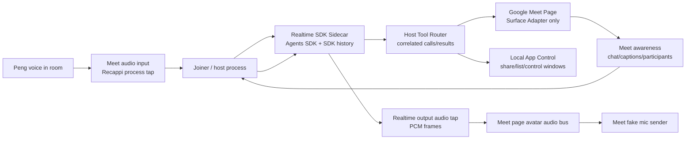

# RFC: Realtime SDK Sidecar for Google Meet

Date: 2026-06-01
Status: implementation checkpoint v0.6
Owner: @劲霸仁波切
Implementation driver: local Codex session

## Summary

Move the OpenAI Realtime Agents SDK out of the Google Meet page.

The Google Meet page should be a **Meet Surface Adapter** only: it owns Meet DOM
observation, Meet chat/caption access, screen-share controls, fake mic/camera
publication, and avatar rendering. The Realtime Agents SDK should run in a
host-owned **Realtime SDK Sidecar** page with a controlled origin and explicit
ports back to the Meet surface.

This is not just cleanup. A live failure showed that injecting the SDK into
`meet.google.com` can let raw Realtime messages arrive while SDK event parsing
breaks under Meet's page restrictions. That creates the worst failure mode for a
live assistant: the avatar can verbally claim "sharing is in progress" while no
real `list_shareable_windows` / `share_existing_app_window` tool call exists.

The target architecture makes that failure mechanically visible and eventually
impossible:

- no Agents SDK bundle executes in the Meet page;
- SDK history and tool telemetry are collected from the sidecar;
- all Meet-local effects go through a narrow host-routed surface port;
- benchmarks replay the same sidecar path as live joins, not a lower-level text
  selection shortcut.

## Document Map

This RFC is split for progressive disclosure. Start here, then open only the
document needed for the current job.

| Need                        | Read                                                                       |
| --------------------------- | -------------------------------------------------------------------------- |
| Implement the migration     | [Execution Todo](./realtime-sdk-sidecar/execution-todo.md)                 |
| Wire the runtime interfaces | [Runtime Ports](./realtime-sdk-sidecar/runtime-ports.md)                   |
| Define red/green gates      | [Benchmark and Acceptance](./realtime-sdk-sidecar/benchmark-acceptance.md) |
| Migrate voice I/O           | [Audio Bridge](./realtime-sdk-sidecar/audio-bridge.md)                     |

Follow-up RFCs from the KWWK Computer Use hardening pass:

| Question                                                               | Read                                                                                     |
| ---------------------------------------------------------------------- | ---------------------------------------------------------------------------------------- |
| How should `kwwk_computer_use` turn natural instructions into actions? | [KWWK CU Internal Action Planner](./kwwk-cu-action-planner-rfc-2026-06-02.md)            |
| How should KWWK actions show a meeting-visible cursor?                 | [KWWK CU Meeting-Visible Cursor](./kwwk-cu-visible-cursor-rfc-2026-06-02.md)             |
| Which benchmark proves which Realtime/KWWK layer?                      | [Realtime/KWWK CU Benchmark Gates](./realtime-kwwk-cu-benchmark-gates-rfc-2026-06-02.md) |

If a future implementer only has ten minutes, they should read this file plus
the execution todo. If they are debugging a failure, they should jump straight
to benchmark and acceptance.

## Decision Snapshot

- Target architecture: Realtime SDK sidecar plus Google Meet surface adapter.
- Rollout state: sidecar is now the default for `agents-sdk + google_meet`
  because inline SDK on `meet.google.com` is unsafe. The 2026-06-02 real-room
  combined gate using `https://meet.google.com/ypw-fozb-anz` now proves sidecar
  placement, Recappi input, model turns, KWWK app-control tool telemetry,
  screen share, sidecar output audio routing, and live Meet fake-mic sender
  deltas in one acceptance artifact:
  `/tmp/oneesama-realtime-live-sidecar-user-meet-after-surface-output-hook.json`.
- Cleanup decision: inline SDK-on-Google-Meet has been removed from the live
  join path; Go, TS, and `oneesama-live.sh meeting-agent` reject
  `realtime_runtime_placement=inline` even if stale emergency override env is
  present. Generic non-Meet inline SDK adapter tests remain only as diagnostic
  coverage for the lower-level browser bridge.
- Main failure to prevent: assistant progress text without a correlated
  share/list/control tool call in the same turn.
- Benchmark standard: replay the live join runtime placement, including SDK
  history and tool telemetry, not just text-to-tool selection.
- Current benchmark state: sidecar-control recall and lane coverage require
  perfect recall and pass with retries disabled. Any `BAD` row now fails the
  benchmark, and benchmark-only high-confidence direct routing removes model
  silence/noise from the simple foreground/lane checks while leaving ordinary
  Realtime text turns model-driven. The strict combined live gate now also
  passes against the user-provided real Meet URL.

## Problem

The current live path overloads the Google Meet page with unrelated
responsibilities:

- join Meet and control Meet DOM;
- render and publish avatar video/audio;
- observe captions, chat, participants, and active speaker state;
- capture/process meeting audio;
- load the OpenAI Realtime Agents SDK;
- own Realtime turn formation, SDK history, tool calls, and function outputs;
- execute tools that may touch either Meet DOM or local host APIs.

This made the first walking skeleton fast, but it puts the most complex runtime
inside the least trustworthy page:

- `meet.google.com` has CSP / Trusted Types constraints that are not under our
  control.
- Third-party SDK internals can depend on page capabilities such as dynamic code
  generation.
- SDK failure can be partially hidden because raw datachannel events still
  arrive.
- The same page-level bridge owns both "what the model did" and "what Meet DOM
  did", so diagnostics can accidentally look at the wrong layer.
- Benchmarks can pass by testing "given text, choose a tool" while live joins
  fail at "voice turn enters SDK history and emits a real tool call".

The old hotfix that patched SDK/Zod into jitless mode is no longer a Google
Meet join fallback. Keep it only as lower-level diagnostic coverage for generic
inline adapter tests.

## Decision

Create a first-class **Realtime SDK Sidecar** for Google Meet sessions.

Hard rule: the production Google Meet page must not load
`@openai/agents-realtime`, `OpenAIAgentsRealtime`, or the SDK UMD bundle.

The Meet page keeps only surface responsibilities:

- Meet join, admission, prompts, captions, chat, participants, active speaker;
- screen-share/app-share controls that require Meet or browser state;
- avatar canvas, camera track, and avatar audio bus;
- fake mic/camera publication into Meet;
- compact surface diagnostics.

The sidecar owns Realtime responsibilities:

- OpenAI Realtime Agents SDK connection;
- SDK session history and model turn observation;
- function-call event parsing;
- tool-call telemetry;
- function-call-output delivery;
- Realtime reconnect/recovery;
- Realtime input/output audio framing;
- benchmark-visible runtime state.

The host process owns cross-page authority:

- create both pages in the same browser context;
- install different init scripts into the Meet page and sidecar page;
- expose narrow bindings between sidecar and Meet page;
- correlate every tool call, tool result, text turn, audio route, and failure.

## Non-Goals

- Do not switch Realtime input from Recappi to receiver/WebRTC track as part of
  this refactor.
- Do not tune VAD or prompt wording as the main fix.
- Do not use Google Meet captions as the source of truth for Realtime turn
  formation.
- Do not keep patching SDK internals as the long-term answer.
- Do not make the sidecar a generic browser automation surface.
- Do not let the sidecar directly query or mutate Meet DOM.
- Do not make benchmarks pass by checking raw speech/datachannel counters alone.

## Required Invariants

- Meet page init scripts contain no Agents SDK bundle.
- Sidecar page is the only browser page that may contain the Agents SDK.
- Share-intent replay must fail if the assistant says it is working but the same
  turn has no real share/list/control tool call.
- Diagnostics must report SDK history, model turn observed state, sidecar
  inbound events, tool wrapper telemetry, app-control jobs, and avatar output
  energy separately.
- Tool calls must have a correlation id from model call through tool result and
  `function_call_output`.
- Host raw Realtime event injection must stay control-only; user/model turns go
  through typed APIs such as `/realtime/text-turn`.
- Fake-execution recovery must not auto-mask acceptance failures. Automatic
  functional-tool follow-up recovery is removed; fake execution stays a hard
  failure and may only be inspected through diagnostics/benchmarks.
- Meet DOM tools must execute on the Meet page through a host-mediated port.
- Local app-control tools must execute through the existing local HTTP/control
  path, not through arbitrary browser page code.
- Realtime output audio must reach the Meet page avatar audio bus without a
  local speaker sink.
- Foreground tool outputs sent back to the model must be compact envelopes.
  Full Meet DOM inventories, `join/status` runtime blobs, screenshots, and
  app-control executor traces stay in diagnostics/artifacts, not SDK history.
- In sidecar mode, the Meet surface page must not receive the internal tool
  callback token and must reject local screen/app-share tools such as
  `list_shareable_windows` / `share_existing_app_window`.

## Acceptance Summary

The full gates live in
[Benchmark and Acceptance](./realtime-sdk-sidecar/benchmark-acceptance.md). The
short version:

- Meet page has no Agents SDK global or bundle marker.
- Exactly one sidecar page owns SDK history, model turn observation, and
  tool-call telemetry.
- Given Peng says "分享/共享 Chrome 窗口", the same model turn records a real
  `list_shareable_windows`, `share_existing_app_window`, or
  `control_shared_app_window` tool call.
- Assistant progress text without a correlated share/list/control tool call is
  a hard failure.
- Recappi remains the live input source; receiver/WebRTC track capture remains
  diagnostic-only.
- Sidecar output audio reaches the Meet avatar audio bus and the Meet fake-mic
  sender publishes a live avatar-bus clone with bytes/packets deltas.
- A post-hardening real-room app-control rerun now proves KWWK provider
  telemetry, function-output delivery, the Meet-page SDK negative probe, and
  exactly one sidecar SDK-owner page.

## Operational Notes

- The live restart runbook remains:
  `scripts/oneesama-live-screen.sh --restart meeting-agent`.
- 2026-06-01 checkpoint: the runbook restarted `meeting-agent` with sidecar
  default preflight and pid env validation twice during hardening; see
  [Benchmark and Acceptance](./realtime-sdk-sidecar/benchmark-acceptance.md) for
  artifact paths.
- `join/status` should show the active Meet page, active Realtime sidecar page,
  sidecar page count, sidecar SDK-owner page count, SDK session id, SDK history
  tail timestamp, last user turn, last assistant text, last tool call, and
  fake-execution verdict.
- Deep traces remain artifact/log-only; foreground meeting responses should not
  expose raw stack traces, prompts, or SDK internals.
- Live incident note: session `session_904489e8` proved the sidecar share/output
  path, then exposed a second bug where `control_shared_app_window` received a
  roughly 236k-character app-control task because full `/join/status` was copied
  into `currentShareStatus`. The fix compacts app-control target status, reports
  timeout as `app_control_timeout`, and makes benchmarks fail terminal
  app-control statuses instead of treating queued delivery as success.
- Benchmark repair note: the post-tool-change sidecar benchmarks initially
  failed because SDK local-tool returns were not recorded as
  `function_call_output` delivery evidence, and because high-confidence
  background-status / GitHub lookup text turns could still speak progress text
  without the matching tool call. The SDK path now records
  `agents_sdk_execute_return`, and manual text turns force `worker_status` or
  `delegate_to_worker` for those narrow lane intents. The manual text-turn
  fake-execution fallback also counts workspace-tool calls, so real
  `control_shared_app_window` calls are not misclassified as progress text
  without a matching functional tool when SDK history is incomplete.
- Worker-result evidence repair note: suppressed worker results were previously
  too easy to confuse with delivered Realtime evidence. `/worker/report`,
  sidecar worker polling, and the Go worker-report path now require current
  meeting session provenance before delivery; session-missing,
  session-mismatch, and no-action results are recorded as
  `realtimeSuppressed`, not `deliveredToRealtime`. DOM
  `meeting-avatar-worker-result` events remain diagnostic-only even when a
  fixture explicitly enables them; they no longer update HUD state or call
  `injectWorkerResult`.
- Benchmark runner repair note: the first strict recall rerun after this fix
  exposed an opaque sidecar `page.waitForFunction` timeout before state capture
  on `generic_window_share_zh`. The runner now waits for sidecar client API
  readiness, records SDK-connect jitter as evidence, and still fails true
  silent/no-SDK rows as `sidecar_sdk_not_connected`; the rerun passed full and
  share/control-only recall with no retries.
- Control-port exposure note: the TS meeting-agent control API now binds to
  `MAB_MEETING_HOST` and defaults to `127.0.0.1`, so local Realtime/CU control
  endpoints are not exposed to the LAN unless a live run explicitly opts into a
  wider host binding.
- Tool-surface cleanup note: the TS meeting-agent `/realtime/config` endpoint
  now uses the live-safe Google Meet tool surface for both top-level `tools` and
  nested `session.tools`; raw TS and Go `buildRealtimeSessionConfig()` defaults
  to the same live-safe surface, while browser/demo-surface tools require
  explicit opt-in by passing the full schema or setting the demo-surface
  Realtime exposure gate. Enabling the demo-surface bridge by itself no longer
  exposes `open_shared_browser_surface` / `control_shared_browser_surface` to
  the foreground model or `/tools` routes. The deprecated backend route names
  `start_demo_surface` / `start_demo_execution` / `control_demo_surface` /
  `cancel_demo_surface` now reject with `deprecated_demo_surface_tool`, even
  when browser-surface tools are explicitly exposed, so old clients cannot
  bypass the current schema through older names. The browser helper posts the
  current schema names directly. The foreground prompt only mentions generated
  browser/workspace routing when those tools are actually present. Join
  metadata now hashes the actual exposed tool surface, not merely whether the
  demo bridge exists.
- HUD cleanup note: Realtime connection/audio/speaking diagnostic cells no
  longer draw low-value states such as `连接中`, `没音频`, `没开口`, or `没出声`.
  HUD stays useful for tool activity, completion, and blockers instead of
  restating audio that the room can already hear. The avatar playground
  regression now waits for the listening HUD cell and painted canvas pixels
  before asserting visual coverage, so HUD cleanup no longer creates a false
  negative by snapshotting before the render frame lands.
- App-control tool-shape note: `control_shared_app_window` remains the
  compatible foreground app-control entry, but the Realtime tool schema no
  longer exposes low-level `operations` primitives. Foreground turns provide a
  natural-language `instruction` and `executionMode`; KWWK/direct or
  Codex/delegate owns observe/plan/act/verify. The KWWK helper accepts
  instruction-only direct requests for bounded observe/key/type/scroll actions
  and returns an explicit blocker when the instruction needs delegate/Codex.
  The browser local-tool boundary strips stale top-level and
  `context.operations` arguments before dry-run simulation or host POST; the Go
  `/tools/control_shared_app_window` handler strips the same stale primitives,
  and the KWWK helper no longer reads operations from either `context` or
  top-level helper params. The Go endpoint also rejects the hidden `standalone`
  flag, so app-control cannot skip the active meeting/share gate through an
  unexposed parameter. Old prompts cannot bypass the schema cleanup. The
  optional live-routing smoke no longer contains the old "generate direct
  operations after state" assertion, so the benchmark contract also matches the
  instruction-only foreground schema. Queued app-control jobs now create the
  worker report before publishing a terminal job status, so polling a terminal
  status cannot race ahead of the evidence event.
- Custom-event cleanup note: production-like Meet surfaces no longer accept
  `meeting-avatar-participant-audio-stream` as an implicit participant audio
  source. The event path is fixture/mock opt-in; non-Google fixture joins set the
  opt-in explicitly, and the stale `allowParticipantAudioStreamRegistration`
  flag no longer opens the path. Google Meet pages also ignore the stale
  `allowGenericMediaElementAudioDiscovery` override, so arbitrary page media
  elements cannot become Realtime input. Real Meet evidence must come from the
  owned host audio/Recappi path and observed mixer energy.
- Worker-result/input gate cleanup note: sidecar worker-result polling no longer
  runs on the Meet surface. The sidecar page owns polling, polls with
  `markDelivered: false`, and only calls `/worker/mark-realtime-delivered` with
  the server-issued delivery token after Realtime client injection succeeds.
  The bridge now sends the sidecar `toolCallbackToken` as
  `X-Oneesama-Internal-Key` on both poll and ack requests, so guarded host
  worker endpoints accept cross-port sidecar delivery. The TS meeting-agent
  route surface now also matches the sidecar local Meet router:
  `/screen-share/apps` and `/screen-share/app` forward to the joiner share APIs,
  and `/tools/control_shared_app_window` is handled before workspace-tool
  fallback so it cannot degrade to `unknown_workspace_tool`. TS direct
  app-control now follows the same non-blocking foreground contract: it queues a
  KWWK job by default, writes terminal evidence into `worker_reports`, and
  leaves `wait:true` as the explicit synchronous diagnostic path. TS helper
  output is compacted before direct responses and queued reports, so raw KWWK
  `metadata`, primitive `operations`, nested helper `result`, and long
  `responseText` cannot leak back into foreground model-visible output. The
  browser local workspace-tool boundary also injects the current `session_id`
  into app-control host POSTs when the model omitted it, preserving meeting
  provenance before the queued worker report is created.
  The Meet-surface placeholder no longer carries sidecar SDK-owned `tools`,
  `session`, `instructions`, OpenAI endpoint fields, worker URLs, or current-user
  context; the Google Meet page keeps only the DOM-tool and audio-forwarding
  config it needs.
  Real-room input gates only accept `recappi_process_audio_tap`;
  `host_meet_audio_pcm` and `meet_audio_mix` remain fixture/diagnostic evidence.
- Config cleanup note: the Go host config validator now accepts only
  `openai.realtime_runtime_placement=sidecar`. The lower-level browser init
  builder can still build inline mode for non-Meet diagnostics only when
  `allowInlineAgentsSDKDiagnostic` is explicit; host/live config no longer keeps
  inline as a valid runtime placement. Go config validation also rejects
  `demo_surface.expose_realtime_tools=true` when the demo-surface adapter is
  `fake`; exposed browser/CU tools must use `demo_surface.mode=safe` or an
  explicit real adapter such as `agent_browser` / `codex`, so Realtime cannot
  report fake demo-surface execution as a live tool path.
- Live app-control benchmark note: `benchmark:realtime-real-app-control` and
  `acceptance:realtime-real-app-control` are strict live gates and fail hard
  when no discoverable real Meet URL exists. With a real URL, the harness drives
  app-control through `/realtime/text-turn` and requires sidecar tool telemetry,
  function-output delivery, the Meet-page SDK negative probe, exactly one active
  sidecar SDK-owner page, matching `/join/status.activeSessionId`, and a
  terminal compact app-control result: success, or `blocked` / `failed` with a
  compact explicit blocker.
  `acceptance:realtime-live-sidecar` is the stricter combined live gate: it runs
  the real-room synthetic-speaker/fake-mic sender gate and the real-room
  app-control gate, and passes only when both report explicit
  `acceptanceSatisfied:true` and both child gate processes exit 0. Malformed
  child evidence becomes a structured `invalid_json` failure, and child gate
  runtime/IO failures become structured `gate_error` failures. Missing-URL
  `skipped` evidence is diagnostic-only, reports `ok:false`,
  `diagnosticOnly:true`, and `acceptanceSatisfied:false`, and is available only
  through explicit `:optional` commands such as
  `benchmark:realtime-real-app-control:optional`.

## Known Risks

- The output audio bridge is the only non-trivial media migration. Browser
  pages cannot safely share `MediaStreamTrack` identity as the primary contract,
  so the design uses PCM chunks into the existing Meet avatar audio bus.
- PCM bridging may add latency. The acceptance target should be "natural enough
  for live meeting response" rather than sample-perfect output.
- Real-room share and voice/output evidence now passes the strict combined
  gate. Remaining risk is operational flake in public Meet admission/guest
  redirects, so live reruns should keep using the strict artifacts rather than
  treating optional skipped diagnostics as green.
- The current jitless SDK patch can hide the urgency of this refactor if it is
  treated as a Meet fallback again. Keep it out of Google Meet join paths.
