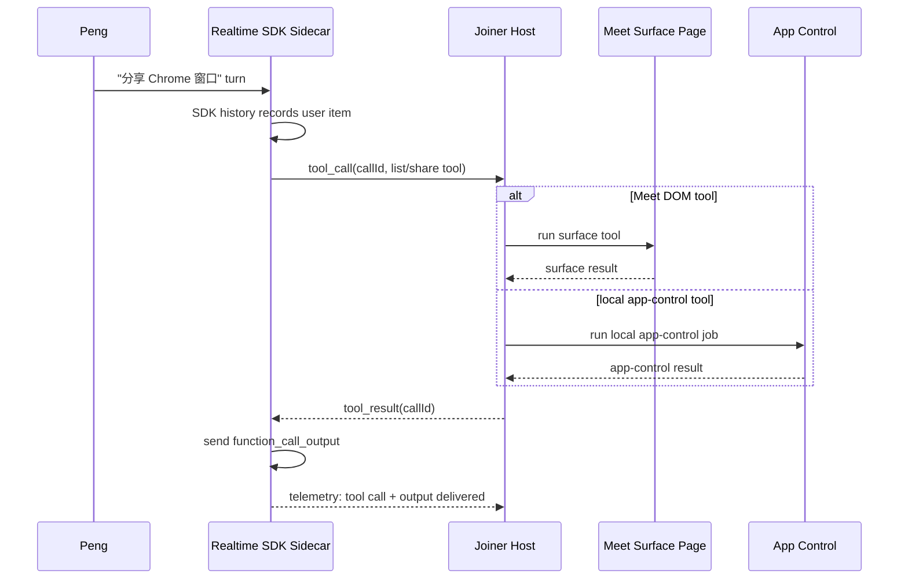

# Realtime SDK Sidecar Runtime Ports

Parent RFC:
[Realtime SDK Sidecar for Google Meet](../realtime-sdk-sidecar-rfc-2026-06-01.md)

These ports are conceptual contracts. The first implementation can keep them as
small helper functions before extracting formal modules.

## Runtime Ownership

- Meet page: Meet Surface Adapter only.
- Sidecar page: Realtime Agents SDK, SDK history, model turn observation, and
  tool-call telemetry.
- Host process: creates both pages, routes tool calls, routes awareness, and
  correlates events across pages.

## `RealtimeControlPort`

Host to sidecar:

- `connect(sessionConfig)`
- `disconnect(reason)`
- `sendRealtimeControlEvent(event)` for a small allowlist of control events
  only (currently cancel/clear); there is no public raw
  `sendRealtimeEvent(...)` browser port.
- User/model turns must use `requestTextTurn(...)` or another typed host API
  instead of raw event injection.
- `requestTextTurn({ text, instructions })`
- `pushMeetingAwareness(snapshot)`

Sidecar to host:

- SDK history tail;
- model turn observed events;
- response text/audio state;
- function call started/done;
- runtime failure reasons.

## `RealtimeInputAudioPort`

Host to sidecar:

- Recappi process-tap audio chunks;
- sample rate, channel count, chunk timing, energy stats;
- selected input source metadata.

Rules:

- Recappi remains the live input source until a separate investigation proves a
  better source.
- Receiver/WebRTC track capture may remain diagnostic-only.
- Input evidence must distinguish "audio energy exists" from "SDK formed a user
  turn".

## `RealtimeOutputAudioPort`

Sidecar to Meet page:

- Realtime response audio frames converted to small PCM chunks;
- output track/energy diagnostics;
- end-of-utterance markers for lip-sync and route health.

Meet page:

- adds an explicit `MAB_AVATAR_AUDIO_BUS.enqueuePcmFrames(...)`-style API;
- routes PCM into the existing avatar audio bus;
- publishes the bus track into Meet through the existing fake mic sender;
- never creates an audible local speaker sink for Realtime output.

This avoids trying to transfer `MediaStreamTrack` objects across isolated pages.
The sidecar may still decode the SDK remote audio track internally, but the
cross-page contract is PCM frames plus metadata, not browser track identity.

## `SurfaceToolPort`

Sidecar to host:

- `{ callId, name, arguments, responseId }`

Host routes by capability:

- Meet DOM capability -> evaluate on the Meet page surface adapter;
- local app/window capability -> existing local app-control HTTP/tool wrapper;
- shared browser/workspace capability -> existing shared-surface runtime;
- unknown capability -> structured tool error and no user-visible success claim.
- If the host surface port is missing, sidecar Meet DOM/chat tools fail closed;
  the sidecar page must not probe its own DOM or fixture state as a fallback.
- The Realtime sidecar page must not install a Meet chat DOM observer. Meet
  chat enters Realtime through the Meet surface port, host-pushed context, or an
  explicit typed tool/turn path, not by scanning the sidecar document.

Host to sidecar:

- `{ callId, ok, result | error }`
- sidecar sends `function_call_output` only after this result is recorded.
- `result` is a compact, model-visible envelope. Full DOM inventories,
  `join/status` runtime, screenshots, app-control executor traces, and raw
  diagnostic blobs stay in artifact logs.

## Tool Execution Path

The assistant may only say "sharing is in progress" after a real tool call has
started or completed. A text-only claim without a correlated tool call is a hard
failure.
