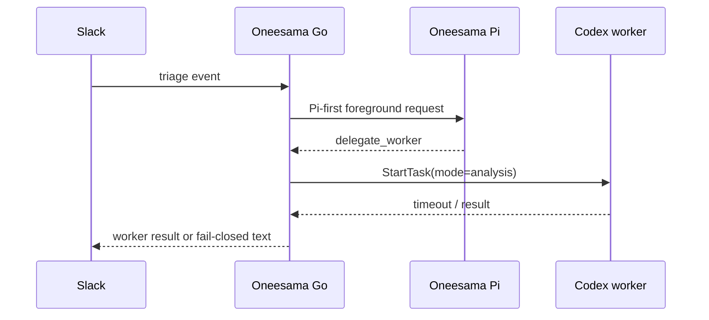

# Secretary Routing Delegation RFC

Status: accepted for task #283 implementation.

## Problem

Oneesama is the Slack foreground secretary for the workspace. It should
notice, summarize, route, remember, and coordinate. It should not silently
become the default code investigator for every project mentioned in Slack.

The incident that triggered this RFC was `job_7ea2ce33`: Pi saw a staging
performance complaint, chose `delegate_worker`, and started a Codex job whose
task was to investigate staging deployments, database query performance, and API
latency. The worker timed out after 10 minutes. The timeout text is now
fail-closed, but the deeper bug is scope: Oneesama should have acted like a
secretary, not like the owner of that project.

## Current Chain

The chain is correct for in-scope delegated work. The failure is that Pi's
delegation boundary is too broad.

## Product Boundary

Oneesama's default role is:

- read the Slack situation;
- connect it to workspace Memory and thread context;
- produce a short routing reply when useful;
- create or suggest follow-up work when the workspace has a route for it;
- delegate only narrow secretary-owned work.

Oneesama is not the default owner for:

- arbitrary project code investigation;
- staging / production / deploy / infra / database / latency debugging;
- open-ended performance investigations;
- fixing bugs or writing code in another project;
- CI failure diagnosis unless explicitly asked to act as the code worker.

## In-Scope Delegation

`delegate_worker` is allowed when the worker task is bounded and secretary-like:

- workspace Memory lookup or synthesis;
- file / document / thread retrieval needed for a reply;
- Canvas edit / publish work;
- memo / issue / follow-up preparation;
- Oneesama's own runtime, Slack, meeting, Memory, or deployment code;
- an explicitly human-authorized code task.

Worker prompts should carry `context.delegation_scope` when possible:

- `oneesama_system`
- `oneesama_code`
- `secretary_lookup`
- `explicit_human_authorized_code`

## Out-of-Scope Delegation

If a worker request looks like external project debugging, Oneesama must not
start Codex just because Pi asked. It should downgrade to secretary routing:

- `reply`: "I see this looks like a project owner issue; I can summarize and
  route it, but I will not investigate code by default."
- `stay_silent`: if the thread is already handled or no useful secretary reply
  is needed.

Blocking markers include broad code/ops investigation terms such as staging,
production, deploy, infra, database, API latency, CI failure, debug, fix,
regression, and incident when they do not also refer to Oneesama's own system.

## Implementation Plan

- Update the Pi system prompt so `delegate_worker` is explicitly secretary
  scoped, not "any tool/code inspection".
- Add a `delegation_scope_policy` context item to Pi requests.
- Add Go-side hard guard before `agent_runner.StartTask`:
  - allow explicit safe scopes;
  - allow Oneesama-system code references;
  - block external project code/ops investigation markers;
  - record `delegate_worker_blocked_scope` in triage tool calls.
- If Pi only returned an out-of-scope `delegate_worker`, downgrade to a safe
  secretary reply instead of launching the worker.
- Add canaries:
  - the #279 staging perf case must not start a worker;
  - existing secretary-like app mention worker cases remain in scope.

## Acceptance Gates

- Automatic triage of a staging/perf/deploy/latency investigation does not call
  `agent_runner.StartTask` unless the task is explicitly about Oneesama or
  explicitly human-authorized.
- Triage metadata records `delegate_worker_scope_blocks > 0` for blocked cases.
- In-scope memory lookup / memo / synthesis worker cases remain allowed.
- Full tests, cueboard parity tests, build, CI, and live monitor pass.

