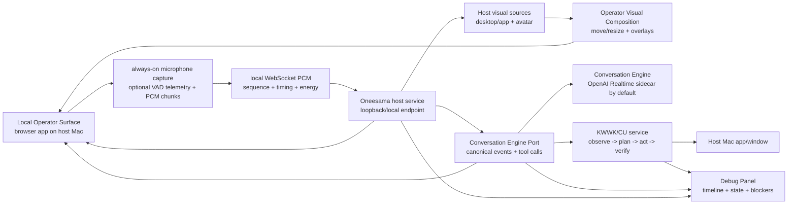

# RFC: Single-Machine Operator Surface Acceptance Lane

Date: 2026-06-05
Updated: 2026-06-06
Status: implemented for automated local acceptance; human-device real-mic gates blocked by host audio input
Owner: @劲霸仁波切
Implementation driver: local Codex session

Related ADRs:

- [Conversation Engine Port owns provider-neutral conversation events](../../docs/adr/0001-conversation-engine-port.md)
- [Operator visual composition produces the shareable video track](../../docs/adr/0002-operator-side-visual-composition.md)

## Verification Snapshot

Verified on 2026-06-06 from the host Mac:

- [x] `vp run dev:local-operator` starts on `http://127.0.0.1:18913/operator`
      with `bindMode:"loopback"` and no trusted-LAN opt-in.
- [x] `vp run acceptance:realtime-local-voice`
- [x] `vp run preflight:realtime-local-real-mic`
- [ ] `vp run acceptance:realtime-local-voice:real-mic`
- [ ] `vp run acceptance:realtime-local-kwwk-action:real-mic`
- [x] `vp run acceptance:realtime-local-host-visual-stream`
- [x] `vp run acceptance:realtime-local-host-visual-stream:display:native`
- [x] `vp run benchmark:realtime-local-tool-routing`
- [x] `vp run benchmark:realtime-local-kwwk-action`
- [x] `vp run benchmark:realtime-local-debug-panel`
- [x] `vp run benchmark:realtime-local-slo-suite`
- [x] `vp run acceptance:realtime-local-openai-live`
- [x] `vp run acceptance:realtime-local-openai-voice-live`
- [x] `vp run acceptance:realtime-local-openai-tool-live`
- [ ] `vp run acceptance:realtime-local-rfc:audit`

The strict RFC audit now expects 12 artifacts. The latest run wrote
`/tmp/oneesama-realtime-local-rfc-acceptance-audit-latest.json` with
`ok:false`, `passed:10`, `failed:2`, and `missing:0`. Both failing
human-device gates report `real_microphone_input_energy_below_threshold`. The
audit now copies selected microphone label, browser-visible input labels,
maximum observed input energy, threshold, and recovery commands with
`MAB_LAN_OPERATOR_MIC_LABEL` / `MAB_LAN_OPERATOR_MIC_DEVICE_ID` into
`requiredFailures[].failureDetail` and `nextActions[]`.

Current host-audio finding: headed Chromium and `system_profiler SPAudioDataType`
only expose Steam virtual input devices on this Mac. The fast preflight
`/tmp/oneesama-realtime-local-real-mic-preflight-latest.json` reports
`ok:false`, `blocker:"macos_no_real_microphone_input"`, system default input
`Steam Streaming Microphone`, and browser selected input
`Default - Steam Streaming Microphone (Virtual)`. The latest real-mic voice
artifact selected `Default - Steam Streaming Microphone (Virtual)` and measured
`audio.maxInputEnergy:0.0046` below the `0.02` threshold. The latest spoken
KWWK real-mic artifact measured `spokenInput.maxInputEnergy:0`. This blocks
human-device acceptance until a real microphone is connected/routed to Chromium
or the system default input is changed to a real device.

The automated voice gates use Chromium fake microphone input or PCM replay.
They prove the Local Operator audio path, always-on voice transport, provider
voice ingress, output evidence, and timing SLOs. The strict real-device gate is
implemented as `acceptance:realtime-local-voice:real-mic`; it opens `/operator`,
does not pass Chromium fake-media flags, and requires
`operator_voice_real_microphone_energy_observed`. A manual pass of that gate
remains the human-device no-tool chat check.

The spoken app-control human-device gate is implemented as
`acceptance:realtime-local-kwwk-action:real-mic`; it opens `/operator`, waits
for real microphone energy before routing the bounded command, executes the
same host KWWK/TextEdit fixture, and requires
`spoken_app_control_real_microphone_observed`, verified host mutation, visible
KWWK progress, and compact assistant follow-up.

## Summary

This RFC resets the acceptance logic for Oneesama Realtime/KWWK voice control.

The new primary acceptance lane is the **Single-Machine Operator Acceptance
Lane**:

- Peng operates from the same host Mac that runs Oneesama.
- The **Local Operator Surface** is a browser web app opened on that machine.
- The surface captures operator voice locally and sends it to the host service
  through the configured Conversation Engine Port.
- Oneesama returns text, audio, host visual context, KWWK progress, and debug
  telemetry to the same surface.
- KWWK/CU executes on the same host Mac against the selected app/window.

This is a product-scope reset. The first accepted product state is a fast,
observable, single-machine loop that can be run during local development without
remote-device reachability as a prerequisite.

The system is accepted only when the user can see and hear what is happening,
debug failures in one panel, and perform simple voice-driven app actions with
low perceived latency on the same machine.

## User Requirements

### Product Requirements

- [x] Peng can open a local browser Operator Surface on the host Mac.
- [x] The Local Operator Surface is a real web app, not just a transport client
      or diagnostics page.
- [x] V1 defaults to loopback/local-host operation. Binding beyond loopback is a
      diagnostic option, not the acceptance path.
- [ ] The operator can speak directly to Oneesama from that web app.
- [x] Voice mode defaults to Always-On Operator Voice because the product path
      is a realtime Conversation Engine, not a manual record/submit loop.
- [x] Oneesama responds through the Local Operator Surface with low perceived
      latency.
- [x] The Local Operator Surface can show host visual context: selected
      desktop/app preview and avatar video.
- [x] The Local Operator Surface owns Operator Visual Composition so sources,
      KWWK overlays, and the Debug Panel can be moved and resized locally.
- [x] The Local Operator Surface creates a local Operator Composed Video Track
      from that composition for future recording/export without changing host
      capture.
- [x] V1 does not stream any separate operator-computer screen back to Oneesama
      because the primary path runs on one machine.
- [ ] Simple spoken app-control commands can mutate the host Mac's active
      selected app/window through KWWK/CU.
- [x] KWWK/CU progress is visible while an action is happening.
- [x] If Oneesama is listening, thinking, blocked, acting, speaking, or silent,
      the operator can see that state immediately.
- [x] If a command fails, the operator can see the failing layer and blocker
      without digging through large logs.

### Pain Observed During Integration

- [x] Feedback is insufficient: KWWK/CU can be running or blocked while the user
      sees little useful progress.
- [x] KWWK feels slow even when it eventually returns a result.
- [x] Chat responsiveness feels broken: the user speaks, but Oneesama often
      appears to ignore them.
- [x] Current benchmark results do not match perceived UX quality.
- [x] Current logs are too hard to inspect during live debugging.
- [x] Old remote-device paths added latency and ambiguity that masked whether
      the core voice/control loop was good.

## Decision Snapshot

- [x] Make single-machine local operation the primary acceptance lane.
- [x] Treat the first-class surface as the Local Operator Surface: a complete web
      app for voice, host visual context, and debugging.
- [x] Keep the Conversation Engine replaceable. OpenAI Realtime/Agents sidecar
      is the V1 default implementation, not the product boundary.
- [x] Put a stable Conversation Engine Port between surfaces/tools/debugging and
      provider-specific engines.
- [x] Surface adapters, KWWK, and the Debug Panel consume Canonical Conversation
      Events, not provider raw events.
- [x] Use WebSocket PCM chunks for V1 Operator Voice Input because stability and
      observability are more important than media-stack cleverness in the first
      cut.
- [x] Default to Always-On Operator Voice: when the session is armed, the Local
      Operator Surface continuously streams audio and the Conversation Engine
      owns speech detection, turn formation, and interruption.
- [x] Keep push-to-talk/tap-to-talk only as an explicit diagnostic fallback, not
      as the primary acceptance path.
- [x] Make Local Voice Activity Telemetry optional. It can improve operator
      confidence and debug evidence, but it must not be required when the
      Conversation Engine provides its own speech detection.
- [x] Host visual context may use WebRTC video internally, native capture, or a
      local browser canvas path, but acceptance is about the single-machine user
      loop and observable visual context, not cross-machine transport.
- [x] Treat position, size, focus, and overlay state as operator-side layout
      state.
- [x] Treat the local Operator Composed Video Track as a first-class debugged
      output: track id, ready state, canvas size, target fps, and recent frame
      age must be visible.
- [x] Do not require a single host-side baked composite video track in V1.
- [x] Keep KWWK/CU as the host-side app execution plane.
- [x] Require a high-information Debug Panel for acceptance.
- [x] Require Debug Report Artifacts for live debugging and acceptance review:
      copyable diagnostics JSON, downloadable report JSON, and operator marks
      for interesting runs.
- [x] Measure perceived UX milestones, not only whether a benchmark eventually
      produced `ok:true`.
- [x] Remove non-local surface compatibility from this RFC. Any future
      non-local surface work must live in a separate RFC or release note.

## Proposed Architecture

### Runtime Shape

- [x] Add a local operator surface URL, for example
      `http://127.0.0.1:<port>/operator`.
- [x] The Local Operator Surface captures microphone input in the browser while
      the voice session is armed.
- [x] The default voice mode is Always-On Operator Voice.
- [x] The Local Operator Surface streams Operator Voice Input as WebSocket PCM
      chunks in V1.
- [x] Each audio chunk carries session id, sequence number, monotonic timestamp,
      sample rate, channel count, chunk duration, and energy metadata.
- [x] The audio path has an explicit backpressure/drop policy, and dropped
      chunks are visible in telemetry.
- [x] Reconnect must not corrupt the active Realtime session or silently mix
      stale audio into a new turn.
- [x] The Conversation Engine, not local button release, owns speech detection
      and turn formation.
- [x] Local Voice Activity Telemetry is optional. When present, it is UI/debug
      evidence and may support safety gating, but it must not turn the primary
      path into push-to-talk.
- [x] The host forwards audio into the same input-audio port used by the
      configured Conversation Engine.
- [x] OpenAI Realtime/Agents sidecar is the default V1 Conversation Engine
      implementation.
- [x] The Conversation Engine returns assistant text/audio events, tool state,
      interruption events, and turn telemetry through the Conversation Engine
      Port.
- [x] Provider-specific events stay inside the provider adapter unless exposed
      as drill-down debug data.
- [x] The surface shows host visual sources from the same machine: selected
      app/desktop preview and avatar video.
- [x] The Local Operator Surface owns Operator Visual Composition and can move,
      resize, hide, or foreground host visual sources without restarting the
      voice/control loop.
- [x] The Local Operator Surface creates a local composed canvas/video track
      from received sources and current operator layout.
- [x] The local composed track is not sent to another operator computer in V1.

### Surface Responsibility

- [x] Local Operator Surface owns microphone capture, playback, arm/mute
      controls, optional voice-activity UI, local audio transport, host visual
      context rendering, Operator Visual Composition, and debug rendering.
- [x] Host service owns explicit local operator lifecycle, audio ingress, host
      visual source publication, and KWWK execution access.
- [x] Conversation Engine owns turn formation, tool calls, tool result delivery,
      output audio, and interruption through a replaceable engine port.
- [x] Conversation Engine Port owns the provider-neutral event contract consumed
      by the Local Operator Surface, KWWK/tool routing, acceptance reports, and
      Debug Panel.
- [x] KWWK/CU owns observation, planner calls, action validation, execution,
      verification, cursor telemetry, and blockers.

## Conversation Engine Port Contract

The Local Operator Surface must not become coupled to provider raw event shape.
The V1 engine may be OpenAI Realtime/Agents sidecar, but the product contract is
a stable port.

### Inputs

- [x] `operator_voice_input`: WebSocket PCM chunks plus session/timing/format
      metadata.
- [x] `operator_text_input`: optional typed text/debug input.
- [x] `surface_context`: active surface kind, selected app/window, host visual
      state, and operator mode state.
- [x] `engine_control`: connect, disconnect, cancel response, clear audio
      buffer, mute/arm state changes.
- [x] `tool_result`: canonical tool result envelope returned from host/KWWK.

### Canonical Conversation Events

- [x] `engine_connected`
- [x] `engine_disconnected`
- [x] `speech_started`
- [x] `speech_stopped`
- [x] `transcript_delta`
- [x] `transcript_completed`
- [x] `assistant_text_delta`
- [x] `assistant_text_completed`
- [x] `assistant_audio_started`
- [x] `assistant_audio_chunk`
- [x] `assistant_audio_stopped`
- [x] `tool_call_started`
- [x] `tool_call_delta`
- [x] `tool_call_completed`
- [x] `tool_result_accepted`
- [x] `interrupted`
- [x] `engine_error`

### Boundary Rules

- [x] Local Operator Surface renders Canonical Conversation Events and never
      branches on provider raw event names.
- [x] KWWK receives canonical tool calls only.
- [x] Debug Panel defaults to Canonical Conversation Events.
- [x] Provider raw events are allowed only as drill-down diagnostics with
      provider/source labels.
- [x] Acceptance reports score canonical events first. Provider raw event
      presence can support diagnosis but cannot be the only proof of a turn.
- [x] Mock/diagnostic Conversation Engines must be able to emit the same
      canonical events for harnesses and failure injection.

## Debug Panel Requirements

The debug panel is part of acceptance. A run without this panel cannot be
accepted because failures remain opaque.

### Required Panels

- [x] Transport: local connection state, surface id, host URL, round-trip
      latency, reconnect count, last packet time.
- [x] Audio input: mic permission, input device, audio energy, optional local
      VAD state, armed/muted state, capture mode, chunk count, sequence gaps,
      dropped chunks, host receive lag, reconnect state.
- [x] Conversation Engine turn: engine kind, transport, session id, current
      response id, user transcript, assistant transcript, speech-start events,
      interruption/cancel state.
- [x] Conversation Engine Port: canonical event counts, latest canonical event,
      provider adapter kind, raw-event drill-down availability.
- [x] Tool routing: expected tool, actual tool, call id, parsed arguments,
      argument-safety state, and function output delivery state.
- [x] KWWK job: job id, target app/window hints, status, blocker, latest action,
      action count, cursor event count, timing fields, observe/plan/execute/
      verify phase evidence, and verification result.
- [x] Cursor/action overlay: overlay visible state is recorded in Operator
      Visual Composition and debug state.
- [x] Host visual context: source state, track/source dimensions, frame rate,
      frame age, selected source, and capture error when applicable.
- [x] Operator Visual Composition: layout state, local composed track state,
      focused source, source rectangles, avatar visible state, overlay visible
      state.
- [x] Output audio: assistant audio active/silent, output energy, playback
      destination, audio underruns, muted state.
- [x] Timeline: correlated rows for operator voice chunk arrival, speech events,
      transcript events, assistant output, tool-routing canonical events, KWWK
      progress, verification, and blockers.
- [x] Artifacts: copy diagnostics JSON, download report, mark interesting run,
      and link large artifacts instead of inlining them into small reports.
- [x] Engine controls: connect, disconnect, reconnect, cancel response, clear
      output audio, reset session.
- [x] Tool cancel: operator can request cancellation of the current tool call or
      KWWK job and deliver a cancelled tool result through the Conversation
      Engine Port.
- [x] Search/filter: the dense Debug Panel has a browser-visible filter that
      narrows sections and rows by blocker/layer/event text.

### Debug Panel Acceptance

- [x] During a good turn, the panel shows all milestones:
      heard -> transcript -> response/tool -> KWWK action -> verification ->
      assistant output.
- [x] During a bad turn, the panel names exactly one primary blocker layer:
      transport, audio input, Conversation Engine, tool routing, KWWK planner,
      KWWK execution, verification, or output audio.
- [x] The panel can be opened from the Local Operator Surface.
- [x] The panel is embedded in the Local Operator Surface.
- [x] The panel can filter dense rows during live debugging.

## Acceptance Ladder

### Gate 1: Local Voice Loop

Purpose: prove direct local speech reaches the Conversation Engine and produces
a timely assistant response inside the same-machine Operator Surface.

- [x] Start host service with Local Operator Surface enabled.
- [x] Open the Local Operator Surface on the same host Mac.
- [x] Arm Always-On Operator Voice.
- [ ] Speak a short prompt without pressing a per-utterance talk button.
- [x] Conversation Engine receives input audio from the Local Operator Surface.
- [x] Audio ingress uses WebSocket PCM chunks with sequence/timing/energy
      metadata.
- [x] Assistant text appears in the Local Operator Surface.
- [x] Assistant audio plays in the Local Operator Surface when enabled.
- [x] Host visual context is visible or explicitly disabled for the run.
- [x] Debug panel records audio chunks, local VAD when enabled, Conversation
      Engine speech-start/turn events, transcript, response, output audio
      state, and host receive lag.

### Gate 2: Host Visual Context

Purpose: prove the Local Operator Surface shows live local visual context for
the app/control loop.

- [x] Host publishes or exposes at least one host visual source.
- [x] Local Operator Surface receives or renders at least one live visual source.
- [x] The surface can show a selected host desktop/app source and avatar source.
- [x] The operator can move and resize visual sources locally without
      restarting capture or the voice/control loop.
- [x] The surface creates a local Operator Composed Video Track from the
      operator-side canvas for display and future recording/export.
- [x] Move/resize acceptance is based on user-side composition state:
      `layoutRevision` increments, `sourceRects` change, and the composed video
      track remains live.
- [x] Debug Panel shows connection/capture state, selected sources, track count,
      frame rate, frame age, composition layout, and overlay visible state.
- [x] Debug Panel shows Operator Composed Video Track id, ready state, canvas
      size, target fps, rendered frame count, and recent rendered-frame age.

### Gate 3: Local Tool Routing

Purpose: prove spoken app-control intent selects the correct host-side tool.

- [ ] Speak bounded commands such as "switch to the first tab" and "click the
      second button."
- [x] Conversation Engine selects the canonical `kwwk_computer_use` tool call.
- [x] Tool arguments contain natural-language instruction plus safe app/window
      hints.
- [x] Tool arguments do not expose raw operation arrays or coordinates.
- [x] Function output is delivered back through the Conversation Engine Port.
- [x] Debug Panel correlates user transcript, selected tool, tool args, and
      function output.

### Gate 4: Local KWWK Action

Purpose: prove direct local voice can drive verified host app mutation.

- [x] Start from a known host app/window fixture or selected real app.
- [ ] Speak one simple command.
- [x] KWWK observes the target state.
- [x] KWWK planner emits a valid bounded action plan.
- [x] KWWK executor performs the action.
- [x] Cursor/action feedback appears within the Local Operator Surface through
      Operator Visual Composition and explicit KWWK status feedback.
- [x] KWWK verifies the final state or reports a specific blocker.
- [x] Conversation Engine gives a compact follow-up response.

### Gate 5: Debuggable Failure

Purpose: prove bad runs are understandable.

- [x] Simulate or capture at least one failure in each major layer: audio input,
      Conversation Engine, tool routing, KWWK planner, KWWK execution,
      verification, output audio.
- [x] Each failure produces a specific blocker and timeline row.
- [x] The operator can copy/download a report that is small enough to inspect
      quickly.
- [x] The report links to larger artifacts only when needed.

## UX Latency SLOs

Initial SLOs should be strict enough to catch regressions but loose enough to
survive browser/device variation on the host Mac.

| Milestone                                                          | Target                           |
| ------------------------------------------------------------------ | -------------------------------- |
| First non-silent surface audio evidence after user starts speaking | p95 <= 150 ms                    |
| Host receives first useful audio chunk                             | p95 <= 100 ms after surface send |
| Conversation Engine speech-start/user-turn observed                | p95 <= 800 ms                    |
| Host visual context connected/rendered                             | p95 <= 1500 ms                   |
| Host visual frame age                                              | p95 <= 250 ms                    |
| Host visual sustained frame rate                                   | p50 >= 15 fps                    |
| Operator Visual Composition layout update after user resize/move   | p95 <= 100 ms                    |
| Assistant first text for no-tool chat                              | p95 <= 1200 ms                   |
| Tool call emitted for simple app command                           | p95 <= 1500 ms                   |
| KWWK visible feedback after tool accepted                          | p95 <= 300 ms                    |
| Warm simple app action verified                                    | p95 <= 2500 ms                   |
| Cold simple app action verified                                    | p95 <= 5000 ms                   |
| Operator sees final response after verified action                 | p95 <= 800 ms                    |

Every benchmark must report cold and warm timings separately. A single
`durationMs` is not enough.

## Benchmark Commands

Target command names for this lane:

- [x] `acceptance:realtime-local-voice`
- [x] `acceptance:realtime-local-voice:real-mic`
- [x] `acceptance:realtime-local-host-visual-stream`
- [x] `acceptance:realtime-local-kwwk-action:real-mic`
- [x] `acceptance:realtime-local-openai-voice-live`
- [x] `acceptance:realtime-local-openai-tool-live`
- [x] `benchmark:realtime-local-tool-routing`
- [x] `benchmark:realtime-local-kwwk-action`
- [x] `benchmark:realtime-local-debug-panel`
- [x] `benchmark:realtime-local-slo-suite`
- [x] Keep temporary redirects from legacy command names only until downstream
      scripts are updated; reports must use `local` lane names.

## Report Envelope

Each acceptance report should include:

- `gate`: one of `local_voice`, `local_host_visual`, `local_tool_routing`,
  `local_kwwk_action`, `local_debug_panel`, `local_slo_suite`.
- `acceptanceLane`: `single_machine_operator`.
- `host`: local surface URL, host platform, browser/channel, trusted local mode.
- `operatorSurface`: surface id, voice mode, local VAD state, selected input
  device, output audio state.
- `conversationEngine`: configured transport, engine id, canonical event counts,
  raw provider drill-down summary.
- `voice`: chunk/byte counts, sequence gaps, drops, host receive lag, ACK RTT,
  first useful audio timing.
- `visual`: source state, composition state, local composed track state, frame
  age, layout revision, overlay state.
- `tool`: expected tool, actual tool, call id, argument safety, function output
  delivery.
- `kwwk`: job id, target hints, phase evidence, actions, cursor events,
  verification, blockers, cold/warm timings.
- `debugPanel`: visible sections, filter evidence, primary blocker, artifact
  links, timeline and turn-correlation rows.
- `slo`: cold/warm sample summary and per-milestone pass/fail.

## Implementation Plan

### Phase 1: RFC Realignment

- [x] Convert the RFC to single-machine operation.
- [x] Remove non-local surface compatibility from this RFC.
- [x] Update command names, report gates, and docs to `local_*` once the current
      implementation is stable enough to rename safely.

### Phase 2: Local Operator Surface

- [x] Add and confirm `dev:local-operator` as the single-machine Local Operator
      Surface on loopback.
- [x] Make loopback binding the default acceptance path.
- [x] Keep non-loopback binding as explicit diagnostic mode only.

### Phase 3: Voice Loop

- [ ] Run strict same-machine voice acceptance with real microphone input.
- [x] Add strict real-microphone acceptance command and report/SLO evidence.
- [x] Verify always-on voice without per-utterance push-to-talk.
- [x] Verify text and audio output in the Local Operator Surface.
- [x] Record perceived UX milestones in the report.

### Phase 4: Visual Context

- [x] Prove host visual context is visible in the same-machine browser surface.
- [x] Prove avatar and selected app/window sources can be composed locally.
- [x] Prove moving/resizing sources updates only operator-side composition state.
- [x] Prove no separate operator-screen backflow exists in the primary path.

### Phase 5: KWWK Action

- [x] Use a canonical local app fixture for spoken app-control commands.
- [x] Prove the model selects `kwwk_computer_use`.
- [x] Prove KWWK observe/plan/execute/verify phases are visible while in flight.
- [ ] Prove a simple real-microphone spoken command mutates host app state and
      receives a compact assistant follow-up.

### Phase 6: Debuggable Failure

- [x] Keep failure injection for every major layer.
- [x] Ensure the Debug Panel names exactly one primary blocker for bad runs.
- [x] Keep report artifacts small and link large artifacts by manifest.

## Non-Goals

- [x] Do not make remote-device operation a V1 acceptance blocker.
- [x] Do not make production-grade auth, pairing, or account identity a V1
      acceptance blocker.
- [x] Do not accidentally open the Local Operator Surface without explicit local
      operator opt-in.
- [x] Do not use the Debug Panel as a substitute for benchmarks; it must produce
      benchmarkable evidence.
- [x] Do not let the browser execute app-control locally. KWWK/CU execution
      stays on the host Mac.
- [x] Do not stream any separate operator-computer screen back to Oneesama in
      V1.
- [x] Do not make WebRTC audio input a V1 dependency.
- [x] Do not force host-side final layout composition for V1 visual output.
- [x] Do not make push-to-talk the primary voice acceptance trigger.
- [x] Do not hard-code OpenAI Realtime as the only possible Conversation Engine.
- [x] Do not let surfaces, KWWK, or acceptance reports depend on provider raw
      event names.
- [x] Do not require Local Voice Activity Telemetry for turn formation.
- [x] Do not treat eventual job completion as success if the operator got no
      timely feedback.
- [x] Do not include non-local surface compatibility in this RFC.

## Open Questions

- [ ] Which app fixture should be the canonical local KWWK action gate:
      TextEdit, browser tabs, Pencil, or a purpose-built local test app?
- [ ] Should the Local Operator Surface always play assistant audio, or allow
      text-only mode during noisy debugging?
- [ ] Which access-control hardening pass, after local voice/control/debug
      acceptance, should replace Trusted Local Operator Mode?
- [ ] What fallback should the operator see when host visual context is
      unavailable but voice/control/debug are still connected?
- [ ] Should the local Operator Composed Video Track be exported/recorded in V1,
      or remain debug-only until the voice/control loop feels good?

## Success Definition

This RFC is accepted when:

- [ ] The host Mac can open the Local Operator Surface and speak to Oneesama.
- [ ] A no-tool chat turn feels responsive and has measurable audio/Conversation
      Engine timing evidence.
- [x] The Local Operator Surface receives or renders host visual context with
      visible desktop/app or avatar state, and can move/resize those sources
      locally without restarting the loop.
- [ ] A simple app-control voice command produces visible KWWK progress and
      verified host app mutation through Operator Visual Composition plus
      explicit KWWK status feedback.
- [x] A failed command names the failing layer and blocker in the Debug Panel.
- [x] Benchmarks report the same milestones the user perceives during live use.

## Migration Notes

- Existing code and command names may still contain legacy network-oriented
  labels while the implementation is being migrated. In this RFC, those commands
  now mean single-machine local acceptance unless explicitly stated otherwise.
- Rename user-facing commands, report gates, and docs to `local` terms once the
  single-machine lane is stable enough to move references safely.
